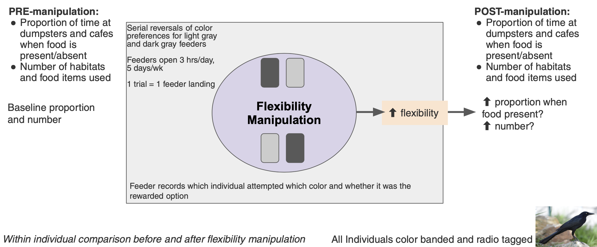

\addtolength{\headheight}{0.1cm}
\pagestyle{fancyplain}
\lhead{\includegraphics[height=1.2cm]{logoPCIRR.png}}
\renewcommand{\headrulewidth}{0pt}

Open... {width=5%} access {width=5%} [code](https://github.com/ManyIndividuals/ManyIndividuals/blob/main/Files/rrs/mi1.Rmd)

**Affiliations:** 1) Max Planck Institute for Evolutionary Anthropology, Germany; 2) Victoria University of Wellington, New Zealand; 3) University of California Santa Barbara, USA. Corresponding authors: corina_logan@eva.mpg.de, rachael.shaw@vuw.ac.nz, kelseybmccune@gmail.com

```{r setup, include=FALSE}
library(knitr)
knitr::opts_chunk$set(tidy.opts=list(width.cutoff=60),tidy=TRUE) 
#Make code wrap text so it doesn't go off the page when Knitting to PDF

knitr::opts_chunk$set(echo = TRUE) 
#sets global options to display code along with the results https://exeter-data-analytics.github.io/LitProg/r-markdown.html
```

# ABSTRACT

Human modified environments are increasing, causing global changes that other species must adjust to or suffer from. Behavioral flexibility (hereafter 'flexibility') could be key: individuals interact with their environment through behavior, making it crucial to an ecologically valid understanding of how species adjust to environmental changes. One of the top priorities for behavioral research to maximize conservation progress is to determine which cognitive abilities and behaviors can predict the ability to adjust to human modified environments and whether these can be manipulated. The rare research that manipulates behavior in a conservation context trains specific behaviors (e.g., predator recognition through predator exposure) to improve individual success in the wild. However, training a general cognitive ability, such as behavioral flexibility (i.e., the ability to rapidly adapt behavior to changes through learning), has the potential to change a whole suite of behaviors and more broadly influence success in adjusting to human modified environments. This project asks whether flexibility can be increased by experimentally increasing environmental heterogeneity, whether such an increase can help species survive in human modified environments, and whether survival information spreads faster through social learning. We explore whether it is even possible to take insights from highly divergent species and apply them to address critical conservation challenges, which pushes the limits in terms of understanding how conserved these abilities may be and to what extent they can be shaped by the environment. We aim to 1) conduct flexibility interventions in two flexible species that are successful in human modified environments (great-tailed grackles and California scrub-jays) to understand how flexibility relates to success and whether social learning increases the rate of behavioral change; and 2) implement the effective interventions in a threatened species (toutouwai) to determine whether flexibility as a generalizable cognitive ability can be trained and whether such training improves survival in human-modified environments. This research will significantly advance our understanding of the causes and consequences of flexibility, linking behavior to environmental change, cognition, and success in human modified environments through a comparative and global framework.

# REGISTERED REPORT DETAILS

 - **Level of bias = 6** This registered report was written (Jul 2021) prior to collecting any data.
 - **Programmatic registered report:** One Stage 2 article for each species (3 in total) will result from this one Stage 1 registered report.

# INTRODUCTION

Human modified environments are increasing [e.g., @liu2020high; @wu2011quantifying; @goldewijk2001estimating], causing global changes that other species must adjust to or suffer from [e.g., @ciani1986intertroop; @chejanovski2017experimental; @federspiel2017adjusting; @alberti2015eco]. Behavioral flexibility (hereafter 'flexibility') could be key: individuals interact with their environment through behavior, making it crucial to an ecologically valid understanding of how species adjust to environmental changes [@lee2021animal]. One of the top priorities for behavioral research to maximize conservation progress is to determine which cognitive abilities and behaviors can predict the ability to adjust to human modified environments and whether these can be manipulated [@moseby2016harnessing]. The rare research that manipulates behavior in a conservation context usually focuses on training specific behaviors (e.g., predator recognition through predator exposure) to improve individual success in the wild [@moseby2012can; @west2018predator; @jolly2018out; @ross2019reversing; see review in @tetzlaff2019effects]. However, training a general cognitive ability, such as flexibility -- the ability to rapidly adapt behavior to changes through learning throughout the lifetime [see the theory behind this definition in @mikhalevich_is_2017] -- has the potential to change a whole suite of behaviors and more broadly influence success in adjusting to human modified environments. 

Environments where informational cues about resources vary in a heterogenous (but non-random) way across space and time are hypothesized to open a pathway for species to functionally detect and react to such cues via flexibility [@mikhalevich_is_2017]. Human modified environments likely provide a different set of informational cues that vary heterogeneously across space and time, and the species that are successful in such environments are likely those who are able to detect and track such cues. Because heterogeneous environments are hypothesized to select for flexibility, we expect that experimentally manipulating environments to be more hetereogenous will result in an increase in flexibility in individuals, which will then increase their success and survival in such environments (Figure 1). Success and survival can relate to any number of variables regarding the usage of and investment in resources, from improved foraging efficiency to increased dispersal into human modified environments to placing nests in more protective locations. Whether a measure of success or survival is predicted to relate to flexibility depends on what is already known about the particular population and their particular environment. 

&nbsp;


**Figure 1.** The theory behind this research illustrated by a directed acyclic graph (DAG). We assume that more heterogeneity causes more flexibility, which then causes better survival in human modified environments.

&nbsp;

If social learning, the ability to acquire and use information obtained by watching others, is used by a particular population, it can increase the rate at which individuals learn about the location and presence of resources [e.g., @belmaker2012learning; @Heinerman2015robots; @lihoreau2011local]. If this is the case, rather than training all individuals in a population to attend to the timing of an available resource, experimenters could train some individuals and then rely on social learning to spread this information to more individuals in that population. Observers would learn about specific behaviors to engage in rather than being trained in a general cognitive ability, however the more behaviors observers learn, the better they will be able to succeed in changing environments. Additionally, over the course of an experiment that manipulates flexibility, observers might learn to pay more attention to social information because increased environmental heterogeneity could make it useful to continue to attend to social information [@laland1996social; @whitehead2010conserving], rather than learning the underlying rules of the experiment and thereafter attending less to social information.

This investigation asks whether flexibility can be increased by experimentally increasing environmental heterogeneity (via serial reversal learning and/or the regularity of whether a given feeder is open or not), whether such an increase can help species survive in human modified environments, and whether information about the location and availablity of resources spreads faster through social learning. We explore whether it is even possible to take insights from highly divergent species and apply them to address critical conservation challenges, which pushes the limits in terms of understanding how conserved these abilities may be and to what extent they can be shaped by the environment. We aim to conduct flexibility interventions in two flexible species that are successful in human modified environments (great-tailed grackles and California scrub-jays) to understand how flexibility relates to success and survival and whether social learning increases the rate of behavioral change, and implement these interventions in a threatened species (toutouwai) to determine whether flexibility as a generalizable cognitive ability can be trained and whether such training improves survival in human modified environments (Figure 2). The results will substantially advance our understanding of the causes and consequences of flexibility, linking behavior to environmental change, cognition, and success in human modified environments through a comparative and global framework.


# RESEARCH QUESTIONS

## Q1: Can behavioral flexibility in individuals be increased by increasing environmental heterogeneity? If so, does increased flexibility help individuals survive in human modified environments? 

**Prediction 1:** Flexibility can be increased in individuals and such an increase **improves the likelihood of survival in human modified environments**. This would indicate that the abilities involved in tracking changing resources in the environment are the same as or related to the abilities involved in surviving in human modified environments. It would also indicate that flexibility is trainable and that such training could be a useful conservation tool for threatened and endangered species. 

**Prediction 1 alternative 1:** Flexibility can be increased in individuals, but such an increase **does not improve the likelihood of survival** in human modified environments. This would indicate that species associated with human modified environments form this association for reasons other than their flexibility, and that threatened species are likely not very successful in human modified environments for reasons unrelated to their ability to change their behavior with changing circumstances.

**Prediction 1 alternative 2:** Flexibility can be increased in some populations, but not others. This would indicate that flexibility manipulations may not work for all populations, and that the effectiveness of such experiments should first be tested in the population of interest before including such an intervention in a conservation plan. If flexibility is not manipulatable in threatened populations, this would indicate that they are likely not very successful in human modified environments because of their inability to change their behavior with changing circumstances, and that flexibility is not trainable. If flexibility is not manipulatable in populations that are successful in human modified environments, this could indicate that they might have used flexibility in the past when originally forming the association, but the need to maintain flexibility in their repertoire is no longer necessary. In populations where flexibility is not manipulatable, this would indicate that the abilities involved in tracking changing resources in the environment are independent of the abilities involved in surviving in human modified environments.


## Q2: Does information spread faster through social learning?

**Prediction 2:** Individuals (observers) who learn about resources by watching those individuals (demonstrators) who were in the flexibility manipulation, are **faster** to use such resources than observers who were not exposed to demonstrators.

**Prediction 2 alternative 1:** Individuals (observers) who learn about resources by watching those individuals (demonstrators) who were in the flexibility manipulation, are **slower** to use such resources than observers who were not exposed to demonstrators.

**Prediction 2 alternative 2:** Individuals (observers) who learn about resources by watching those individuals (demonstrators) who were in the flexibility manipulation, **do not differ** in their use of such resources compared with observers who were not exposed to demonstrators.


## Population-specific background and tailored research questions

&nbsp;


**Figure 2.** Comparing the three species involved in this investigation relative to their geographic range and association with human modified habitats. The yellow dots represent field site locations.


### Great-tailed grackles (*Quiscalus mexicanus*)

**Background:** Great-tailed grackles are flexible [@logan2016flexibilityproblem; @logan2019flexmanip], highly associated with human modified environments [@johnson2001great], and have been rapidly expanding their geographic range across North America over the past 140 years [@wehtje2003range]. They are social and polygamous, and eat a diversity of human foods as well as foraging on insects and on substrates for other natural food items [@johnson2001great]. Males tend to be the socially dominant sex [@johnson2000male] and also the sex that disperses away from their natal area [@sevchik2019dispersal]. @Rodrigo2021gtgr found that more grackles are present and more foraging events occur during garbage pick ups when garbage tends to spill out of the bags, thus increasing food availability. Attending to garbage trucks, potentially across space and time, is an example of how flexibility can help individuals meet foraging needs in the context of changing environmental cues. We are in the middle of long-term data collection on grackles to answer questions about manipulating flexibility using serial reversal learning [@logan2019flexmanip], the predictability of their space use [@mccune2020spaceuse], and their foraging breadth [@logan2019flexforaging]. In the future, we will conduct additional analyses on this data that are relevant to the current investigation. 

**Table 1.** Study design for the great-tailed grackle research.

```{r designgtgr, eval=TRUE, echo=F, message=F, warnings=F, results='asis', include=TRUE}
var md = require('markdown-it')()
                .use(require('markdown-it-multimd-table'));

    const exampleTable =
    "|             |          Grouping           || \n" +
    "First Header  | Second Header | Third Header | \n" +
    " ------------ | :-----------: | -----------: | \n" +
    "Content       |          *Long Cell*        || \n" +
    "Content       |   **Cell**    |         Cell | \n" +
    "                                               \n" +
    "New section   |     More      |         Data | \n" +
    "And more      | With an escaped '\\|'       || \n" +
    "[Prototype table]                              \n";

    console.log(md.render(exampleTable));
```

```{r designgtgrtest, eval=TRUE, warning=FALSE, results='asis', echo=TRUE, include=TRUE}
d <- read.csv(url("https://raw.githubusercontent.com/ManyIndividuals/ManyIndividuals/main/Files/rrs/mi1studydesignGTGR.csv"), header=F, sep=",", stringsAsFactors=F) 

colnames(d) <- c("Question","Hypothesis","Sampling plan","Analysis plan","Rationale for deciding the sensitivity of the test for confirming or disconfirming the hypothesis","Interpretation given different outcomes","Theory that could be shown wrong by the outcomes")

library(kableExtra)
knitr::kable(d)
#kable_styling(full_width = T, position = "left")
```

**Q1: Do flexibility manipulated individuals differ in their visits to outdoor cafes and garbage dumpsters on regular days (when there is more food availability) than on holidays when they are closed (thus reduced food availability)?**

 - **Prediction 1.1:** If individuals rely more on flexibility, they will likely decrease the frequency and duration of their visits on holidays because other environmental cues could indicate the lack of food availability (e.g., reduced human presence, no visible food, no garbage trucks or garbage spilled on the ground). This is because flexibility is the functional tracking of resources across time and space: one knows a variety of places to obtain food and prefers to forage at those with higher pay offs. If no food is available at a usual food location, then the more functional choice is to go somewhere else that does have food. 
 - **Prediction 1.2:** If individuals rely more on what-where-when memory (WWW, remembering what food was where and when from a previous experience they had) [@clayton_episodic-like_1998; @clayton_prometheus_2003], they will likely increase the frequency and duration of their visits on holidays because the closure is a violation of their expectations. These expectations are based on associations between food and this place and time that have been built from multiple past experiences. Therefore, they would likely keep checking this location, which is expected to have more food availability at this time.
 - **Prediction 1.3:** If there is no difference in the frequency and/or duration of visits between regular days and holidays, this could indicate that the flexibility manipulation did not manipulate an ability that is linked to foraging visits to cafes and dumpsters. 
 - **Prediction 1.4:** If the holiday frequency of visits increases while the duration decreases, this could indicate that WWW memory is being used because individuals keep checking the location they expect food to be, but that these visits are short and used for checking for food cues (including looking for human presence), which is likely faster than stopping to eat food that is present. 
 - **Prediction 1.5:** If the holiday frequency of visits decreases while the duration increases, this could indicate that WWW memory is being used because individuals may be sitting and waiting for food to become available in the location they expect it to be.
 - **Prediction 2:** There will be no difference between pre- and post- experiment frequency and duration of visits at dumpsters because garbage pick up is generally once per week, which might be too long of a period to be able to accurately remember (i.e., can individuals count to 7 days?). However, we do predict a difference between pre- and post- experiment frequency and duration of visits (as outlined in Predictions 1.1-1.5) at cafes because they are generally open daily and therefore do not require longer-term memory retention to track.

**Q2: Does information about which feeder contains the food spread faster through social learning?**

Predictions are the same as in the Research Question: Q2 section, except the comparison is among all individuals in the flexibility manipulation, examining the difference between innovators (those who have not seen others at a feeder when attempting to solve) versus observers who had seen at least one demonstrator at a feeder. We will examine whether observers are more likely to learn from demonstrators of a particular sex or age (<1 year or >1 year), whether the rate of updating differs by sex or age, and whether the feeder's pay-off (accessible or inaccessible) played a role in the choice of visit.

&nbsp;



**Figure 3.** The template feeder experimental design (Figure 7) tailored to the great-tailed grackle research question.


### Jays

**Background:** Jay species in the genus *Aphelocoma* exhibit a diversity of social systems and success in colonizing suburban and urban areas. California scrub-jays (*A. californica*, hereafter "CASJ"), a singular, monogamous breeder, are increasing in abundance, expanding their range size and are highly successful in natural, suburban, and urban areas [@blair1996land, @curry2017california]. In contrast, the Florida scrub-jay (*A. coerulescens*; hereafter "FLSJ") is a threatened species endemic and range-restricted to xeric oak scrub habitat in Florida [@woolfenden1996florida]. 

Both species forage primarily on mast (acorns, hazelnuts, etc.) that they cache throughout their territory to eat all year. But they are also opportunistic omnivores and specifically need high-fat and high-protein arthropods to feed to nestlings and fledglings [@curry2017california]. Nesting and foraging substrate can be drastically different in human modified environments compared to natural areas [@tuomainen2011behavioural], but it is unknown whether suburban and urban jays persist through behavioral adaptations. FLSJ have colonized suburban habitats, however suburban populations of FLSJ steadily decline after colonization events [Bowman pers. comm.]. This is potentially due to suboptimal habitat resulting from fire suppression [@woolfenden1996florida], higher rates of brood reduction through nestling starvation [@shawkey2004why] and the lack of nutritionally complete prey items [@shawkey2004why] in suburban habitats. It is possible that behavioral flexibility in habitat use and foraging breadth underlies the ability of some jays to persist in human-dominated areas. 

We aim to compare behavioral flexibility within species, between suburban and natural populations to determine if variation in flexibility relates to variation in persistence. Subsequently we will compare flexibility between species to determine whether this trait is related to the greater persistence of CASJ in human-dominated areas. Lastly, we will test whether manipulating flexibility increases the foraging breadth and reproductive success of jays in human modified environments. Manipulating flexibility of a subset of individuals has the potential to affect the population because previous research demonstrates that both species have the capacity to use foraging information discovered by others to flexibly change their behavior [social learning; @mccune2018cognition, @midford2000social].


**Q1: Do jay populations in human modified areas differ in baseline behavioral flexibility compared to populations in natural areas?**

 - **Prediction 1.1:** If suburban jays are *more* flexible than jays in natural areas, this implies that flexibility is related to the ability to persist in human modified environments where spatial and temporal heterogeneity of resources is high. 
 - **Prediction 1.2:** If suburban jays are *less* flexible than jays in natural areas, this implies that human modification of the environment has led to less spatial and temporal heterogeneity of resources. For example, the prevalence of bird feeders in suburban areas leads to consistently available food.
 - **Prediction 1.3:** If suburban jays are *equally* flexible as jays in natural areas, this implies that additional behavioral traits [i.e. boldness; @lapiedra2017urbanization] facilitate success in human modified environments
 
**Q2: Are CASJ more behaviorally flexible than FLSJ in general?**

 - **Prediction 2.1:** If CASJ are *more* flexible than FLSJ, this may explain the range expansion and greater success of CASJ in human modified environments.
 - **Prediction 2.2:** If CASJ are *less* flexible than FLSJ, it implies that flexibility is not related to persistence in human modified environments and that behavioral flexibility is instead related to a different, unknown social or environmental characteristic.
 - **Prediction 2.3:** If CASJ and FLSJ are *equally* flexible, then flexibility is not related to persistence in human modified environments and the level of flexibility is potentially an evolutionary conserved trait from the *Aphelocoma* common ancestor.
 
**Q3: Does manipulating behavioral flexibility affect success of CASJ and FLSJ in human modified environments?**

Predictions are the same as in the general Research Question: Q1 section.


**Figure 4.**

### Toutouwai

**RACHAEL add**

**Figure 5.**


# METHODS

We present two designs for flexibility intervention experiments. Experimenters can decide which (or both) they want to conduct in their population. Only one experiment must be conducted per population to be able to test these hypotheses. Conducting more than one of these experiments per population is acceptable, but not necessary. Social learning data can only be collected using design 2 because design 1 is conducted in visual isolation of other individuals.

## **Design 1 - Reversal learning experiment** 

Half of the individuals (manipulated group) undergo serial reversal learning until they meet the passing criterion, while the other half (control group) receive only one reversal (Figure 6). A reversal of where the reward is placed represents environmental heterogeneity, and those individuals who have enough experience in this heterogeneous environment through multiple reversals are able to learn to improve their flexibility (the number of trials it takes to change a preference). This flexibility intervention has been shown to work in great-tailed grackles where 8 out of 9 individuals in the serial reversal group passed the passing criterion (passing 2 consecutive reversals in 50 trials or less) within their given time frame [@logan2019flexmanip]. Individuals are presented with two options that differ in color, shape, or in some other way, with one option being the rewarded option. Once a preference for the rewarded option is reached (17/20 trials correct), the reward is then always placed in the previously non-rewarded option until a preference is reached (using the same criterion). The individual is only allowed one choice per trial and the option on the left is always placed first, with the experimenter always turning to the right when setting up and taking down each trial (if a live experimenter is involved). After the control group's first reversal, they receive a similar amount of experience as the manipulated group, but without the functionality: two apparatuses are still used in every trial, but they are the same color/shape/etc. and both contain food. As with the manipulated group, only one choice, the first choice, is allowed per trial. Choices are scored as: 1=chose the correct option (even if they do not eat the food), 0=chose the incorrect option, and -1=did not make a choice.

&nbsp;


**Figure 6.** Template design for the reversal learning experiment.

### Planned Sample

At least 20 individuals per population will be tested (50% in the control condition, 50% in the flexibility manipulation condition). Individuals will be randomly assigned to the control and flexibility manipulation conditions using a random number generator (random.org). The first rewarded option (i.e., color, shape, etc.) in reversal learning is counterbalanced across individuals at each site. The rewarded option is pseudorandomized for side (and the option on the left is always placed first). Pseudorandomization consists of alternating location for the first two trials of a session and then keeping the same color on the same side for at most two consecutive trials thereafter. A list of all [88 unique trial sequences](https://docs.google.com/spreadsheets/d/1B3-ZKd4nr_4gA91Pu2eUUBOriwW-V88VRgK9c1lDSjY/edit?usp=sharing) for a 10-trial session, following the pseudorandomization rules, will be generated in advance for experimenters to use during testing (e.g., a randomized trial sequence might look like: LRLLRRLRLR, where L and R refer to the location, left or right, of the rewarded tube). Randomized trial sequences will be assigned randomly to any given 10-trial session using a random number generator (random.org) to generate a number from 1-88.

**Passing criteria:**

 - **Habituation:** leave one color/shape/etc. apparatus that is not used in the experiment in the enclosure overnight and feed the individual off of it until they readily approach it for food.
 - **Training to look for non-visible food:** obtain the food from the habituation apparatus (only one presented per trial) in 5 consecutive trials when the food is hidden inside the apparatus (and not visible to the individual unless they approach the apparatus and choose to look inside). Choices are scored as: 1=ate first from the rewarded option, 0=ate first from the non-rewarded option, and -1=did not eat any food. Choices are scored as: 1=ate first from inside the apparatus, 0=ate food from around the apparatus but not inside it, and -1=did not eat any food.
 - **Training to eliminate any color/shape/etc. preference:** choose one apparatus first 8 or fewer times out of 10 trials, which indicates no preference. Use both experimental apparatuses (e.g., two colors or shapes) per trial with the food openings taped over so the individual cannot look inside the tubes. Place both apparatuses in the test area at the same time and place food on the outside of both apparatuses at the same time (if you need to spend more time on one apparatus because the food falls off or something, make mirror movements on the other apparatus at the same time so both apparatuses get the same amount of attention and in the same way). Choices are scored as: 1=ate first from the rewarded option, 0=ate first from the non-rewarded option, and -1=did not eat any food.
 - **Reversal (including initial discrimination):** at least 17 of the latest 20 trials correct, calculated in 1-trial windows (i.e., the individual can pass on trial 21, 35, 44, etc.). To reach the 17 correct, the individual must have scored at least 8/10 or 9/10 in the two 10-trial blocks of the most recent 20 trials.
 - **Serial reversal manipulation group:** two consecutive reversals in 50 trials or less. This passing criterion was generated using great-tailed grackles [@logan2019flexmanip] and might need to be adjusted depending on the population.
 - **Control group:** the average number of trials to pass serial reversals. If this is unknown at the beginning of the experiment, test a manipulated individual first and match the control individuals to this number until an average can be obtained. The average can continue to be updated as more manipulated individuals complete testing.

**Minimum sample size:** The minimum sample size of 20 was determined using Bayesian simulations in Logan et al. [2020](http://corinalogan.com/Preregistrations/gxpopbehaviorhabitat.html#Q1:_behavior_across_the_range). 

**Data collection stopping rule:** Data collection will be stopped when the minimum sample size is reached or when the season in which the minimum sample size is reached comes to an end.

### Protocols

[Protocol](https://docs.google.com/document/d/16hKGUNO1SpnXAT8DN_GXb56Aw6WzCraCIUKiP9gVI6o/edit?usp=sharing) for reversal learning of a color preference used by @logan2019flexmanip for great-tailed grackles. 

### Interobserver reliability

We conduct interobserver reliability by having hypothesis-blind video coders code all of the videos for 20% of the individuals in the experiment: [instructions for video coders](https://docs.google.com/document/d/1QakS8TMe4WRv_QWKrHaWHyJSXbQwl8v9Y061SY914Wg/edit?usp=sharing). Live coder data is then compared with video coder data by analyzing whether the individual made the correct choice (1) or not (0) or whether they did not make a choice (-1) using Cohen's unweighted kappa (@landis1977measurement, with the psych package in R @psych). This measure indicates how replicable the experiment and the coding instructions are. Before a video coder is approved to begin coding, they must first pass training where they code a different set of videos and reach an unweighted kappa of 0.89 or above.

```{r iorRev, eval=FALSE, warning=FALSE, results='asis', echo=TRUE, include=TRUE}
library(irr) #ICC package

# did video coder pass interobserver reliability training? 
data <- read.csv("", header = TRUE, sep = ",", stringsAsFactors = FALSE)
head(data)  #Check to make sure it looks right
# Note: c(3,5) is telling R to look at columns 2 and 3 and compare them. Double check this:
data[,3] #coder 1 (live coder)
data[,5] #coder 2 (video coder)
cohen.kappa(data[,c(3,5)], w=NULL,n.obs=NULL,alpha=.05,levels=NULL) 

# video coder score for 20% of videos =  
data <- read.csv("", header = TRUE, sep = ",", stringsAsFactors = FALSE)
head(data)  #Check to make sure it looks right
# Note: c(3,5) is telling R to look at columns 2 and 3 and compare them. Double check this:
data[,3] #coder 1 (live coder)
data[,5] #coder 2 (video coder)
cohen.kappa(data[,c(3,5)], w=NULL,n.obs=NULL,alpha=.05,levels=NULL) 
```


## **Design 2 - Feeder experiment** 

Half of the individuals (manipulated group) are exposed to opaque feeders that open at irregular times until they meet the passing criterion, while the other half (control group) are exposed to opaque feeders that open regularly (Figure 7). The irregular opening times represents environmental heterogeneity, and those individuals who have enough experience in this heterogeneous environment through multiple exposures are able to learn to improve their flexibility (latency to approach the right feeder at the right time - i.e., when it is open). In both designs, both groups are habituated to the open feeders filled with food until at least half of the minimum sample size has visited more than 50% of the feeders, and data are collected on success/survival measures either before and after the flexibility intervention or only after the intervention (depending on feasibility and how the study design needs to be tailored for each population). **KELSEY do we want to say anything about all of the "piloting" we're doing in GTGR in space use?** The social learning component is conducted during this experiment.

&nbsp;


**Figure 7.** Template design for the feeder experiment.

### Planned Sample

50% of the individuals or locations will be assigned to the control condition and 50% to the flexibility manipulation condition. Assignment to condition will be random (using random number generator random.org). Ensure that the locations of the two conditions are far enough apart that individuals in one condition are not likely to be present at the site of their non-assigned condition.

**Passing criteria:**

 - **Feeder habituation:** all feeders at all locations will have food and be open for several hours on consecutive days or until at least half of the minimum sample size in each condition (control and manipulated) have visited at least 50% of the feeders.
 - **Feeder experiment - flexibility manipulation condition:** the latency in seconds (from the beginning of the period in which the feeders in that location are open) to go to an open feeder is 20% faster for that individual at that particular feeder for 50% of the feeders.
 - **Feeder experiment - Control condition stopping criterion:** the experiment will end when half of the individuals in the manipulated condition pass criterion.

**Minimum sample size:** To determine the ability to detect actual effects in the analyses, we ran a power analysis in G&ast;Power with the following settings: test family=F tests, statistical test=linear multiple regression: Fixed model (R^2 deviation from zero), type of power analysis=a priori, alpha error probability=0.05. We set the power at 0.70. We found that, to have a 70% chance of detecting a medium effect (approximated at f^2=0.15 by @cohen1988statistical), the minimum sample size needs to be 44 for analyses with 1 explanatory variable.

**Data collection stopping rule:** Data collection will be stopped when the minimum sample size is reached or when the season in which the minimum sample size is reached comes to an end.

### Protocols

**Food in the feeders:** All feeders are opaque and always have food in them to eliminate the confound due to olfactory differences between the feeders that could be introduced if only the active feeders have food in them. If a feeder needs to be refilled, refill all feeders consecutively in the same time period and refill each for the same amount of time even if that feeder does not need much or any food (in these cases, pretend to fill the feeder as you normally would). This eliminates confounds from cues provided by a differential amount of attention experimenters give the feeders depending on which needs refilling.

**Social learning data collection:** are observers (individuals who have never landed on the perch of any feeder) more likely to land on the perch of a feeder sooner if they see another individual (demonstrator) land on a perch compared with observers who don't see demonstrators? **CORINA KELSEY NEED TO FIGURE THIS OUT** 

**Population-specific experimental protocols:**

 - [Grackle protocol](https://docs.google.com/document/d/1pTrcy7ztgYVSAP7rGA6Y_lAmZ7hK_-mB01zwy0oKh7w/edit?usp=sharing)
    - [Protocol for applying radio tags and conducting GPS tracks](https://docs.google.com/document/d/1ZOpkdxy5-wiGg7hYod-XaaBoOl53DsVQ3pwWoIdvrzk/edit?usp=sharing) from @mccune2020spaceuse
  - [Scrub jay protocol](https://docs.google.com/document/d/1VWL7AIDB-Z1vhs1dEM7JACHuvNjgjZCBI3ubQECqm2U/edit?usp=sharing)
  - [Toutouwai protocol]()

### Reliability of feeder data

During the experiment, we will determine the reliability of the automated feeder data. We will verify that the feeders are correctly detecting tags by using a (motion-activated, Go-Pro, or similar) camera focused on 20% of the feeder perches. Hypothesis-blind video coders will then code who landed on the perch: individual ID, time of day, and whether it ate food. We will then compare the automated feeder data sheets with the video coder’s data sheets by calculating the Cohen’s unweighted kappa for individual ID and the intra-class correlation coefficient (ICC) on the time of day (kappa: @landis1977measurement, with the psych package in R @psych; ICC: @hutcheon2010random, with the irr package in R: @gamer2012package). Cohen's kappa is used when the distance between measurements is not quantifiable numerically, and the ICC is used for continuous variables with equal distances between units.


## Assessment of survival likelihood with regard to the flexibility manipulation

After the manipulation, compare control individuals with individuals in the flexibility manipulation using one or more of the following measures. If possible, also conduct within individual comparisons of the selected measures (e.g., predictability of space use) in the control and manipulation groups before and after the flexibility manipulation. Choose population-relevant survival variables that are predicted to be the most likely to be used in human modified environments.

 - Fitness variables: nest success, number of offspring who survived to independence or adulthood, longevity, etc.
 - Foraging variables: diet breadth, number of foraging techniques used, etc.
 - Movement variables: predictability of movement behavior (e.g., step length and turning angles), ability to disperse from a non-human modified environment to a human modified environment (assess success/survival after dispersal if possible), etc.
 - Habitat use variables: foraging substrate (ground, bushes, trees, human modified substrates, human-provided supplemental food), nesting substrate (high or low, tree, bush or reeds), etc.

**CORINA KELSEY RACHAEL NEED TO ADD TO THIS LIST**

## Open data

The data will be published in the Knowledge Network for Biocomplexity's data repository.


# ANALYSIS PLAN

## Q1: Can flexibility be increased and help individuals survive in human modified environments?

### Design 1 - Reversal learning experiment

**Can flexibility be increased?** If most individuals in the flexibility manipulation (serial reversals) passed the passing criterion, then the answer is yes.

**Do the flexibility manipulated (serial reversal) individuals survive better in human modified environments?**

*Response variable:* survival variable (e.g., predictability of space use, number of different food items eaten, etc.)

*Explanatory variable:* 

- Condition (control, manipulated)

OR

- Time (pre-manipulation, post-manipulation)

*Random variable:* ID (because multiple reversal trials per individual)


### Design 2 - Feeder experiment

*Response variable:* survival variable (e.g., predictability of space use, number of different food items eaten, etc.)

*Explanatory variable:* 

- Condition (control, manipulated)

OR

- Time (pre-manipulation, post-manipulation)

*Random variable:* ID (when response variable has multiple data points per individual)


#### Great-tailed grackles

**Cafes: cafe pre-manipulation baseline compared with cafe post-manipulation**

Model 1: Number of visits ~ Time (before/after) + (ID)

Model 2: Duration of visits ~ Time (before/after) + (ID)

**Dumpsters: dumpster pre-manipulation baseline compared with dumpster post-manipulation**

Model 3: Number of visits ~ Time (before/after) + (ID)

Model 4: Duration of visits ~ Time (before/after) + (ID)


#### Jays

**KELSEY**

#### Toutouwai

**Rachael**


## Q2: Does information spread faster through social learning?

### Design 2 - Feeder experiment

The analyses will be conducted using multilevel experience-weighted attraction models that allow one to determine which individual-level learning rules are applied in a particular group [as in @barrett2017pay]. Experimenters will adapt the code from @barrett2017pay (code at: https://github.com/bjbarrett/panama1) to meet their specific experimental design needs. When the experiment has a control condition and a flexibility manipulated condition, this variable must be added to the model to determine whether observers learn only to attend to the particular stimulus in the environment that they observed others attending to, or whether observers learn how to be flexible (i.e., observers of individuals in the manipulated condition perform better than observers of individuals in the control condition). **KELSEY will you check the logic on this last part?**


#### Great-tailed grackles

*Variables in the model:* 

 - Attraction scores (indicating whether the currently open feeder had the largest attraction score)
 - Gamma (indicating the weight of social information - whether social learning influenced which feeder was chosen)
 - Logit(theta) (rate of updating per individual)
 - Phi (indicating the weight of past experiences)
 - Pay-off - Beta(pay) (whether they visited an accessible or inaccessible feeder)
 - Age similarity biases (between the observer and demonstrator. Two age classes: adult (1+ years) and juvenile (<1 year))
 - Age bias - Beta(age) (whether observers ore more likely to learn from demonstrators of a certain age)
 - Sex bias (whether observers ore more likely to learn from demonstrators of a certain sex)


#### Jays

**KELSEY**


#### Toutouwai

**Rachael**


# ETHICS

This research is carried out in accordance with permits from the:

1) US Fish and Wildlife Service (scientific collecting permit number MB76700A-0,1,2)
2) US Geological Survey Bird Banding Laboratory (federal bird banding permit for Logan 23872, for McCune 24273)
3) Institutional Animal Care and Use Committee at the University of California Santa Barbara (protocol number 958)
4) California Department of Fish and Wildlife (scientific collecting permit [specific use] number S‐192100001‐19210‐001)
5) Oregon Department of Fish and Wildlife (scientific collecting permit number XXXX)
6) **RACHAEL & KELSEY: add your permits here**

# AUTHOR CONTRIBUTIONS

**Logan:** Hypothesis development, data collection, data analysis and interpretation, write up, revising/editing, materials/funding.

**Shaw:** Hypothesis development, data collection, data analysis and interpretation, write up, revising/editing, materials/funding.

**McCune:** Hypothesis development, data collection, data analysis and interpretation, write up, revising/editing.

# FUNDING

This research is funded by the Department of Human Behavior, Ecology and Culture at the Max Planck Institute for Evolutionary Anthropology.

# CONFLICT OF INTEREST DISCLOSURE

We, the authors, declare that we have no financial conflicts of interest with the content of this article. CJ Logan is a co-founder of and on the Managing Board at PCI Registered Reports.

# ACKNOWLEDGEMENTS

We thank Richard McElreath at the Max Planck Institute for Evolutionary Anthropology for project support.

# REFERENCES
