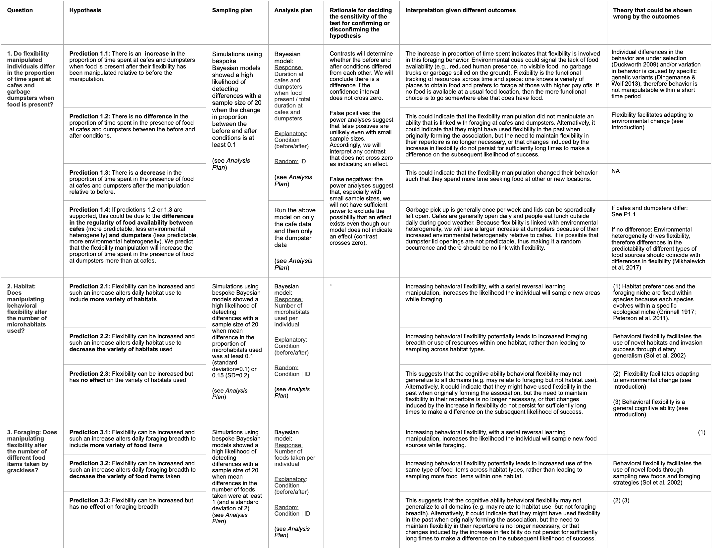

\addtolength{\headheight}{0.1cm}
\pagestyle{fancyplain}
\lhead{\includegraphics[height=1.2cm]{logoPCIRR.png}}
\renewcommand{\headrulewidth}{0pt}

Open... {width=5%} access {width=5%} [code](https://github.com/ManyIndividuals/ManyIndividuals/blob/main/Files/rrs/mi1.Rmd)

**Affiliations:** 1) Max Planck Institute for Evolutionary Anthropology, Germany; 2) Victoria University of Wellington, New Zealand; 3) University of California Santa Barbara, USA. Corresponding authors: corina_logan@eva.mpg.de, rachael.shaw@vuw.ac.nz, kelseybmccune@gmail.com

```{r setup, include=FALSE}
library(knitr)
knitr::opts_chunk$set(tidy.opts=list(width.cutoff=60),tidy=TRUE) 
#Make code wrap text so it doesn't go off the page when Knitting to PDF

knitr::opts_chunk$set(echo=T, include=T, results='asis', warning=F, message=F) 
#sets global options to display code along with the results https://exeter-data-analytics.github.io/LitProg/r-markdown.html
#set echo=F for knitting to PDF (hide code), and echo=T for knitting to HTML (show code)
```

# ABSTRACT

Human modified environments are increasing, causing global changes that other species must adjust to or suffer from. Behavioral flexibility (hereafter 'flexibility') could be key to coping with rapid change. Behavioral research can contribute to conservation by determining which behaviors can predict the ability to adjust to human modified environments and whether these can be manipulated. When research that manipulates behavior in a conservation context occurs, it primarily trains a specific behavior to improve individual success in the wild. However, training a domain general cognitive ability, such as flexibility, has the potential to change a whole suite of behaviors, which could have a larger impact on influencing success in adjusting to human modified environments. This project asks whether flexibility can be increased by experimentally increasing environmental heterogeneity and whether such an increase can help species succeed in human modified environments. We explore whether it is  possible to take insights from highly divergent species and apply them to address critical conservation challenges. This pushes the limits in terms of understanding how conserved these abilities may be and to what extent they can be shaped by the environment. We aim to 1) conduct flexibility interventions in two flexible species that are successful in human modified environments (great-tailed grackles and California scrub-jays) to understand how flexibility relates to success and whether information about new behavior spreads via social learning; and 2) implement these interventions in two vulnerable species (toutouwai and Florida scrub-jays) to determine whether flexibility as a generalizable cognitive ability can be trained and whether such training improves success in human-modified environments. This research will significantly advance our understanding of the causes and consequences of flexibility, linking behavior to environmental change, cognition, and success in human modified environments through a comparative and global framework.

# REGISTERED REPORT DETAILS

 - **Level of bias = 6** This registered report was written (Jul 2021-Feb 2022) prior to collecting any data.
 - **Programmatic registered report:** Three Stage 2 articles will result from this one Stage 1 registered report: one for toutouwai, one for grackles, and one for scrub-jays.
 - **Deviations from the Stage 1 registered report:** [to be filled in as needed after data collection begins]

# INTRODUCTION

Human modified environments are increasing [e.g., @liu2020high; @wu2011quantifying; @goldewijk2001estimating], causing global changes that other species must adjust to or suffer from [e.g., @ciani1986intertroop; @chejanovski2017experimental; @federspiel2017adjusting; @alberti2015eco]. Behavioral flexibility (hereafter 'flexibility') could be key: individuals interact with their environment through behavior, making it crucial to an ecologically valid understanding of how species adjust to environmental changes [@lee2021animal]. One of the top priorities for behavioral research to maximize conservation progress is to determine which cognitive abilities and behaviors can predict the ability to adjust to human modified environments and whether these can be manipulated [@moseby2016harnessing]. The rare research that manipulates behavior in a conservation context usually focuses on training specific behaviors (e.g., predator recognition through predator exposure) to improve individual success in the wild [@moseby2012can; @west2018predator; @jolly2018out; @ross2019reversing; see review in @tetzlaff2019effects]. However, training a general cognitive ability, such as flexibility -- the ability to rapidly adapt behavior to changes through learning throughout the lifetime [see the theory behind this definition in @mikhalevich_is_2017] -- has the potential to change a whole suite of behaviors and more broadly influence success in adjusting to human modified environments. Recent evidence supports this hypothesis: as far as we are aware, we were the first to show that flexibility can be manipulated using serial reversal learning of color preferences, and that the manipulated individuals were more flexible in a new context (locus switching on a puzzlebox) as well as being more innovative (solved more loci on a puzzlebox) [@logan2022flexmanip].

Environments where informational cues about resources vary in a heterogenous (but non-random) way across space and time are hypothesized to open a pathway for species to functionally detect and react to such cues via flexibility [@mikhalevich_is_2017]. Human modified environments likely provide a different set of informational cues that vary heterogeneously across space and time, and the species that are successful in such environments are likely those who are able to detect and track such cues. Because heterogeneous environments are hypothesized to select for flexibility, we expect that experimentally manipulating environments to be more heterogeneous will result in an increase in flexibility in individuals, which will then increase their success in such environments (Figure 1). Success can relate to any number of variables regarding the usage of and investment in resources and response to threats, from improved foraging efficiency to increased dispersal and survival within human modified environments, to placing nests in more protective locations. Whether a measure of success is predicted to relate to flexibility depends on what is already known about the particular population and their particular environment. 

&nbsp;


**Figure 1.** The theory behind this research illustrated by a directed acyclic graph (DAG). We assume that more heterogeneity causes more flexibility, which then causes more success in human modified environments.

&nbsp;

This investigation asks whether flexibility can be increased by experimentally increasing environmental heterogeneity (via serial reversal learning) and whether such an increase can help species succeed in human modified environments. We explore whether it is possible to take insights from highly divergent species and apply them to address critical conservation challenges. We aim to conduct a flexibility intervention in two flexible species that are successful in human modified environments (great-tailed grackles and California scrub-jays) to understand how flexibility relates to success, and implement these interventions in two vulnerable species (toutouwai and Florida scrub-jays) to determine whether flexibility as a generalizable cognitive ability can be trained and whether such training improves success in human modified environments (Figure 2). Manipulating the flexibility of a few individuals could have population-level effects because significant research on social information use in birds [e.g., @valente2021conspecific] demonstrates the potential for the manipulated behavior to disseminate to conspecifics (e.g., if manipulated individuals are faster at locating new resources, which could attract the attention of conspecifics, or if unmanipulated individuals copy the manipulated individuals’ nesting or foraging locations). This comparative approach will ultimately reveal how conserved these abilities may be and to what extent they can be shaped by the environment. The results will substantially advance our understanding of the causes and consequences of flexibility, linking behavior to environmental change, cognition, and success in human modified environments through a comparative and global framework.


# RESEARCH QUESTION

## Can behavioral flexibility in individuals be increased by increasing environmental heterogeneity? If so, does increased flexibility help individuals succeed in human modified environments? 

**Prediction 1:** Flexibility can be increased in individuals and such an increase **improves the likelihood of success in human modified environments**. This would indicate that the abilities involved in tracking changing resources or threats in the environment are the same as or related to the abilities involved in succeeding in human modified environments. It would also indicate that flexibility is trainable and that such training could be a useful conservation tool for threatened and endangered species. 

**Prediction 1 alternative 1:** Flexibility can be increased in individuals, but such an increase **does not improve the likelihood of success** in human modified environments. This would indicate that species associated with human modified environments form this association for reasons other than their flexibility, and that threatened species are likely not very successful in human modified environments for reasons unrelated to their ability to change their behavior with changing circumstances.

**Prediction 1 alternative 2:** Flexibility can be increased in some populations, but not others. This would indicate that flexibility manipulations may not work for all populations, and that the effectiveness of such experiments should first be tested in the population of interest before including such an intervention in a conservation plan. If flexibility is not manipulatable in threatened populations, this would indicate that they are likely not very successful in human modified environments because of their inability to change their behavior with changing circumstances, and that flexibility is not trainable. If flexibility is not manipulatable in populations that are successful in human modified environments, this could indicate that they might have used flexibility in the past when originally forming the association, but the need to maintain flexibility in their repertoire is no longer necessary. In populations where flexibility is not manipulatable, this would indicate that the abilities involved in tracking changing resources in the environment are independent of the abilities involved in succeeding in human modified environments.


## Population-specific background and tailored research questions

&nbsp;


**Figure 2.** Comparing the three species involved in this investigation relative to their geographic range and association with human modified habitats. The yellow dots represent field site locations.


### Great-tailed grackles (*Quiscalus mexicanus*)

**Background:** Great-tailed grackles are flexible [@logan2016flexibilityproblem; @logan2019flexmanip], highly associated with human modified environments [@johnson2001great], and have been rapidly expanding their geographic range across North America over the past 140 years [@wehtje2003range]. They are social and polygamous, and eat a diversity of human foods as well as foraging on insects and on substrates for other natural food items [@johnson2001great]. Males tend to be the socially dominant sex [@johnson2000male] and also the sex that disperses away from their natal area [@sevchik2019dispersal]. @Rodrigo2021gtgr found that more grackles are present and more foraging events occur during garbage pick ups when garbage tends to spill out of the bags, thus increasing food availability. Attending to garbage trucks, potentially across space and time, is an example of how flexibility can help individuals meet foraging needs in the context of changing environmental cues. Their flexibility is manipulatable using serial reversal learning, and this manipulation improves their flexibility in a new context as well as their innovativeness [@logan2019flexmanip], which shows that training a general cognitive ability can affect more behaviors than the behavior that was trained and potentially make them more successful in human modified environments. We are in the middle of long-term data collection on grackles to answer questions about, how flexibility relates to exploration [@mccune2019exploration], the predictability of their space use [@mccune2020spaceuse] and their foraging breadth [@logan2019flexforaging]. 

**Table 1.** Study design for the great-tailed grackle research.



**G.Q1: Do flexibility manipulated individuals differ in their visits to outdoor cafes and garbage dumpsters on regular days (when there is more food availability) than on holidays when they are closed (thus reduced food availability)?**

 - **Prediction 1.1:** If individuals rely more on flexibility, they will likely decrease the frequency and duration of their visits on holidays because other environmental cues could indicate the lack of food availability (e.g., reduced human presence, no visible food, no garbage trucks or garbage spilled on the ground). This is because flexibility is the functional tracking of resources across time and space: one knows a variety of places to obtain food and prefers to forage at those with higher pay offs. If no food is available at a usual food location, then the more functional choice is to go somewhere else that does have food. 
 - **Prediction 1.2:** If there is no difference in the frequency and/or duration of visits between regular days and holidays, this could indicate that the flexibility manipulation did not manipulate an ability that is linked to foraging visits to cafes and dumpsters. 
 - **Prediction 1.3:** If the holiday frequency of visits increases while the duration decreases, this could indicate individuals keep checking the location they expect food to be, but that these visits are short and used for checking for food cues (including looking for human presence), which is likely faster than stopping to eat food that is present. 
 - **Prediction 1.4:** If the holiday frequency of visits decreases while the duration increases, this could indicate that individuals may be sitting and waiting for food to become available in the location they expect it to be.
 - **Prediction 2:** There will be no difference between pre- and post- experiment frequency and duration of visits at dumpsters because garbage pick up is generally once per week, which might be too long of a period to be able to accurately remember. However, we do predict a difference between pre- and post- experiment frequency and duration of visits (as outlined in Predictions 1.1-1.4) at cafes because they are generally open daily and therefore do not require longer-term memory retention to track.

&nbsp;


**Figure 3.** The reversal learning experiment in a group context (Figure 7) tailored to the great-tailed grackle research question.


### Scrub-jays (*Aphelocoma californica* & *A. coerulescens*)

**Background:** Jay species in the genus *Aphelocoma* exhibit a diversity of social systems and success in colonizing suburban and urban areas. California scrub-jays (*A. californica*, hereafter "CASJ"), a singular, monogamous breeder, are increasing in abundance, expanding their range size and are highly successful in natural, suburban, and urban areas [@blair1996land; @curry2017california]. In contrast, the Florida scrub-jay (*A. coerulescens*; hereafter "FLSJ") is a threatened species, endemic and range-restricted to xeric oak scrub habitat in Florida [@woolfenden1996florida]. 

Both species forage primarily on mast (acorns, hazelnuts, etc.) that they cache throughout their territory, which makes it available to eat year-round. They are also opportunistic omnivores and specifically need high-fat and high-protein arthropods to feed to nestlings and fledglings [@curry2017california]. Nesting and foraging substrates can be drastically different in human modified environments compared to natural areas [@tuomainen2011behavioural], and it is unknown whether suburban and urban jays are able to persist in these environments through behavioral adjustments. FLSJ can persist in suburban habitats after conversion from xeric oak scrub, however suburban populations of FLSJ steadily decline (Bowman pers. comm.). This is potentially due to the presence of suboptimal habitat resulting from fire suppression [@woolfenden1996florida], higher rates of brood reduction through nestling starvation [@shawkey2004brood], and the lack of nutritionally complete prey items [@shawkey2004brood] in suburban habitats. It is possible that behavioral flexibility in habitat use and foraging breadth underlies the ability of some FLSJ to persist in human-dominated areas. 

We aim to compare behavioral flexibility within species, between suburban and natural populations to determine whether variation in flexibility relates to variation in presence in these habitats. Subsequently we will compare flexibility between species to determine whether this trait is related to the greater presence of CASJ in human-dominated areas. Lastly, we will test whether manipulating flexibility increases the foraging breadth and reproductive success of jays in human modified environments. Manipulating the flexibility of a subset of individuals has the potential to affect the population because previous research demonstrates that both species have the capacity to use foraging information discovered by others (social learning) to flexibly change their behavior [@mccune2018cognition; @midford2000social].


**J.Q1: Do jay populations in human modified areas differ in baseline behavioral flexibility compared to populations in natural areas?**

 - **Prediction 1.1:** If suburban jays are *more* flexible than jays in natural areas, this implies that flexibility is related to the ability to occupy human modified environments where spatial and temporal heterogeneity of resources is high. 
 - **Prediction 1.2:** If suburban jays are *less* flexible than jays in natural areas, this implies that human modification of the environment has led to less spatial and temporal heterogeneity of resources. For example, the prevalence of bird feeders in suburban areas leads to consistently available food.
 - **Prediction 1.3:** If suburban jays are *equally* flexible as jays in natural areas, this implies that additional behavioral traits [e.g. boldness, @lapiedra2017urbanization] may facilitate success in human modified environments
 
**J.Q2: Are CASJ more behaviorally flexible than FLSJ in general?**

 - **Prediction 2.1:** If CASJ are *more* flexible than FLSJ, this may explain the range expansion and greater success of CASJ in human modified environments.
 - **Prediction 2.2:** If CASJ are *less* flexible than FLSJ, it implies that flexibility is not related to success in human modified environments and that flexibility may instead be related to a different, unknown social or environmental characteristic. For example, the cooperative breeding system of FLSJ may favor increased flexibility for responding to group mates’ behavior.
 - **Prediction 2.3:** If CASJ and FLSJ are *equally* flexible, then flexibility is not related to success in human modified environments and the level of flexibility is potentially an evolutionary conserved trait from the *Aphelocoma* common ancestor [@emery2004mentality].
 
**J.Q3: Does manipulating behavioral flexibility affect success of CASJ and FLSJ in human modified environments?**

Predictions are the same as in the general Research Question: Q1 section.


**Figure 4.**

### Toutouwai (North Island robin, *Petroica longipes*)

**Background:** Toutouwai are a small insectivorous passerine species that is endemic to the North Island of New Zealand. Prior to the arrival of European settlers, they were abundant and widespread. However, European colonization brought the introduction of mammalian predators, which  had devastating consequences for New Zealand's avifauna. As a result, the national conservation status of the toutouwai is now at risk and in decline [@Robertson2016birdstatus]. In response to avifauna declines in New Zealand, many offshore islands have now been established as predator free sanctuaries. Threatened endemic birds have also been reintroduced into ‘mainland island’ sanctuaries; areas on New Zealand's North and South Islands that are designed to eliminate the threat posed by non-native mammalian predators [@Saunders2001mainlandisland]. Yet, despite predator control and fences protecting sanctuary populations, these vulnerable species still come into contact with invasive mammalian predators beyond mainland sanctuary boundaries. 

At Zealandia, a 225 hectare predator-proof fenced sanctuary located in central Wellington, less than 20 years have passed since the introduction of toutouwai [@Miskelly2005zealandia]. This species now thrives inside the sanctuary with some individuals surviving up to 14 years, but is struggling to gain a foothold in the surrounding reserves. Toutouwai may undergo juvenile dispersal from 5 weeks post-fledging onwards, travelling anywhere from a few meters to several kilometers from their natal territory [@Richard2010dispersal]. Many juvenile toutouwai are sighted establishing territories outside of the sanctuary each year, yet few persist for more than a few weeks [@Shaw2018halomonitoring]. Previous research on the cognitive abilities of toutouwai reveals that this species can retain a learned skill for several months in the wild, without reinforcement [@Shaw2020longterm]. Moreover, their bold and curious nature means that they will interact with novel objects and readily engage in a suite of cognitive tests [@shaw2015wild]. As such, they are an ideal species in which to examine whether flexibility manipulations might influence the dispersal decisions made by juveniles, or enhance the survival of juveniles that attempt to establish beyond the sanctuary fence.

**T.Q1: Does a flexibility manipulation alter dispersal timing and distance, as well as the likelihood that juvenile toutouwai will disperse beyond the protection of Zealandia’s fence and attempt to establish in the adjacent urban reserves?**

- **Prediction 1.1:** Flexibility can be increased in individuals and such an increase alters the pattern (distance and location) and/or timing of dispersal.

- **Prediction 1.1 alternative 1:** Flexibility can be increased in individuals, but such an increase does not alter the pattern and/or timing of dispersal.

**Prediction 1.1 alternative 2:** Flexibility cannot be increased in individuals.

**T.Q2: Compared to control individuals, are flexibility manipulated individuals more likely to survive their first 16 weeks post-fledging, particularly if they disperse into the urban reserves outside the sanctuary fence?**

Predictions are the same as in the general Research Question: Q1 section.


# METHODS

We present one experimental design for the flexibility intervention that can be conducted in two ways: in visual isolation (design 1) and in a group context (design 2). Experimenters can decide which (or both) they want to conduct in their population. Only one experiment must be conducted per population to be able to test these hypotheses. Conducting more than one of these experiments per population is acceptable, but not necessary.

&nbsp;


**Figure 6.** Template design for the reversal learning experiment.


## **Design 1 - Reversal learning experiment in visual isolation** 

Half of the individuals (manipulated group) undergo serial reversal learning until they meet the passing criterion, while the other half (control group) receive only one reversal (Figure 6). A reversal of where the reward is placed represents environmental heterogeneity, and those individuals who have enough experience in this heterogeneous environment through multiple reversals are able to learn to improve their flexibility (the number of trials it takes to change a preference). This flexibility intervention has been shown to work in great-tailed grackles where 8 out of 9 individuals in the serial reversal group achieved the passing criterion (passing 2 consecutive reversals in 50 trials or less) within their given time frame [@logan2019flexmanip]. Individuals are presented with two options that differ in color, shape, or in some other way, with one option being the rewarded option. The first rewarded option (i.e., color, shape, etc.) in reversal learning is counterbalanced across individuals at each site. The rewarded option location is pseudorandomized for side. Pseudorandomization consists of alternating location of the rewarded option for the first two trials of a session and then keeping the same color on the same side for at most two consecutive trials thereafter. A list of all [88 unique trial sequences](https://docs.google.com/spreadsheets/d/1B3-ZKd4nr_4gA91Pu2eUUBOriwW-V88VRgK9c1lDSjY/edit?usp=sharing) for a 10-trial session, following the pseudorandomization rules, will be generated in advance for experimenters to use during testing (e.g., a randomized trial sequence might look like: LRLLRRLRLR, where L and R refer to the location, left or right, of the rewarded tube). Randomized trial sequences will be assigned randomly to any given 10-trial session using a random number generator (random.org) to generate a number from 1-88. The individual is only allowed one choice per trial and the option on the left is always placed first, with the experimenter always turning to the right when setting up and taking down each trial (if a live experimenter is involved). Once a preference for the rewarded option is reached (17/20 trials correct), the reward is then always placed in the previously non-rewarded option until a preference is reached (using the same criterion). After the control group's first reversal, they receive a similar amount of experience as the manipulated group, but without the functionality: two apparatuses are still used in every trial, but they are the same color/shape/etc. and both contain food. As with the manipulated group, only one choice, the first choice, is allowed per trial. Choices are scored as: 1=chose the correct option (even if they do not eat the food), 0=chose the incorrect option, and -1=did not make a choice.

**Passing criteria:**

 - **Habituation:** leave one color/shape/etc. apparatus that is not used in the experiment in the enclosure overnight and feed the individual off of it until they readily approach it for food.
 - **Training to look for non-visible food:** obtain the food from the habituation apparatus (only one presented per trial) in 5 consecutive trials when the food is hidden inside the apparatus (and not visible to the individual unless they approach the apparatus and choose to look inside). Choices are scored as: 1=ate first from inside the apparatus, 0=ate food from around the apparatus but not inside it, and -1=did not eat any food.
 - **Training to eliminate any color/shape/etc. preference:** choose one option first 8 or fewer times out of 10 trials, which indicates no preference. Use both experimental apparatuses (e.g., two colors or shapes) per trial with the food openings taped over so the individual cannot look inside the tubes. Place both apparatuses in the test area at the same time and place food on the outside of both apparatuses at the same time (if you need to spend more time on one apparatus because the food falls off or something, make mirror movements on the other apparatus at the same time so both apparatuses get the same amount of attention and in the same way). Choices are scored as: 1=ate first from the rewarded option, 0=ate first from the non-rewarded option, and -1=did not eat any food.
 - **Reversal (including initial discrimination):** at least 17 of the latest 20 trials correct, calculated in 1-trial windows (i.e., the individual can pass on trial 21, 35, 44, etc.). To reach the 17 correct, the individual must have scored at least 8/10 or 9/10 in the two 10-trial blocks of the most recent 20 trials.
 - **Serial reversal manipulation group:** achieve the reversal criterion for two consecutive reversals in 50 trials or less. This passing criterion was generated using great-tailed grackles [@logan2019flexmanip] and might need to be adjusted depending on the population.
 - **Control group:** receives as many trials with the control apparatuses as the average number of trials that manipulated individuals require to pass serial reversals. If this is unknown at the beginning of the experiment, test a manipulated individual first and match the control individuals to this number until an average can be obtained. The average can continue to be updated as more manipulated individuals complete testing.


### Planned Sample

At least 20 individuals per population will be tested (50% in the control condition, 50% in the flexibility manipulation condition). Individuals will be randomly assigned to the control and flexibility manipulation conditions using a random number generator (random.org). This minimum sample size of 20 was determined using Bayesian simulations in Logan et al. [2020](http://corinalogan.com/Preregistrations/gxpopbehaviorhabitat.html#Q1:_behavior_across_the_range).

**Data collection stopping rule:** Data collection will be stopped when the minimum sample size is reached or when the season in which the minimum sample size is reached comes to an end.

### Protocols and data sheet templates

[Protocol](https://docs.google.com/document/d/16hKGUNO1SpnXAT8DN_GXb56Aw6WzCraCIUKiP9gVI6o/edit?usp=sharing) for reversal learning of a color preference used by @logan2019flexmanip for great-tailed grackles. 

See the [data sheet templates](http://corinalogan.com/Preregistrations/g_flexmanip.html) in @logan2019flexmanip.

### Interobserver reliability

We conduct interobserver reliability by having hypothesis-blind video coders code all of the videos for 20% of the individuals in the experiment: [instructions for video coders](https://docs.google.com/document/d/1QakS8TMe4WRv_QWKrHaWHyJSXbQwl8v9Y061SY914Wg/edit?usp=sharing). Live coder data is then compared with video coder data by analyzing whether the individual made the correct choice (1) or not (0) or whether they did not make a choice (-1) using Cohen's unweighted kappa (@landis1977measurement, with the psych package in R @psych). This measure indicates how replicable the experiment and the coding instructions are. Before a video coder is approved to begin coding, they must first pass training where they code a different set of videos and reach an unweighted kappa of 0.89 or above.

```{r iorRev, eval=FALSE, warning=FALSE, results='asis', echo=TRUE, include=TRUE}
library(irr) #ICC package
# did video coder pass interobserver reliability training? 
data <- read.csv("", header = TRUE, sep = ",", stringsAsFactors = FALSE)
head(data)  #Check to make sure it looks right
# Note: c(3,5) is telling R to look at columns 2 and 3 and compare them. Double check this:
data[,3] #coder 1 (live coder)
data[,5] #coder 2 (video coder)
cohen.kappa(data[,c(3,5)], w=NULL,n.obs=NULL,alpha=.05,levels=NULL) 
# video coder score for 20% of videos =  
data <- read.csv("", header = TRUE, sep = ",", stringsAsFactors = FALSE)
head(data)  #Check to make sure it looks right
# Note: c(3,5) is telling R to look at columns 2 and 3 and compare them. Double check this:
data[,3] #coder 1 (live coder)
data[,5] #coder 2 (video coder)
cohen.kappa(data[,c(3,5)], w=NULL,n.obs=NULL,alpha=.05,levels=NULL) 
```


## **Design 2 - Reversal learning experiment in a group context** 

Feeders are set up counterbalanced for color/location/etc and will be available for opening when the experiment is being conducted (Figure 7). The feeders will be fitted with technology to automatically record which individual visits which feeder and when (unless a particular population is easy to track visually without such automated technology). Individuals are habituated to the open feeders filled with food until at least half of the minimum sample size has visited at least 1 feeder. All individuals start on the same rewarded option for the intiial discrimination to improve motivation for participating in the experiment (e.g., if the first rewarded option was counterbalanced across individuals, subjects might be slower to learn their rewarded option if they use social information about which option is rewarded). If the subject visits the rewarded feeder, the feeder will automatically deliver a small amount of food, and then close and reset more food in preparation for the next opening. If the subject visits the non-rewarded feeder, the presence data will be recorded, but the feeder will not open. All feeders will contain one type of high value food.

Individuals in the control condition (if there is one), will receive 1 reversal and, after they pass criterion on reversal 1, feeders of both options (previously rewarded and previously non-rewarded options) will open for these individuals. This will help keep the whole group interested in visiting the feeders while the individuals in the manipulated group complete their serial reversals. Data are collected on success measures either before and after the flexibility intervention or only after the intervention (depending on feasibility and how the study design needs to be tailored for each population).


### Planned Sample

There are two experimental design options: 
 
 1) manipulated vs. control groups (and compare pre- and post-manipulation success measures or only post-manipulation measures) (instructions below)
 2) run the manipulation on all individuals (and compare pre- and post-manipulation success measures)

**Manipulated vs control groups:** 50% of the individuals will be assigned to the control condition and 50% to the flexibility manipulation condition. Assignment to condition will be random (using the random number generator random.org).

**Passing criteria:**

 - **Feeder habituation:** all feeders at all locations will have food and be open for several hours daily or until at least half of the minimum sample size in each condition (control and manipulated) have visited at least one of the feeders.
 - **Reversal passing criterion:**  an individual is considered to have a preference when they choose 17 of the most recent 20 trials (choices) correct (the rewarded option). This criterion applies to the initial discrimination, and to each reversal.
 - **Manipulation passing criterion:** pass two consecutive reversals in 50 trials or less.

**Minimum sample size:** To determine the ability to detect actual effects in the analyses, we ran a power analysis in G&ast;Power with the following settings: test family=F tests, statistical test=linear multiple regression: Fixed model (R^2 deviation from zero), type of power analysis=a priori, alpha error probability=0.05. We set the power at 0.70. We found that, to have a 70% chance of detecting a medium effect (approximated at f^2=0.15 by @cohen1988statistical), the minimum sample size needs to be 44 for analyses with 1 explanatory variable.

**Data collection stopping rule:** Data collection will stop when the minimum sample size is reached or when the season in which the minimum sample size is reached comes to an end.

### Protocols

**Food in the feeders:** All feeders are opaque and always have food in them to eliminate the confound due to olfactory differences between the feeders that could be introduced if only the rewarded feeders have food in them. If a feeder needs to be refilled, refill all feeders consecutively in the same time period and refill each for the same amount of time even if that feeder does not need much or any food (in these cases, pretend to fill the feeder as you normally would). This eliminates confounds from cues provided by a differential amount of attention experimenters give the feeders depending on which needs refilling.

**Population-specific experimental protocols and data sheet templates:**

 - Grackle [protocol](https://docs.google.com/document/d/1pTrcy7ztgYVSAP7rGA6Y_lAmZ7hK_-mB01zwy0oKh7w/edit?usp=sharing) and [data sheet templates](https://docs.google.com/spreadsheets/d/1xELxnCJPa0hIXKagbUPgqq8Tap8mh7PFfLFUGCc525s/edit?usp=sharing)
    - [Protocol for applying radio tags and conducting GPS tracks](https://docs.google.com/document/d/1ZOpkdxy5-wiGg7hYod-XaaBoOl53DsVQ3pwWoIdvrzk/edit?usp=sharing) from @mccune2020spaceuse
  - Jay [protocol](https://docs.google.com/document/d/1VWL7AIDB-Z1vhs1dEM7JACHuvNjgjZCBI3ubQECqm2U/edit?usp=sharing) and [data sheet templates](https://docs.google.com/spreadsheets/d/1qpukS67A8IslPxP8RBpdB4fS4f9ofWCvQXVgXu-G7Qs/edit?usp=sharing)
  - Toutouwai [protocol](https://docs.google.com/document/d/1U11MpcGd6_dQmgv4jP127KklD7gpAQR--yOtWGMpFXw/edit?usp=sharing) and [data sheet templates]()

### Reliability of feeder data

During the experiment, we will determine the reliability of the automated feeder data. We will verify that the feeders are correctly detecting tags by using a (motion-activated, Go-Pro, or similar) camera focused on 20% of the feeder perches. Hypothesis-blind video coders will then code who landed on the perch: individual ID, time of day, and whether it ate food. We will then compare the automated feeder data sheets with the video coder’s data sheets by calculating the Cohen’s unweighted kappa for individual ID and the intra-class correlation coefficient (ICC) on the time of day (kappa: @landis1977measurement, with the psych package in R @psych; ICC: @hutcheon2010random, with the irr package in R: @gamer2012package). Cohen's kappa is used when the distance between measurements is not quantifiable numerically, and the ICC is used for continuous variables with equal distances between units.


## Assessment of the likelihood of success in human modified environments with regard to the flexibility manipulation

After the manipulation, compare control individuals with individuals in the flexibility manipulation and/or pre-manipulation and post-manipulation measures on the same individuals using one or more of the following success measures. Choose population-relevant success variables that are predicted to be the most likely to be used in human modified environments. This list is not exhaustive - it serves as a place to generate ideas about what the best measures could be in a given population.

 - **Fitness variables:** nest success, number of offspring who survived to independence or adulthood, longevity, etc.
 - **Foraging variables:** diet breadth, number of foraging techniques used, etc.
 - **Movement variables:** predictability of movement behavior [e.g., step length and turning angles; see @mccune2020spaceuse], ability to disperse from a lower risk environment (e.g. a sanctuary, or largely intact natural habitat) to a higher risk, more heavily human modified environment (assess success/survival after dispersal if possible), etc.
 - **Habitat use variables:** foraging substrate (ground, bushes, trees, human modified substrates, human-provided supplemental food), nesting substrate (high or low, tree, bush or reeds), etc.

## Open data

The data will be published in the Knowledge Network for Biocomplexity's data repository.


# ANALYSIS PLAN

## Q1: Can flexibility be increased to help individuals succeed in human modified environments?

### Design 1 - Reversal learning experiment in visual isolation

**Can flexibility be increased?** If most individuals in the flexibility manipulation (serial reversals) passed the passing criterion, then the answer is yes.

**Do the flexibility manipulated (serial reversal) individuals have better success in human modified environments?**

*Response variable:* success variable (e.g., predictability of movement behavior, number of different food items eaten, etc.)

*Explanatory variable:* 

- Condition (control, manipulated)

OR

- Time (pre-manipulation, post-manipulation)

*Random variable:* ID (when response variable has multiple data points per individual)


### Design 2 - Reversal learning experiment in a group context

Same as in Design 1


#### Great-tailed grackles

##### Cafes and dumpsters: pre-manipulation baseline compared with post-manipulation

The model as it would appear in a generalized linear mixed model format:

(duration at cafes and dumpsters when food was present / total duration at cafes and dumpsters) ~ Time (before/after) + (1 | ID)

The Bayesian models were developed using @mcelreath2020statistical as a guide.

*Bayesian model for a normal distribution:*

y ~ $\alpha$[ind] + $\beta$[ind]*B

y is the response variable (duration at cafes and dumpsters when food was present / total duration at cafes and dumpsters). There will be one intercept, $\alpha$, and one slope $\beta$ per individual, which will be estimated for the two times, B (before and after manipulation).

*Bayesian model for a binomial distribution:*

$R_i$ ~ Binomial($t_i$,$p_i$)

$R_i$ is the duration spent at cafes and dumpsters when food rewards were present and $t_i$ is the total duration spent at cafes and dumpsters either before or after (i) the flexibility manipulation.

logit($p_i$) = $\gamma$[condition] + $\alpha$[ind],[condition]

$\gamma$[condition] is the average log-odds for each condition (before/after) and $\alpha$[ind],[condition] is the effect for each individual in each condition.

```{r gtgrq1simulation, eval=F}
library(rethinking)
library(cmdstanr)
set_ulam_cmdstan(TRUE) #makes it so ulam always runs with cmdstan
rstan_options(auto_write = TRUE)

### SIMULATE the population
# use the cafe example for normal distribution p.437, the primate pulling example p.447 for the binomial distribution, and the grad admissions example for how to deal with a response variable that is a proportion p.341 (McElreath 2020). Replace the 1 in the primate pulling model with the total duration; the response variable is duration when reward is present. So the model makes the proportion for you - feed it the raw data.
N_ind <- 20 #number of individuals tested

#choosing the mean proportion change in the amount of time spent at a location when a reward was present and standard deviations - visualize to see whether it would be possible to tell the difference between before (black) and after (red). An SD of 0.1 (when the mean before is 0.6) encompasses all of the range of proportions we expect to find (0.3-0.9) so it would be the largest SD we would expect and thus the most conservative sd to use in the simulations
prob_before<-0.6
changeprop<-0.025
plot(density(rnorm(10000,prob_before,sd=0.1)),lwd=2,xlim=c(0,1.2))
lines(density(rnorm(10000,prob_before+(1-prob_before)*(changeprop*2),sd=0.1)),lwd=2,col="red")

#before
durationtotalb <- round(rnorm(N_ind,mean=10000,sd=500),0) #observed for 10000 seconds before manipulation, 0=no decimal points
propbefore <- round(rnorm(N_ind,mean=0.5,sd=0.1),2) #proportion of duration rewarded:total duration, 2 means 2 decimal points
durationrewardb <- round(durationtotalb*propbefore,0) #duration at location when reward was present
changeprop <- rnorm(N_ind, mean=(1-propbefore)/5,sd=0.1) #if had a large proportion before, have a smaller change relative to the after condition. Divide by 2 = assume that on average they will improve by 0.25 (the before mean of 0.5 divided by 2)

#after
propafter <- round(propbefore+changeprop,2)
propafter[propafter>1]<-1 #values larger than 1 mess up the model so restrict it
durationtotala <- round(rnorm(N_ind,mean=10000,sd=500),0) #10000 seconds, after manipulation
durationrewarda <- round(durationtotala*propafter,0) 

#check the plot to see whether individuals are increasing their proportions
#plot(propbefore,propafter)
#abline(0,1)

# power analysis: run this simulation with different N_ind, changeprop means and sd, to find the boundaries of where you can detect a difference (run the model and use contrasts) between the two conditions (before/after). Automate the process like Dieter did in xpop figs 5 (line 1133) and 6 (line 1452)?


### POWER ANALYSIS: different sample sizes and different mean changes in proportions between before and after conditions
# We now set our range of likely sample sizes, from a minimum of 9 individuals per population to a maximum of 60 individuals per population. We draw repeated samples of individuals of that size from each of the 5 populations, during each repetition we draw two samples from each population (so we can infer the false negative rate of wrongly estimating that two samples come from a different population even though they were taken from the sample population). This means we have 10 repetitions for each of the 5 sample sizes and each of the 6 changeprops. So 10*6 changeprops (=60) for each of the 5 sample sizes, resulting in a total length of samplesizes of 300
samplesizes<-c(10,20,30,40,60) #c(10,20,30,40,60)

# Set the means you want to compare
meanchangeprop1<-0.4 
meanchangeprop2<-0.3
meanchangeprop3<-0.2 #e.g., a bird spends 0.6 of its time being rewarded at cafes and dumpsters before the manipulation and then increases this proportion to 0.8 after the manipulation, showing that the manipulation improved their foraging success
meanchangeprop4<-0.1
meanchangeprop5<-0.05
meanchangeprop6<-0.025
changepropvariants<-c(meanchangeprop1,meanchangeprop2,meanchangeprop3,meanchangeprop4,meanchangeprop5,meanchangeprop6) #for false negatives
#changepropvariants<-c(0) #for false positives
#changepropvariants<-c(meanchangeprop6) #for showing differences

#compare different baseline proportions for how much time these individuals spend when the reward is present before the manipulation
prop_before<-c(0.5,0.6,0.7) #c(0.5,0.6,0.7)


#set up data frame where results will be stored
simresults <- matrix(NA,nrow=900,ncol=7)
simresults <- data.frame(simresults)
colnames(simresults) <- c("n","changeprop_mean","changeprop_sd","repetition","proportion_before","proportion_estimates_below_zero","count_estimates_below_zero")
counter<-1
 
# run simulations. There are 5 different sample sizes, and for each we have 6 different mean change in proportions that we want to examine, and each will repeat 10 times for a total of 300 samples.
for (samplesize in 1:length(samplesizes)) {
        N_ind <- samplesizes[samplesize] #number of grackles per sample size
        
        #now run through each of the 6 proportion variations
        for (propvariant in 1:length(changepropvariants)) {
        
        #pick the current proportion variant from the list changepropvariants
        currentchangeprop <- changepropvariants[propvariant]
        
        for (baselineprop in 1:3) {
        #pick the current proportion variant from the list changepropvariants
        currentprop_before <- prop_before[baselineprop]
        
        for (repetition in 1:10) {
        #create data frame to store for each repetition of the simulated data to be analyzed by the model
        sites <- matrix(nrow=n,ncol=4) 
        colnames(sites)<-c("ID","condition","duration_rewarded","total_duration")

        indchange <- rnorm(N_ind, mean=currentchangeprop,sd=0.1) #choose the next proportion change for each individual
        
        #BEFORE manipulation
        #observed for 10000 seconds before manipulation, 0=no decimal points
        durationtotalb <- round(rnorm(N_ind,mean=10000,sd=500),0) 
        #proportion of duration rewarded:total duration, 2 means 2 decimal points. Assume baseline proportion is 0.5, 0.6, or 0.7
        propbefore <- round(rnorm(N_ind,mean=currentprop_before,sd=0.1),2)
        propbefore[propbefore>1]<-1
        #duration at location when reward was present
        durationrewardb <- round(durationtotalb*propbefore,0) 
        #choose the next proportion change for each individual. If had a large proportion before, have a smaller change relative to the after condition. Multiply by 0.2 = assume that on average they will improve by 0.2. Modifying the proportion after relative to the proportion before accounts for those individuals who were already successful before the manipulation and thus won't have much of a change in prop due to the manipulation. Using the relative change also ensures that an individual will never have an after proportion larger than 1. Multiply currentchangeprop by 2 bc want the relative change to be in about the same order of magnitude as the proportion of change for each individual as the absolute change. If the proportion before is 0.5, the relative change will be the same as the absolute change. If the proportion before >0.5, then the absolute change will be smaller. E.g., if proportion before = 0.7, then a relative change of 0.2 leads to an absolute change of 0.14. If it is <0.5, then the absolute change will be larger than 0.2.
        changeprop <- rnorm(N_ind, mean=(1-propbefore)*(currentchangeprop*2),sd=0.1)  

        #AFTER manipulation
        propafter <- round(propbefore+changeprop,2)
        propafter[propafter>1]<-1 #values larger than 1 mess up the model so restrict it
        durationtotala <- round(rnorm(N_ind,mean=10000,sd=500),0) 
        durationrewarda <- round(durationtotala*propafter,0) 
  
        ### run a STAN model to see whether the before and after proportions are estimated to be different from each other
        #sets up the data sheet with the simulated data that the model will run on
       dat <- list(
    response = c(durationrewardb,durationrewarda),
    total = c(durationtotalb,durationtotala),
    tid = c(rep(1,N_ind),rep(2,N_ind)), #1 refers to durationrewardb and 2 to durationrewarda
    actor = rep(1:N_ind,2) #go through all individuals twice because there are observations from before and after for each
)
       
        # Our MODEL, which will estimate a different mean and variance of phi for each site 
       #(note: had to add force_recompile bc kept giving me an error and wouldn't finish running. See https://github.com/rmcelreath/rethinking/issues/338)
s1 <- ulam(
    alist(
        response ~ dbinom(total,p),
        logit(p) <- g[tid] + alpha[actor,tid],
        # adaptive priors - non-centered which is a parameterization that improves sampling for the MCMC model fit by helping with complex varying effects (see p.453)
        transpars> matrix[actor,4]:alpha <- compose_noncentered( sigma_actor , L_Rho_actor , z_actor ),
        matrix[4,actor]:z_actor ~ normal( 0 , 1 ),
        # fixed priors
        g[tid] ~ normal(0,1),
        vector[4]:sigma_actor ~ dexp(1),
        cholesky_factor_corr[4]:L_Rho_actor ~ lkj_corr_cholesky( 2 ),
        # compute ordinary correlation matrixes from Cholesky factors
        gq> matrix[4,4]:Rho_actor <<- Chol_to_Corr(L_Rho_actor)
    ) , data=dat , chains=4 , cores=4 , log_lik=TRUE , cmdstan = TRUE, control = list(adapt_delta = .95, force_recompile = TRUE))
      
        #run a CONTRAST to determine whether there is a difference between before (g1) and after (g2) (subtract g1 before from g2 after). Yes if all values for diff_p on one side of zero (want probability scale because that is the scale we used in the simulation)
post <- extract.samples(s1)
diff_g <- post$g[,2] - post$g[,1] #log-odds difference p.341 McElreath 2020
diff_p <- inv_logit(post$g[,2]) - inv_logit(post$g[,1]) #on the probability scale p.341 McElreath 2020
#precis( list( diff_g=diff_g , diff_p=diff_p ) )
    
    # enter all of the results into the data sheet
    simresults[counter,]$n <- N_ind
    simresults[counter,]$changeprop_mean <- currentchangeprop
    simresults[counter,]$changeprop_sd <- 0.1
    simresults[counter,]$repetition <- repetition
    simresults[counter,]$proportion_before <- currentprop_before
    simresults[counter,]$proportion_estimates_below_zero <- sum(diff_p<0)/length(diff_p)
    simresults[counter,]$count_estimates_below_zero <- sum(diff_p<0)
    counter<-counter+1 
    print(c(counter,"out of",10*length(samplesizes)*length(changepropvariants)*length(prop_before)))
        }
        }
        }
}

#write.csv(simresults,file="simresults20plus.csv") #put the outputs into a csv file so don't have to run the model again...it takes hours

## Prep a figure to show how sample size and mean change prop makes a difference in the results. Get posterior values for particular sample sizes and change props. Set samplesize (20 or 60), changepropvariants (0.1 or 0.025), and prop_before (always 0.6) to just one number and run the model. Generate the output, write to csv. Repeat for other model variants
#write.csv(diff_p,file="diff_p20changeprop0.1.csv")
#write.csv(diff_p,file="diff_p60changeprop0.1.csv")
#write.csv(diff_p,file="diff_p20changeprop0.025.csv")
#write.csv(diff_p,file="diff_p60changeprop0.025.csv")
```

We estimated our power to detect differences between conditions at different sample sizes and with different mean changes in the proportion of time spent in the presence of a reward in the before vs. after conditions (Figure 3). We simulated the proportions of times that different sample sizes of individuals would spend in the presence of the reward before and after the flexibility manipulation. We analyzed these simulated data with the model we will use to analyze the actual data, estimating the change in the proportion of time spent in the presence of the reward between the before and after conditions. From the posterior estimates of the model, we extracted both the mean change as well as the ratio of the posterior estimates that were below zero. 

If the mean ratio of estimates below zero is close to 0.5, the model assumes that the change in proportion of time spent in the presence of a reward before the flexibility manipulation is similar to after. If the ratio is close to zero, the model assumes individuals have changed their behavior. For changes smaller than 0.1, models are likely to assume that no changes occured even with large sample sizes. If the change in the proportion of time an individual spends at a location when food is present before the flexibility manipulation vs. after is 0.1, on average 93% of the posterior of the model based on a sample size of 20 individuals will be larger than zero. This means that the model is quite certain there is a difference that is larger than zero. In addition, none of the models for a sample size of 20 at the mean change of 0.1 have a ratio larger than 0.3, meaning that the risk of having a false negative is unlikely. 

In general, with sample sizes at or above 20 and mean changes in the proportion of time spent in the presence of a reward is 0.1 or larger, then it is highly likely that the model will indicate that individuals have changed their behavior. Mean changes below 0.1 can still be detected, however there is a higher risk that there will be a false negative. If the change in the proportion of time an individual spends at a location when food is present before the flexibility manipulation vs. after is 0.025, on average 61% of the posterior of the model based on a sample size of 20 individuals will be larger than zero. In addition, only 20% of the models for a sample size of 20 at the mean change of 0.025 have a ratio larger than 0.3, meaning that the risk of having a false negative is still low.

With small mean changes in the response variable, some individuals might not increase or even decrease their response after the manipulation because there is variation around the mean change in individual responses. With small sample sizes, there is a risk that only individuals who did not clearly increase their response will be studied, whereas larger sample sizes are more likely to include a wider spectrum of individuals.

To estimate the risk of detecting false positives, we set the mean change in the proportion of time spent in the presence of the reward to zero so there was no change between the before and after conditions. As expected, the average ratio of estimates below zero is close to 0.5 and independent of sample size. With a sample size of 20, 43% have a ratio smaller than 0.3, meaning that the risk of having a false positive is high. The risk would be lower if the variation among individuals was lower than what we assumed (across all models, the standard deviation of the mean change in proportion was 0.1, which is a conservative estimate).

```{r gtgrq1simulationfiguresamplesize, eval=T, messages=F}
library(rethinking)
library(cmdstanr)
set_ulam_cmdstan(TRUE) #makes it so ulam always runs with cmdstan

#load the data sheet that was made from the simulation in the previous R chunk
d <- read.csv("https://raw.githubusercontent.com/ManyIndividuals/ManyIndividuals/main/Files/rrs/mi1simresultsgtgr.csv", header = TRUE, sep = ",", stringsAsFactors = FALSE)
#head(d)

# Set up the data sheet for the model
dat <- list(
  proportion_estimates_below_zero = as.numeric(d$proportion_estimates_below_zero),
  count_estimates_below_zero = as.numeric(d$count_estimates_below_zero),
  changeprop_mean = as.numeric(sqrt(d$changeprop_mean)),
  samplesize = as.integer(as.factor(d$n))
)

# We run the STAN model - it is a binomial model that assumes that the probability to estimate a difference depends on an interaction between the sample size and the difference between the conditions (before/after). These two models do the same thing with different versions of the response variable. In m_samplesize_diffs, the response variable is already a proportion. In m_samplesize_diffscount, the response variable is a count and the model turns it into a proportion. We ended up using the latter
#m_samplesize_diffs <- ulam(
#    alist(
#        proportion_estimates_below_zero ~ dnorm(mu,sigma),
#        mu <- a[samplesize] + b[samplesize]*changeprop_mean,
#        a[samplesize] ~ dnorm(a_bar,sigma_a),
#        a_bar~dnorm(0,1.5),
#        sigma_a~dexp(1),
#        sigma~dexp(1),
#        b[samplesize]~dnorm(0,1.5)
#    ) , data=dat , chains=4 , cores=4 , log_lik=TRUE , cmdstan = TRUE, control = list(adapt_delta = .95, force_recompile = TRUE))

m_samplesize_diffscount <- ulam(
  alist(
    count_estimates_below_zero~dbinom(2000,p),
    logit(p) <- a[samplesize]-b[samplesize]*changeprop_mean,
    a[samplesize]~dnorm(a_bar,sigma_a),
    a_bar~dnorm(0,1.5),
    sigma_a~dexp(1),
    b[samplesize]~dnorm(0,1.5)
  ),data=dat, log_lik=TRUE, messages=FALSE,cmdstan=T)

# Extract the posterior estimates from this STAN model
precis_output<-precis( m_samplesize_diffscount , depth=2 )

# Plot the predictions for the different sample sizes as separate lines = COUNT out of 2000
plot(NULL,xlim=c(-0.01,0.41),ylim=c(0.0,0.6),pch=1,ann=F,frame.plot=F,cex=1.5)

mu_10<- link( m_samplesize_diffscount , data=data.frame( changeprop_mean=sqrt(unique(d$changeprop_mean)),samplesize=rep(1,length(unique(d$changeprop_mean))) ) )
mu_10_mean <- apply( mu_10 , 2 , mean )
mu_10_ci <- apply( mu_10 , 2 , PI , prob=0.97 )
shade( mu_10_ci , unique(d$changeprop_mean) , col=col.alpha("blue",0.7) )
lines(x=c(-0.008,-0.008),y=c(min(d[d$n %in% 10 & d$changeprop_mean %in% 0,]$proportion_estimates_below_zero),max(d[d$n %in% 10 & d$changeprop_mean %in% 0,]$proportion_estimates_below_zero)),col=col.alpha("blue",0.5))
lines(x=c(0.022,0.022),y=c(min(d[d$n %in% 10 & d$changeprop_mean %in% 0.025,]$proportion_estimates_below_zero),max(d[d$n %in% 10 & d$changeprop_mean %in% 0.025,]$proportion_estimates_below_zero)),col=col.alpha("blue",0.5))
lines(x=c(0.044,0.044),y=c(min(d[d$n %in% 10 & d$changeprop_mean %in% 0.05,]$proportion_estimates_below_zero),max(d[d$n %in% 10 & d$changeprop_mean %in% 0.05,]$proportion_estimates_below_zero)),col=col.alpha("blue",0.5))
lines(x=c(0.092,0.092),y=c(min(d[d$n %in% 10 & d$changeprop_mean %in% 0.1,]$proportion_estimates_below_zero),max(d[d$n %in% 10 & d$changeprop_mean %in% 0.1,]$proportion_estimates_below_zero)),col=col.alpha("blue",0.5))
lines(x=c(0.192,0.192),y=c(min(d[d$n %in% 10 & d$changeprop_mean %in% 0.2,]$proportion_estimates_below_zero),max(d[d$n %in% 10 & d$changeprop_mean %in% 0.2,]$proportion_estimates_below_zero)),col=col.alpha("blue",0.5))
lines(x=c(0.292,0.292),y=c(min(d[d$n %in% 10 & d$changeprop_mean %in% 0.3,]$proportion_estimates_below_zero),max(d[d$n %in% 10 & d$changeprop_mean %in% 0.3,]$proportion_estimates_below_zero)),col=col.alpha("blue",0.5))
lines(x=c(0.392,0.392),y=c(min(d[d$n %in% 10 & d$changeprop_mean %in% 0.4,]$proportion_estimates_below_zero),max(d[d$n %in% 10 & d$changeprop_mean %in% 0.4,]$proportion_estimates_below_zero)),col=col.alpha("blue",0.5))

mu_20 <- link( m_samplesize_diffscount , data=data.frame( changeprop_mean=sqrt(unique(d$changeprop_mean)),samplesize=rep(2,length(unique(d$changeprop_mean))) ) )
mu_20_mean <- apply( mu_20 , 2 , mean )
mu_20_ci <- apply( mu_20 , 2 , PI , prob=0.97 )
shade( mu_20_ci , unique(d$changeprop_mean) , col=col.alpha("orange",0.7) )
lines(x=c(-0.004,-0.004),y=c(min(d[d$n %in% 20 & d$changeprop_mean %in% 0,]$proportion_estimates_below_zero),max(d[d$n %in% 20 & d$changeprop_mean %in% 0,]$proportion_estimates_below_zero)),col=col.alpha("orange",0.5))
lines(x=c(0.024,0.024),y=c(min(d[d$n %in% 20 & d$changeprop_mean %in% 0.025,]$proportion_estimates_below_zero),max(d[d$n %in% 20 & d$changeprop_mean %in% 0.025,]$proportion_estimates_below_zero)),col=col.alpha("orange",0.5))
lines(x=c(0.048,0.048),y=c(min(d[d$n %in% 20 & d$changeprop_mean %in% 0.05,]$proportion_estimates_below_zero),max(d[d$n %in% 20 & d$changeprop_mean %in% 0.05,]$proportion_estimates_below_zero)),col=col.alpha("orange",0.5))
lines(x=c(0.096,0.096),y=c(min(d[d$n %in% 20 & d$changeprop_mean %in% 0.1,]$proportion_estimates_below_zero),max(d[d$n %in% 20 & d$changeprop_mean %in% 0.1,]$proportion_estimates_below_zero)),col=col.alpha("orange",0.5))
lines(x=c(0.196,0.196),y=c(min(d[d$n %in% 20 & d$changeprop_mean %in% 0.2,]$proportion_estimates_below_zero),max(d[d$n %in% 20 & d$changeprop_mean %in% 0.2,]$proportion_estimates_below_zero)),col=col.alpha("orange",0.5))
lines(x=c(0.296,0.296),y=c(min(d[d$n %in% 20 & d$changeprop_mean %in% 0.3,]$proportion_estimates_below_zero),max(d[d$n %in% 20 & d$changeprop_mean %in% 0.3,]$proportion_estimates_below_zero)),col=col.alpha("orange",0.5))
lines(x=c(0.396,0.396),y=c(min(d[d$n %in% 20 & d$changeprop_mean %in% 0.4,]$proportion_estimates_below_zero),max(d[d$n %in% 20 & d$changeprop_mean %in% 0.4,]$proportion_estimates_below_zero)),col=col.alpha("orange",0.5))

mu_30 <- link( m_samplesize_diffscount , data=data.frame( changeprop_mean=sqrt(unique(d$changeprop_mean)),samplesize=rep(3,length(unique(d$changeprop_mean))) ) )
mu_30_mean <- apply( mu_30 , 2 , mean )
mu_30_ci <- apply( mu_30 , 2 , PI , prob=0.97 )
shade( mu_30_ci ,unique(d$changeprop_mean), col=col.alpha("skyblue",0.7) )
lines(x=c(0,0),y=c(min(d[d$n %in% 30 & d$changeprop_mean %in% 0,]$proportion_estimates_below_zero),max(d[d$n %in% 30 & d$changeprop_mean %in% 0,]$proportion_estimates_below_zero)),col=col.alpha("skyblue",0.5))
lines(x=c(0.028,0.028),y=c(min(d[d$n %in% 30 & d$changeprop_mean %in% 0.025,]$proportion_estimates_below_zero),max(d[d$n %in% 30 & d$changeprop_mean %in% 0.025,]$proportion_estimates_below_zero)),col=col.alpha("skyblue",0.5))
lines(x=c(0.052,0.052),y=c(min(d[d$n %in% 30 & d$changeprop_mean %in% 0.05,]$proportion_estimates_below_zero),max(d[d$n %in% 30 & d$changeprop_mean %in% 0.05,]$proportion_estimates_below_zero)),col=col.alpha("skyblue",0.5))
lines(x=c(0.1,0.1),y=c(min(d[d$n %in% 30 & d$changeprop_mean %in% 0.1,]$proportion_estimates_below_zero),max(d[d$n %in% 30 & d$changeprop_mean %in% 0.1,]$proportion_estimates_below_zero)),col=col.alpha("skyblue",0.5))
lines(x=c(0.2,0.2),y=c(min(d[d$n %in% 30 & d$changeprop_mean %in% 0.2,]$proportion_estimates_below_zero),max(d[d$n %in% 30 & d$changeprop_mean %in% 0.2,]$proportion_estimates_below_zero)),col=col.alpha("skyblue",0.5))
lines(x=c(0.3,0.3),y=c(min(d[d$n %in% 30 & d$changeprop_mean %in% 0.3,]$proportion_estimates_below_zero),max(d[d$n %in% 30 & d$changeprop_mean %in% 0.3,]$proportion_estimates_below_zero)),col=col.alpha("skyblue",0.5))
lines(x=c(0.4,0.4),y=c(min(d[d$n %in% 30 & d$changeprop_mean %in% 0.4,]$proportion_estimates_below_zero),max(d[d$n %in% 30 & d$changeprop_mean %in% 0.4,]$proportion_estimates_below_zero)),col=col.alpha("skyblue",0.5))

mu_40 <- link( m_samplesize_diffscount , data=data.frame( changeprop_mean=sqrt(unique(d$changeprop_mean)),samplesize=rep(4,length(unique(d$changeprop_mean))) ) )
mu_40_mean <- apply( mu_40 , 2 , mean )
mu_40_ci <- apply( mu_40 , 2 , PI , prob=0.97 )
shade( mu_40_ci ,unique(d$changeprop_mean) , col=col.alpha("#213940",0.7) )
lines(x=c(0.004,0.004),y=c(min(d[d$n %in% 40 & d$changeprop_mean %in% 0,]$proportion_estimates_below_zero),max(d[d$n %in% 40 & d$changeprop_mean %in% 0,]$proportion_estimates_below_zero)),col=col.alpha("#213940",0.5))
lines(x=c(0.032,0.032),y=c(min(d[d$n %in% 40 & d$changeprop_mean %in% 0.025,]$proportion_estimates_below_zero),max(d[d$n %in% 40 & d$changeprop_mean %in% 0.025,]$proportion_estimates_below_zero)),col=col.alpha("#213940",0.5))
lines(x=c(0.056,0.056),y=c(min(d[d$n %in% 40 & d$changeprop_mean %in% 0.05,]$proportion_estimates_below_zero),max(d[d$n %in% 40 & d$changeprop_mean %in% 0.05,]$proportion_estimates_below_zero)),col=col.alpha("#213940",0.5))
lines(x=c(0.104,0.104),y=c(min(d[d$n %in% 40 & d$changeprop_mean %in% 0.1,]$proportion_estimates_below_zero),max(d[d$n %in% 40 & d$changeprop_mean %in% 0.1,]$proportion_estimates_below_zero)),col=col.alpha("#213940",0.5))
lines(x=c(0.204,0.204),y=c(min(d[d$n %in% 40 & d$changeprop_mean %in% 0.2,]$proportion_estimates_below_zero),max(d[d$n %in% 40 & d$changeprop_mean %in% 0.2,]$proportion_estimates_below_zero)),col=col.alpha("#213940",0.5))
lines(x=c(0.304,0.304),y=c(min(d[d$n %in% 40 & d$changeprop_mean %in% 0.3,]$proportion_estimates_below_zero),max(d[d$n %in% 40 & d$changeprop_mean %in% 0.3,]$proportion_estimates_below_zero)),col=col.alpha("#213940",0.5))
lines(x=c(0.404,0.404),y=c(min(d[d$n %in% 40 & d$changeprop_mean %in% 0.4,]$proportion_estimates_below_zero),max(d[d$n %in% 40 & d$changeprop_mean %in% 0.4,]$proportion_estimates_below_zero)),col=col.alpha("#213940",0.5))

mu_60 <- link( m_samplesize_diffscount , data=data.frame( changeprop_mean=sqrt(unique(d$changeprop_mean)),samplesize=rep(5,length(unique(d$changeprop_mean))) ) )
mu_60_mean <- apply( mu_60 , 2 , mean )
mu_60_ci <- apply( mu_60 , 2 , PI , prob=0.97 )
shade( mu_60_ci , unique(d$changeprop_mean), col=col.alpha("red",0.7) )
lines(x=c(0.008,0.008),y=c(min(d[d$n %in% 60 & d$changeprop_mean %in% 0,]$proportion_estimates_below_zero),max(d[d$n %in% 60 & d$changeprop_mean %in% 0,]$proportion_estimates_below_zero)),col=col.alpha("red",0.5))
lines(x=c(0.036,0.036),y=c(min(d[d$n %in% 60 & d$changeprop_mean %in% 0.025,]$proportion_estimates_below_zero),max(d[d$n %in% 60 & d$changeprop_mean %in% 0.025,]$proportion_estimates_below_zero)),col=col.alpha("red",0.5))
lines(x=c(0.06,0.06),y=c(min(d[d$n %in% 60 & d$changeprop_mean %in% 0.05,]$proportion_estimates_below_zero),max(d[d$n %in% 60 & d$changeprop_mean %in% 0.05,]$proportion_estimates_below_zero)),col=col.alpha("red",0.5))
lines(x=c(0.108,0.108),y=c(min(d[d$n %in% 60 & d$changeprop_mean %in% 0.1,]$proportion_estimates_below_zero),max(d[d$n %in% 60 & d$changeprop_mean %in% 0.1,]$proportion_estimates_below_zero)),col=col.alpha("red",0.5))
lines(x=c(0.208,0.208),y=c(min(d[d$n %in% 60 & d$changeprop_mean %in% 0.2,]$proportion_estimates_below_zero),max(d[d$n %in% 60 & d$changeprop_mean %in% 0.2,]$proportion_estimates_below_zero)),col=col.alpha("red",0.5))
lines(x=c(0.308,0.308),y=c(min(d[d$n %in% 60 & d$changeprop_mean %in% 0.3,]$proportion_estimates_below_zero),max(d[d$n %in% 60 & d$changeprop_mean %in% 0.3,]$proportion_estimates_below_zero)),col=col.alpha("red",0.5))
lines(x=c(0.408,0.408),y=c(min(d[d$n %in% 60 & d$changeprop_mean %in% 0.4,]$proportion_estimates_below_zero),max(d[d$n %in% 60 & d$changeprop_mean %in% 0.4,]$proportion_estimates_below_zero)),col=col.alpha("red",0.5))

legend(x="topright",legend=c(lty2="10",lty1="20",lty3="30",lty2="40",lty3="60"),lty=c(1,1,1,1,1),lwd=c(5,5,5,5,5),col=c(col.alpha("blue",0.4),col.alpha("orange",0.4),col.alpha("skyblue",0.4),col.alpha("#213940",0.4),col.alpha("red",0.4)),cex=1,bty="n")

# Axis labels (side 1=x axis, side 2=y axis)
mtext("Sample size",side=3,line=-0.7,at=0.4)
mtext("Power to detect differences between conditions",side=3,line=1,at=0.2,cex=1.5)
mtext("Mean change in proportion of time spent in reward presence before vs. after",side=1,line=3, cex=1.2)
mtext("Ratio of estimates below zero",side=2,line=3, cex=1.2)

#93% of the posterior mass is above zero for a 0.1 or larger mean change in proportion between before and after when the sample size is 20. 96% for n=30, 99% for n=40, and 99.7% for n=60
#mu_10_ci #82%. 3rd column from the right (column 4) for the 0.1 category on the x axis (ordered by unique(d$changeprop_mean))
#mu_20_ci #93%
#mu_30_ci #96%
#mu_40_ci #99%
#mu_60_ci #99.7%
#sum(d[d$n %in% 20 & d$changeprop_mean %in% 0,]$proportion_estimates_below_zero<0.3) #13 values are <0.3 (out of 30)
#length(d[d$n %in% 20 & d$changeprop_mean %in% 0,]$proportion_estimates_below_zero) #30 values total

### extra figure to show that an increase in sample size reduces the SD, but does not shift the curve to the right
#d20 <-d[d$n==20,] #sample size of 20, sd=0.1
#d60 <-d[d$n==60,] #sample size of 60, sd=0.1
#plot(density(d20$proportion_estimates_below_zero),lwd=2,col="blue",xlim=c(-0.1,1),ylim=c(0,40),ylab="",ylab(""),xlab(""))
#lines(density(d60$proportion_estimates_below_zero),lwd=2,col="red")
#abline(v=0)
#legend(x="topright",legend=c(lty2="20",lty1="60"),lty=c(1,1),lwd=c(5,5),col=c(col.alpha("blue",0.4),col.alpha("red",0.4)),cex=1,bty="n")

# Axis labels (side 1=x axis, side 2=y axis)
#mtext("Sample size",side=3,line=0,at=1)
#mtext("Mean change in proportion of time spent in the presence of a reward between before and after conditions",side=1,line=3, cex=1.2)
#mtext("Density of the proportion of estimates below zero",side=2,line=3, cex=1.2)
```

**Figure 3.** Curves of the mean ratio of estimates below zero (vertical lines show the minimum and maximum ratios), which illustrates the power we have to detect differences between conditions at different sample sizes. Across all models, the standard deviation of the mean change in proportion was 0.1 (a conservative estimate) and the proportion of time spent in the presence of food before the flexibility manipulation was 0.6.

```{r gtgrq1simulationfigurecurve, eval=F}
# (not shown in the article, but useful if you want to learn more about this modeling process)

# a figure that shows that an increase in sample size usually only decreases the sd and doesn't shift the curve to the right where there would be less of a chance of crossing zero and thus being less likely that the before and after are different from each other 
#load the data sheet that was made from the simulation
d <- read.csv("https://raw.githubusercontent.com/ManyIndividuals/ManyIndividuals/main/Files/rrs/mi1_posterior_diff_p.csv", header = TRUE, sep = ",", stringsAsFactors = FALSE)
#head(d)

# figure to show that an increase in sample size reduces the SD, but does not shift the curve to the right
plot(density(d$diff_p20changeprop0.1),lwd=2,col="blue",xlim=c(-0.1,0.3),ylim=c(0,25),ylab="",ylab(""),xlab(""))
lines(density(d$diff_p60changeprop0.1),lwd=2,col="red")
lines(density(d$diff_p20changeprop0.025),lwd=2,col="black")
lines(density(d$diff_p60changeprop0.025),lwd=2,col="purple")
abline(v=0)
legend(x="topright",legend=c(lty2="n=20, change=0.1",lty1="n=60, change=0.1",lty1="n=20, change=0.025",lty1="n=60, change=0.025"),lty=c(1,1,1,1),lwd=c(5,5,5,5),col=c(col.alpha("blue",0.4),col.alpha("red",0.4),col.alpha("black",0.4),col.alpha("purple",0.4)),cex=1,bty="n")

# Axis labels (side 1=x axis, side 2=y axis)
mtext("Sample size and mean proportion change",side=3,line=0,at=1)
mtext("Mean change in proportion of time spent in the presence of a reward between before and after conditions",side=1,line=3, cex=1.2)
mtext("Density",side=2,line=3, cex=1.2)
```

```{r gtgrq1model, eval=F}
library(rethinking)
library(cmdstanr)
set_ulam_cmdstan(TRUE) #makes it so ulam always runs with cmdstan

# load data sheet
d <- read.csv(url(""), header=T, sep=",", stringsAsFactors=F)

# sort the data
beforepresent <- d[d$RewardPresent==1 & d$BeforeOrAfterManipulation=="Before",]
beforeabsent <- d[d$RewardPresent==0 & d$BeforeOrAfterManipulation=="Before",]
beforetotal <- c(beforepresent,beforeabsent)
afterpresent <- d[d$RewardPresent==1 & d$BeforeOrAfterManipulation=="After",]
afterabsent <- d[d$RewardPresent==0 & d$BeforeOrAfterManipulation=="After",]
aftertotal <- c(afterpresent,afterabsent)

# Set up the data sheet
dat <- list(
    response = c(beforepresent$Duration,afterpresent$Duration),
    total = c(beforetotal$Duration,aftertotal$Duration),
    tid = d$BeforeOrAfterManipulation,
    actor = d$ID
)

# THE MODEL (p.441 for normal distribution, 448 for binomial distribution - McElreath 2020)
m1 <- ulam(
    alist(
        response ~ dbinom(total,p),
        logit(p) <- g[tid] + alpha[actor,tid],
        # adaptive priors - non-centered which is a parameterization that improves sampling for the MCMC model fit by helping with complex varying effects (see p.453)
        transpars> matrix[actor,4]:alpha <- compose_noncentered( sigma_actor , L_Rho_actor , z_actor ),
        matrix[4,actor]:z_actor ~ normal( 0 , 1 ),
        # fixed priors
        g[tid] ~ normal(0,1),
        vector[4]:sigma_actor ~ dexp(1),
        cholesky_factor_corr[4]:L_Rho_actor ~ lkj_corr_cholesky( 2 ),
        # compute ordinary correlation matrixes from Cholesky factors
        gq> matrix[4,4]:Rho_actor <<- Chol_to_Corr(L_Rho_actor)
    ) , data=dat , chains=4 , cores=4 , log_lik=TRUE , cmdstan = TRUE)

#model output: pay attention to before (g1) and after (g2)
#precis(m1,depth=2)

#run a CONTRAST to determine whether there is a difference between before (g1) and after (g2). Yes if all values on one side of zero
post <- extract.samples(m1)
diff_g <- post$g[,1] - post$g[,2] #log-odds difference p.341
diff_p <- inv_logit(post$g[,1]) - inv_logit(post$g[,2]) #on the probability scale p.341
precis( list( diff_g=diff_g , diff_p=diff_p ) )
```


#### Jays

*Condition = flexibility manipulation or control site; Habitat = human modified or natural site; Time = pre- or post-flexibility manipulation*

**Fitness:**

Model 1: Probability of fledging a nest ~ Species + Condition + Habitat + Condition x Habitat + Species x Habitat

**Movement:**

Model 2: Step length ~ Species + Condition + Habitat + Time + Condition x Habitat + Species x Habitat + Condition x Time + (1 | ID)

Model 3: Turning angle ~ Species + Condition + Habitat + Time + Condition x Habitat + Species x Habitat + Condition x Time + (1 | ID)

**Foraging:**

Model 4: Number of different food types eaten per individual ~ Species + Condition + Habitat + Time + Condition x Habitat + Species x Habitat + Condition x Time


#### Toutouwai


# ETHICS

This research is carried out in accordance with permits from the:

1) US Fish and Wildlife Service (scientific collecting permit number MB76700A-0,1,2)
2) US Geological Survey Bird Banding Laboratory (federal bird banding permit for Logan 23872, for McCune 24273)
3) Institutional Animal Care and Use Committee at the University of California Santa Barbara (protocol number 958)
4) California Department of Fish and Wildlife (scientific collecting permit [specific use] number S‐192100001‐19210‐001)
5) Oregon Department of Fish and Wildlife (scientific collecting permit in process)

# AUTHOR CONTRIBUTIONS

**Logan:** Hypothesis development, data collection, data analysis and interpretation, write up, revising/editing, materials/funding.

**Shaw:** Hypothesis development, data collection, data analysis and interpretation, write up, revising/editing, materials/funding.

**Lukas:** Analysis design and code, sample size modeling, validated serial reversal passing criterion, write up, revising/editing

**McCune:** Hypothesis development, data collection, data analysis and interpretation, write up, revising/editing.

# FUNDING

This research is funded by the Department of Human Behavior, Ecology and Culture at the Max Planck Institute for Evolutionary Anthropology.

# CONFLICT OF INTEREST DISCLOSURE

We, the authors, declare that we have no financial conflicts of interest with the content of this article. CJ Logan is a co-founder of and on the Managing Board at PCI Registered Reports.

# ACKNOWLEDGEMENTS

We thank Richard McElreath at the Max Planck Institute for Evolutionary Anthropology for project support.

# REFERENCES