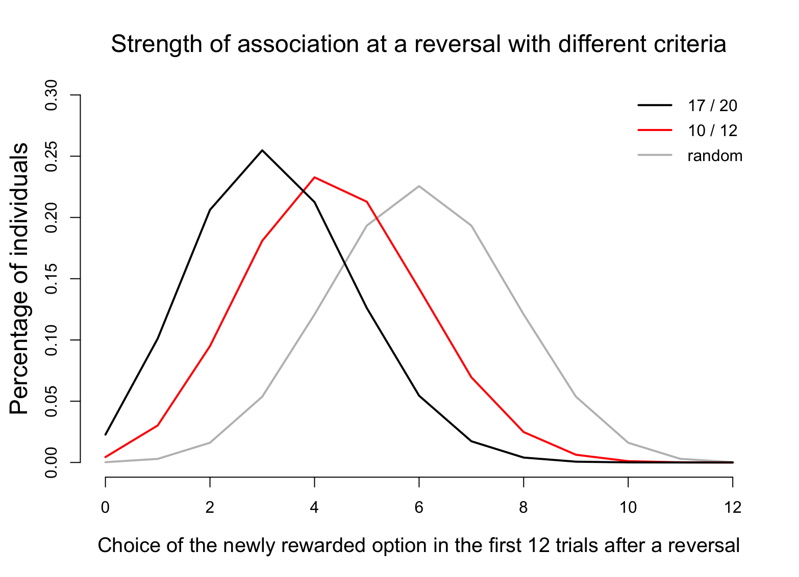
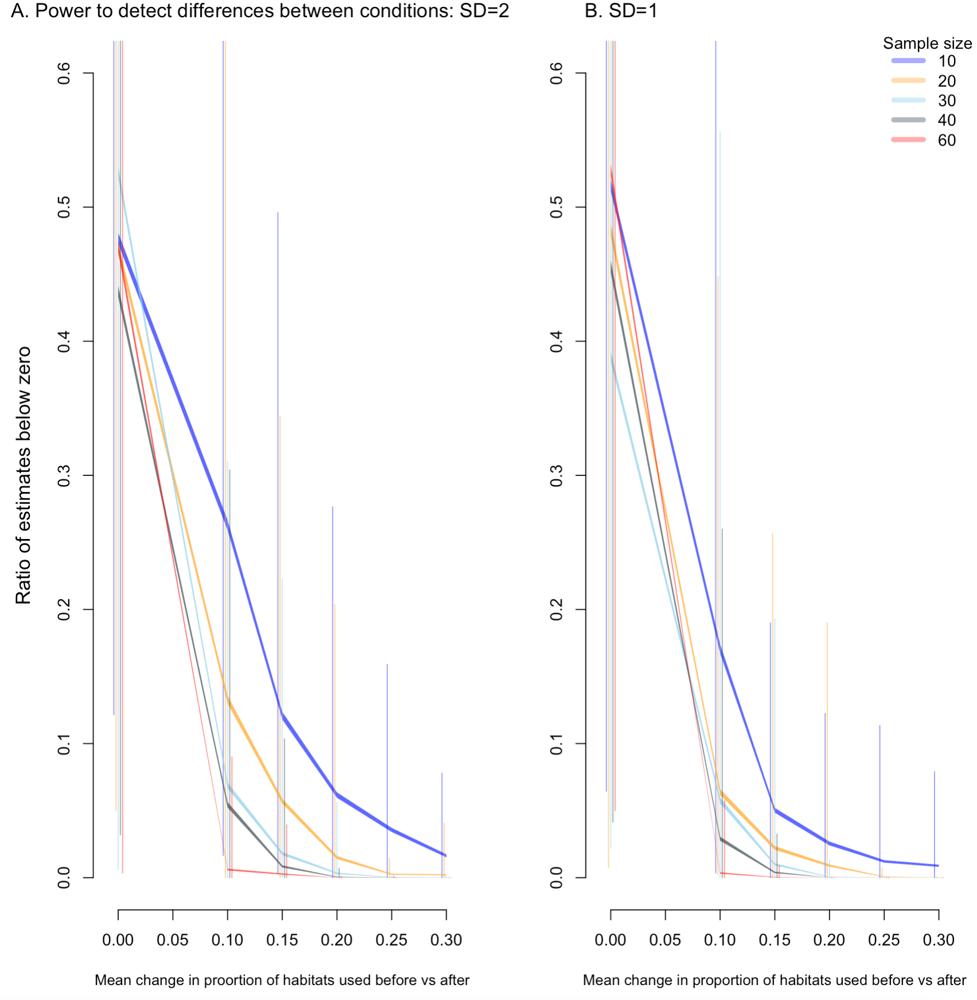

\addtolength{\headheight}{0.1cm}
\pagestyle{fancyplain}
\lhead{\includegraphics[height=1.2cm]{logoPCIRR.png}}
\renewcommand{\headrulewidth}{0pt}

Open... {width=5%} access {width=5%} [code](https://github.com/ManyIndividuals/ManyIndividuals/blob/main/Files/rrs/mi1.Rmd)

**Affiliations:** 1) Max Planck Institute for Evolutionary Anthropology, Germany; 2) Victoria University of Wellington, New Zealand; 3) University of California Santa Barbara, USA. Corresponding authors: corina_logan@eva.mpg.de, rachael.shaw@vuw.ac.nz, kelseybmccune@gmail.com

```{r setup, include=FALSE}
library(knitr)
knitr::opts_chunk$set(tidy.opts=list(width.cutoff=60),tidy=TRUE) 
#Make code wrap text so it doesn't go off the page when Knitting to PDF

knitr::opts_chunk$set(echo=T, include=T, results='asis', warning=F, message=F) 
#sets global options to display code along with the results https://exeter-data-analytics.github.io/LitProg/r-markdown.html
#set echo=F for knitting to PDF (hide code), and echo=T for knitting to HTML (show code)
```

# **ABSTRACT**

Human modified environments are increasing, causing global changes that other species must adjust to or suffer from. Behavioral flexibility (hereafter 'flexibility') could be key to coping with rapid change. Behavioral research can contribute to conservation by determining which behaviors can predict the ability to adjust to human modified environments and whether these can be manipulated. When research that manipulates behavior in a conservation context occurs, it primarily trains a specific behavior to improve individual success in the wild. However, training a domain general cognitive ability, such as flexibility, has the potential to change a whole suite of behaviors, which could have a larger impact on influencing success in adjusting to human modified environments. This project asks whether flexibility can be increased by experimentally increasing environmental heterogeneity and whether such an increase can help species succeed in human modified environments. We explore whether it is  possible to take insights from highly divergent species and apply them to address critical conservation challenges. This pushes the limits in terms of understanding how conserved these abilities may be and to what extent they can be shaped by the environment. We aim to 1) conduct flexibility interventions in two flexible species that are successful in human modified environments (great-tailed grackles and California scrub-jays) to understand how flexibility relates to success; and 2) implement these interventions in two vulnerable species (toutouwai and Florida scrub-jays) to determine whether flexibility as a generalizable cognitive ability can be trained and whether such training improves success in human-modified environments. This research will significantly advance our understanding of the causes and consequences of flexibility, linking behavior to environmental change, cognition, and success in human modified environments through a comparative and global framework.

# **REGISTERED REPORT DETAILS**

 - **Level of bias = 6:** This registered report was written (Jul 2021-Mar 2022) prior to collecting any data.
 - **Programmatic registered report:** Three Stage 2 articles will result from this one Stage 1 registered report: one for toutouwai, one for grackles, and one for scrub-jays.
 - **Deviations from the Stage 1 registered report:** [to be filled in as needed after data collection begins]

# **INTRODUCTION**

Human modified environments are increasing [e.g., @liu2020high; @wu2011quantifying; @goldewijk2001estimating], causing global changes that other species must adjust to or suffer from [e.g., @ciani1986intertroop; @chejanovski2017experimental; @federspiel2017adjusting; @alberti2015eco]. Behavioral flexibility (hereafter 'flexibility') could be key: individuals interact with their environment through behavior, making it crucial to an ecologically valid understanding of how species adjust to environmental changes [@lee2021animal]. One of the top priorities for behavioral research to maximize conservation progress is to determine which cognitive abilities and behaviors can predict the ability to adjust to human modified environments and whether these can be manipulated [@moseby2016harnessing]. The rare research that manipulates behavior in a conservation context usually focuses on training specific behaviors (e.g., predator recognition through predator exposure) to improve individual success in the wild [@moseby2012can; @west2018predator; @jolly2018out; @ross2019reversing; see review in @tetzlaff2019effects]. However, training a general cognitive ability, such as flexibility -- the ability to rapidly adapt behavior to changes through learning throughout the lifetime [see the theory behind this definition in @mikhalevich_is_2017] -- has the potential to change a whole suite of behaviors and more broadly influence success in adjusting to human modified environments. Recent evidence supports this hypothesis: as far as we are aware, we were the first to show that flexibility can be manipulated using serial reversal learning of color preferences, and that the manipulated individuals were more flexible in a new context (locus switching on a puzzlebox) as well as being more innovative (solved more loci on a puzzlebox) [@logan2022flexmanip].

Environments where informational cues about resources vary in a heterogenous (but non-random) way across space and time are hypothesized to open a pathway for species to functionally detect and react to such cues via flexibility [@mikhalevich_is_2017]. Human modified environments likely provide a different set of informational cues that vary heterogeneously across space and time, and the species that are successful in such environments are likely those who are able to detect and track such cues. Because heterogeneous environments are hypothesized to select for flexibility, we expect that experimentally manipulating environments to be more heterogeneous will result in an increase in flexibility in individuals, which will then increase their success in such environments (Figure 1). Success can relate to any number of variables regarding the usage of and investment in resources and response to threats, from improved foraging efficiency to increased dispersal and survival within human modified environments, to placing nests in more protective locations. Whether a measure of success is predicted to relate to flexibility depends on what is already known about the particular population and their particular environment. 

&nbsp;


**Figure 1.** The theory behind this research illustrated by a directed acyclic graph (DAG), which is a theoretical model of the causal relationships among the key variables in our investigation. Based on the theoretical background provided by @mikhalevich_is_2017, we assume that more heterogeneity causes more flexibility, which then causes more success in human modified environments.

&nbsp;

This investigation asks whether flexibility can be increased by experimentally increasing environmental heterogeneity (via serial reversal learning) and whether such an increase can help species succeed in human modified environments. We explore whether it is possible to take insights from highly divergent species and apply them to address critical conservation challenges. We aim to conduct a flexibility intervention in two flexible species that are successful in human modified environments (great-tailed grackles and California scrub-jays) to understand how flexibility relates to success, and implement these interventions in two vulnerable species (toutouwai and Florida scrub-jays) to determine whether flexibility as a generalizable cognitive ability can be trained and whether such training improves success in human modified environments (Figure 2). Manipulating the flexibility of a few individuals could have population-level effects because significant research on social information use in birds [e.g., @valente2021conspecific] demonstrates the potential for the manipulated behavior to disseminate to conspecifics (e.g., if manipulated individuals are faster at locating new resources, which could attract the attention of conspecifics, or if unmanipulated individuals copy the manipulated individuals’ nesting or foraging locations). This comparative approach will ultimately reveal how conserved these abilities may be and to what extent they can be shaped by the environment. The results will substantially advance our understanding of the causes and consequences of flexibility, linking behavior to environmental change, cognition, and success in human modified environments through a comparative and global framework.


# **RESEARCH QUESTIONS**

## Can behavioral flexibility in individuals be increased by increasing environmental heterogeneity? If so, does increased flexibility help individuals succeed in human modified environments? 

**Prediction 1:** Flexibility can be increased in individuals and such an increase **improves the likelihood of success in human modified environments**. This would indicate that the abilities involved in tracking changing resources or threats in the environment are the same as or related to the abilities involved in succeeding in human modified environments. It would also indicate that flexibility is trainable and that such training could be a useful conservation tool for threatened and endangered species. 

**Prediction 1 alternative 1:** Flexibility can be increased in individuals, but such an increase **does not improve the likelihood of success** in human modified environments. This would indicate that species associated with human modified environments form this association for reasons other than their flexibility, and that threatened species are likely not very successful in human modified environments for reasons unrelated to their ability to change their behavior with changing circumstances.

**Prediction 1 alternative 2:** Flexibility can be increased in some populations, but not others. This would indicate that **flexibility manipulations may not work for all populations**, and that the effectiveness of such experiments should first be tested in the population of interest before including such an intervention in a conservation plan. If flexibility is not manipulatable in threatened populations, this would indicate that they are likely not very successful in human modified environments because of their inability to change their behavior with changing circumstances, and that flexibility is not trainable. If flexibility is not manipulatable in populations that are successful in human modified environments, this could indicate that they might have used flexibility in the past when originally forming the association, but the need to maintain flexibility in their repertoire is no longer necessary. In populations where flexibility is not manipulatable, this would indicate that the abilities involved in tracking changing resources in the environment are independent of the abilities involved in succeeding in human modified environments.


## Population-specific background and tailored research questions

&nbsp;


**Figure 2.** Comparing the species involved in this investigation relative to their geographic range and association with human modified habitats. The yellow dots represent field site locations. Photo credit: grackle and CASJ, Corina Logan; blue jay, Rhododendrites; FLSJ, VvAndromedavV; toutouwai, Rachael Shaw.

&nbsp;

### **Great-tailed grackles (*Quiscalus mexicanus*)**

#### Background 
Great-tailed grackles are flexible [@logan2016flexibilityproblem; @logan2019flexmanip], highly associated with human modified environments [@johnson2001great], and have been rapidly expanding their geographic range across North America over the past 140 years [@wehtje2003range]. They are social and polygamous, and eat a diversity of human foods as well as foraging on insects and on substrates for other natural food items [@johnson2001great]. Males tend to be the socially dominant sex [@johnson2000male] and also the sex that disperses away from their natal area [@sevchik2019dispersal]. @Rodrigo2021gtgr found that more grackles are present and more foraging events occur during garbage pick ups when garbage tends to spill out of the bags, thus increasing food availability. Attending to garbage trucks, potentially across space and time, is an example of how flexibility can help individuals meet foraging needs in the context of changing environmental cues. Great-tailed grackle behavioral flexibility is manipulatable using serial reversal learning, and this manipulation improves their flexibility in a new context as well as their innovativeness [@logan2019flexmanip], which shows that training a general cognitive ability can affect more behaviors than the behavior that was trained and potentially make them more successful in human modified environments. We are in the middle of long-term data collection on grackles to answer questions about how flexibility relates to exploration [@mccune2019exploration], the predictability of their space use [@mccune2020spaceuse] and their foraging breadth [@logan2019flexforaging]. 

#### Research question 

 - **G.Q1: Do flexibility manipulated individuals differ in the proportion of time spent at cafes and garbage dumpsters when food is present?** We will investigate this question by tracking their presence at cafes and dumpsters when food is present versus when it is absent before and after manipulating their flexibility using serial reversal learning in the wild (Figure 3). Table 1 summarizes our predictions, analysis plans, interpretations for the various directions the results could go, and the hypotheses that could be contradicted given the various outcomes.

&nbsp;


**Figure 3.** The reversal learning experiment in a group context (Design 2) tailored to the great-tailed grackle research question.

&nbsp;

**Table 1.** Study design for the great-tailed grackle research. References that were not already cited in the introduction: @duckworth2009role, @dingemanse2013between.


&nbsp;


### **Jays (*Aphelocoma californica* and/or *A. coerulescens* and/or *Cyanocitta cristata*)**

We are not yet sure which jay species will be feasible to test as part of this investigation. We aim to test a disturbance resilience species like the California scrub-jay or blue jay. We also aim to test the disturbance sensitive Florida scrub-jay, but we are still waiting for permits on the Florida Scrub-jay and blue jay. Regardless of the species that end up in the investigation, we will use the same hypotheses and predictions below.

#### Background
Jay species exhibit a diversity of social systems and success in colonizing suburban and urban areas. California scrub-jays (*Aphelocoma californica*, hereafter "CASJ") and blue jays (*Cyanocitta cristata*, hereafter “BLJA”) are singular, monogamous breeders that are increasing in abundance, expanding their range sizes, and highly successful in natural, suburban, and urban areas [@blair1996land; @curry2017california]. We therefore consider these “disturbance-resilient” (DR) jay species. In contrast, the Florida scrub-jay (*A. coerulescens*; hereafter "FLSJ") is a “disturbance-sensitive” (DS) jay species that is threatened, endemic, and range-restricted to xeric oak scrub habitat in Florida [@woolfenden1996florida]. 

These species forage primarily on mast (acorns, hazelnuts, etc.) that they cache throughout their territory, which makes it available to eat year-round. They are also opportunistic omnivores and specifically need high-fat and high-protein arthropods to feed to nestlings and fledglings [@curry2017california]. Nesting and foraging substrates can be drastically different in human modified environments compared to natural areas [@tuomainen2011behavioural], and it is unknown whether suburban and urban jays are able to persist in these environments through behavioral adjustments. The DS jay species, the FLSJ, can persist in suburban habitats after conversion from xeric oak scrub, however suburban populations of FLSJ steadily decline (Bowman pers. comm.). This is potentially due to the presence of suboptimal habitat resulting from fire suppression [@woolfenden1996florida], higher rates of brood reduction through nestling starvation [@shawkey2004brood], and the lack of nutritionally complete prey items [@shawkey2004brood] in suburban habitats. It is possible that behavioral flexibility in habitat use and foraging breadth underlies the ability of some FLSJ to persist in human-dominated areas. 

We aim to compare behavioral flexibility within species, between suburban and natural populations to determine whether variation in flexibility relates to variation in presence in these habitats. Subsequently, we will compare flexibility between DS and DR jay species to determine whether this trait is related to the greater success of DR jay species, like the CASJ and BLJA, in human-dominated areas. Lastly, we will test whether manipulating flexibility increases the foraging breadth and reproductive success of jays in human modified environments. Manipulating the flexibility of a subset of individuals has the potential to affect the population because previous research demonstrates that both species have the capacity to use foraging information discovered by others (social learning) to flexibly change their behavior [@mccune2018cognition; @midford2000social]. 

While we have begun to acquire permits to work with these species, the processing time for permits to research threatened and endangered species can be very long and unpredictable. Therefore, while we aim to collect data on the FLSJ during the 5-year timeline of this project, it is possible this species will have to be omitted if the permits are not approved in time. If this occurs, we will not be able to compare CASJ/BLJA and FLSJ (Question 2 in Table 2), but we will still be able to compare behavioral flexibility of CASJ/BLJA populations in human modified and natural areas, and assess whether the behavioral flexibility manipulation affects success in human modified environments.

#### Research questions

For all research questions, Table 2 summarizes our predictions, analysis plans, interpretations for the various directions the results could go, and the hypotheses that could be contradicted given the various outcomes.

 - **J.Q1: Do jay populations in human modified areas differ in baseline behavioral flexibility compared to populations in natural areas?** We will investigate this question by comparing performance on serial reversal learning in the wild between jays in natural areas and jays in human modified areas. 
 - **J.Q2: Are disturbance-resilient (DR) jays more behaviorally flexible than disturbance-sensitive (DS) jays?** We will investigate this question by comparing performance on serial reversal learning in the wild between between DR and DS jay species. 
 - **J.Q3: Does manipulating behavioral flexibility alter the number of microhabitats used?** We will investigate this question by tracking their presence in a variety of microhabitats before and after manipulating their flexibility using serial reversal learning in the wild. 
 - **J.Q4: Does manipulating flexibility alter the number of different food items taken by jays?** We will investigate this question by tracking the various food items they take before and after manipulating their flexibility using serial reversal learning in the wild.
 
&nbsp;


**Figure 4.** The reversal learning experiment in a group context (Design 2) tailored to the jay research questions.

&nbsp;

**Table 2.** Study design for the jay research. References that were not already cited in the introduction: [@barton2000limits].


&nbsp;


### **Toutouwai (North Island robin, *Petroica longipes*)**

#### Background
Toutouwai are a small insectivorous passerine species that is endemic to the North Island of New Zealand. Prior to the arrival of European settlers, they were abundant and widespread. However, European colonization brought the introduction of mammalian predators, which  had devastating consequences for New Zealand's avifauna. As a result, the national conservation status of the toutouwai is now at risk and in decline [@Robertson2016birdstatus]. In response to avifauna declines in New Zealand, many offshore islands have now been established as predator free sanctuaries. Threatened endemic birds have also been reintroduced into ‘mainland island’ sanctuaries; areas on New Zealand's North and South Islands that are designed to eliminate the threat posed by non-native mammalian predators [@Saunders2001mainlandisland]. Yet, despite predator control and fences protecting sanctuary populations, these vulnerable species still come into contact with invasive mammalian predators beyond mainland sanctuary boundaries. 

At Zealandia, a 225 hectare predator-proof fenced sanctuary located in central Wellington, less than 20 years have passed since the introduction of toutouwai [@Miskelly2005zealandia]. This species now thrives inside the sanctuary with some individuals surviving up to 14 years, but is struggling to gain a foothold in the surrounding reserves. Toutouwai may undergo juvenile dispersal from 5 weeks post-fledging onwards, travelling anywhere from a few meters to several kilometers from their natal territory [@Richard2010dispersal]. Many juvenile toutouwai are sighted establishing territories outside of the sanctuary each year, yet few persist for more than a few weeks [@Shaw2018halomonitoring]. Previous research on the cognitive abilities of toutouwai reveals that this species can retain a learned skill for several months in the wild, without reinforcement [@Shaw2020longterm]. Moreover, their bold and curious nature means that they will interact with novel objects and readily engage in a suite of cognitive tests [@shaw2015wild]. As such, they are an ideal species in which to examine whether flexibility manipulations might influence the dispersal decisions made by juveniles, or enhance the survival of juveniles that attempt to establish beyond the sanctuary fence.

#### Research questions
For all research questions, Table 3 summarizes our predictions, analysis plans, interpretations for the various directions the results could go, and the hypotheses that could be contradicted given the various outcomes.

 - **T.Q1: Does a flexibility manipulation alter dispersal timing and distance, as well as the likelihood that juvenile toutouwai will disperse beyond the protection of Zealandia’s fence and attempt to establish in the adjacent urban reserves?** We will investigate this question by measuring their age at dispersal, dispersal distance, and habitat dispersed to after either manipulating their flexibility using serial reversal learning in the wild (manipulated group) or not manipulating their flexibility by giving them only one reversal rather than serial reversals (control group).  
 - **T.Q2: Compared to control individuals, are flexibility manipulated individuals more likely to survive their first 16 weeks post-fledging, particularly if they disperse into the urban reserves outside the sanctuary fence?** We will investigate this question by tracking their dispersal destination after either manipulating their flexibility using serial reversal learning in the wild (manipulated group) or not manipulating their flexibility by giving them only one reversal rather than serial reversals (control group). 

&nbsp;


**Figure 5.** The reversal learning experiment in a group context (Design 2) tailored to the toutouwai research questions.

&nbsp;

**Table 3.** Study design for the toutouwai research. References that were not already cited in the introduction: .


&nbsp;


# **METHODS**

We present one experimental design for the flexibility intervention (Figure 6) that can be conducted in two ways: in visual isolation (design 1) and in a group context (design 2). Experimenters can decide which (or both) they want to conduct in their population. Only one experiment must be conducted per population to be able to test these hypotheses. Conducting more than one of these experiments per population is acceptable, but not necessary. Before we present the designs, we first validated the reversal passing criteria and made them generalizable to a variety of species (see the next two sections).

&nbsp;


**Figure 6.** Template design for the reversal learning experiment.

## Determining when to switch each individual to the next reversal: reversal passing criterion

Different criteria exist to decide whether an individual has learned an association between the presence of a reward and some other feature (e.g., color or shape). The two main two criteria used are to switch an individual after it either has chosen 10 out of 12 choices correct [e.g., @shaw2015wild] or 17 out of 20 choices correct [e.g., @logan2016flexibilityproblem]. The criteria are further modified depending on whether choices are assessed continuously or grouped in predetermined blocks. 

Here, we assess whether stopping after an individual chose 10 out of the last 12 continuously counted choices can be used as a reliable reversal passing criterion. To determine reliability and suitability, we investigated five questions by generalizing previously simulated reversal learning data from @logan2020xpop, which was based on reversal learning data from one species (great-tailed grackles). Grackles are fast to reverse preferences compared with many other species [@logan2016flexibilityproblem], therefore we generalized the simulations to other species by setting the parameters that guide performance (phi and lambda) to also lead to slower performances. 

The findings from these simulated data indicate that deciding that an individual has passed the reversal when they choose 10 out of the last 12 consecutive trials correctly is functional and reliable because of the following:

**1) individuals will be finished after fewer trials than with other criteria**

With the 10 out of 12 criterion, individuals pass the reversal 8 trials faster (median) than with the 17 out of 20 criterion. This means that, for most individuals, the two rules are equally effective because they will pass both in the same amount of trials, but because the 10 out of 12 criterion is restricted to 12 trials instead of 20 individuals they need 8 fewer trials to meet the passing criterion. No individual needs more trials with the 10 out of 12 criterion. When trials are grouped into blocks of 10 such that they could only pass on trial 20, 30, etc., individuals need a median of 5 more trials compared to when choices are assessed continuously.

**2) classification of individuals using the 10/12 criterion is less noisy because there is less of a chance for individuals to approach the criterion and not pass or never pass**

The average improvement is larger than the median because there are no individuals who are faster with the 17 out of 20 criterion, and because there is a subset of individuals who need considerably fewer trials with the 10/12 criterion (Figure 7). Individuals who require a larger number of trials (>100) to pass almost never occur with the 10/12 criterion, whereas they are more common with the 17/20. With more trials, there is a higher chance that an individual will deviate from their preference by chance. This is also reflected in that 65 of the 626 simulated individuals never reached the 17/20 criterion within the maximum 300 trials, whereas there were only 4 individuals with the 10/12 criterion. Accordingly, an additional benefit of choosing the 10/12 criterion is that it is more likely that data for all individuals, even those who are slow to learn an association, can be collected.


**Figure 7.** There is less noise with the 10/12 reversal learning passing criterion and it requires fewer trials to reach than the 17/20 passing criterion. Each circle represents one of the 626 simulated individuals, the black diagonal line indicates where both criteria are equal, and the red line is the slope of the simulated data and stops at x=100 trials to show that there are only few individuals who need more than 100 trials to pass using the 10/12 criterion, but there are many individuals with the 17/20 criterion (y=100+). The red line is above the black line, which shows that the 10/12 criterion requires fewer trials for individuals to reach.

**3) variation among individuals with the 10/12 criterion is still present and similar to the variation detected with other criteria**

As described in point 1, when changing the criterion from 17/20 to 10/12, most individuals need 8 fewer trials. This also means that the differences among individuals, which might contain relevant information about variation among them, is preserved. When transforming performance with the two criteria to ranks, individuals are sorted essentially in the same order independent of which criterion is used. This is shown in Figure 7: most points are close to the red line, which is the 1:1 regression line (shifted up by 8 trials).

**4) individuals can be assumed to have reliably learned the association using the 10/12 criterion**

Based on the two reversal passing criteria (10/12 and 17/20), we can extract the attractions that simulated individuals have formed toward both the rewarded and the unrewarded option at the point at which they meet each of these criteria. Comparing the two attractions (to the rewarded and unrewarded options), we can determine whether individuals are likely to have learned an association or not. Independent of the criterion, individuals generally formed a preference for the rewarded option: 89% of individuals favor the rewarded option between 2.5 and 14 times more than the unrewarded option. With both criteria, individuals always have a stronger attraction to the rewarded than the unrewarded option. The smallest difference between the attraction scores to the rewarded and unrewarded options we observe at the point of passing is the same with both criteria. With the 10/12 criterion, individuals would in the next trial, on average, choose the rewarded option with a probability of 76% (3 times more likely to choose rewarded over unrewarded option), whereas this is 84% with the 17/20 criterion (5 times more likely).

**5) the learned association means that individuals who move to the next reversal are unlikely to solve the reversed association by chance**

As expected, based on the relative attraction scores at the end of the previous reversal, most individuals are unlikely to choose the now rewarded option. We expect that, on average, individuals will choose the newly rewarded option in 4 or fewer trials out of the first 12 trials (red line in Figure 8). This is a lower number of trials compared to individuals who have no association with either option (gray line in Figure 8), and a slightly higher number compared to individuals who use the 17/20 criterion (black line in Figure 8). The probability that an individual would, after a reversal, immediately choose the rewarded option 10 times during the first 12 trials (and pass) by chance is 0.001. However, even such rare individuals will have actually reversed their preference during their first 12 trials because they update their attractions on every trial.



**Figure 8.** Individuals form strong enough preferences using the 10/12 passing criterion as indicated by the fact that they are unlikely to pass in the first 12 trials of their next reversal (red line). These individuals would take longer to switch their preference than individuals who have no preference (gray line), and they would be slightly faster at switching their preference than individuals who formed their previous association using the 17/20 criterion (black line).

```{r loadsimulatedreversaldata, eval=F}
################################################################################################
# Load previously simulated data from xpop
################################################################################################

# There are two sets of simulated data, with initial attractions towards both options set at 0.1, and eight different phi and four different lambda combinations
simulatedreversaldata_attractionscores_1<-read.csv(url("https://raw.githubusercontent.com/corinalogan/grackles/master/Files/Preregistrations/gxpopbehaviorhabitat_SimulatedReversalData_Grackles_PhiLambda_Attraction02_Aug2021.csv"), header=T, sep=",", stringsAsFactors=F) 

simulatedreversaldata_attractionscores_2<-read.csv(url("https://raw.githubusercontent.com/corinalogan/grackles/master/Files/Preregistrations/gxpopbehaviorhabitat_SimulatedReversalData_Grackles_PhiLambda_Attraction04_Aug2021.csv"), header=T, sep=",", stringsAsFactors=F) 

# In both simulations, sites (which differ by the phi and lambda assigned to individuals) were counted from 1-16; for the second simulation we change this to 17-32
simulatedreversaldata_attractionscores_2$Site<-simulatedreversaldata_attractionscores_2$Site+16

# In both simulations, individuals were counted from 1-320; for the second population we change the ids to start at 321
simulatedreversaldata_attractionscores_2$Bird_ID<-simulatedreversaldata_attractionscores_2$Bird_ID+320

# We combine the two data sets for the further analyses
library(dplyr)
simulatedreversaldata_attractionscores<-bind_rows(simulatedreversaldata_attractionscores_1,simulatedreversaldata_attractionscores_2)


################################################################################################
# Preparing simulated data for analyses
################################################################################################

# In the simulations, trials were counted continuously for each bird. We now want to change this so that it restarts counting trials from 1 upward once a bird switches to reversal.

for (birds in 1:length(unique(simulatedreversaldata_attractionscores$Bird_ID))){
  currentbird<-unique(simulatedreversaldata_attractionscores$Bird_ID)[birds]
  maximuminitial<-max(simulatedreversaldata_attractionscores[simulatedreversaldata_attractionscores$Bird_ID==currentbird & simulatedreversaldata_attractionscores$Reversal == "initial",]$Trial)
  simulatedreversaldata_attractionscores[simulatedreversaldata_attractionscores$Bird_ID==currentbird & simulatedreversaldata_attractionscores$Reversal == "reversal",]$Trial<-simulatedreversaldata_attractionscores[simulatedreversaldata_attractionscores$Bird_ID==currentbird & simulatedreversaldata_attractionscores$Reversal == "reversal",]$Trial - maximuminitial
}

# We need to adjust the coding during the reversal learning so that "correct" now matches whether it is correct or not. 
simulatedreversaldata_attractionscores[simulatedreversaldata_attractionscores$Choice==0,]$Choice<-2

# To use the model to estimate the phi and lambda parameters, we first need to change the column names to match these to the specifications in the model: change Bird_ID  to id; change Reversal to Choice, change CorrectChoice to Correct, change Site to Expid

colnames(simulatedreversaldata_attractionscores)<-c("counter","id","Session","Trial","Reversal","Choice","Correct","Phi_mean","Lambda_mean","Site","Phi_sd","Lambda_sd","ThisBirdsPhi","ThisBirdsLambda","Attraction1","Attraction2")


# There are several simulated individuals who never reached any criterion during the initial learning phase (in xpop we worked with the criterion of 17 correct out of the 20 choices given as one block). We need to remove these individuals from the dataset

birdswithreversal<-as.data.frame(simulatedreversaldata_attractionscores %>% group_by(id) %>% summarise(experiments=length(unique(Reversal))))
birdswithreversal<-birdswithreversal[birdswithreversal$experiments==2,]
simulatedreversaldata_attractionscores<-simulatedreversaldata_attractionscores[simulatedreversaldata_attractionscores$id %in% birdswithreversal$id,]

# Next, we need to change the ids of the birds to be continuous again for easier further processing in loops
simulatedreversaldata_attractionscores$id<-as.integer(as.factor(simulatedreversaldata_attractionscores$id))


################################################################################################
# 1) With the 10 correct out of 12 continuous trials criterion, individuals finish after fewer trials than with other criteria
################################################################################################

# We use the data from the first reversal to check after how many trials an individual reaches the 10 out of 12 trials solved correctly rule. We are using a sliding window, rather than assuming that the experiment is split into discrete blocks of trials. For this, we check for each individual at what trial number it first reached the criterion that it had correctly solved 10 out of the last 12 trials.

# We create a matrix to store the output. We have two columns, one with the id of the individual the other with the number of trials they needed with this rule. Having this setup makes the comparison with the alternative rule easier. In addition, it will keep track of individuals that never reached the criterion
trialnumber_initiallearning_reachedtwelveten<-matrix(ncol=2,nrow=length(unique(simulatedreversaldata_attractionscores$id)))

# We loop through all unique individuals in the simulated dataset (626 individuals) and for each check when they reached the criterion - at that point we can stop ("break") and ignore the remaining performance. In the initial association learning, wrong choices are coded as 2 and correct choices as 1, so individuals reached the criterion if they chose 10*1 + 2*2 (equals 14) - so individuals reached criterion when the sum in choices across 12 trials is lower than 15.
for (i in 1:length(unique(simulatedreversaldata_attractionscores$id))){
  
  thisindividualsinitaltrials<-simulatedreversaldata_attractionscores[simulatedreversaldata_attractionscores$id %in% i & simulatedreversaldata_attractionscores$Reversal %in% "initial",]
  trialnumber_initiallearning_reachedtwelveten[i,1]<-i
  for (k in 1:(nrow(thisindividualsinitaltrials)-12)){
    if(sum(thisindividualsinitaltrials[c(k:(k+11)),]$Choice)<15){
      trialnumber_initiallearning_reachedtwelveten[i,2]<-(k+11)
      break}
  }
}

# Next, we repeat this for the alternative rule of 17 out of 20 trials, again using a sliding window approach across trials (17*1 + 3*2 = 23).
trialnumber_initiallearning_reachedseventeentwenty<-matrix(ncol=2,nrow=length(unique(simulatedreversaldata_attractionscores$id)))

for (i in 1:length(unique(simulatedreversaldata_attractionscores$id))){
  
  thisindividualsinitaltrials<-simulatedreversaldata_attractionscores[simulatedreversaldata_attractionscores$id %in% i & simulatedreversaldata_attractionscores$Reversal %in% "initial",]
  trialnumber_initiallearning_reachedseventeentwenty[i,1]<-i
  for (k in 1:(nrow(thisindividualsinitaltrials)-20)){
    if(sum(thisindividualsinitaltrials[c(k:(k+19)),]$Choice)<24){
      trialnumber_initiallearning_reachedseventeentwenty[i,2]<-(k+19)
      break}
  }
}

# We now have the number of trials each individual would have needed with the two rules to reach the respective criterion. We can check whether individuals needed fewer trials with the 10 out of 12 rule than the 17 out of 20 rule
twelvetenfaster<-trialnumber_initiallearning_reachedseventeentwenty[,2]-trialnumber_initiallearning_reachedtwelveten[,2]

# The median improvement is 8 trials
median(twelvetenfaster,na.rm=T)
# This means that for most individuals the two rules are equally effective, but because the 10 out of 12 rule is restricted to 12 trials instead of 20 individuals need 8 fewer trials.


# The same is seen in a regression
summary(lm(trialnumber_initiallearning_reachedseventeentwenty[,2]~trialnumber_initiallearning_reachedtwelveten[,2]))
# The intercept is 7 (similar to the mean listed above), and the slope is 1.3 (suggesting that deviations are slightly more when individuals need a large number of trials). 


# We can also check whether counting trials continously, instead of grouping them into blocks, means that individuals finish sooner. In the original simulation, trials where stopped when birds reached the 17 out of 20 criterion based on blocks of 10 trials. We can check whether counting trials continously means they would have finished sooner:

# We now get the number of trials they needed to pass the block criterion
trialnumber_initiallearning_reachedseventeentwentyblock<-matrix(ncol=2,nrow=length(unique(simulatedreversaldata_attractionscores$id)))

for (i in 1:length(unique(simulatedreversaldata_attractionscores$id))){
  
  thisindividualsinitaltrials<-simulatedreversaldata_attractionscores[simulatedreversaldata_attractionscores$id %in% i & simulatedreversaldata_attractionscores$Reversal %in% "initial",]
  trialnumber_initiallearning_reachedseventeentwentyblock[i,1]<-i
  trialnumber_initiallearning_reachedseventeentwentyblock[i,2]<-max(thisindividualsinitaltrials$Trial)

  }

plot(trialnumber_initiallearning_reachedseventeentwentyblock[,2]~trialnumber_initiallearning_reachedseventeentwenty[,2])
abline(a=0,b=1)

median(trialnumber_initiallearning_reachedseventeentwentyblock[,2]-trialnumber_initiallearning_reachedseventeentwenty[,2],na.rm=T)
# 5 trials faster

mean(trialnumber_initiallearning_reachedseventeentwentyblock[,2]-trialnumber_initiallearning_reachedseventeentwenty[,2],na.rm=T)
# 7 trials faster


################################################################################################
# 2) With the 10 correct out of 12 continuous trials criterion, variation among individuals is still present and similar to the variation detected with other criteria
################################################################################################


# Changing the criterion from 17/20 to 10/12 generally means that most individuals need 8 fewer trials. That also means that the differences among individuals, which might contain relevant information, is preserved. We can see this when we plot their ranks in how many trials they need (individuals who need the same number of trials have the same rank; there are fewer ranks with the 10/12 criterion because large values do not appear)
plot(as.integer(as.factor(trialnumber_initiallearning_reachedseventeentwenty[,2])) ~ as.integer(as.factor(trialnumber_initiallearning_reachedtwelveten[,2])),xlim=c(0,100),ylim=c(0,100))
abline(a=0,b=1)


################################################################################################
# 3) With the 10 correct out of 12 continuous trials criterion, classification is less noisy because there is less of a chance of individuals missing the criterion repeatedly or even never reaching it, meaning that individuals slow to learn will be more reliably classified than with a different criterion
################################################################################################

# While the median improvement is 8 trials, the average improvement is 15 trials
mean(twelvetenfaster,na.rm=T)
# The average improvement is larger than the median because, first, there are no individuals who are faster with the 17 out of 20 rule, and secondly because there is a subset of individuals who need considerably fewer trials with the 10 out of 12 rule. We can see this in a plot:

plot(trialnumber_initiallearning_reachedseventeentwenty[,2]~trialnumber_initiallearning_reachedtwelveten[,2],xlim=c(0,250),ylim=c(0,250),ann=F,bty="n")
mtext("with 10 out of 12 criterion", side=1,line=3,cex=1.5)
mtext("with 17 out of 20 criterion", side=2,line=2.5,cex=1.5)
mtext("number of trials needed to pass reversal", side=3,line=1.25,cex=2)
abline(a=0,b=1)
segments(x0 = 12, y0 = 20, x1 = 100, y1 = 108, col = "red",lwd=2) 

# m1Fig_ReversalCriterionComparison

# With the 17 out of 20 rule, some individuals need a very large number of trials. This is presumably because with more trials there is a higher chance that an individual will deviate from their preference by chance, leading to them not reaching the criterion. Such individuals with very larger number of trials (>100) almost never occur with the 10 out 12 rule. There are also 65 individuals (out of the 626) with the 17 out of 20 criterion who never reached the criterion within the maximum 300 trials that were simulated - while there are only 4 with the 10 out of 12 criterion.
sum(is.na(trialnumber_initiallearning_reachedseventeentwenty))
sum(is.na(trialnumber_initiallearning_reachedtwelveten))

# Accordingly, an additional benefit of choosing the 10/12 rule is that it is more likely that data for all individuals, even those slow to learn an association, can be collected.


################################################################################################
# 4) With the 10 correct out of 12 continuous trials criterion, individuals can be assumed to have reliably learned the association
################################################################################################

# The difference in attraction, the mechanisms of the assumed learning processes mean that changes in attraction scores are non-linear. New information that an option is rewarded leads initially to large increases in the attraction score towards that option, but each additional information about the reward leads to smaller and smaller additional increases; new information that a previously rewarded option is now unrewarded lead initially to large drops in the attraction score, but additional information that this option is no longer rewarded leads to smaller declines in the attraction score. This means that with the 10 out of 12 criterion, individuals might have already reached the part in the curve of change of attraction scores where there are large differences that have essentially plateaued. We can check this by assessing both the actual attraction scores at that trial when individuals would have reached the criterion, and how high their attraction score is in relation to the maximum attraction score they obtained during the experiment.
simulatedreversaldata_attractionscores$relativeattraction<-simulatedreversaldata_attractionscores$Attraction1/simulatedreversaldata_attractionscores$Attraction2

# We create a matrix to store the output. We have two columns, one with the id of the individual the other with the number of trials they needed with this rule. Having this setup makes the comparison with the alternative rule easier. In addition, it will keep track of individuals that never reached the criterion
trialnumber_initiallearning_reachedtwelveten<-matrix(ncol=6,nrow=length(unique(simulatedreversaldata_attractionscores$id)))
colnames(trialnumber_initiallearning_reachedtwelveten)<-c("Id","TrialAtReachingCriterion","AttractionScore","RelativeAttractionScore","AttractionOutOfMax","RelativeAttractionOutOfMax")
trialnumber_initiallearning_reachedtwelveten<-as.data.frame(trialnumber_initiallearning_reachedtwelveten)

# We loop through all unique individuals in the simulated dataset (626 individuals) and for each check when they reached the criterion - at that point we can stop ("break") and ignore the remaining performance. In the initial association learning, wrong choices are coded as 2 and correct choices as 1, so individuals reached the criterion if they chose 10*1 + 2*2 (equals 14) - so individuals reached criterion when the sum in choices across 12 trials is lower than 15.
for (i in 1:length(unique(simulatedreversaldata_attractionscores$id))){
  
  thisindividualsinitaltrials<-simulatedreversaldata_attractionscores[simulatedreversaldata_attractionscores$id %in% i & simulatedreversaldata_attractionscores$Reversal %in% "initial",]
  trialnumber_initiallearning_reachedtwelveten[i,1]<-i
  for (k in 1:(nrow(thisindividualsinitaltrials)-12)){
    if(sum(thisindividualsinitaltrials[c(k:(k+11)),]$Choice)<15){
      trialnumber_initiallearning_reachedtwelveten[i,2]<-(k+11)
      trialnumber_initiallearning_reachedtwelveten[i,3]<-thisindividualsinitaltrials[k+11,]$Attraction1
      trialnumber_initiallearning_reachedtwelveten[i,4]<-thisindividualsinitaltrials[k+11,]$relativeattraction
      trialnumber_initiallearning_reachedtwelveten[i,5]<-thisindividualsinitaltrials[k+11,]$Attraction1/max(thisindividualsinitaltrials$Attraction1,na.rm=T)
      trialnumber_initiallearning_reachedtwelveten[i,6]<-thisindividualsinitaltrials[k+11,]$relativeattraction/max(thisindividualsinitaltrials$relativeattraction,na.rm=T)
      break}
  }
}

# Next, we repeat this for the alternative rule of 17 out of 20 trials, again using a sliding window approach across trials (17*1 + 3*2 = 23).
trialnumber_initiallearning_reachedseventeentwenty<-matrix(ncol=6,nrow=length(unique(simulatedreversaldata_attractionscores$id)))
colnames(trialnumber_initiallearning_reachedseventeentwenty)<-c("Id","TrialAtReachingCriterion","AttractionScore","RelativeAttractionScore","AttractionOutOfMax","RelativeAttractionOutOfMax")
trialnumber_initiallearning_reachedseventeentwenty<-as.data.frame(trialnumber_initiallearning_reachedseventeentwenty)

for (i in 1:length(unique(simulatedreversaldata_attractionscores$id))){
  
  thisindividualsinitaltrials<-simulatedreversaldata_attractionscores[simulatedreversaldata_attractionscores$id %in% i & simulatedreversaldata_attractionscores$Reversal %in% "initial",]
  trialnumber_initiallearning_reachedseventeentwenty[i,1]<-i
  for (k in 1:(nrow(thisindividualsinitaltrials)-20)){
    if(sum(thisindividualsinitaltrials[c(k:(k+19)),]$Choice)<24){
      trialnumber_initiallearning_reachedseventeentwenty[i,2]<-(k+19)
      trialnumber_initiallearning_reachedseventeentwenty[i,3]<-thisindividualsinitaltrials[k+19,]$Attraction1
      trialnumber_initiallearning_reachedseventeentwenty[i,4]<-thisindividualsinitaltrials[k+19,]$relativeattraction
      trialnumber_initiallearning_reachedseventeentwenty[i,5]<-thisindividualsinitaltrials[k+19,]$Attraction1/max(thisindividualsinitaltrials$Attraction1,na.rm=T)
      trialnumber_initiallearning_reachedseventeentwenty[i,6]<-thisindividualsinitaltrials[k+19,]$relativeattraction/max(thisindividualsinitaltrials$relativeattraction,na.rm=T)
      break}
  }
}

# We can plot the relative attraction scores (prefer rewarded option relative to unrewarded option) at the points where each individual reached either the 10/12 or the 17/20 criterion. 
plot(trialnumber_initiallearning_reachedtwelveten$RelativeAttractionScore~trialnumber_initiallearning_reachedseventeentwenty$RelativeAttractionScore,ylim=c(0,50),xlim=c(0,50))
abline(a=0,b=1)
library(rethinking)
PI(trialnumber_initiallearning_reachedtwelveten[is.na(trialnumber_initiallearning_reachedtwelveten$RelativeAttractionScore)==F,]$RelativeAttractionScore)
PI(trialnumber_initiallearning_reachedseventeentwenty[is.na(trialnumber_initiallearning_reachedseventeentwenty$RelativeAttractionScore)==F,]$RelativeAttractionScore)

# We can see that (i) the lowest relative attraction scores are very similar, suggesting that independent of the criterion, individuals generally have formed a preference for the rewarded option (89% of the values lie between 2.5 and 14); and that (ii) for most individuals, the relative attraction scores are very similar for the two criteria.


# We can convert the relative attraction scores into the probability that an individual will choose the rewarded option in the trial following the cut-off by converting it back with the respective phi and lambda values
attractionlightgrey_twelveten<-median(trialnumber_initiallearning_reachedtwelveten$AttractionScore,na.rm=T)
attractiondarkgrey_twelveten<-(median(trialnumber_initiallearning_reachedtwelveten$AttractionScore,na.rm=T))/(median(trialnumber_initiallearning_reachedtwelveten$RelativeAttractionScore,na.rm=T))
bird_lambda<-median(simulatedreversaldata_attractionscores$ThisBirdsLambda)
probability_choose_lightgrey_tenoftwelve<-exp(bird_lambda*attractionlightgrey_twelveten)/(exp(bird_lambda*attractionlightgrey_twelveten)+exp(bird_lambda*attractiondarkgrey_twelveten)  )

attractionlightgrey_seventeentwenty<-median(trialnumber_initiallearning_reachedseventeentwenty$AttractionScore,na.rm=T)
attractiondarkgrey_seventeentwenty<-(median(trialnumber_initiallearning_reachedseventeentwenty$AttractionScore,na.rm=T))/(median(trialnumber_initiallearning_reachedseventeentwenty$RelativeAttractionScore,na.rm=T))
bird_lambda<-median(simulatedreversaldata_attractionscores$ThisBirdsLambda)
probability_choose_lightgrey_seventeenoftwenty<-exp(bird_lambda*attractionlightgrey_seventeentwenty)/(exp(bird_lambda*attractionlightgrey_seventeentwenty)+exp(bird_lambda*attractiondarkgrey_seventeentwenty)  )

probability_choose_lightgrey_tenoftwelve
# 0.7612336
probability_choose_lightgrey_seventeenoftwenty
# 0.839137

# While individuals are more likely to choose the rewarded option if they needed the 17/20 criterion to pass, also with the 10/12 criterion individuals show a clear preference for the rewarded option


################################################################################################
# 4) this learned association means that individuals who move to the next reversal with this criteria are unlikely to solve the reversed association by chance.
################################################################################################


# We can simulate the performance in the first 12 trials after switching the rewarded option for sets of 10000 individuals who either have no learned association, have been stopped after the 10/12 rule, or stopped after the 17/20 rule.
choselightgrey_seventeenoftwenty<-matrix(nrow=10000,ncol=12)
choselightgrey_seventeenoftwenty<-as.data.frame(choselightgrey_seventeenoftwenty)

for(i in 1:10000){
  for(j in 1:12)
choselightgrey_seventeenoftwenty[i,j]<-if(runif(1,0,1)<probability_choose_lightgrey_seventeenoftwenty){1} else{0}
}

# We can plot how often these individuals choose the now rewarded option in the first 12 trials: individuals with no learned associations are in the grey distribution, individuals with the 10/12 rule in the blue distribution, and individuals with the 17/20 rule are in the red distribution.  
plot(NA,xlim=c(1,12),ylim=c(0,0.3))
lines(dbinom(1:12,12,1-probability_choose_lightgrey_seventeenoftwenty)~c(1:12),col="red")
lines(dbinom(1:12,12,1-probability_choose_lightgrey_tenoftwelve)~c(1:12),col="blue")
lines(dbinom(1:12,12,0.5)~c(1:12),col="grey")

# As expected based on the relative attraction scores (probability to choose the now rewarded option of 24% for 10/12 and 16% for 17/20), most individuals choose the now rewarded option in less than 6 out of the first 12 trials, whereas that is the mean for individuals with no association

# We can make this more explicit and incorporate that individuals will also change their association as they learn that the rewarded option has switched
#assume that a bird made 10/12 choices correct
attractiondarkgrey<-0.388985
attractionlightgrey<-0.08549744
bird_phi<-median(simulatedreversaldata_attractionscores$ThisBirdsPhi)

# We give the individual 12 trials. We assume that at first they chose the previously rewarded option (dark grey) and switch to the now rewarded option halfway through
attractiondarkgrey<-(1-bird_phi)*attractiondarkgrey+bird_phi*0
attractiondarkgrey<-(1-bird_phi)*attractiondarkgrey+bird_phi*0
attractiondarkgrey<-(1-bird_phi)*attractiondarkgrey+bird_phi*0
attractionlightgrey<-(1-bird_phi)*attractionlightgrey+bird_phi*1
attractiondarkgrey<-(1-bird_phi)*attractiondarkgrey+bird_phi*0
attractiondarkgrey<-(1-bird_phi)*attractiondarkgrey+bird_phi*0
attractionlightgrey<-(1-bird_phi)*attractionlightgrey+bird_phi*1
attractionlightgrey<-(1-bird_phi)*attractionlightgrey+bird_phi*1
attractionlightgrey<-(1-bird_phi)*attractionlightgrey+bird_phi*1
attractiondarkgrey<-(1-bird_phi)*attractiondarkgrey+bird_phi*0
attractionlightgrey<-(1-bird_phi)*attractionlightgrey+bird_phi*1
attractionlightgrey<-(1-bird_phi)*attractionlightgrey+bird_phi*1

probability_choose_lightgrey_twelvetrials<-exp(bird_lambda*attractionlightgrey)/(exp(bird_lambda*attractionlightgrey)+exp(bird_lambda*attractiondarkgrey)  )

attractionlightgrey_seventeentwenty
attractiondarkgrey<-attractionlightgrey_seventeentwenty
attractionlightgrey<-attractiondarkgrey_seventeentwenty
bird_phi<-median(simulatedreversaldata_attractionscores$ThisBirdsPhi)

# We give the individual 12 trials. We assume that at first they chose the previously rewarded option (dark grey) and switch to the now rewarded option halfway through
attractiondarkgrey<-(1-bird_phi)*attractiondarkgrey+bird_phi*0
attractiondarkgrey<-(1-bird_phi)*attractiondarkgrey+bird_phi*0
attractiondarkgrey<-(1-bird_phi)*attractiondarkgrey+bird_phi*0
attractionlightgrey<-(1-bird_phi)*attractionlightgrey+bird_phi*1
attractiondarkgrey<-(1-bird_phi)*attractiondarkgrey+bird_phi*0
attractiondarkgrey<-(1-bird_phi)*attractiondarkgrey+bird_phi*0
attractionlightgrey<-(1-bird_phi)*attractionlightgrey+bird_phi*1
attractionlightgrey<-(1-bird_phi)*attractionlightgrey+bird_phi*1
attractionlightgrey<-(1-bird_phi)*attractionlightgrey+bird_phi*1
attractiondarkgrey<-(1-bird_phi)*attractiondarkgrey+bird_phi*0
attractionlightgrey<-(1-bird_phi)*attractionlightgrey+bird_phi*1
attractionlightgrey<-(1-bird_phi)*attractionlightgrey+bird_phi*1

probability_choose_lightgrey_twentytrials<-exp(bird_lambda*attractionlightgrey)/(exp(bird_lambda*attractionlightgrey)+exp(bird_lambda*attractiondarkgrey)  )


# While the learning during the 12 trials changes what they choose compared to what they would choose just based on their attractions at the end of the previous phase (black line is shifted up compared to the blue line), this is still not sufficient for them to pass the 10/12 rule
plot(NA,xlim=c(0,12),ylim=c(0,0.3),bty="n",ann=F)
lines(dbinom(0:12,12,0.5)~c(0:12),col="grey",lwd=2)
lines(dbinom(0:12,12,probability_choose_lightgrey_twelvetrials)~c(0:12),col="red",lwd=2)
lines(dbinom(0:12,12,probability_choose_lightgrey_twentytrials)~c(0:12),col="black",lwd=2)
mtext("Choice of the newly rewarded option in the first 12 trials after a reversal", side=1,line=3,cex=1.25)
mtext("Percentage of individuals", side=2,line=2.5,cex=1.5)
mtext("Strength of association at a reversal with different criteria", side=3,line=1.25,cex=1.5)
legend(x="topright",legend=c(lty1="17 / 20",lty1="10 / 12",lty3="random"),lwd=c(2,2,2),col=c("black","red","grey"),cex=1,bty="n")

dbinom(1:12,12,probability_choose_lightgrey_twelvetrials)[10]
# The probability that a bird would, after a reversal, reach the 10 out of 12 rule by chance is 0.001
```

## Determining after which reversal an individual has completed the experiment: serial reversal passing criterion

Data from previous serial reversal experiments suggests that individuals who go through multiple reversals will end up with a performance that is is similar to the individuals who needed the fewest trials on the first reversal [@Loganflexmanip; @morandferron]. This suggests that the manipulation changes individuals within their natural range of variation rather than pushing them to new limits. This means that we can use the performance of the fastest individuals in the first reversal to set the criterion for passing the serial reversal experiment. Accordingly, we can only set the serial reversal passing criterion after the data from the first reversal begins to become available. Some species might already have data from previous studies on reversal learning, however it is important to set the passing criterion for this experiment using the this particular setup. Therefore, the criterion must be established from scratch for each species using this setup.

**The serial reversal passing criterion:** reach the reversal passing criterion (10 out of 12 trials correct) in X trials or fewer in two consecutive reversals. 

X = the number of trials required that marks the fastest 20% of individuals in the first reversal. For example, if you test 20 individuals, the number of trials for the 4th fastest individual will be the criterion. For 10 individuals, use the number of trials for the 2nd fastest individual. The fastest 20% was validated using the grackle data [@Loganflexmanip]: it aligns with the one sigma rule from a normal distribution, indicating the percentage of individuals who are faster than the mean number of trials minus one standard deviation. If more than 20% of individuals reach this number of trials in their first reversal (because there might be a tie), choose the next fastest number of trials to pass. Particularly near the beginning of the experiment, it will be important to set the passing criterion to a lower number to ensure that individuals will be overtrained rather than undertrained. 

As the data for additional individuals becomes available, this number can change accordingly. If the number changes across the experiment, we will check whether any currently participating individuals would have already passed according to this criterion and end their experiment.

Individuals need to meet this criterion in two consecutive reversals to pass the serial reversal experiment to ensure that their behavior is consistent and that their speedy performance did not occur by chance. Previous serial reversal experiments show that reversal performance plateaus after a certain number of reversals [e.g., 6-8 reversals in great-tailed grackles @Loganflexmanip]. If individuals show no consistent improvement after 12 reversals and have not yet met the serial reversal passing criterion, they will be excluded from the experiment. We will plan to start with many more individuals than the minimum sample size to allow for potential drop outs.


## **DESIGN 1** - Reversal learning experiment in visual isolation

Half of the individuals (manipulated group) undergo serial reversal learning until they meet the passing criterion, while the other half (control group) receive only one reversal (Figure 6). A reversal of where the reward is placed represents environmental heterogeneity, and those individuals who have enough experience in this heterogeneous environment through multiple reversals are able to learn to improve their flexibility (the number of trials it takes to change a preference). This flexibility intervention has been shown to work in great-tailed grackles where 8 out of 9 individuals in the serial reversal group achieved the passing criterion (passing 2 consecutive reversals in 50 trials or less) within their given time frame [@logan2019flexmanip]. Individuals are presented with two options that differ in color, shape, or in some other way, with one option being the rewarded option. The first rewarded option (i.e., color, shape, etc.) in reversal learning is counterbalanced across individuals at each site. The rewarded option location is pseudorandomized for side. Pseudorandomization consists of alternating location of the rewarded option for the first two trials of a session and then keeping the same color on the same side for at most two consecutive trials thereafter. A list of all [88 unique trial sequences](https://docs.google.com/spreadsheets/d/1B3-ZKd4nr_4gA91Pu2eUUBOriwW-V88VRgK9c1lDSjY/edit?usp=sharing) for a 10-trial session, following the pseudorandomization rules, will be generated in advance for experimenters to use during testing (e.g., a randomized trial sequence might look like: LRLLRRLRLR, where L and R refer to the location, left or right, of the rewarded tube). Randomized trial sequences will be assigned randomly to any given 10-trial session using a random number generator (random.org) to generate a number from 1-88. The individual is only allowed one choice per trial and the option on the left is always placed first, with the experimenter always turning to the right when setting up and taking down each trial (if a live experimenter is involved). Once a preference for the rewarded option is reached (17/20 trials correct), the reward is then always placed in the previously non-rewarded option until a preference is reached (using the same criterion). After the control group's first reversal, they receive a similar amount of experience as the manipulated group, but without the functionality: two apparatuses are still used in every trial, but they are the same color/shape/etc. and both contain food. As with the manipulated group, only one choice, the first choice, is allowed per trial. Choices are scored as: 1=chose the correct option (even if they do not eat the food), 0=chose the incorrect option, and -1=did not make a choice.

**Passing criteria:**

 - **Habituation:** leave one color/shape/etc. apparatus that is not used in the experiment in the enclosure overnight and feed the individual off of it until they readily approach it for food.
 - **Training to look for non-visible food:** obtain the food from the habituation apparatus (only one presented per trial) in 5 consecutive trials when the food is hidden inside the apparatus (and not visible to the individual unless they approach the apparatus and choose to look inside). Choices are scored as: 1=ate first from inside the apparatus, 0=ate food from around the apparatus but not inside it, and -1=did not eat any food.
 - **Training to eliminate any color/shape/etc. preference:** choose one option first 8 or fewer times out of 10 trials, which indicates no preference. Use both experimental apparatuses (e.g., two colors or shapes) per trial with the food openings taped over so the individual cannot look inside the tubes. Place both apparatuses in the test area at the same time and place food on the outside of both apparatuses at the same time (if you need to spend more time on one apparatus because the food falls off or something, make mirror movements on the other apparatus at the same time so both apparatuses get the same amount of attention and in the same way). Choices are scored as: 1=ate first from the rewarded option, 0=ate first from the non-rewarded option, and -1=did not eat any food.
 - **Reversal (including initial discrimination):** at least 17 of the latest 20 trials correct, calculated in 1-trial windows (i.e., the individual can pass on trial 21, 35, 44, etc.). To reach the 17 correct, the individual must have scored at least 8/10 or 9/10 in the two 10-trial blocks of the most recent 20 trials.
 - **Serial reversal manipulation group:** achieve the reversal criterion for two consecutive reversals in 50 trials or less. This passing criterion was generated using great-tailed grackles [@logan2019flexmanip] and might need to be adjusted depending on the population.
 - **Control group:** receives as many trials with the control apparatuses as the average number of trials that manipulated individuals require to pass serial reversals. If this is unknown at the beginning of the experiment, test a manipulated individual first and match the control individuals to this number until an average can be obtained. The average can continue to be updated as more manipulated individuals complete testing.


### Planned Sample

At least 20 individuals per population will be tested (50% in the control condition, 50% in the flexibility manipulation condition). Individuals will be randomly assigned to the control and flexibility manipulation conditions using a random number generator (random.org). This minimum sample size of 20 was determined using Bayesian simulations in Logan et al. [2020](http://corinalogan.com/Preregistrations/gxpopbehaviorhabitat.html#Q1:_behavior_across_the_range).

**Data collection stopping rule:** Data collection will be stopped when the minimum sample size is reached or when the season in which the minimum sample size is reached comes to an end.

### Protocols and data sheet templates

[Protocol](https://docs.google.com/document/d/16hKGUNO1SpnXAT8DN_GXb56Aw6WzCraCIUKiP9gVI6o/edit?usp=sharing) for reversal learning of a color preference used by @logan2019flexmanip for great-tailed grackles. 

See the [data sheet templates](http://corinalogan.com/Preregistrations/g_flexmanip.html) in @logan2019flexmanip.

### Interobserver reliability

We conduct interobserver reliability by having hypothesis-blind video coders code all of the videos for 20% of the individuals in the experiment: [instructions for video coders](https://docs.google.com/document/d/1QakS8TMe4WRv_QWKrHaWHyJSXbQwl8v9Y061SY914Wg/edit?usp=sharing). Live coder data is then compared with video coder data by analyzing whether the individual made the correct choice (1) or not (0) or whether they did not make a choice (-1) using Cohen's unweighted kappa (@landis1977measurement, with the psych package in R @psych). This measure indicates how replicable the experiment and the coding instructions are. Before a video coder is approved to begin coding, they must first pass training where they code a different set of videos and reach an unweighted kappa of 0.89 or above.

```{r iorRev, eval=FALSE, warning=FALSE, results='asis', echo=TRUE, include=TRUE}
library(irr) #ICC package
# did video coder pass interobserver reliability training? 
data <- read.csv("", header = TRUE, sep = ",", stringsAsFactors = FALSE)
head(data)  #Check to make sure it looks right
# Note: c(3,5) is telling R to look at columns 2 and 3 and compare them. Double check this:
data[,3] #coder 1 (live coder)
data[,5] #coder 2 (video coder)
cohen.kappa(data[,c(3,5)], w=NULL,n.obs=NULL,alpha=.05,levels=NULL) 
# video coder score for 20% of videos =  
data <- read.csv("", header = TRUE, sep = ",", stringsAsFactors = FALSE)
head(data)  #Check to make sure it looks right
# Note: c(3,5) is telling R to look at columns 2 and 3 and compare them. Double check this:
data[,3] #coder 1 (live coder)
data[,5] #coder 2 (video coder)
cohen.kappa(data[,c(3,5)], w=NULL,n.obs=NULL,alpha=.05,levels=NULL) 
```


## **DESIGN 2** - Reversal learning experiment in a group context

Feeders are set up counterbalanced for color/location/etc and will be available for opening when the experiment is being conducted (Figure 7). The feeders will be fitted with technology to automatically record which individual visits which feeder and when (unless a particular population is easy to track visually without such automated technology). Individuals are habituated to the open feeders filled with food until at least half of the minimum sample size has visited at least 1 feeder. All individuals start on the same rewarded option for the intiial discrimination to improve motivation for participating in the experiment (e.g., if the first rewarded option was counterbalanced across individuals, subjects might be slower to learn their rewarded option if they use social information about which option is rewarded). If the subject visits the rewarded feeder, the feeder will automatically deliver a small amount of food, and then close and reset more food in preparation for the next opening. If the subject visits the non-rewarded feeder, the presence data will be recorded, but the feeder will not open. All feeders will contain one type of high value food.

Individuals in the control condition (if there is one), will receive 1 reversal and, after they pass criterion on reversal 1, feeders of both options (previously rewarded and previously non-rewarded options) will open for these individuals. This will help keep the whole group interested in visiting the feeders while the individuals in the manipulated group complete their serial reversals. Data are collected on success measures either before and after the flexibility intervention or only after the intervention (depending on feasibility and how the study design needs to be tailored for each population).


### Planned Sample

There are two experimental design options: 
 
 1) manipulated vs. control groups (and compare pre- and post-manipulation success measures or only post-manipulation measures) (instructions below)
 2) run the manipulation on all individuals (and compare pre- and post-manipulation success measures)

**Manipulated vs control groups:** 50% of the individuals will be assigned to the control condition and 50% to the flexibility manipulation condition. Assignment to condition will be random (using the random number generator random.org).

**Passing criteria:**

 - **Feeder habituation:** all feeders at all locations will have food and be open for several hours daily or until at least half of the minimum sample size in each condition (control and manipulated) have visited at least one of the feeders.
 - **Reversal passing criterion:**  an individual is considered to have a preference when they choose 17 of the most recent 20 trials (choices) correct (the rewarded option). This criterion applies to the initial discrimination, and to each reversal.
 - **Manipulation passing criterion:** pass two consecutive reversals in 50 trials or less.

**Minimum sample size:** To determine the ability to detect actual effects in the analyses, we ran a power analysis in G&ast;Power with the following settings: test family=F tests, statistical test=linear multiple regression: Fixed model (R^2 deviation from zero), type of power analysis=a priori, alpha error probability=0.05. We set the power at 0.70. We found that, to have a 70% chance of detecting a medium effect (approximated at f^2=0.15 by @cohen1988statistical), the minimum sample size needs to be 44 for analyses with 1 explanatory variable.

**Data collection stopping rule:** Data collection will stop when the minimum sample size is reached or when the season in which the minimum sample size is reached comes to an end.

### Protocols

**Food in the feeders:** All feeders are opaque and always have food in them to eliminate the confound due to olfactory differences between the feeders that could be introduced if only the rewarded feeders have food in them. If a feeder needs to be refilled, refill all feeders consecutively in the same time period and refill each for the same amount of time even if that feeder does not need much or any food (in these cases, pretend to fill the feeder as you normally would). This eliminates confounds from cues provided by a differential amount of attention experimenters give the feeders depending on which needs refilling.

### Reliability of feeder data

During the experiment, we will determine the reliability of the automated feeder data. We will verify that the feeders are correctly detecting tags by using a (motion-activated, Go-Pro, or similar) camera focused on 20% of the feeder perches. Hypothesis-blind video coders will then code who landed on the perch: individual ID, time of day, and whether it ate food. We will then compare the automated feeder data sheets with the video coder’s data sheets by calculating the Cohen’s unweighted kappa for individual ID and the intra-class correlation coefficient (ICC) on the time of day (kappa: @landis1977measurement, with the psych package in R @psych; ICC: @hutcheon2010random, with the irr package in R: @gamer2012package). Cohen's kappa is used when the distance between measurements is not quantifiable numerically, and the ICC is used for continuous variables with equal distances between units.

## Assessment of the likelihood of success in human modified environments with regard to the flexibility manipulation

After the manipulation, compare control individuals with individuals in the flexibility manipulation and/or pre-manipulation and post-manipulation measures on the same individuals using one or more of the following success measures. Choose population-relevant success variables that are predicted to be the most likely to be used in human modified environments. This list is not exhaustive - it serves as a place to generate ideas about what the best measures could be in a given population.

 - **Fitness variables:** nest success, number of offspring who survived to independence or adulthood, longevity, etc.
 - **Foraging variables:** diet breadth, number of foraging techniques used, etc.
 - **Movement variables:** predictability of movement behavior [e.g., step length and turning angles; see @mccune2020spaceuse], ability to disperse from a lower risk environment (e.g. a sanctuary, or largely intact natural habitat) to a higher risk, more heavily human modified environment (assess success/survival after dispersal if possible), etc.
 - **Habitat use variables:** foraging substrate (ground, bushes, trees, human modified substrates, human-provided supplemental food), nesting substrate (high or low, tree, bush or reeds), etc.

## Open data

The data will be published in the Knowledge Network for Biocomplexity's data repository.

## **Great-tailed grackles**

 - Grackle [protocol](https://docs.google.com/document/d/1pTrcy7ztgYVSAP7rGA6Y_lAmZ7hK_-mB01zwy0oKh7w/edit?usp=sharing) and [data sheet templates](https://docs.google.com/spreadsheets/d/1xELxnCJPa0hIXKagbUPgqq8Tap8mh7PFfLFUGCc525s/edit?usp=sharing)
 - [Protocol for applying radio tags and conducting GPS tracks](https://docs.google.com/document/d/1ZOpkdxy5-wiGg7hYod-XaaBoOl53DsVQ3pwWoIdvrzk/edit?usp=sharing) from @mccune2020spaceuse

### Planned sample

We will catch at least 20 grackles using walk in traps, mist nets, and bow nets; collect their biometric data, blood, and feathers; apply colored leg bands for individual identification, one band will have a PIT tag that will interface with the automated feeders; attach a radio tag using a leg loop harness; and release them at their point of capture.

### Before and after manipulation success measures

The proportion of time spent at dumpsters and outdoor cafes when food is present will be collected using automation from Cellular Tracking Technologies. Individuals will wear radio tags whose signals are detected (within approximately 75m) by nodes that are placed at approximately 200m intervals. Before and after tracking data will be collected on a minimum of 20 individuals with a minimum of 4 separate visit events per individual pre-manipulation and a minimum of 4 separate visit events per individual post-manipulation. This data will allow me to detect pre- vs post-manipulation within-individual differences in visits to dumpsters and cafes to determine whether individuals change the proportion of time they spend at these locations when food is present. 

A determination will be made daily about whether food was present at a location and in which particular time period. I will visit the dumpsters each morning to record whether the lids were open and there was garbage inside or garbage on the ground around the dumpsters (1=food present) or whether the lids were closed and there was no garbage on the ground (0=food absent). I will initially visit cafes during lunch hours to determine when people generally eat outside and then set the default food presence period for each cafe to the widest time period I observed for that cafe (e.g., 12-2p = food present, before 12p and after 2p = food absent).

### Flexibility manipulation (Design 2 reversal learning)

We will set up 4 feeders (2 dark gray and 2 light gray) at one location in a particular spatial arrangement: one dark gray and one light gray feeder will be oriented in the same way 1-2m apart, and the other dark gray and light gray feeders will be facing them in a mirrored position, but 5-10m away. The feeders will be available for opening for 3 hours per day, 5 days per week. The feeders will be fitted with RFID readers to automatically record which individual (fitted with a PIT tag attached to a leg band) visits which feeder and when. If the subject visits the feeder that has the rewarded color, the feeder will automatically deliver a small amount of food, and then close and reset more food in preparation for the next opening. If the subject visits the feeder that has the non-rewarded color, the presence data will be recorded, but the feeder will not open. All feeders will contain one type of high value food (e.g., goldfish crackers, cheetos, cheez-its, or peanuts).

**Feeder habituation:** All feeders will have food available and be open for 3 hours per day on 5 consecutive days or until at least 20 banded grackles have visited at least 1 feeder.

**The experiment:** Each time a PIT tagged subject lands on a feeder it is recorded as the color choice and counts as one trial. The experiment will begin with the dark gray feeder being the rewarded feeder for all individuals. 


## **Jays**

  - Jay [protocol](https://docs.google.com/document/d/1VWL7AIDB-Z1vhs1dEM7JACHuvNjgjZCBI3ubQECqm2U/edit?usp=sharing) and [data sheet templates](https://docs.google.com/spreadsheets/d/1qpukS67A8IslPxP8RBpdB4fS4f9ofWCvQXVgXu-G7Qs/edit?usp=sharing)
 - [Protocol for applying radio tags and conducting GPS tracks](https://docs.google.com/document/d/1ZOpkdxy5-wiGg7hYod-XaaBoOl53DsVQ3pwWoIdvrzk/edit?usp=sharing) from @mccune2020spaceuse
 - Jay [processing protocol](https://docs.google.com/document/d/1YnGdsU-Q7kNBVT-N3x1BA30xP10jPFYEv9-dlTw2RcQ/edit?usp=sharing)

### Planned sample

We will catch up to 60 jays per year using walk in traps, mist nets, and bow nets; collect their biometric data, and a blood sample; apply colored leg bands; attach a radio tag using a leg loop harness; and release them at their point of capture.

To determine whether the flexibility manipulation has influenced the ability of jays to persist in human modified environments, we will catch half of the jays in areas with access to human-supplemented food (i.e. private property, a university campus, parks adjacent to neighborhoods with feeders) and the other half in natural areas (wildlife management areas, reserves).

### Before and after manipulation success measures

We will track baseline behavior and changes after the flexibility manipulation via spatial movement tracking that lasts for 90 min, noting the GPS location and the jay’s behavior at 1 minute intervals. During tracks, we document all occurrences of habitats used (see below), foraging (see below), and breeding behaviors of the focal individual [@altmann1974observational]. The minimum sample size will be 20 individuals with a minimum of 4 tracks per individual (at least 2 per month) pre-manipulation and a minimum of 4 tracks per individual (at least 2 per month) post-manipulation (at least 352 tracks in total). These data will allow us to detect any pre- and post-manipulation within-individual differences in movement, diversity of habitat use, and foraging breadth.

Substrate types in the suburban habitat include: human structure, native vegetation, non-native vegetation, grass, and dirt. In the natural habitat, substrate types include all previous categories, but not human structure. All categories can be further defined by whether the substrate was high (>3m) or low (<3m).

Food types are broken down into plant (seed, fruit, human-provided, or unknown plant) and animal (insect larva, adult insect, amphibian, reptile, mammal, bird, egg, human-provided, or unknown animal).

### Flexibility manipulation (Design 2 reversal learning)

We will set up feeding stations at a minimum of 4 study sites, each containing multiple jay territories, spaced at least 2km apart: 2 for the in natural habitat, 2 in human-modified habitat. If individuals are dispersed across multiple areas, we will attempt to add an equal number of locations in natural and human-modified habitats. Gravity feeders will be set up in territories in each of the sites in the same spatial arrangements. 

#### Feeder habituation

All feeders at all locations will have food and be open for 2-hour sessions between 8a-3p on a minimum of 4 consecutive days or until at least 1 banded jay per territory per condition (control/manipulated and natural/human modified) has visited at least 3 feeders.

### The experiment

Prior to the flexibility manipulation, we will collect the 4 minimum tracking sessions to determine the baseline values for movement, nest success, and foraging breadth. Afterwards, we will set up feeders to initiate the flexibility manipulation phase.  Once jays are habituated to the feeders we will manipulate behavioral flexibility using serial reversals of the open feeder location or color.  Only one feeder will be opened at a consistent location (or that is a consistent color) within territories across days and the manipulation treatment will consist of 1-hour sessions per day, up to 4 days per week, where each visit to a feeder is considered a trial.  Jays pass a given reversal when they correctly choose the open feeder in at least 10 trials out of the most recent 12 trials.  Serial reversals will continue in manipulated territories until jays are able to switch their preference in 50 or fewer trials in two sequential reversals (Logan et al. 2019).  At this criterion, the jays in manipulated territories will be considered to have increased their behavioral flexibility.  After the manipulation is complete in each territory, I will again conduct the tracking sessions to measure movement, nest success and foraging breadth.


## **Toutouwai**

  - Toutouwai [protocol](https://docs.google.com/document/d/1U11MpcGd6_dQmgv4jP127KklD7gpAQR--yOtWGMpFXw/edit?usp=sharing) and [data sheet templates](https://docs.google.com/spreadsheets/d/1Ix7EdTc9SHCW0wDmFJC5T8KA0WNe6wkihG_P8XpW6-s/edit?usp=sharing)

### Planned sample

In the Zealandia toutouwai population the breeding season runs from October to February. Pairs typically produce 1-3 fledglings per nesting attempt and can nest up to 3 times per season. Each season, around 30 pairs nest in the long term study area (Figure 9), so I will aim to catch up to 30 fledgling toutouwai a year (one per pair, 60 in total) using a drop trap. I will collect their biometric data and a feather sample for DNA sexing. On each bird I will apply 2 colored leg bands for individual ID (one to each leg), a uniquely numbered metal BP sized band (supplied by the New Zealand National Bird Banding Scheme) and a single RFID tag attached to a leg band (on the opposite leg to the metal band). I will also attach a radio tag using a leg loop harness that degrades over time. Birds will be released at their point of capture. 

&nbsp;


**Figure 9.** The toutouwai study area shown in white, is situated centrally within Zealandia Ecosanctuary, outlined in purple.

&nbsp;

### Flexibility manipulation (Design 2 reversal learning)

Juvenile toutouwai typically begin to forage independently on their caregiver parent’s territory from 3-4 weeks post-fledging. I will set up two experimental feeders on the caregiver parent’s territory when the juvenile toutouwai is at least 3 weeks post-fledging and has been captured, radio tagged and fitted with an RFID tag. Half of all juveniles will be assigned to a manipulated condition and half will be assigned to a control condition. The condition (control or manipulation) will be randomly assigned to each bird using random.org. On each territory the two RFID activated feeders will be spaced a maximum of 4 m apart and within sight of each other, with one feeder mounted within 20 cm of the ground, and the other mounted at 2 m height. Feeders on the ground will be light grey in colour and feeders mounted at height will be dark grey, to make them both spatially and visually distinct. To ensure that the juvenile belonging to the territory is the only bird that can access the feeders, each feeder will only open when the individual fitted with the RFID tag coded to the feeder approaches.

#### Feeder habituation

Both feeders on a territory will be available to the RFID tagged individual(s) from 8 am - 3 pm for 5 consecutive days, or until the juvenile has visited both feeders. When a juvenile lands on the perch of an available feeder, the RFID tag will be read and the feeder will automatically open to dispense a live mealworm reward.

#### The experiment

Juveniles in both the manipulation and control conditions will initially undergo one reversal learning procedure consisting of a discrimination learning phase and a reversal learning phase. During the initial discrimination learning phase, only one feeder will be available (hereafter called the rewarded feeder) and the location of this rewarded feeder (high or low) will be assigned randomly, with half of the birds receiving the low and half receiving the high feeder as their rewarded feeder. The rewarded feeder will be available for 2 hours each day, or until all food is taken from the feeder (whichever occurs first). The rewarded feeder will automatically open when the target bird (fitted with the correct RFID tag) lands on the feeder perch. However, when the target bird lands on the perch of either feeder (rewarded or unrewarded), the visit will be logged and counted as a single trial. To pass the discrimination phase, the bird must visit the rewarded feeder in 10 out of 12 consecutive trials. Once this criteria is reached, the juvenile toutouwai will be given a reversal phase, where the previously unrewarded feeder is now rewarded. To pass this reversal phase, the bird must again achieve the criterion of 10 out of 12 consecutive trials visiting the correct feeder. Birds in the manipulation group will then receive serial reversals until the point at which they are switching feeder preferences in 50 or fewer trials in two sequential reversals (Logan et al. 2019). For juveniles in the control group, after the initial single reversal both feeders will remain available and rewarded for two hours each day (or until food is depleted) for a minimum of 8 days. 

#### Post-manipulation success measures

We will radio track fledglings for 12 weeks following the end of the flexibility manipulation (i.e., until they are 112 days post-fledging). Tag signals will either be detected with a hand-held antenna, or by nodes that are placed at approximately 200m intervals across the 25 ha robin study area and around the sanctuary perimeter. Each fledgling will be located once per week over this time period and their location will be GPS marked to reconstruct dispersal tracks. By the end of 12 weeks, fledglings will be approximately 4 months post-fledging, at which point they are likely to be attempting to establish their own territories. The measures used to investigate the effect of the manipulation versus control treatment will include the final dispersal location (inside or outside the sanctuary), the total dispersal distance between the natal territory and final location, the age at which dispersal is first detected (defined as when the bird has left the caregiver parent’s territory for a minimum of 3 days), and their survival status at 16 weeks post-fledging (alive/dead).


# **ANALYSIS PLAN**

We run analyses in R [current version `r getRversion()`; @rcoreteam] using the following R packages: rethinking [@rethinking2020], rstan [@rstan], cmdstanr [@cmdstanr], knitr [@xie2018knitr], and irr [@gamer2012package].

## Can flexibility be increased to help individuals succeed in human modified environments?

### **DESIGN 1** - Reversal learning experiment in visual isolation

**Can flexibility be increased?** If most individuals in the flexibility manipulation (serial reversals) passed the passing criterion, then the answer is yes.

**Do the flexibility manipulated (serial reversal) individuals have better success in human modified environments?**

*Response variable:* success variable (e.g., predictability of movement behavior, number of different food items eaten, etc.)

*Explanatory variable:* 

- Condition (control, manipulated)

OR

- Time (pre-manipulation, post-manipulation)

*Random variable:* ID (when response variable has multiple data points per individual)


### **DESIGN 2** - Reversal learning experiment in a group context

Same questions, response/explanatory/random variables as in Design 1.


#### **Great-tailed grackles**

##### G.Q1 Do flexibility manipulated individuals differ in the proportion of time spent at cafes and garbage dumpsters when food is present?

*Bayesian model for a binomial distribution:*

$R_i$ ~ Binomial($t_i$,$p_i$)

$R_i$ is the duration spent at cafes and dumpsters when food rewards were present and $t_i$ is the total duration spent at cafes and dumpsters either before or after (i) the flexibility manipulation.

logit($p_i$) = $\gamma$[condition] + $\alpha$[ind],[condition]

$\gamma$[condition] is the average log-odds for each condition (before/after) and $\alpha$[ind],[condition] is the effect for each individual in each condition. The Bayesian model was developed using @mcelreath2020statistical as a guide.

###### Power analysis

```{r gtgrq1simulation, eval=F}
library(rethinking)
library(cmdstanr)
set_ulam_cmdstan(TRUE) #makes it so ulam always runs with cmdstan
rstan_options(auto_write = TRUE)
#rebuild_cmdstan() #run this if you get an error about a PCH file https://discourse.mc-stan.org/t/struggling-to-get-cmdstan-working-on-mac-os-big-sur/19774/4

### SIMULATE the population
# use the cafe example for normal distribution p.437, the primate pulling example p.447 for the binomial distribution, and the grad admissions example for how to deal with a response variable that is a proportion p.341 (McElreath 2020). Replace the 1 in the primate pulling model with the total duration; the response variable is duration when reward is present. So the model makes the proportion for you - feed it the raw data.
N_ind <- 20 #number of individuals tested

#choosing the mean proportion change in the amount of time spent at a location when a reward was present and standard deviations - visualize to see whether it would be possible to tell the difference between before (black) and after (red). An SD of 0.1 (when the mean before is 0.6) encompasses all of the range of proportions we expect to find (0.3-0.9) so it would be the largest SD we would expect and thus the most conservative sd to use in the simulations
prob_before<-0.6
changeprop<-0.025
plot(density(rnorm(10000,prob_before,sd=0.1)),lwd=2,xlim=c(0,1.2))
lines(density(rnorm(10000,prob_before+(1-prob_before)*(changeprop*2),sd=0.1)),lwd=2,col="red")

#before
durationtotalb <- round(rnorm(N_ind,mean=10000,sd=500),0) #observed for 10000 seconds before manipulation, 0=no decimal points
propbefore <- round(rnorm(N_ind,mean=0.5,sd=0.1),2) #proportion of duration rewarded:total duration, 2 means 2 decimal points
durationrewardb <- round(durationtotalb*propbefore,0) #duration at location when reward was present
changeprop <- rnorm(N_ind, mean=(1-propbefore)/5,sd=0.1) #if had a large proportion before, have a smaller change relative to the after condition. Divide by 2 = assume that on average they will improve by 0.25 (the before mean of 0.5 divided by 2)

#after
propafter <- round(propbefore+changeprop,2)
propafter[propafter>1]<-1 #values larger than 1 mess up the model so restrict it
durationtotala <- round(rnorm(N_ind,mean=10000,sd=500),0) #10000 seconds, after manipulation
durationrewarda <- round(durationtotala*propafter,0) 

#check the plot to see whether individuals are increasing their proportions
#plot(propbefore,propafter)
#abline(0,1)

# power analysis: run this simulation with different N_ind, changeprop means and sd, to find the boundaries of where you can detect a difference (run the model and use contrasts) between the two conditions (before/after). Automate the process like Dieter did in xpop figs 5 (line 1133) and 6 (line 1452)?


### POWER ANALYSIS: different sample sizes and different mean changes in proportions between before and after conditions
# We now set our range of likely sample sizes, from a minimum of 9 individuals per population to a maximum of 60 individuals per population. We draw repeated samples of individuals of that size from each of the 5 populations, during each repetition we draw two samples from each population (so we can infer the false negative rate of wrongly estimating that two samples come from a different population even though they were taken from the sample population). This means we have 10 repetitions for each of the 5 sample sizes and each of the 6 changeprops. So 10*6 changeprops (=60) for each of the 5 sample sizes, resulting in a total length of samplesizes of 300
samplesizes<-c(10,20,30,40,60) #c(10,20,30,40,60)

# Set the means you want to compare
meanchangeprop1<-0.4 
meanchangeprop2<-0.3
meanchangeprop3<-0.2 #e.g., a bird spends 0.6 of its time being rewarded at cafes and dumpsters before the manipulation and then increases this proportion to 0.8 after the manipulation, showing that the manipulation improved their foraging success
meanchangeprop4<-0.1
meanchangeprop5<-0.05
meanchangeprop6<-0.025
changepropvariants<-c(meanchangeprop1,meanchangeprop2,meanchangeprop3,meanchangeprop4,meanchangeprop5,meanchangeprop6) #for false negatives
#changepropvariants<-c(0) #for false positives
#changepropvariants<-c(meanchangeprop6) #for showing differences

#compare different baseline proportions for how much time these individuals spend when the reward is present before the manipulation
prop_before<-c(0.5,0.6,0.7) #c(0.5,0.6,0.7)


#set up data frame where results will be stored
simresults <- matrix(NA,nrow=900,ncol=7)
simresults <- data.frame(simresults)
colnames(simresults) <- c("n","changeprop_mean","changeprop_sd","repetition","proportion_before","proportion_estimates_below_zero","count_estimates_below_zero")
counter<-1
 
# run simulations. There are 5 different sample sizes, and for each we have 6 different mean change in proportions that we want to examine, and each will repeat 10 times for a total of 300 samples.
for (samplesize in 1:length(samplesizes)) {
        N_ind <- samplesizes[samplesize] #number of grackles per sample size
        
        #now run through each of the 6 proportion variations
        for (propvariant in 1:length(changepropvariants)) {
        
        #pick the current proportion variant from the list changepropvariants
        currentchangeprop <- changepropvariants[propvariant]
        
        for (baselineprop in 1:3) {
        #pick the current proportion variant from the list changepropvariants
        currentprop_before <- prop_before[baselineprop]
        
        for (repetition in 1:10) {
        #create data frame to store for each repetition of the simulated data to be analyzed by the model
        sites <- matrix(nrow=n,ncol=4) 
        colnames(sites)<-c("ID","condition","duration_rewarded","total_duration")
        
        #BEFORE manipulation
        #observed for 10000 seconds before manipulation, 0=no decimal points
        durationtotalb <- round(rnorm(N_ind,mean=10000,sd=500),0) 
        #proportion of duration rewarded:total duration, 2 means 2 decimal points. Assume baseline proportion is 0.5, 0.6, or 0.7
        propbefore <- round(rnorm(N_ind,mean=currentprop_before,sd=0.1),2)
        propbefore[propbefore>1]<-1
        #duration at location when reward was present
        durationrewardb <- round(durationtotalb*propbefore,0) 
        #choose the next proportion change for each individual. If had a large proportion before, have a smaller change relative to the after condition. Multiply by 0.2 = assume that on average they will improve by 0.2. Modifying the proportion after relative to the proportion before accounts for those individuals who were already successful before the manipulation and thus won't have much of a change in prop due to the manipulation. Using the relative change also ensures that an individual will never have an after proportion larger than 1. Multiply currentchangeprop by 2 bc want the relative change to be in about the same order of magnitude as the proportion of change for each individual as the absolute change. If the proportion before is 0.5, the relative change will be the same as the absolute change. If the proportion before >0.5, then the absolute change will be smaller. E.g., if proportion before = 0.7, then a relative change of 0.2 leads to an absolute change of 0.14. If it is <0.5, then the absolute change will be larger than 0.2.
        changeprop <- rnorm(N_ind, mean=(1-propbefore)*(currentchangeprop*2),sd=0.1)  

        #AFTER manipulation
        propafter <- round(propbefore+changeprop,2)
        propafter[propafter>1]<-1 #values larger than 1 mess up the model so restrict it
        durationtotala <- round(rnorm(N_ind,mean=10000,sd=500),0) 
        durationrewarda <- round(durationtotala*propafter,0) 
  
        ### run a STAN model to see whether the before and after proportions are estimated to be different from each other
        #sets up the data sheet with the simulated data that the model will run on
       dat <- list(
    response = c(durationrewardb,durationrewarda),
    total = c(durationtotalb,durationtotala),
    tid = c(rep(1,N_ind),rep(2,N_ind)), #1 refers to durationrewardb and 2 to durationrewarda
    actor = rep(1:N_ind,2) #go through all individuals twice because there are observations from before and after for each
)
       
        # Our MODEL, which will estimate a different mean and variance of phi for each site 
       #(note: had to add force_recompile bc kept giving me an error and wouldn't finish running. See https://github.com/rmcelreath/rethinking/issues/338)
s1 <- ulam(
    alist(
        response ~ dbinom(total,p),
        logit(p) <- g[tid] + alpha[actor,tid],
        # adaptive priors - non-centered which is a parameterization that improves sampling for the MCMC model fit by helping with complex varying effects (see p.453)
        transpars> matrix[actor,2]:alpha <- compose_noncentered( sigma_actor , L_Rho_actor , z_actor ),
        matrix[2,actor]:z_actor ~ normal( 0 , 1 ),
        # fixed priors
        g[tid] ~ normal(0,1),
        vector[2]:sigma_actor ~ dexp(1),
        cholesky_factor_corr[2]:L_Rho_actor ~ lkj_corr_cholesky( 2 ),
        # compute ordinary correlation matrixes from Cholesky factors
        gq> matrix[2,2]:Rho_actor <<- Chol_to_Corr(L_Rho_actor)
    ) , data=dat , chains=4 , cores=4 , log_lik=TRUE , cmdstan = TRUE, control = list(adapt_delta = .95, force_recompile = TRUE))
      
        #run a CONTRAST to determine whether there is a difference between before (g1) and after (g2) (subtract g1 before from g2 after). Yes if all values for diff_p on one side of zero (want probability scale because that is the scale we used in the simulation)
post <- extract.samples(s1)
diff_g <- post$g[,2] - post$g[,1] #log-odds difference p.341 McElreath 2020
diff_p <- inv_logit(post$g[,2]) - inv_logit(post$g[,1]) #on the probability scale p.341 McElreath 2020
#precis( list( diff_g=diff_g , diff_p=diff_p ) )
    
    # enter all of the results into the data sheet
    simresults[counter,]$n <- N_ind
    simresults[counter,]$changeprop_mean <- currentchangeprop
    simresults[counter,]$changeprop_sd <- 0.1
    simresults[counter,]$repetition <- repetition
    simresults[counter,]$proportion_before <- currentprop_before
    simresults[counter,]$proportion_estimates_below_zero <- sum(diff_p<0)/length(diff_p)
    simresults[counter,]$count_estimates_below_zero <- sum(diff_p<0)
    counter<-counter+1 
    print(c(counter,"out of",10*length(samplesizes)*length(changepropvariants)*length(prop_before)))
        }
        }
        }
}

#write.csv(simresults,file="simresults20plus.csv") #put the outputs into a csv file so don't have to run the model again...it takes hours

## Prep a figure to show how sample size and mean change prop makes a difference in the results. Get posterior values for particular sample sizes and change props. Set samplesize (20 or 60), changepropvariants (0.1 or 0.025), and prop_before (always 0.6) to just one number and run the model. Generate the output, write to csv. Repeat for other model variants
#write.csv(diff_p,file="diff_p20changeprop0.1.csv")
#write.csv(diff_p,file="diff_p60changeprop0.1.csv")
#write.csv(diff_p,file="diff_p20changeprop0.025.csv")
#write.csv(diff_p,file="diff_p60changeprop0.025.csv")
```

We estimated our power to detect differences between conditions at different sample sizes and with different mean changes in the proportion of time spent in the presence of a reward in the before vs. after conditions (Figure 10). We simulated the proportions of times that different sample sizes of individuals would spend in the presence of the reward before and after the flexibility manipulation. We analyzed these simulated data with the model we will use to analyze the actual data, estimating the change in the proportion of time spent in the presence of the reward between the before and after conditions. From the posterior estimates of the model, we extracted both the mean change as well as the ratio of the posterior estimates that were below zero. 

If the mean ratio of estimates below zero is close to 0.5, the model assumes that the change in proportion of time spent in the presence of a reward before the flexibility manipulation is similar to after. If the ratio is close to zero, the model assumes individuals have changed their behavior. For changes smaller than 0.1, models are likely to assume that no changes occurred even with large sample sizes. If the change in the proportion of time an individual spends at a location when food is present before the flexibility manipulation vs. after is 0.1, on average 93% of the posterior of the model based on a sample size of 20 individuals will be larger than zero. This means that the model is quite certain there is a difference that is larger than zero. In addition, none of the models for a sample size of 20 at the mean change of 0.1 have a ratio larger than 0.3, meaning that the risk of having a false negative is unlikely. 

In general, with sample sizes at or above 20 and mean changes in the proportion of time spent in the presence of a reward is 0.1 or larger, then it is highly likely that the model will indicate that individuals have changed their behavior. Mean changes below 0.1 can still be detected, however there is a higher risk that there will be a false negative. If the change in the proportion of time an individual spends at a location when food is present before the flexibility manipulation vs. after is 0.025, on average 61% of the posterior of the model based on a sample size of 20 individuals will be larger than zero. In addition, only 20% of the models for a sample size of 20 at the mean change of 0.025 have a ratio larger than 0.3, meaning that the risk of having a false negative is still low.

With small mean changes in the response variable, some individuals might not increase or even decrease their response after the manipulation because there is variation around the mean change in individual responses. With small sample sizes, there is a risk that only individuals who did not clearly increase their response will be studied, whereas larger sample sizes are more likely to include a wider spectrum of individuals.

To estimate the risk of detecting false positives, we set the mean change in the proportion of time spent in the presence of the reward to zero so there was no change between the before and after conditions. As expected, the average ratio of estimates below zero is close to 0.5 and independent of sample size. With a sample size of 20, 43% have a ratio smaller than 0.3, meaning that the risk of having a false positive is high. The risk would be lower if the variation among individuals was lower than what we assumed (across all models, the standard deviation of the mean change in proportion was 0.1, which is a conservative estimate).

```{r gtgrq1simulationfiguresamplesize, eval=F, messages=F}
library(rethinking)
library(cmdstanr)
set_ulam_cmdstan(TRUE) #makes it so ulam always runs with cmdstan

#load the data sheet that was made from the simulation in the previous R chunk
d <- read.csv("https://raw.githubusercontent.com/ManyIndividuals/ManyIndividuals/main/Files/rrs/mi1simresultsgtgr.csv", header = TRUE, sep = ",", stringsAsFactors = FALSE)
#head(d)

# Set up the data sheet for the model
dat <- list(
  proportion_estimates_below_zero = as.numeric(d$proportion_estimates_below_zero),
  count_estimates_below_zero = as.numeric(d$count_estimates_below_zero),
  changeprop_mean = as.numeric(sqrt(d$changeprop_mean)),
  samplesize = as.integer(as.factor(d$n))
)

# We run the STAN model - it is a binomial model that assumes that the probability to estimate a difference depends on an interaction between the sample size and the difference between the conditions (before/after). These two models do the same thing with different versions of the response variable. In m_samplesize_diffs, the response variable is already a proportion. In m_samplesize_diffscount, the response variable is a count and the model turns it into a proportion. We ended up using the latter
#m_samplesize_diffs <- ulam(
#    alist(
#        proportion_estimates_below_zero ~ dnorm(mu,sigma),
#        mu <- a[samplesize] + b[samplesize]*changeprop_mean,
#        a[samplesize] ~ dnorm(a_bar,sigma_a),
#        a_bar~dnorm(0,1.5),
#        sigma_a~dexp(1),
#        sigma~dexp(1),
#        b[samplesize]~dnorm(0,1.5)
#    ) , data=dat , chains=4 , cores=4 , log_lik=TRUE , cmdstan = TRUE, control = list(adapt_delta = .95, force_recompile = TRUE))

m_samplesize_diffscount <- ulam(
  alist(
    count_estimates_below_zero~dbinom(2000,p),
    logit(p) <- a[samplesize]-b[samplesize]*changeprop_mean,
    a[samplesize]~dnorm(a_bar,sigma_a),
    a_bar~dnorm(0,1.5),
    sigma_a~dexp(1),
    b[samplesize]~dnorm(0,1.5)
  ),data=dat, log_lik=TRUE, messages=FALSE,cmdstan=T)

# Extract the posterior estimates from this STAN model
precis_output<-precis( m_samplesize_diffscount , depth=2 )

# Plot the predictions for the different sample sizes as separate lines = COUNT out of 2000
plot(NULL,xlim=c(-0.01,0.41),ylim=c(0.0,0.6),pch=1,ann=F,frame.plot=F,cex=1.5)

mu_10<- link( m_samplesize_diffscount , data=data.frame( changeprop_mean=sqrt(unique(d$changeprop_mean)),samplesize=rep(1,length(unique(d$changeprop_mean))) ) )
mu_10_mean <- apply( mu_10 , 2 , mean )
mu_10_ci <- apply( mu_10 , 2 , PI , prob=0.97 )
shade( mu_10_ci , unique(d$changeprop_mean) , col=col.alpha("blue",0.7) )
lines(x=c(-0.008,-0.008),y=c(min(d[d$n %in% 10 & d$changeprop_mean %in% 0,]$proportion_estimates_below_zero),max(d[d$n %in% 10 & d$changeprop_mean %in% 0,]$proportion_estimates_below_zero)),col=col.alpha("blue",0.5))
lines(x=c(0.022,0.022),y=c(min(d[d$n %in% 10 & d$changeprop_mean %in% 0.025,]$proportion_estimates_below_zero),max(d[d$n %in% 10 & d$changeprop_mean %in% 0.025,]$proportion_estimates_below_zero)),col=col.alpha("blue",0.5))
lines(x=c(0.044,0.044),y=c(min(d[d$n %in% 10 & d$changeprop_mean %in% 0.05,]$proportion_estimates_below_zero),max(d[d$n %in% 10 & d$changeprop_mean %in% 0.05,]$proportion_estimates_below_zero)),col=col.alpha("blue",0.5))
lines(x=c(0.092,0.092),y=c(min(d[d$n %in% 10 & d$changeprop_mean %in% 0.1,]$proportion_estimates_below_zero),max(d[d$n %in% 10 & d$changeprop_mean %in% 0.1,]$proportion_estimates_below_zero)),col=col.alpha("blue",0.5))
lines(x=c(0.192,0.192),y=c(min(d[d$n %in% 10 & d$changeprop_mean %in% 0.2,]$proportion_estimates_below_zero),max(d[d$n %in% 10 & d$changeprop_mean %in% 0.2,]$proportion_estimates_below_zero)),col=col.alpha("blue",0.5))
lines(x=c(0.292,0.292),y=c(min(d[d$n %in% 10 & d$changeprop_mean %in% 0.3,]$proportion_estimates_below_zero),max(d[d$n %in% 10 & d$changeprop_mean %in% 0.3,]$proportion_estimates_below_zero)),col=col.alpha("blue",0.5))
lines(x=c(0.392,0.392),y=c(min(d[d$n %in% 10 & d$changeprop_mean %in% 0.4,]$proportion_estimates_below_zero),max(d[d$n %in% 10 & d$changeprop_mean %in% 0.4,]$proportion_estimates_below_zero)),col=col.alpha("blue",0.5))

mu_20 <- link( m_samplesize_diffscount , data=data.frame( changeprop_mean=sqrt(unique(d$changeprop_mean)),samplesize=rep(2,length(unique(d$changeprop_mean))) ) )
mu_20_mean <- apply( mu_20 , 2 , mean )
mu_20_ci <- apply( mu_20 , 2 , PI , prob=0.97 )
shade( mu_20_ci , unique(d$changeprop_mean) , col=col.alpha("orange",0.7) )
lines(x=c(-0.004,-0.004),y=c(min(d[d$n %in% 20 & d$changeprop_mean %in% 0,]$proportion_estimates_below_zero),max(d[d$n %in% 20 & d$changeprop_mean %in% 0,]$proportion_estimates_below_zero)),col=col.alpha("orange",0.5))
lines(x=c(0.024,0.024),y=c(min(d[d$n %in% 20 & d$changeprop_mean %in% 0.025,]$proportion_estimates_below_zero),max(d[d$n %in% 20 & d$changeprop_mean %in% 0.025,]$proportion_estimates_below_zero)),col=col.alpha("orange",0.5))
lines(x=c(0.048,0.048),y=c(min(d[d$n %in% 20 & d$changeprop_mean %in% 0.05,]$proportion_estimates_below_zero),max(d[d$n %in% 20 & d$changeprop_mean %in% 0.05,]$proportion_estimates_below_zero)),col=col.alpha("orange",0.5))
lines(x=c(0.096,0.096),y=c(min(d[d$n %in% 20 & d$changeprop_mean %in% 0.1,]$proportion_estimates_below_zero),max(d[d$n %in% 20 & d$changeprop_mean %in% 0.1,]$proportion_estimates_below_zero)),col=col.alpha("orange",0.5))
lines(x=c(0.196,0.196),y=c(min(d[d$n %in% 20 & d$changeprop_mean %in% 0.2,]$proportion_estimates_below_zero),max(d[d$n %in% 20 & d$changeprop_mean %in% 0.2,]$proportion_estimates_below_zero)),col=col.alpha("orange",0.5))
lines(x=c(0.296,0.296),y=c(min(d[d$n %in% 20 & d$changeprop_mean %in% 0.3,]$proportion_estimates_below_zero),max(d[d$n %in% 20 & d$changeprop_mean %in% 0.3,]$proportion_estimates_below_zero)),col=col.alpha("orange",0.5))
lines(x=c(0.396,0.396),y=c(min(d[d$n %in% 20 & d$changeprop_mean %in% 0.4,]$proportion_estimates_below_zero),max(d[d$n %in% 20 & d$changeprop_mean %in% 0.4,]$proportion_estimates_below_zero)),col=col.alpha("orange",0.5))

mu_30 <- link( m_samplesize_diffscount , data=data.frame( changeprop_mean=sqrt(unique(d$changeprop_mean)),samplesize=rep(3,length(unique(d$changeprop_mean))) ) )
mu_30_mean <- apply( mu_30 , 2 , mean )
mu_30_ci <- apply( mu_30 , 2 , PI , prob=0.97 )
shade( mu_30_ci ,unique(d$changeprop_mean), col=col.alpha("skyblue",0.7) )
lines(x=c(0,0),y=c(min(d[d$n %in% 30 & d$changeprop_mean %in% 0,]$proportion_estimates_below_zero),max(d[d$n %in% 30 & d$changeprop_mean %in% 0,]$proportion_estimates_below_zero)),col=col.alpha("skyblue",0.5))
lines(x=c(0.028,0.028),y=c(min(d[d$n %in% 30 & d$changeprop_mean %in% 0.025,]$proportion_estimates_below_zero),max(d[d$n %in% 30 & d$changeprop_mean %in% 0.025,]$proportion_estimates_below_zero)),col=col.alpha("skyblue",0.5))
lines(x=c(0.052,0.052),y=c(min(d[d$n %in% 30 & d$changeprop_mean %in% 0.05,]$proportion_estimates_below_zero),max(d[d$n %in% 30 & d$changeprop_mean %in% 0.05,]$proportion_estimates_below_zero)),col=col.alpha("skyblue",0.5))
lines(x=c(0.1,0.1),y=c(min(d[d$n %in% 30 & d$changeprop_mean %in% 0.1,]$proportion_estimates_below_zero),max(d[d$n %in% 30 & d$changeprop_mean %in% 0.1,]$proportion_estimates_below_zero)),col=col.alpha("skyblue",0.5))
lines(x=c(0.2,0.2),y=c(min(d[d$n %in% 30 & d$changeprop_mean %in% 0.2,]$proportion_estimates_below_zero),max(d[d$n %in% 30 & d$changeprop_mean %in% 0.2,]$proportion_estimates_below_zero)),col=col.alpha("skyblue",0.5))
lines(x=c(0.3,0.3),y=c(min(d[d$n %in% 30 & d$changeprop_mean %in% 0.3,]$proportion_estimates_below_zero),max(d[d$n %in% 30 & d$changeprop_mean %in% 0.3,]$proportion_estimates_below_zero)),col=col.alpha("skyblue",0.5))
lines(x=c(0.4,0.4),y=c(min(d[d$n %in% 30 & d$changeprop_mean %in% 0.4,]$proportion_estimates_below_zero),max(d[d$n %in% 30 & d$changeprop_mean %in% 0.4,]$proportion_estimates_below_zero)),col=col.alpha("skyblue",0.5))

mu_40 <- link( m_samplesize_diffscount , data=data.frame( changeprop_mean=sqrt(unique(d$changeprop_mean)),samplesize=rep(4,length(unique(d$changeprop_mean))) ) )
mu_40_mean <- apply( mu_40 , 2 , mean )
mu_40_ci <- apply( mu_40 , 2 , PI , prob=0.97 )
shade( mu_40_ci ,unique(d$changeprop_mean) , col=col.alpha("#213940",0.7) )
lines(x=c(0.004,0.004),y=c(min(d[d$n %in% 40 & d$changeprop_mean %in% 0,]$proportion_estimates_below_zero),max(d[d$n %in% 40 & d$changeprop_mean %in% 0,]$proportion_estimates_below_zero)),col=col.alpha("#213940",0.5))
lines(x=c(0.032,0.032),y=c(min(d[d$n %in% 40 & d$changeprop_mean %in% 0.025,]$proportion_estimates_below_zero),max(d[d$n %in% 40 & d$changeprop_mean %in% 0.025,]$proportion_estimates_below_zero)),col=col.alpha("#213940",0.5))
lines(x=c(0.056,0.056),y=c(min(d[d$n %in% 40 & d$changeprop_mean %in% 0.05,]$proportion_estimates_below_zero),max(d[d$n %in% 40 & d$changeprop_mean %in% 0.05,]$proportion_estimates_below_zero)),col=col.alpha("#213940",0.5))
lines(x=c(0.104,0.104),y=c(min(d[d$n %in% 40 & d$changeprop_mean %in% 0.1,]$proportion_estimates_below_zero),max(d[d$n %in% 40 & d$changeprop_mean %in% 0.1,]$proportion_estimates_below_zero)),col=col.alpha("#213940",0.5))
lines(x=c(0.204,0.204),y=c(min(d[d$n %in% 40 & d$changeprop_mean %in% 0.2,]$proportion_estimates_below_zero),max(d[d$n %in% 40 & d$changeprop_mean %in% 0.2,]$proportion_estimates_below_zero)),col=col.alpha("#213940",0.5))
lines(x=c(0.304,0.304),y=c(min(d[d$n %in% 40 & d$changeprop_mean %in% 0.3,]$proportion_estimates_below_zero),max(d[d$n %in% 40 & d$changeprop_mean %in% 0.3,]$proportion_estimates_below_zero)),col=col.alpha("#213940",0.5))
lines(x=c(0.404,0.404),y=c(min(d[d$n %in% 40 & d$changeprop_mean %in% 0.4,]$proportion_estimates_below_zero),max(d[d$n %in% 40 & d$changeprop_mean %in% 0.4,]$proportion_estimates_below_zero)),col=col.alpha("#213940",0.5))

mu_60 <- link( m_samplesize_diffscount , data=data.frame( changeprop_mean=sqrt(unique(d$changeprop_mean)),samplesize=rep(5,length(unique(d$changeprop_mean))) ) )
mu_60_mean <- apply( mu_60 , 2 , mean )
mu_60_ci <- apply( mu_60 , 2 , PI , prob=0.97 )
shade( mu_60_ci , unique(d$changeprop_mean), col=col.alpha("red",0.7) )
lines(x=c(0.008,0.008),y=c(min(d[d$n %in% 60 & d$changeprop_mean %in% 0,]$proportion_estimates_below_zero),max(d[d$n %in% 60 & d$changeprop_mean %in% 0,]$proportion_estimates_below_zero)),col=col.alpha("red",0.5))
lines(x=c(0.036,0.036),y=c(min(d[d$n %in% 60 & d$changeprop_mean %in% 0.025,]$proportion_estimates_below_zero),max(d[d$n %in% 60 & d$changeprop_mean %in% 0.025,]$proportion_estimates_below_zero)),col=col.alpha("red",0.5))
lines(x=c(0.06,0.06),y=c(min(d[d$n %in% 60 & d$changeprop_mean %in% 0.05,]$proportion_estimates_below_zero),max(d[d$n %in% 60 & d$changeprop_mean %in% 0.05,]$proportion_estimates_below_zero)),col=col.alpha("red",0.5))
lines(x=c(0.108,0.108),y=c(min(d[d$n %in% 60 & d$changeprop_mean %in% 0.1,]$proportion_estimates_below_zero),max(d[d$n %in% 60 & d$changeprop_mean %in% 0.1,]$proportion_estimates_below_zero)),col=col.alpha("red",0.5))
lines(x=c(0.208,0.208),y=c(min(d[d$n %in% 60 & d$changeprop_mean %in% 0.2,]$proportion_estimates_below_zero),max(d[d$n %in% 60 & d$changeprop_mean %in% 0.2,]$proportion_estimates_below_zero)),col=col.alpha("red",0.5))
lines(x=c(0.308,0.308),y=c(min(d[d$n %in% 60 & d$changeprop_mean %in% 0.3,]$proportion_estimates_below_zero),max(d[d$n %in% 60 & d$changeprop_mean %in% 0.3,]$proportion_estimates_below_zero)),col=col.alpha("red",0.5))
lines(x=c(0.408,0.408),y=c(min(d[d$n %in% 60 & d$changeprop_mean %in% 0.4,]$proportion_estimates_below_zero),max(d[d$n %in% 60 & d$changeprop_mean %in% 0.4,]$proportion_estimates_below_zero)),col=col.alpha("red",0.5))

legend(x="topright",legend=c(lty2="10",lty1="20",lty3="30",lty2="40",lty3="60"),lty=c(1,1,1,1,1),lwd=c(5,5,5,5,5),col=c(col.alpha("blue",0.4),col.alpha("orange",0.4),col.alpha("skyblue",0.4),col.alpha("#213940",0.4),col.alpha("red",0.4)),cex=1,bty="n")

# Axis labels (side 1=x axis, side 2=y axis)
mtext("Sample size",side=3,line=-0.7,at=0.4)
mtext("Power to detect differences between conditions",side=3,line=1,at=0.2,cex=1.5)
mtext("Mean change in proportion of time spent in reward presence before vs. after",side=1,line=3, cex=1.2)
mtext("Ratio of estimates below zero",side=2,line=3, cex=1.2)

#93% of the posterior mass is above zero for a 0.1 or larger mean change in proportion between before and after when the sample size is 20. 96% for n=30, 99% for n=40, and 99.7% for n=60
#mu_10_ci #82%. 3rd column from the right (column 4) for the 0.1 category on the x axis (ordered by unique(d$changeprop_mean))
#mu_20_ci #93%
#mu_30_ci #96%
#mu_40_ci #99%
#mu_60_ci #99.7%
#sum(d[d$n %in% 20 & d$changeprop_mean %in% 0,]$proportion_estimates_below_zero<0.3) #13 values are <0.3 (out of 30)
#length(d[d$n %in% 20 & d$changeprop_mean %in% 0,]$proportion_estimates_below_zero) #30 values total

### extra figure to show that an increase in sample size reduces the SD, but does not shift the curve to the right
#d20 <-d[d$n==20,] #sample size of 20, sd=0.1
#d60 <-d[d$n==60,] #sample size of 60, sd=0.1
#plot(density(d20$proportion_estimates_below_zero),lwd=2,col="blue",xlim=c(-0.1,1),ylim=c(0,40),ylab="",ylab(""),xlab(""))
#lines(density(d60$proportion_estimates_below_zero),lwd=2,col="red")
#abline(v=0)
#legend(x="topright",legend=c(lty2="20",lty1="60"),lty=c(1,1),lwd=c(5,5),col=c(col.alpha("blue",0.4),col.alpha("red",0.4)),cex=1,bty="n")

# Axis labels (side 1=x axis, side 2=y axis)
#mtext("Sample size",side=3,line=0,at=1)
#mtext("Mean change in proportion of time spent in the presence of a reward between before and after conditions",side=1,line=3, cex=1.2)
#mtext("Density of the proportion of estimates below zero",side=2,line=3, cex=1.2)
```

&nbsp;


**Figure 10.** Curves of the mean ratio of estimates below zero (vertical lines show the minimum and maximum ratios), which illustrates the power we have to detect differences between conditions at different sample sizes. Across all models, the standard deviation of the mean change in proportion was 0.1 (a conservative estimate) and the proportion of time spent in the presence of food before the flexibility manipulation was 0.6.

```{r gtgrq1simulationfigurecurve, eval=F}
# (not shown in the article, but useful if you want to learn more about this modeling process)

# a figure that shows that an increase in sample size usually only decreases the sd and doesn't shift the curve to the right where there would be less of a chance of crossing zero and thus being less likely that the before and after are different from each other 
#load the data sheet that was made from the simulation
d <- read.csv("https://raw.githubusercontent.com/ManyIndividuals/ManyIndividuals/main/Files/rrs/mi1_posterior_diff_p.csv", header = TRUE, sep = ",", stringsAsFactors = FALSE)
#head(d)

# figure to show that an increase in sample size reduces the SD, but does not shift the curve to the right
plot(density(d$diff_p20changeprop0.1),lwd=2,col="blue",xlim=c(-0.1,0.3),ylim=c(0,25),ylab="",ylab(""),xlab(""))
lines(density(d$diff_p60changeprop0.1),lwd=2,col="red")
lines(density(d$diff_p20changeprop0.025),lwd=2,col="black")
lines(density(d$diff_p60changeprop0.025),lwd=2,col="purple")
abline(v=0)
legend(x="topright",legend=c(lty2="n=20, change=0.1",lty1="n=60, change=0.1",lty1="n=20, change=0.025",lty1="n=60, change=0.025"),lty=c(1,1,1,1),lwd=c(5,5,5,5),col=c(col.alpha("blue",0.4),col.alpha("red",0.4),col.alpha("black",0.4),col.alpha("purple",0.4)),cex=1,bty="n")

# Axis labels (side 1=x axis, side 2=y axis)
mtext("Sample size and mean proportion change",side=3,line=0,at=1)
mtext("Mean change in proportion of time spent in the presence of a reward between before and after conditions",side=1,line=3, cex=1.2)
mtext("Density",side=2,line=3, cex=1.2)
```

###### Run this model on the actual data

Run the code below to determine whether there were differences between the before and after conditions in their proportion of time spent at locations when food was present. A contrast will be run to determine whether there is a difference between the conditions: if all values of the confidence interval are on one side of zero, then there was a difference; if the confidence interval crosses zero, then there was no difference.

```{r gtgrq1model, eval=F}
library(rethinking)
library(cmdstanr)
set_ulam_cmdstan(TRUE) #makes it so ulam always runs with cmdstan

# load data sheet
d <- read.csv(url(""), header=T, sep=",", stringsAsFactors=F)

# sort the data
beforepresent <- d[d$RewardPresent==1 & d$BeforeOrAfterManipulation=="Before",]
beforeabsent <- d[d$RewardPresent==0 & d$BeforeOrAfterManipulation=="Before",]
beforetotal <- c(beforepresent,beforeabsent)
afterpresent <- d[d$RewardPresent==1 & d$BeforeOrAfterManipulation=="After",]
afterabsent <- d[d$RewardPresent==0 & d$BeforeOrAfterManipulation=="After",]
aftertotal <- c(afterpresent,afterabsent)

# Set up the data sheet
dat <- list(
    response = c(beforepresent$Duration,afterpresent$Duration),
    total = c(beforetotal$Duration,aftertotal$Duration),
    tid = c(rep(1,nrow(beforepresent)),rep(2,nrow(afterpresent))), #for all rows with before data, assign a treatment=1, and for all rows with after data, assign a treatment=2
    actor = rep(unique(d$ID),2) #now each actor has 2 data points: one for before and one for after so multiply by 2
)

#simulated data to test the model
simulatedgtgrproportiondata<-matrix(nrow=40,ncol=4) #n=20*2 conditions
simulatedgtgrproportiondata<-as.data.frame(simulatedgtgrproportiondata)
colnames(simulatedgtgrproportiondata)<-c("id","condition","totalduration","presentduration")
simulatedgtgrproportiondata$id<-rep(c(1:20),2) #n=20 individuals in 2 conditions so need to repeat the ID twice
simulatedgtgrproportiondata$condition<-c(rep(1,20),rep(2,20)) #condition: first 20 rows = condition 1, second 20 rows = condition 2
simulatedgtgrproportiondata$totalduration<-rnorm(40,mean=3600,sd=600) #assume mean total duration = 3600 seconds for n=20*2 conditions
for(durationbefore in 1:20) {
  initialproportion<-runif(1,min=0.5,max=0.7) #proportion of time spent in the presence of a reward before the manipulation is between 0.5 and 0.7
simulatedgtgrproportiondata[durationbefore,]$presentduration<-simulatedgtgrproportiondata[durationbefore,]$totalduration*initialproportion #convert the proportion to the number of seconds by multiplying it by total duration before
simulatedgtgrproportiondata[durationbefore+20,]$presentduration<-simulatedgtgrproportiondata[durationbefore+20,]$totalduration*initialproportion*runif(1,1.1,1.3) #increase proportion by between 1.1 and 1.3 to get the proportion after the manipulation and convert it to seconds by multiplying it by duration after
}

dat2 <- list(
    response = round(simulatedgtgrproportiondata$presentduration,0),
    total = round(simulatedgtgrproportiondata$totalduration,0),
    tid = simulatedgtgrproportiondata$condition,
    actor = simulatedgtgrproportiondata$id 
)


# THE MODEL (p.441 for normal distribution, 448 for binomial distribution - McElreath 2020)
m1 <- ulam(
    alist(
        response ~ dbinom(total,p),
        logit(p) <- g[tid] + alpha[actor,tid],
        # adaptive priors - non-centered which is a parameterization that improves sampling for the MCMC model fit by helping with complex varying effects (see p.453)
        transpars> matrix[actor,2]:alpha <- compose_noncentered( sigma_actor , L_Rho_actor , z_actor ),
        matrix[2,actor]:z_actor ~ normal( 0 , 1 ),
        # fixed priors
        g[tid] ~ normal(0,1),
        vector[2]:sigma_actor ~ dexp(1),
        cholesky_factor_corr[2]:L_Rho_actor ~ lkj_corr_cholesky( 2 ),
        # compute ordinary correlation matrixes from Cholesky factors
        gq> matrix[2,2]:Rho_actor <<- Chol_to_Corr(L_Rho_actor)
    ) , data=dat2 , chains=4 , cores=4 , log_lik=TRUE , cmdstan = TRUE)

#model output: pay attention to before (g1) and after (g2)
#precis(m1,depth=2)

#run a CONTRAST to determine whether there is a difference between before (g1) and after (g2). Yes if all values on one side of zero
post <- extract.samples(m1)
diff_g <- post$g[,1] - post$g[,2] #log-odds difference p.341
diff_p <- inv_logit(post$g[,1]) - inv_logit(post$g[,2]) #on the probability scale p.341
precis( list( diff_g=diff_g , diff_p=diff_p ) )
```


#### **Jays**

##### J.Q1 Do jay populations in human modified areas differ in baseline behavioral flexibility compared to populations in natural areas?

###### The model

We used the reversal learning Bayesian model in @logan2020xpop to simulate and analyze population differences in reversal learning, and calculate our ability to detect differences between populations. The model "accounts for every choice made in the reversal learning experiment and updates the probability of choosing either option after the choice was made depending on whether that choice contained a food reward or not. It does this by updating three main components for each choice: an attraction score, a learning rate ($\phi$), and a rate of deviating from learned attractions ($\lambda$)" [@logan2020xpop].

**Equation 1 (attraction and $\phi$):** $A_{i,j, t+1} = (1-\phi_j) A_{i,j,t} + \phi_j \pi_{i,j,t}$

Equation 1 “tells us how attractions to different behavioral options $A_{i,j, t+1}$ (i.e., how preferable option $i$ is to the bird $j$ at time $t+1$) change over time as a function of previous attractions $A_{i ,j, t}$ and recently experienced payoffs $\pi_{i,j,t}$ (i.e., whether they received a reward in a given trial or not). Attraction scores thus reflect the accumulated learning history up to this point. The (bird-specific) parameter $\phi_j$ describes the weight of recent experience. The higher the value of $\phi_j$, the faster the bird updates their attraction. It thus can be interpreted as the *learning or updating rate of an individual*. A value of $\phi_j = 0.04$, for example, means that receiving a single reward for one of the two options will shift preferences by 0.02 from initial 0.5-0.5 attractions, a value of $\phi_j = 0.06$ will shift preferences by 0.03 and so on” [@blaisdell2021causal]. 

**Equation 2 ($\lambda$):** $P(i)_{t+1} = \frac{\exp(\lambda_j A_{i, j, t})}{\sum\limits_{m=1}^{2}\exp(\lambda_j A_{m, j, t})}.$

Equation 2 “expresses the probability an individual $j$ chooses option $i$ in the next round, $t+1$, based on the latent attractions. The parameter $\lambda_j$ represents the *rate of deviating from learned attractions* of an individual (also called inverse temperature). It controls how sensitive choices are to differences in attraction scores. As $\lambda_j$ gets larger, choices become more deterministic, as it gets smaller, choices become more exploratory (random choice if $\lambda_j = 0$). For instance, if an individual has a 0.6-0.4 preference for option A, a value of $\lambda_j = 3$ means they choose A 65% of the time, a value of $\lambda_j = 10$ means they choose A 88% of the time and a value of $\lambda_j = 0.5$ means they choose A only 53% of the time” [@blaisdell2021causal].  

We used the $\phi_j$ and $\lambda_j$ values as the response variable in the Bayesian model to examine whether there were differences in flexibility between the habitats:

y ~ $\alpha$[habitat]

y is the response variable ($\phi_j$ and $\lambda_j$, which are extracted from the correct and incorrect choices in the serial reversals). There is one intercept, $\alpha$, per habitat (suburban or natural) and we will estimate the habitat's average and standard deviation of the response variable.

###### Power analysis

Simulations using bespoke Bayesian models in @logan2020xpop (the same model structure we use here) showed a high likelihood of detecting differences with a minimum sample size of 15 when mean differences in phi were at least 0.01 and mean differences in lambda at least 3.

###### Run this model on the actual data

Run the code below to determine whether there were differences between the two habitats in their phi and lambda flexibility measures.

```{r jayflexbeforehabitatcomparison, eval=F}
library(rethinking)
library(cmdstanr)
set_ulam_cmdstan(TRUE) #makes it so ulam always runs with cmdstan

# load data sheet
dflex <- read.csv(url(""), header=T, sep=",", stringsAsFactors=F)

# sort the data: only want data from the initial discrimination and first reversal to use as the baseline flexibility so we can compare between habitats
reduceddata <- matrix(ncol=ncol(dflex),nrow=0)
reduceddata <- data.frame(reduceddata)
for (i in 1:length(unique(dflex$ID))) {
  thisbird <- unique(dflex$ID)[i]
  thisbirddata <- dflex[dflex$ID==thisbird,]
  thisbirdslastreversal <- thisbirddata[thisbirddata$Reversal %in% c(0,1),]
  reduceddata <- rbind(reduceddata,thisbirdslastreversal)
}
dflex_beginning <- reduceddata


# Now we run a STAN model with all simulated habitats, estimating both means of phi and lambda for each habitat as well as each individuals' phi and lambda

# We set up the data for the model
dat_full <- as.list(simulatedreversaldata_attractionscores)
dat_full$N <- nrow(simulatedreversaldata_attractionscores)
dat_full$N_id <- length(unique(simulatedreversaldata_attractionscores$id))
dat_full$N_exp <- length(unique(simulatedreversaldata_attractionscores$Habitat))
dat_full$Choice <- as.numeric(as.factor(dat_full$Choice))

# This STAN model, in addition to estimating phi and lambda for each individual, also estimates means for each habitat It again starts with attractions set to 0.1 and assumes that individuals only learn about the option they chose.

reinforcement_model_id_site_nonzeroattraction <- "
data{
   int N;
   int N_id;
   int N_exp;
   int id[N];
   int Habitat[N];
   int Trial[N];
   int Choice[N];
   int Correct[N];
}

parameters{
  real logit_phi;
  real log_L;

  // Varying effects clustered on individual
  matrix[2,N_id] z_ID;
  vector<lower=0>[2] sigma_ID;       //SD of parameters among individuals
  cholesky_factor_corr[2] Rho_ID;

  // Varying effects clustered on experimenter
  matrix[2,N_exp] z_EXP;
  vector<lower=0>[2] sigma_EXP;
  cholesky_factor_corr[2] Rho_EXP;
}

transformed parameters{
matrix[N_id,2] v_ID; // varying effects on individuals
matrix[N_exp,2] v_EXP; // varying effects on experimenter

v_ID = ( diag_pre_multiply( sigma_ID , Rho_ID ) * z_ID )';
v_EXP = ( diag_pre_multiply( sigma_EXP , Rho_EXP ) * z_EXP )';
}

model{
matrix[N_id,2] A; // attraction matrix

logit_phi ~  normal(0,1);
log_L ~  normal(0,1);

// varying effects
to_vector(z_ID) ~ normal(0,1);
sigma_ID ~ exponential(1);
Rho_ID ~ lkj_corr_cholesky(4);

to_vector(z_EXP) ~ normal(0,1);
sigma_EXP ~ exponential(1);
Rho_EXP ~ lkj_corr_cholesky(4);

// initialize attraction scores
for ( i in 1:N_id ) {
A[i,1] = 0.1; A[i,2] = 0.1';
}

// loop over Choices
for ( i in 1:N ) {
vector[2] pay;
vector[2] p;
real L;
real phi;

// first, what is log-prob of observed choice
L =  exp(log_L + v_ID[id[i],1]+ v_EXP[Habitat[i],1]);
p = softmax(L*A[id[i],1:2]' );
Choice[i] ~ categorical( p );

// second, update attractions conditional on observed choice
phi =  inv_logit(logit_phi + v_ID[id[i],2]+ v_EXP[Habitat[i],2]);
pay[1:2] = rep_vector(0,2);
pay[ Choice[i] ] = Correct[i];
A[ id[i] , Choice[i] ] = ( (1-phi)*(A[ id[i] , Choice[i] ]) + phi*pay[Choice[i]])';
}//i
}
"

# Now we run the STAN model on the full data. This will take a few hours.
m_simulated_full <- stan( model_code =  reinforcement_model_id_site_nonzeroattraction, data=dat_full ,iter = 5000, cores = 4, chains=4, control = list(adapt_delta=0.9, max_treedepth = 12))

# We extract the posterior from the STAN model
s <- extract.samples(m_simulated_full)

# We calculate the mean phi and lambda for each habitat as estimated by the STAN model
lambda <- sapply(1 : dat_full$N_exp, function(x) exp( mean(s$log_L) + mean(s$v_EXP[ ,x, 1])))
phi <- sapply(1 : dat_full$N_exp, function(x) inv_logit( mean(s$logit_phi) + mean(s$v_EXP[ ,x, 2])))


# We want to know whether the STAN model estimated two habitats to be different or not. As criterion for this, we check whether the samples in the posterior for pairs of habitat overlap or not. That means that, when calculating the difference between the samples in the posterior for a pair of habitat, they are assumed to be different if the differences are all on one side of zero.

# We first check our power to estimate difference in mean phi between sites
# We calculate the pairwise differences between sites for the estimated phi means
pairwisedifferences_phiposteriors<-list(sapply(1 : (dat_full$N_exp * (dat_full$N_exp-1)/2), function(x) (s$v_EXP[ ,combn(1:dat_full$N_exp,m=2)[1,x], 2]-(s$v_EXP[ ,combn(1:dat_full$N_exp,m=2)[2,x], 2]))))

# We convert it into a dataframe for easier manipulation
estimates_pairwisedifferences_phiposteriors<-as.data.frame(precis(pairwisedifferences_phiposteriors,depth=2))

# We add a column that classifies as true or false whether the estimates crosses zero (as opposed to all values being either smaller or larger than zero)
estimates_pairwisedifferences_phiposteriors$crosseszero<-ifelse(estimates_pairwisedifferences_phiposteriors$mean>0,estimates_pairwisedifferences_phiposteriors$`5.5%`<0,estimates_pairwisedifferences_phiposteriors$`94.5%`>0)
```


##### J.Q2 Are disturbance-resiliant jays more flexible than disturbance-resistant jays?

###### The model

Same as in J.Q1 above.

###### Power analysis

Same as in J.Q1 above.

###### Run this model on the actual data

Run the code below to determine whether there were differences between the species in their phi and lambda flexibility measures.

```{r jayflexsppdiff, eval=F}
library(rethinking)
library(cmdstanr)
set_ulam_cmdstan(TRUE) #makes it so ulam always runs with cmdstan

# load data sheet
dflex <- read.csv(url(""), header=T, sep=",", stringsAsFactors=F)

# sort the data: only want data from the initial discrimination and first reversal to use as the baseline flexibility so we can compare between species
reduceddata <- matrix(ncol=ncol(dflex),nrow=0)
reduceddata <- data.frame(reduceddata)
for (i in 1:length(unique(dflex$ID))) {
  thisbird <- unique(dflex$ID)[i]
  thisbirddata <- dflex[dflex$ID==thisbird,]
  thisbirdslastreversal <- thisbirddata[thisbirddata$Reversal %in% c(0,1),]
  reduceddata <- rbind(reduceddata,thisbirdslastreversal)
}
dflex_beginning <- reduceddata


# Now we run a STAN model with all simulated species, estimating both means of phi and lambda for each species as well as each individuals' phi and lambda

# We set up the data for the model
dat_full <- as.list(simulatedreversaldata_attractionscores)
dat_full$N <- nrow(simulatedreversaldata_attractionscores)
dat_full$N_id <- length(unique(simulatedreversaldata_attractionscores$id))
dat_full$N_exp <- length(unique(simulatedreversaldata_attractionscores$Habitat))
dat_full$Choice <- as.numeric(as.factor(dat_full$Choice))

# This STAN model, in addition to estimating phi and lambda for each individual, also estimates means for each habitat It again starts with attractions set to 0.1 and assumes that individuals only learn about the option they chose.

reinforcement_model_id_site_nonzeroattraction <- "
data{
   int N;
   int N_id;
   int N_exp;
   int id[N];
   int Species[N];
   int Trial[N];
   int Choice[N];
   int Correct[N];
}

parameters{
  real logit_phi;
  real log_L;

  // Varying effects clustered on individual
  matrix[2,N_id] z_ID;
  vector<lower=0>[2] sigma_ID;       //SD of parameters among individuals
  cholesky_factor_corr[2] Rho_ID;

  // Varying effects clustered on experimenter
  matrix[2,N_exp] z_EXP;
  vector<lower=0>[2] sigma_EXP;
  cholesky_factor_corr[2] Rho_EXP;
}

transformed parameters{
matrix[N_id,2] v_ID; // varying effects on individuals
matrix[N_exp,2] v_EXP; // varying effects on experimenter

v_ID = ( diag_pre_multiply( sigma_ID , Rho_ID ) * z_ID )';
v_EXP = ( diag_pre_multiply( sigma_EXP , Rho_EXP ) * z_EXP )';
}

model{
matrix[N_id,2] A; // attraction matrix

logit_phi ~  normal(0,1);
log_L ~  normal(0,1);

// varying effects
to_vector(z_ID) ~ normal(0,1);
sigma_ID ~ exponential(1);
Rho_ID ~ lkj_corr_cholesky(4);

to_vector(z_EXP) ~ normal(0,1);
sigma_EXP ~ exponential(1);
Rho_EXP ~ lkj_corr_cholesky(4);

// initialize attraction scores
for ( i in 1:N_id ) {
A[i,1] = 0.1; A[i,2] = 0.1';
}

// loop over Choices
for ( i in 1:N ) {
vector[2] pay;
vector[2] p;
real L;
real phi;

// first, what is log-prob of observed choice
L =  exp(log_L + v_ID[id[i],1]+ v_EXP[Species[i],1]);
p = softmax(L*A[id[i],1:2]' );
Choice[i] ~ categorical( p );

// second, update attractions conditional on observed choice
phi =  inv_logit(logit_phi + v_ID[id[i],2]+ v_EXP[Species[i],2]);
pay[1:2] = rep_vector(0,2);
pay[ Choice[i] ] = Correct[i];
A[ id[i] , Choice[i] ] = ( (1-phi)*(A[ id[i] , Choice[i] ]) + phi*pay[Choice[i]])';
}//i
}
"

# Now we run the STAN model on the full data. This will take a few hours.
m_simulated_full <- stan( model_code =  reinforcement_model_id_site_nonzeroattraction, data=dat_full ,iter = 5000, cores = 4, chains=4, control = list(adapt_delta=0.9, max_treedepth = 12))

# We extract the posterior from the STAN model
s <- extract.samples(m_simulated_full)

# We calculate the mean phi and lambda for each Species as estimated by the STAN model
lambda <- sapply(1 : dat_full$N_exp, function(x) exp( mean(s$log_L) + mean(s$v_EXP[ ,x, 1])))
phi <- sapply(1 : dat_full$N_exp, function(x) inv_logit( mean(s$logit_phi) + mean(s$v_EXP[ ,x, 2])))


# We want to know whether the STAN model estimated two habitats to be different or not. As criterion for this, we check whether the samples in the posterior for pairs of Species overlap or not. That means that, when calculating the difference between the samples in the posterior for a pair of Species, they are assumed to be different if the differences are all on one side of zero.

# We first check our power to estimate difference in mean phi between sites
# We calculate the pairwise differences between sites for the estimated phi means
pairwisedifferences_phiposteriors<-list(sapply(1 : (dat_full$N_exp * (dat_full$N_exp-1)/2), function(x) (s$v_EXP[ ,combn(1:dat_full$N_exp,m=2)[1,x], 2]-(s$v_EXP[ ,combn(1:dat_full$N_exp,m=2)[2,x], 2]))))

# We convert it into a dataframe for easier manipulation
estimates_pairwisedifferences_phiposteriors<-as.data.frame(precis(pairwisedifferences_phiposteriors,depth=2))

# We add a column that classifies as true or false whether the estimates crosses zero (as opposed to all values being either smaller or larger than zero)
estimates_pairwisedifferences_phiposteriors$crosseszero<-ifelse(estimates_pairwisedifferences_phiposteriors$mean>0,estimates_pairwisedifferences_phiposteriors$`5.5%`<0,estimates_pairwisedifferences_phiposteriors$`94.5%`>0)
```

##### J.Q3 More flexible = use more microhabitats?

###### The model

*Bayesian model with a normal distribution:*

y ~ $\alpha$[ind] + $\beta$[ind]*before

y is the response variable: the total number of different habitats used per individual. There will be one intercept, $\alpha$, and one slope $\beta$ per individual, which will be estimated for the two conditions, before (and after) the manipulation. ID is nested within condition as a random effect because there is more than one data point per individual: each individual has a data point in the before condition and in the after condition. A normal distribution was used because the response variable is a sum without an expected skew to the curve [see Figure 10.6 in @mcelreath2020statistical]. The Bayesian model was developed using @mcelreath2020statistical as a guide.

###### Power analysis

We estimated our power to detect differences between conditions at different sample sizes and with different mean changes in the total number of different microhabitats used per individual in the before vs. after conditions (Figure 11). We simulated the number of habitats used for different sample sizes of individuals before and after the flexibility manipulation. We analyzed these simulated data with the model we will use to analyze the actual data, estimating the change in the number of habitats used between the before and after conditions. From the posterior estimates of the model, we extracted both the mean change as well as the ratio of the posterior estimates that were below zero.

If the mean ratio of estimates below zero is close to 0.5, the model assumes that the change in the number of habitats used before the flexibility manipulation is similar to after. If the ratio is close to zero, the model assumes individuals have changed their behavior. For changes in the number of habitats used smaller than 1, models are likely to assume that no changes occurred even with large sample sizes. If the change in the number of habitats used before the flexibility manipulation vs. after is 1 with a standard deviation of 2, on average 99.96% of the posterior of the model based on a sample size of 20 individuals will be larger than zero. This means that the model is quite certain there is a difference that is larger than zero. In addition, only one of the 30 models for a sample size of 20 at the mean change of 1 have a ratio larger than 0.3, meaning that the risk of having a false negative is not very likely.

In general, with sample sizes at or above 20 and mean changes in the number of habitats used at 1 or larger, it is highly likely that the model will indicate that individuals have changed their behavior. Mean changes below 1 can still be detected, however there is a higher risk that there will be a false negative and this risk is independent of sample size. 

With small mean changes in the response variable, some individuals might not increase or even decrease their response after the manipulation because there is variation around the mean change in individual responses. With small sample sizes, there is a risk that only individuals who did not clearly increase their response will be studied, whereas larger sample sizes are more likely to include a wider spectrum of individuals.

To estimate the risk of detecting false positives, we set the mean change in the number of habitats used to zero so there was no change between the before and after conditions. As expected, the average ratio of estimates below zero is close to but below 0.5 and independent of sample size. The estimates went generally below 0.5 because the maximum number of habitats used was set to 10 and we had a condition where individuals before the manipulation used a mean of 9 habitats. Accordingly, if individuals randomly either increase or decrease their number of habitats used, decreases will be more severe because individuals can only increase by 1 habitat, but potentially decrease by 8 habitats. With a sample size of 20, 33% have a ratio smaller than 0.3, meaning that the risk of having a false positive is high. The risk would be lower if the variation among individuals was lower than what we assumed (the standard deviation of the mean change in number of habitats was 2, which is a conservative estimate).

```{r jayhabitatusesim, eval=F}
library(rethinking)
library(cmdstanr)
set_ulam_cmdstan(TRUE) #makes it so ulam always runs with cmdstan
rstan_options(auto_write = TRUE)

### SIMULATE the population (p.441 for normal distribution - McElreath 2020)
N_ind <- 20 #number of individuals tested

#choose the mean number of habitats used and standard deviations - visualize to see whether it would be possible to tell the difference between before (black) and after (red)
number_before<-4.5 #number of habitats used per bird in the before condition
changenumber<-1.5 #the difference in the number habitats used between the before and after conditions
plot(density(rnorm(10000,number_before,sd=1.5)),lwd=2,xlim=c(0,18),ylim=c(0,0.3)) #A sample size of 10k individuals. An SD of 2 (when the mean before is 5) encompasses all of the range of numbers of habitats we expect to find (0-10) so it would be the largest SD we would expect and thus the most conservative sd to use in the simulations
lines(density(rnorm(10000,number_before*(changenumber*1),sd=2)),lwd=2,col="red") #the after condition. Should be able to tell the difference when changenumber is at least 1.3 and the SD is at least 2 (and number_before is 4.5)

#before
numberbefore <- round(rnorm(N_ind,mean=4.5,sd=1.5),2) #number of habitats used, 2 means 2 decimal points
numberbefore[numberbefore<1]<-1 #this needs to be a minimum of 1 bc an individual can never live in less than 1 habitat
changenumber <- rnorm(N_ind, mean=(10-numberbefore)*1,sd=2)  #if had a large number before, have a smaller change relative to the after condition. Subtract 3.5 to have a change of 2 habitats (10-4.5=5.5-3.5=2)

#after
numberafter <- round(numberbefore+rnorm(N_ind,mean=changenumber,sd=2),2)
numberafter[numberafter<1]<-1 #this needs to be a minimum of 1 bc an individual can never live in less than 1 habitat

#change the number of habitats increased (e.g., 3.5) in changenumber and the sd in numberafter to determine which sds to run the simulations at. Visualize using the plot below to see when the distributions have more separation. It looks like with a difference of 2 habitats (3.5 in changenumber), which is probably the minimum we could detect differences with, the maximum numberafter sd would be 2 and an sd with larger detectable differences is 1. Run the simulation with an sd of 1 and 2 to explore the boundaries
plot(density(numberbefore),lwd=2,xlim=c(0,18),ylim=c(0,0.3)) #A sample size of 10k individuals. An SD of 2 (when the mean before is 5) encompasses all of the range of numbers of habitats we expect to find (0-10) so it would be the largest SD we would expect and thus the most conservative sd to use in the simulations
lines(density(numberafter),lwd=2,col="red") #the after condition. Should be able to tell the difference when changenumber is at least 1.5 and the SD is at least 1.5 (and number_before is 5)

#check the plot to see whether individuals are increasing their numbers = one point is below the 1:1 line
#plot(numberbefore,numberafter)
#abline(0,1)


### POWER ANALYSIS: different sample sizes and different mean changes in proportions between before and after conditions
# We now set our range of likely sample sizes, from a minimum of 9 individuals per population to a maximum of 60 individuals per population. We draw repeated samples of individuals of that size from each of the 5 populations, during each repetition we draw two samples from each population (so we can infer the false negative rate of wrongly estimating that two samples come from a different population even though they were taken from the sample population). This means we have 10 repetitions for each of the 5 sample sizes and each of the 6 changeprops. So 10*6 changeprops (=60) for each of the 5 sample sizes, resulting in a total length of samplesizes of 300
samplesizes<-c(10,20,30,40,60) #c(10,20,30,40,60)

# Set the means you want to compare. To get a certain mean change in number of microhabitats between beforemaxnum and after, set the multiplier in the changenumber mean: a large multiplier means a large change. 
maxnum <- 10 #maximum number of habitats possible
maxinc <- (maxnum-1)/2 #4.5 habitats
meanchangenumber1<-1 #100% of the maximum possible change (individuals in the suburban habitat will on average use 4.5 more habitats after the experiment, and individuals in the natural habitat will use 3.5). maxinc*1. For example, if max is 10, then avg increase of (10-1)/2=4-5. Push everyone to 10 meaning that the lowest individuals will increase by 9 and the highest by 0 food items. Therefore, the average is 4.5 food items. Subtract by 1 bc birds will live in a minimum of 1 habitat
meanchangenumber2<-0.89 #89% of the maximum possible change (=4 more habitats for suburban birds and  3.1 more habitats for birds in natural areas. maxinc*0.89. If set this to be a value between 0-1, it will reflect the proportion of the max habitat change that individuals will on average show. If instead of working with proportions, you want this to reflect a specific number of habitats, can use your specific number to get the proportion. number habitats / maxinc   For example, we got the 0.89 by dividing 4/4.5. If you want this, replace the code with meanchangenumber2<-("number habitats"/maxinc)
meanchangenumber3<-0.67 #3 more habitats for suburban, 2.3  more habitats for natural
meanchangenumber4<-0.44 # 2 more habitats for suburban, 1.5  more habitats for natural
meanchangenumber5<-0.22 # 1 more habitat for suburban, 0.8  more habitats for natural
meanchangenumber6<-0 # 0 more habitats for suburban and  natural
changenumbervariants<-c(meanchangenumber1,meanchangenumber2,meanchangenumber3,meanchangenumber4,meanchangenumber5,meanchangenumber6) #for false negatives

#compare different baseline numbers for how many habitats these individuals use before the manipulation
number_before<-c(3, 4.5, 6)

#set up data frame where results will be stored
simresults <- matrix(NA,nrow=900,ncol=7)
simresults <- data.frame(simresults)
colnames(simresults) <- c("n","changenumber_mean","changenumber_sd","repetition","number_before","proportion_estimates_below_zero","count_estimates_below_zero")
counter<-1

# run simulations. There are 5 different sample sizes, and for each we have 6 different mean change in proportions that we want to examine, and each will repeat 10 times for a total of 300 samples.
for (samplesize in 1:length(samplesizes)) {
        N_ind <- samplesizes[samplesize] #number of grackles per sample size
        
        #now run through each of the 6 number variations
        for (numbervariant in 1:length(changenumbervariants)) {
        
        #pick the current proportion variant from the list changepropvariants
        currentchangenumber <- changenumbervariants[numbervariant]
        
        for (baselinenumber in 1:3) {
        #pick the current proportion variant from the list changepropvariants
        currentnumber_before <- number_before[baselinenumber]
        
        for (repetition in 1:10) {
        #create data frame to store for each repetition of the simulated data to be analyzed by the model
        sites <- matrix(nrow=n,ncol=3) 
        colnames(sites)<-c("ID","condition","number_habitats")
        
        #BEFORE manipulation
        #number of habitats used, 2 means 2 decimal points. Assume baseline number is 2, 3, or 4
        numberbefore <- round(rnorm(N_ind,mean=currentnumber_before,sd=1.5),2) #number of habitats used, 2 means 2 decimal points
        numberbefore[numberbefore<1]<-1 #this needs to be a minimum of 1 bc an individual can never live in less than 1 habitat
        
        changenumber <- rnorm(N_ind, mean=(10-numberbefore)*(currentchangenumber),sd=2) #change this SD to explore the boundaries of individual variation in their response (in terms of the success measure) to the flexibility manipulation. We explored SD=1 and SD=2

        #AFTER manipulation
        numberafter <- round(numberbefore+changenumber,2)
        numberafter[numberafter<1]<-1 #this needs to be a minimum of 1 bc an individual can never live in less than 1 habitat
  
        ### run a STAN model to see whether the before and after proportions are estimated to be different from each other
        #sets up the data sheet with the simulated data that the model will run on
      dat <- list(
    habitatuse = standardize(c(numberbefore,numberafter)), #compare before and after
    before = c(rep(1,N_ind),rep(2,N_ind)), #1 refers to before and 2 to after
    ind = rep(1:N_ind,2) #go through all individuals twice because there are observations from before and after for each
)

        # Our MODEL, which will estimate a different mean and variance of phi for each site 
        # note: had to add force_recompile bc kept giving me an error and wouldn't finish running. See https://github.com/rmcelreath/rethinking/issues/338
sj <- ulam(
    alist(
        habitatuse ~ normal( mu , sigma ),
        mu <- a_ind[ind] + b_ind[ind]*before,
        c(a_ind,b_ind)[ind] ~ multi_normal( c(alpha,beta) , Rho , sigma_ind ),
        alpha ~ normal(0,2), #0=standardized mean number of habitats used, 2=habitats for the sd
        beta ~ normal(0,4), #0=mean slope, 4=sd which is like the max difference between before and after
        sigma_ind ~ exponential(1),
        sigma ~ exponential(1),
        Rho ~ lkj_corr(2)
    ) , data=dat , chains=4 , cores=4 , log_lik=TRUE , cmdstan = TRUE, control = list(adapt_delta = .95, force_recompile = TRUE))
#precis(sj, depth=2) #check the output to make sure it looks as expected
  #Don't need to do the contrast because we already have each individual's number so we only need to look at their beta to see whether it is positive (more habitats after) or negative (fewer habitats after)

post <- extract.samples(sj)

  # enter all of the results into the data sheet
    simresults[counter,]$n <- N_ind
    simresults[counter,]$changenumber_mean <- maxinc*currentchangenumber #this will show the avg change in number of habitats
    simresults[counter,]$changenumber_sd <- 2 #change this SD to match that in changenumber (only changes in these 2 places)
    simresults[counter,]$repetition <- repetition
    simresults[counter,]$number_before <- currentnumber_before
    simresults[counter,]$proportion_estimates_below_zero <- sum(post$beta<0)/2000
    simresults[counter,]$count_estimates_below_zero <- sum(post$beta<0)
    counter<-counter+1 
    print(c(counter,"out of",10*length(samplesizes)*length(changenumbervariants)*length(number_before)))
        }
        }
        }
}

#write the output to csv, combine both SD data sets into one sheet, change the column "changenumber_mean" to the number of habitats (e.g., 4.5, 4, 3, 2, 1 as in meanchangenumber above), upload to github, and get the url for the next R chunk. FYI the model takes 5-7hrs to run
#write.csv(simresults,file="simresultsjayhabitatsd2.csv")
#write.csv(simresults,file="simresultsjayhabitatsd1.csv")
```

```{r jayq3simulationfiguresamplesize, eval=F, messages=F}
library(rethinking)
library(cmdstanr)
set_ulam_cmdstan(TRUE) #makes it so ulam always runs with cmdstan

#load the data sheet that was made from the simulation in the previous R chunk
d <- read.csv("https://raw.githubusercontent.com/ManyIndividuals/ManyIndividuals/main/Files/rrs/mi1simresultsjayshabitat.csv", header = TRUE, sep = ",", stringsAsFactors = FALSE)
#head(d)

#make a plot first for sd=2
d2 <- d[d$changenumber_sd==2,]

# Set up the data sheet for the model
dat2 <- list(
  proportion_estimates_below_zero = as.numeric(d2$proportion_estimates_below_zero),
  count_estimates_below_zero = as.numeric(d2$count_estimates_below_zero),
  changenumber_mean = as.factor(d2$changenumber_mean),
  samplesize = as.integer(as.factor(d2$n))
)

# We run the STAN model for sd=2 - it is a binomial model that assumes that the probability to estimate a difference depends on an interaction between the sample size and the difference between the conditions (before/after). The response variable is a count and the model turns it into a proportion
m_samplesize_diffscount2 <- ulam(
  alist(
    count_estimates_below_zero ~ dbinom(2000,p),
    logit(p) <- a[samplesize] + b[samplesize,changenumber_mean],
    a[samplesize]~dnorm(0,1),
    transpars> matrix[samplesize,6]:b <- compose_noncentered( sigma_actor , L_Rho_actor , z_actor ),
    matrix[6,samplesize]:z_actor ~ normal( 0 , 1 ),
    # fixed priors
    vector[6]:sigma_actor ~ dexp(1),
    cholesky_factor_corr[6]:L_Rho_actor ~ lkj_corr_cholesky( 2 ),
    gq> matrix[6,6]:Rho_actor <<- Chol_to_Corr(L_Rho_actor)
  ),data=dat2, log_lik=TRUE, messages=FALSE,cmdstan=T)

# Extract the posterior estimates from this STAN model
precis_output<-precis( m_samplesize_diffscount2 , depth=2 )


#now make a plot for sd=1
d1 <- d[d$changenumber_sd==1,]

# Set up the data sheet for the model
dat1 <- list(
  proportion_estimates_below_zero = as.numeric(d1$proportion_estimates_below_zero),
  count_estimates_below_zero = as.numeric(d1$count_estimates_below_zero),
  changenumber_mean = as.factor(d1$changenumber_mean),
  samplesize = as.integer(as.factor(d1$n))
)

# We run the STAN model - it is a binomial model that assumes that the probability to estimate a difference depends on an interaction between the sample size and the difference between the conditions (before/after). The response variable is a count and the model turns it into a proportion
m_samplesize_diffscount <- ulam(
  alist(
    count_estimates_below_zero ~ dbinom(2000,p),
    logit(p) <- a[samplesize] + b[samplesize,changenumber_mean],
    a[samplesize]~dnorm(0,1),
    transpars> matrix[samplesize,6]:b <- compose_noncentered( sigma_actor , L_Rho_actor , z_actor ),
    matrix[6,samplesize]:z_actor ~ normal( 0 , 1 ),
    # fixed priors
    vector[6]:sigma_actor ~ dexp(1),
    cholesky_factor_corr[6]:L_Rho_actor ~ lkj_corr_cholesky( 2 ),
    gq> matrix[6,6]:Rho_actor <<- Chol_to_Corr(L_Rho_actor)
  ),data=dat1, log_lik=TRUE, messages=FALSE,cmdstan=T)

# Extract the posterior estimates from this STAN model
precis_output1<-precis( m_samplesize_diffscount , depth=2 )


# Plot the predictions for the different sample sizes as separate lines = COUNT out of 2000
# plot for sd=2
op <- par(mfrow=c(1,2), mar=c(5.9,4.9,2.3,0.9))
plot(NULL,xlim=c(-0.2,5),ylim=c(0.0,0.8),pch=1,ann=F,frame.plot=F,cex=1.5,xaxt="n")

mu_10<- link( m_samplesize_diffscount2 , data=data.frame( changenumber_mean=as.factor(unique(d2$changenumber_mean)),samplesize=rep(1,length(unique(d2$changenumber_mean))) ) )
mu_10_mean <- apply( mu_10 , 2 , mean )
mu_10_ci <- apply( mu_10 , 2 , PI , prob=0.97 )
shade( mu_10_ci , unique(d2$changenumber_mean) , col=col.alpha("blue",0.7) )
lines(x=c(-0.1,-0.1),y=c(min(d2[d2$n %in% 10 & d2$changenumber_mean %in% 0,]$proportion_estimates_below_zero),max(d2[d2$n %in% 10 & d2$changenumber_mean %in% 0,]$proportion_estimates_below_zero)),col=col.alpha("blue",0.5))
lines(x=c(0.9,0.9),y=c(min(d2[d2$n %in% 10 & d2$changenumber_mean %in% 1,]$proportion_estimates_below_zero),max(d2[d2$n %in% 10 & d2$changenumber_mean %in% 1,]$proportion_estimates_below_zero)),col=col.alpha("blue",0.5))
lines(x=c(1.9,1.9),y=c(min(d2[d2$n %in% 10 & d2$changenumber_mean %in% 2,]$proportion_estimates_below_zero),max(d2[d2$n %in% 10 & d2$changenumber_mean %in% 2,]$proportion_estimates_below_zero)),col=col.alpha("blue",0.5))
lines(x=c(2.9,2.9),y=c(min(d2[d2$n %in% 10 & d2$changenumber_mean %in% 3,]$proportion_estimates_below_zero),max(d2[d2$n %in% 10 & d2$changenumber_mean %in% 3,]$proportion_estimates_below_zero)),col=col.alpha("blue",0.5))
lines(x=c(3.9,3.9),y=c(min(d2[d2$n %in% 10 & d2$changenumber_mean %in% 4,]$proportion_estimates_below_zero),max(d2[d2$n %in% 10 & d2$changenumber_mean %in% 4,]$proportion_estimates_below_zero)),col=col.alpha("blue",0.5))
lines(x=c(4.9,4.9),y=c(min(d2[d2$n %in% 10 & d2$changenumber_mean %in% 4.5,]$proportion_estimates_below_zero),max(d2[d2$n %in% 10 & d2$changenumber_mean %in% 4.5,]$proportion_estimates_below_zero)),col=col.alpha("blue",0.5))

mu_20 <- link( m_samplesize_diffscount2 , data=data.frame( changenumber_mean=as.factor(unique(d2$changenumber_mean)),samplesize=rep(2,length(unique(d2$changenumber_mean))) ) )
mu_20_mean <- apply( mu_20 , 2 , mean )
mu_20_ci <- apply( mu_20 , 2 , PI , prob=0.97 )
shade( mu_20_ci , unique(d2$changenumber_mean) , col=col.alpha("orange",0.7) )
lines(x=c(-0.05,-0.05),y=c(min(d2[d2$n %in% 20 & d2$changenumber_mean %in% 0,]$proportion_estimates_below_zero),max(d2[d2$n %in% 20 & d2$changenumber_mean %in% 0,]$proportion_estimates_below_zero)),col=col.alpha("orange",0.5))
lines(x=c(0.95,0.95),y=c(min(d2[d2$n %in% 20 & d2$changenumber_mean %in% 1,]$proportion_estimates_below_zero),max(d2[d2$n %in% 20 & d2$changenumber_mean %in% 1,]$proportion_estimates_below_zero)),col=col.alpha("orange",0.5))
lines(x=c(1.95,1.95),y=c(min(d2[d2$n %in% 20 & d2$changenumber_mean %in% 2,]$proportion_estimates_below_zero),max(d2[d2$n %in% 20 & d2$changenumber_mean %in% 2,]$proportion_estimates_below_zero)),col=col.alpha("orange",0.5))
lines(x=c(2.95,2.95),y=c(min(d2[d2$n %in% 20 & d2$changenumber_mean %in% 3,]$proportion_estimates_below_zero),max(d2[d2$n %in% 20 & d2$changenumber_mean %in% 3,]$proportion_estimates_below_zero)),col=col.alpha("orange",0.5))
lines(x=c(3.95,3.95),y=c(min(d2[d2$n %in% 20 & d2$changenumber_mean %in% 4,]$proportion_estimates_below_zero),max(d2[d2$n %in% 20 & d2$changenumber_mean %in% 4,]$proportion_estimates_below_zero)),col=col.alpha("orange",0.5))
lines(x=c(4.95,4.95),y=c(min(d2[d2$n %in% 20 & d2$changenumber_mean %in% 4.5,]$proportion_estimates_below_zero),max(d2[d2$n %in% 20 & d2$changenumber_mean %in% 4.5,]$proportion_estimates_below_zero)),col=col.alpha("orange",0.5))

mu_30 <- link( m_samplesize_diffscount2 , data=data.frame( changenumber_mean=as.factor(unique(d2$changenumber_mean)),samplesize=rep(3,length(unique(d2$changenumber_mean))) ) )
mu_30_mean <- apply( mu_30 , 2 , mean )
mu_30_ci <- apply( mu_30 , 2 , PI , prob=0.97 )
shade( mu_30_ci ,unique(d2$changenumber_mean), col=col.alpha("skyblue",0.7) )
lines(x=c(0,0),y=c(min(d2[d2$n %in% 30 & d2$changenumber_mean %in% 0,]$proportion_estimates_below_zero),max(d2[d2$n %in% 30 & d2$changenumber_mean %in% 0,]$proportion_estimates_below_zero)),col=col.alpha("skyblue",0.5))
lines(x=c(1,1),y=c(min(d2[d2$n %in% 30 & d2$changenumber_mean %in% 1,]$proportion_estimates_below_zero),max(d2[d2$n %in% 30 & d2$changenumber_mean %in% 1,]$proportion_estimates_below_zero)),col=col.alpha("skyblue",0.5))
lines(x=c(2,2),y=c(min(d2[d2$n %in% 30 & d2$changenumber_mean %in% 2,]$proportion_estimates_below_zero),max(d2[d2$n %in% 30 & d2$changenumber_mean %in% 2,]$proportion_estimates_below_zero)),col=col.alpha("skyblue",0.5))
lines(x=c(3,3),y=c(min(d2[d2$n %in% 30 & d2$changenumber_mean %in% 3,]$proportion_estimates_below_zero),max(d2[d2$n %in% 30 & d2$changenumber_mean %in% 3,]$proportion_estimates_below_zero)),col=col.alpha("skyblue",0.5))
lines(x=c(4,4),y=c(min(d2[d2$n %in% 30 & d2$changenumber_mean %in% 4,]$proportion_estimates_below_zero),max(d2[d2$n %in% 30 & d2$changenumber_mean %in% 4,]$proportion_estimates_below_zero)),col=col.alpha("skyblue",0.5))
lines(x=c(5,5),y=c(min(d2[d2$n %in% 30 & d2$changenumber_mean %in% 4.5,]$proportion_estimates_below_zero),max(d2[d2$n %in% 30 & d2$changenumber_mean %in% 4.5,]$proportion_estimates_below_zero)),col=col.alpha("skyblue",0.5))

mu_40 <- link( m_samplesize_diffscount2 , data=data.frame( changenumber_mean=as.factor(unique(d2$changenumber_mean)),samplesize=rep(4,length(unique(d2$changenumber_mean))) ) )
mu_40_mean <- apply( mu_40 , 2 , mean )
mu_40_ci <- apply( mu_40 , 2 , PI , prob=0.97 )
shade( mu_40_ci ,unique(d2$changenumber_mean) , col=col.alpha("#213940",0.7) )
lines(x=c(0.05,0.05),y=c(min(d2[d2$n %in% 40 & d2$changenumber_mean %in% 0,]$proportion_estimates_below_zero),max(d2[d2$n %in% 40 & d2$changenumber_mean %in% 0,]$proportion_estimates_below_zero)),col=col.alpha("#213940",0.5))
lines(x=c(1.05,1.05),y=c(min(d2[d2$n %in% 40 & d2$changenumber_mean %in% 1,]$proportion_estimates_below_zero),max(d2[d2$n %in% 40 & d2$changenumber_mean %in% 1,]$proportion_estimates_below_zero)),col=col.alpha("#213940",0.5))
lines(x=c(2.05,2.05),y=c(min(d2[d2$n %in% 40 & d2$changenumber_mean %in% 2,]$proportion_estimates_below_zero),max(d2[d2$n %in% 40 & d2$changenumber_mean %in% 2,]$proportion_estimates_below_zero)),col=col.alpha("#213940",0.5))
lines(x=c(3.05,3.05),y=c(min(d2[d2$n %in% 40 & d2$changenumber_mean %in% 3,]$proportion_estimates_below_zero),max(d2[d2$n %in% 40 & d2$changenumber_mean %in% 3,]$proportion_estimates_below_zero)),col=col.alpha("#213940",0.5))
lines(x=c(4.05,4.05),y=c(min(d2[d2$n %in% 40 & d2$changenumber_mean %in% 4,]$proportion_estimates_below_zero),max(d2[d2$n %in% 40 & d2$changenumber_mean %in% 4,]$proportion_estimates_below_zero)),col=col.alpha("#213940",0.5))
lines(x=c(5.05,5.05),y=c(min(d2[d2$n %in% 40 & d2$changenumber_mean %in% 4.5,]$proportion_estimates_below_zero),max(d2[d2$n %in% 40 & d2$changenumber_mean %in% 4.5,]$proportion_estimates_below_zero)),col=col.alpha("#213940",0.5))

mu_60 <- link( m_samplesize_diffscount2 , data=data.frame( changenumber_mean=as.factor(unique(d2$changenumber_mean)),samplesize=rep(4.5,length(unique(d2$changenumber_mean))) ) )
mu_60_mean <- apply( mu_60 , 2 , mean )
mu_60_ci <- apply( mu_60 , 2 , PI , prob=0.97 )
shade( mu_60_ci , unique(d2$changenumber_mean), col=col.alpha("red",0.7) )
lines(x=c(0.1,0.1),y=c(min(d2[d2$n %in% 60 & d2$changenumber_mean %in% 0,]$proportion_estimates_below_zero),max(d2[d2$n %in% 60 & d2$changenumber_mean %in% 0,]$proportion_estimates_below_zero)),col=col.alpha("red",0.5))
lines(x=c(1.1,1.1),y=c(min(d2[d2$n %in% 60 & d2$changenumber_mean %in% 1,]$proportion_estimates_below_zero),max(d2[d2$n %in% 60 & d2$changenumber_mean %in% 1,]$proportion_estimates_below_zero)),col=col.alpha("red",0.5))
lines(x=c(2.1,2.1),y=c(min(d2[d2$n %in% 60 & d2$changenumber_mean %in% 2,]$proportion_estimates_below_zero),max(d2[d2$n %in% 60 & d2$changenumber_mean %in% 2,]$proportion_estimates_below_zero)),col=col.alpha("red",0.5))
lines(x=c(3.1,3.1),y=c(min(d2[d2$n %in% 60 & d2$changenumber_mean %in% 3,]$proportion_estimates_below_zero),max(d2[d2$n %in% 60 & d2$changenumber_mean %in% 3,]$proportion_estimates_below_zero)),col=col.alpha("red",0.5))
lines(x=c(4.1,4.1),y=c(min(d2[d2$n %in% 60 & d2$changenumber_mean %in% 4,]$proportion_estimates_below_zero),max(d2[d2$n %in% 60 & d2$changenumber_mean %in% 4,]$proportion_estimates_below_zero)),col=col.alpha("red",0.5))
lines(x=c(5.1,5.1),y=c(min(d2[d2$n %in% 60 & d2$changenumber_mean %in% 4.5,]$proportion_estimates_below_zero),max(d2[d2$n %in% 60 & d2$changenumber_mean %in% 4.5,]$proportion_estimates_below_zero)),col=col.alpha("red",0.5))

# Axis labels (side 1=x axis, side 2=y axis)
mtext("A. Power to detect differences between conditions: SD=2",side=3,line=1,at=2.5,cex=1.2)
mtext("Suburban",side=1,line=0, at=-0.7, cex=1)
mtext("Natural",side=1,line=1, at=-0.6, cex=1)
mtext("0",side=1,line=0, at=0, cex=1)
mtext("1",side=1,line=0, at=1, cex=1)
mtext("2",side=1,line=0, at=2, cex=1)
mtext("3",side=1,line=0, at=3, cex=1)
mtext("4",side=1,line=0, at=4, cex=1)
mtext("4.5",side=1,line=0, at=5, cex=1)
mtext("0",side=1,line=1, at=0, cex=1)
mtext("0.8",side=1,line=1, at=1, cex=1)
mtext("1.5",side=1,line=1, at=2, cex=1)
mtext("2.3",side=1,line=1, at=3, cex=1)
mtext("3.1",side=1,line=1, at=4, cex=1)
mtext("3.5",side=1,line=1, at=5, cex=1)
mtext("Mean change in number of habitats used before vs after",side=1,line=3, cex=1)
mtext("Ratio of estimates below zero",side=2,line=3, cex=1.2)

#99.98% of the posterior mass is above zero for a 1 or larger mean change in number of habitats used between before and after when the sample size is 20
#mu_10_ci #99.87%. column 5 for the 1 habitat change category on the x axis (ordered by unique(d$changenumber_mean))
#mu_20_ci #99.96%
#mu_30_ci #99.983%
#mu_40_ci #99.996%
#mu_60_ci #99.996%
#sum(d2[d2$n %in% 20 & d2$changenumber_mean %in% 1,]$proportion_estimates_below_zero<0.3) #mean change=1 then 29 values are <0.3 (out of 30). mean change=0 then 10/30 values are <0.3
#length(d2[d2$n %in% 20 & d2$changenumber_mean %in% 1,]$proportion_estimates_below_zero) #30 values total


# plot for sd=1
plot(NULL,xlim=c(-0.2,5.2),ylim=c(0.0,0.8),pch=1,ann=F,frame.plot=F,cex=1.5,xaxt="n")

mu1_10<- link( m_samplesize_diffscount , data=data.frame( changenumber_mean=as.factor(unique(d1$changenumber_mean)),samplesize=rep(1,length(unique(d1$changenumber_mean))) ) )
mu1_10_mean <- apply( mu1_10 , 2 , mean )
mu1_10_ci <- apply( mu1_10 , 2 , PI , prob=0.97 )
shade( mu1_10_ci , unique(d1$changenumber_mean) , col=col.alpha("blue",0.7) )
lines(x=c(-0.1,-0.1),y=c(min(d1[d1$n %in% 10 & d1$changenumber_mean %in% 0,]$proportion_estimates_below_zero),max(d1[d1$n %in% 10 & d1$changenumber_mean %in% 0,]$proportion_estimates_below_zero)),col=col.alpha("blue",0.5))
lines(x=c(0.9,0.9),y=c(min(d1[d1$n %in% 10 & d1$changenumber_mean %in% 1,]$proportion_estimates_below_zero),max(d1[d1$n %in% 10 & d1$changenumber_mean %in% 1,]$proportion_estimates_below_zero)),col=col.alpha("blue",0.5))
lines(x=c(1.9,1.9),y=c(min(d1[d1$n %in% 10 & d1$changenumber_mean %in% 2,]$proportion_estimates_below_zero),max(d1[d1$n %in% 10 & d1$changenumber_mean %in% 2,]$proportion_estimates_below_zero)),col=col.alpha("blue",0.5))
lines(x=c(2.9,2.9),y=c(min(d1[d1$n %in% 10 & d1$changenumber_mean %in% 3,]$proportion_estimates_below_zero),max(d1[d1$n %in% 10 & d1$changenumber_mean %in% 3,]$proportion_estimates_below_zero)),col=col.alpha("blue",0.5))
lines(x=c(3.9,3.9),y=c(min(d1[d1$n %in% 10 & d1$changenumber_mean %in% 4,]$proportion_estimates_below_zero),max(d1[d1$n %in% 10 & d1$changenumber_mean %in% 4,]$proportion_estimates_below_zero)),col=col.alpha("blue",0.5))
lines(x=c(4.9,4.9),y=c(min(d1[d1$n %in% 10 & d1$changenumber_mean %in% 4.5,]$proportion_estimates_below_zero),max(d1[d1$n %in% 10 & d1$changenumber_mean %in% 4.5,]$proportion_estimates_below_zero)),col=col.alpha("blue",0.5))

mu1_20 <- link( m_samplesize_diffscount , data=data.frame( changenumber_mean=as.factor(unique(d1$changenumber_mean)),samplesize=rep(2,length(unique(d1$changenumber_mean))) ) )
mu1_20_mean <- apply( mu1_20 , 2 , mean )
mu1_20_ci <- apply( mu1_20 , 2 , PI , prob=0.97 )
shade( mu1_20_ci , unique(d1$changenumber_mean) , col=col.alpha("orange",0.7) )
lines(x=c(-0.05,-0.05),y=c(min(d1[d1$n %in% 20 & d1$changenumber_mean %in% 0,]$proportion_estimates_below_zero),max(d1[d1$n %in% 20 & d1$changenumber_mean %in% 0,]$proportion_estimates_below_zero)),col=col.alpha("orange",0.5))
lines(x=c(0.95,0.95),y=c(min(d1[d1$n %in% 20 & d1$changenumber_mean %in% 1,]$proportion_estimates_below_zero),max(d1[d1$n %in% 20 & d1$changenumber_mean %in% 1,]$proportion_estimates_below_zero)),col=col.alpha("orange",0.5))
lines(x=c(1.95,1.95),y=c(min(d1[d1$n %in% 20 & d1$changenumber_mean %in% 2,]$proportion_estimates_below_zero),max(d1[d1$n %in% 20 & d1$changenumber_mean %in% 2,]$proportion_estimates_below_zero)),col=col.alpha("orange",0.5))
lines(x=c(2.95,2.95),y=c(min(d1[d1$n %in% 20 & d1$changenumber_mean %in% 3,]$proportion_estimates_below_zero),max(d1[d1$n %in% 20 & d1$changenumber_mean %in% 3,]$proportion_estimates_below_zero)),col=col.alpha("orange",0.5))
lines(x=c(3.95,3.95),y=c(min(d1[d1$n %in% 20 & d1$changenumber_mean %in% 4,]$proportion_estimates_below_zero),max(d1[d1$n %in% 20 & d1$changenumber_mean %in% 4,]$proportion_estimates_below_zero)),col=col.alpha("orange",0.5))
lines(x=c(4.95,4.95),y=c(min(d1[d1$n %in% 20 & d1$changenumber_mean %in% 4.5,]$proportion_estimates_below_zero),max(d1[d1$n %in% 20 & d1$changenumber_mean %in% 4.5,]$proportion_estimates_below_zero)),col=col.alpha("orange",0.5))

mu1_30 <- link( m_samplesize_diffscount , data=data.frame( changenumber_mean=as.factor(unique(d1$changenumber_mean)),samplesize=rep(3,length(unique(d1$changenumber_mean))) ) )
mu1_30_mean <- apply( mu1_30 , 2 , mean )
mu1_30_ci <- apply( mu1_30 , 2 , PI , prob=0.97 )
shade( mu1_30_ci ,unique(d1$changenumber_mean), col=col.alpha("skyblue",0.7) )
lines(x=c(0,0),y=c(min(d1[d1$n %in% 30 & d1$changenumber_mean %in% 0,]$proportion_estimates_below_zero),max(d1[d1$n %in% 30 & d1$changenumber_mean %in% 0,]$proportion_estimates_below_zero)),col=col.alpha("skyblue",0.5))
lines(x=c(1,1),y=c(min(d1[d1$n %in% 30 & d1$changenumber_mean %in% 1,]$proportion_estimates_below_zero),max(d1[d1$n %in% 30 & d1$changenumber_mean %in% 1,]$proportion_estimates_below_zero)),col=col.alpha("skyblue",0.5))
lines(x=c(2,2),y=c(min(d1[d1$n %in% 30 & d1$changenumber_mean %in% 2,]$proportion_estimates_below_zero),max(d1[d1$n %in% 30 & d1$changenumber_mean %in% 2,]$proportion_estimates_below_zero)),col=col.alpha("skyblue",0.5))
lines(x=c(3,3),y=c(min(d1[d1$n %in% 30 & d1$changenumber_mean %in% 3,]$proportion_estimates_below_zero),max(d1[d1$n %in% 30 & d1$changenumber_mean %in% 3,]$proportion_estimates_below_zero)),col=col.alpha("skyblue",0.5))
lines(x=c(4,4),y=c(min(d1[d1$n %in% 30 & d1$changenumber_mean %in% 4,]$proportion_estimates_below_zero),max(d1[d1$n %in% 30 & d1$changenumber_mean %in% 4,]$proportion_estimates_below_zero)),col=col.alpha("skyblue",0.5))
lines(x=c(5,5),y=c(min(d1[d1$n %in% 30 & d1$changenumber_mean %in% 4.5,]$proportion_estimates_below_zero),max(d1[d1$n %in% 30 & d1$changenumber_mean %in% 4.5,]$proportion_estimates_below_zero)),col=col.alpha("skyblue",0.5))

mu1_40 <- link( m_samplesize_diffscount , data=data.frame( changenumber_mean=as.factor(unique(d1$changenumber_mean)),samplesize=rep(4,length(unique(d1$changenumber_mean))) ) )
mu1_40_mean <- apply( mu1_40 , 2 , mean )
mu1_40_ci <- apply( mu1_40 , 2 , PI , prob=0.97 )
shade( mu1_40_ci ,unique(d1$changenumber_mean) , col=col.alpha("#213940",0.7) )
lines(x=c(0.05,0.05),y=c(min(d1[d1$n %in% 40 & d1$changenumber_mean %in% 0,]$proportion_estimates_below_zero),max(d1[d1$n %in% 40 & d1$changenumber_mean %in% 0,]$proportion_estimates_below_zero)),col=col.alpha("#213940",0.5))
lines(x=c(1.05,1.05),y=c(min(d1[d1$n %in% 40 & d1$changenumber_mean %in% 1,]$proportion_estimates_below_zero),max(d1[d1$n %in% 40 & d1$changenumber_mean %in% 1,]$proportion_estimates_below_zero)),col=col.alpha("#213940",0.5))
lines(x=c(2.05,2.05),y=c(min(d1[d1$n %in% 40 & d1$changenumber_mean %in% 2,]$proportion_estimates_below_zero),max(d1[d1$n %in% 40 & d1$changenumber_mean %in% 2,]$proportion_estimates_below_zero)),col=col.alpha("#213940",0.5))
lines(x=c(3.05,3.05),y=c(min(d1[d1$n %in% 40 & d1$changenumber_mean %in% 3,]$proportion_estimates_below_zero),max(d1[d1$n %in% 40 & d1$changenumber_mean %in% 3,]$proportion_estimates_below_zero)),col=col.alpha("#213940",0.5))
lines(x=c(4.05,4.05),y=c(min(d1[d1$n %in% 40 & d1$changenumber_mean %in% 4,]$proportion_estimates_below_zero),max(d1[d1$n %in% 40 & d1$changenumber_mean %in% 4,]$proportion_estimates_below_zero)),col=col.alpha("#213940",0.5))
lines(x=c(5.05,5.05),y=c(min(d1[d1$n %in% 40 & d1$changenumber_mean %in% 4.5,]$proportion_estimates_below_zero),max(d1[d1$n %in% 40 & d1$changenumber_mean %in% 4.5,]$proportion_estimates_below_zero)),col=col.alpha("#213940",0.5))

mu1_60 <- link( m_samplesize_diffscount , data=data.frame( changenumber_mean=as.factor(unique(d1$changenumber_mean)),samplesize=rep(5,length(unique(d1$changenumber_mean))) ) )
mu1_60_mean <- apply( mu1_60 , 2 , mean )
mu1_60_ci <- apply( mu1_60 , 2 , PI , prob=0.97 )
shade( mu1_60_ci , unique(d1$changenumber_mean), col=col.alpha("red",0.7) )
lines(x=c(0.1,0.1),y=c(min(d1[d1$n %in% 60 & d1$changenumber_mean %in% 0,]$proportion_estimates_below_zero),max(d1[d1$n %in% 60 & d1$changenumber_mean %in% 0,]$proportion_estimates_below_zero)),col=col.alpha("red",0.5))
lines(x=c(1.1,1.1),y=c(min(d1[d1$n %in% 60 & d1$changenumber_mean %in% 1,]$proportion_estimates_below_zero),max(d1[d1$n %in% 60 & d1$changenumber_mean %in% 1,]$proportion_estimates_below_zero)),col=col.alpha("red",0.5))
lines(x=c(2.1,2.1),y=c(min(d1[d1$n %in% 60 & d1$changenumber_mean %in% 2,]$proportion_estimates_below_zero),max(d1[d1$n %in% 60 & d1$changenumber_mean %in% 2,]$proportion_estimates_below_zero)),col=col.alpha("red",0.5))
lines(x=c(3.1,3.1),y=c(min(d1[d1$n %in% 60 & d1$changenumber_mean %in% 3,]$proportion_estimates_below_zero),max(d1[d1$n %in% 60 & d1$changenumber_mean %in% 3,]$proportion_estimates_below_zero)),col=col.alpha("red",0.5))
lines(x=c(4.1,4.1),y=c(min(d1[d1$n %in% 60 & d1$changenumber_mean %in% 4,]$proportion_estimates_below_zero),max(d1[d1$n %in% 60 & d1$changenumber_mean %in% 4,]$proportion_estimates_below_zero)),col=col.alpha("red",0.5))
lines(x=c(5.1,5.1),y=c(min(d1[d1$n %in% 60 & d1$changenumber_mean %in% 4.5,]$proportion_estimates_below_zero),max(d1[d1$n %in% 60 & d1$changenumber_mean %in% 4.5,]$proportion_estimates_below_zero)),col=col.alpha("red",0.5))

legend(x="topright",legend=c(lty2="10",lty1="20",lty3="30",lty2="40",lty3="60"),lty=c(1,1,1,1,1),lwd=c(5,5,5,5,5),col=c(col.alpha("blue",0.4),col.alpha("orange",0.4),col.alpha("skyblue",0.4),col.alpha("#213940",0.4),col.alpha("red",0.4)),cex=1,bty="n")

# Axis labels (side 1=x axis, side 2=y axis)
mtext("Sample size",side=3,line=-0.7,at=4.9)
mtext("B. SD=1",side=3,line=1,at=0.1,cex=1.2)
mtext("0",side=1,line=0, at=0, cex=1)
mtext("1",side=1,line=0, at=1, cex=1)
mtext("2",side=1,line=0, at=2, cex=1)
mtext("3",side=1,line=0, at=3, cex=1)
mtext("4",side=1,line=0, at=4, cex=1)
mtext("4.5",side=1,line=0, at=5, cex=1)
mtext("0",side=1,line=1, at=0, cex=1)
mtext("0.8",side=1,line=1, at=1, cex=1)
mtext("1.5",side=1,line=1, at=2, cex=1)
mtext("2.3",side=1,line=1, at=3, cex=1)
mtext("3.1",side=1,line=1, at=4, cex=1)
mtext("3.5",side=1,line=1, at=5, cex=1)
mtext("Mean change in number of habitats used before vs after",side=1,line=3, cex=1)
par(op)

#99.996% of the posterior mass is above zero for a 1 or larger mean change in number of habitats used between before and after when the sample size is 20
#mu1_10_ci #99.987%. column 5 for the 1 habitat change category on the x axis (ordered by unique(d$changenumber_mean))
#mu1_20_ci #99.996%
#mu1_30_ci #99.9996%
#mu1_40_ci #100%
#mu1_60_ci #100%
#sum(d1[d1$n %in% 20 & d1$changenumber_mean %in% 1,]$proportion_estimates_below_zero<0.3) #30 values are <0.3 (out of 30)
#length(d1[d1$n %in% 20 & d1$changenumber_mean %in% 1,]$proportion_estimates_below_zero) #30 values total
```

&nbsp;



**Figure 11.** Curves of the mean ratio of estimates below zero (vertical lines show the minimum and maximum ratios), which illustrates the power we have to detect differences between conditions at different sample sizes. Across all models, the standard deviation of the mean change in number of habitats used was 2 (A) or 1 (B) and the number of habitats used before the flexibility manipulation was 4.5.

&nbsp;

###### Run this model on the actual data

Run the code below to determine whether there were differences between the before and after conditions in their proportion of time spent at locations when food was present. If the beta confidence interval is on one side of zero, then there was a difference between the before and after conditions. If the beta confidence interval crosses zero, then there was no difference between before and after.

```{r jayhabitatuse, eval=F}
library(rethinking)
library(cmdstanr)
set_ulam_cmdstan(TRUE) #makes it so ulam always runs with cmdstan
                                                                                                                                  ## when the data do not yet exist, use simulated data to test the model
N_ind <- 20

#standardize the data to make suburban (max 10 microhabitats) directly comparable with natural (max 8 microhabitats)
suburban_before<-rnorm(20,mean=5,sd=1)
suburban_after<-suburban_before+rnorm(20,mean=2,sd=1)
natural_before<-rnorm(20,mean=4,sd=1)
natural_after<-natural_before+rnorm(20,mean=2,sd=1)
plot(density(suburban_before),xlim=c(0,10))
lines(density(suburban_after),col="grey")
lines(density(natural_before),col="darkred")
lines(density(natural_after),col="red")

#combine before and after data per habitat
suburban<-c(suburban_before,suburban_after)
natural<-c(natural_before,natural_after)

plot(density(suburban))
lines(density(natural),col="red")

#the standardization worked: both curves almost exactly overlap (note the hump to the right which is the after data)
standardized_suburban<-standardize(suburban)
standardized_natural<-standardize(natural)

plot(density(standardized_suburban))
lines(density(standardized_natural),col="red")

dat <- list(
    habitatuse = standardize(rnorm(40,mean=4.5,sd=2)), #estimate 20 total individuals (*2 conditions) with a mean of 4.5 habitats/individual (halfway between the max 10 suburban and 8 natural habitats)
    before = c(rep(1,N_ind),rep(2,N_ind)), #1 refers to before and 2 to after
    ind = rep(1:N_ind,2) #go through all individuals twice because there are observations from before and after for each
)

## load data sheet
d <- read.csv(url(""), header=T, sep=",", stringsAsFactors=F)

# replace all values with standardized values for each habitat (suburban and natural)
d[d$Habitat=="Suburban",]$habitats<-standardize(d[d$Habitat=="Suburban",]$habitats)
d[d$Habitat=="Natural",]$habitats<-standardize(d[d$Habitat=="Natural",]$habitats)

# Set up the data sheet
dat <- list(
    habitatuse = d$habitats,
    before = d$BeforeOrAfterManipulation,
    ind = d$ID
)

# THE MODEL (p.441 for normal distribution - McElreath 2020). Note that it is MULTIPLIED by condition (before), which means that you don't need to run a contrast because each individual value already accounts for the difference. So only look at beta to see if it is above zero or not for each individual or summed across individuals
mj <- ulam(
    alist(
        habitatuse ~ normal( mu , sigma ),
        mu <- a_ind[ind] + b_ind[ind]*before,
        c(a_ind,b_ind)[ind] ~ multi_normal( c(alpha,beta) , Rho , sigma_ind ),
        alpha ~ normal(4.5,2), #4.5=mean number of habitats used, 2=habitats for the sd
        beta ~ normal(0,4), #0=mean slope, 4=sd which is like the max difference between before and after
        sigma_ind ~ exponential(1),
        sigma ~ exponential(1),
        Rho ~ lkj_corr(2)
    ) , data=dat , chains=4 , cores=4 , log_lik=TRUE , cmdstan = TRUE)

#precis(mj,depth=2) #pay attention to beta to determine whether there is a difference between the before and after conditions (there is a difference if CI on one side of zero)
#boxplot(dat$habitatuse~dat$before) #see if there is a difference visually
```


##### J.Q4 More flexible = more food types?

###### The model

*Bayesian model with a normal distribution:*

y ~ $\alpha$[ind] + $\beta$[ind]*before

y is the response variable: the total number of different food types taken per individual. There will be one intercept, $\alpha$, and one slope $\beta$ per individual, which will be estimated for the two conditions, before (and after) the manipulation. ID is nested within condition as a random effect because there is more than one data point per individual: each individual has a data point in the before condition and in the after condition. A normal distribution was used because the response variable is a sum without an expected skew to the curve [see Figure 10.6 in @mcelreath2020statistical]. The Bayesian model was developed using @mcelreath2020statistical as a guide.

###### Power analysis

We estimated our power to detect differences between conditions at different sample sizes and with different mean changes in the total number of different food types taken per individual in the before vs. after conditions (Figure 14). We simulated the number of food types taken for different sample sizes of individuals before and after the flexibility manipulation. We analyzed these simulated data with the model we will use to analyze the actual data, estimating the change in the number of food types taken between the before and after conditions. From the posterior estimates of the model, we extracted both the mean change as well as the ratio of the posterior estimates that were below zero.

If the mean ratio of estimates below zero is close to 0.5, the model assumes that the change in the number of food types taken before the flexibility manipulation is similar to after. If the ratio is close to zero, the model assumes individuals have changed their behavior. For changes in the number of food types taken smaller than 1, models are likely to assume that no changes occurred even with large sample sizes. If the change in the number of food types taken before the flexibility manipulation vs. after is 1 with a standard deviation of 2, on average 99.96% of the posterior of the model based on a sample size of 20 individuals will be larger than zero. This means that the model is quite certain there is a difference that is larger than zero. In addition, none of the 30 models for a sample size of 20 at the mean change of 1 have a ratio larger than 0.3, meaning that the risk of having a false negative is not very likely.

In general, with sample sizes at or above 20 and mean changes in the number of food types taken at 1 or larger, it is likely that the model will indicate that individuals have changed their behavior. Mean changes below 1 can still be detected, however there is a higher risk that there will be a false negative and this risk is independent of sample size. For example, 17% of the models for a sample size of 20 at the mean change of 0.5 have a ratio larger than 0.3, meaning there is a risk of having a false negative.

With small mean changes in the response variable, some individuals might not increase or even decrease their response after the manipulation because there is variation around the mean change in individual responses. With small sample sizes, there is a risk that only individuals who did not clearly increase their response will be studied, whereas larger sample sizes are more likely to include a wider spectrum of individuals.

To estimate the risk of detecting false positives, we set the mean change in the number of food types taken to zero so there was no change between the before and after conditions. As expected, the average ratio of estimates below zero is close to 0.5 and independent of sample size. With a sample size of 20, 30% have a ratio smaller than 0.3, meaning that the risk of having a false positive is high. The risk would be lower if the variation among individuals was lower than what we assumed (the standard deviation of the mean change in number of foods was 2, which is a conservative estimate).

```{r jayforagingsim, eval=F}
library(rethinking)
library(cmdstanr)
set_ulam_cmdstan(TRUE) #makes it so ulam always runs with cmdstan
rstan_options(auto_write = TRUE)

### SIMULATE the population (p.441 for normal distribution - McElreath 2020)
N_ind <- 20 #number of individuals tested

#choose the mean number of food types taken and standard deviations - visualize to see whether it would be possible to tell the difference between before (black) and after (red)
number_before<-6.5 #number of foods per bird in the before condition
changenumber<-1.3 #the difference in the number foods between the before and after conditions
plot(density(rnorm(10000,number_before,sd=2)),lwd=2,xlim=c(0,18),ylim=c(0,0.3)) #A sample size of 10k individuals. An SD of 1.3 (when the mean before is 6.5) encompasses all of the range of numbers of foods we expect to find (0-13) so it would be the largest SD we would expect and thus the most conservative sd to use in the simulations
lines(density(rnorm(10000,number_before*(changenumber*1),sd=2)),lwd=2,col="red") #the after condition. Should be able to tell the difference when changenumber is at least 1.3 and the SD is at least 2 (and number_before is 6.5)

#before
numberbefore <- round(rnorm(N_ind,mean=6.5,sd=2),2) #number of foods taken, 2 means 2 decimal points
numberbefore[numberbefore<1]<-0 #this needs to be a minimum of 0 bc an individual can never take negative food
changenumber <- rnorm(N_ind, mean=(13-numberbefore)*1,sd=2) #if had a large number before, have a smaller change relative to the after condition. Multiply by 1 to have a change of 6.5 food types (13-6.5 = 6.5*1 = 6.5)

#after
numberafter <- round(numberbefore+rnorm(N_ind,mean=changenumber,sd=2),2)
numberafter[numberafter<1]<-0

#change the number of foods increased (e.g., 4.5) in changenumber and the sd in numberafter to determine which sds to run the simulations at. Visualize using the plot below to see when the distributions have more separation. It looks like with a difference of 2 foods (4.5 in changenumber), which is probably the minimum we could detect differences with, the maximum numberafter sd would be 2 and an sd with larger detectable differences is 1. Run the simulation with an sd of 1 and 2 to explore the boundaries
plot(density(numberbefore),lwd=2,xlim=c(0,18),ylim=c(0,0.3)) #A sample size of 10k individuals. An SD of 2 (when the mean before is 6.5) encompasses all of the range of numbers of foods we expect to find (0-13) so it would be the largest SD we would expect and thus the most conservative sd to use in the simulations
lines(density(numberafter),lwd=2,col="red") #the after condition. Should be able to tell the difference when changenumber is at least 2 and the SD is at least 2 (and number_before is 6.5)

#check the plot to see whether individuals are increasing their numbers in general (as we are attempting with the changenumber) = 3 points are below the 1:1 line so it looks good
plot(numberbefore,numberafter)
abline(0,1)


### POWER ANALYSIS: different sample sizes and different mean changes in proportions between before and after conditions
# We now set our range of likely sample sizes, from a minimum of 9 individuals per population to a maximum of 60 individuals per population. We draw repeated samples of individuals of that size from each of the 5 populations, during each repetition we draw two samples from each population (so we can infer the false negative rate of wrongly estimating that two samples come from a different population even though they were taken from the sample population). This means we have 10 repetitions for each of the 5 sample sizes and each of the 6 changeprops. So 10*6 changeprops (=60) for each of the 5 sample sizes, resulting in a total length of samplesizes of 300
samplesizes<-c(10,20,30,40,60) #c(10,20,30,40,60)

# Set the means you want to compare. To get a certain mean change in number of microhabitats between before and after, set the multiplier in the changenumber mean: a large multiplier means a large change. Max (13) minus 1 (bc individuals will always live in at least one habitat) / 2 bc individuals who have low starting values will increase to the max, whereas individuals with high starting values will not increase at all
meanchangenumber1<-1 #individuals will on average take 6 more foods after the experiment ((13-numberbefore=6) 6*(6/6)=6*1 = 6. push everyone to 13 meaning that the lowest individuals will increase by 12 and the highest by 0 food items. Therefore, the average is 6 food items
meanchangenumber2<-0.5 # individuals will on average take 3 more foods after the experiment (6*(3/6) =6*0.5= 3)
meanchangenumber3<-0.333 #individuals will on average take 2 more foods after the experiment (6*(2/6) =6*0.33  = 2)
meanchangenumber4<-0.17 # individuals will on average take 1 more foods after the experiment (6*(1/6)=6*0.17  = 1)
meanchangenumber5<-0.08 # individuals will on average take 0.5 more foods after the experiment (6*(0.5/6)=6*0.08 = 0.5)
meanchangenumber6<-0 # individuals will on average take 0 more foods after the experiment (6*(0/6))=6*0 = 0). 0 for false positives
changenumbervariants<-c(meanchangenumber1,meanchangenumber2,meanchangenumber3,meanchangenumber4,meanchangenumber5,meanchangenumber6) #for false negatives

#compare different baseline numbers for how many foods these individuals take before the manipulation
number_before<-c(4, 6.5, 9)

#set up data frame where results will be stored
simresults <- matrix(NA,nrow=900,ncol=7)
simresults <- data.frame(simresults)
colnames(simresults) <- c("n","changenumber_mean","changenumber_sd","repetition","number_before","proportion_estimates_below_zero","count_estimates_below_zero")
counter<-1

# run simulations. There are 5 different sample sizes, and for each we have 6 different mean change in numbers that we want to examine, and each will repeat 10 times for a total of 300 samples.
for (samplesize in 1:length(samplesizes)) {
        N_ind <- samplesizes[samplesize] #number of grackles per sample size
        
        #now run through each of the 6 number variations
        for (numbervariant in 1:length(changenumbervariants)) {
        
        #pick the current proportion variant from the list changepropvariants
        currentchangenumber <- changenumbervariants[numbervariant]
        
        for (baselinenumber in 1:3) {
        #pick the current proportion variant from the list changepropvariants
        currentnumber_before <- number_before[baselinenumber]
        
        for (repetition in 1:10) {
        #create data frame to store for each repetition of the simulated data to be analyzed by the model
        sites <- matrix(nrow=n,ncol=3) 
        colnames(sites)<-c("ID","condition","number_habitats")
        
        #BEFORE manipulation
        #number of habitats used, 2 means 2 decimal points. Assume baseline number is 2, 3, or 4
        numberbefore <- round(rnorm(N_ind,mean=currentnumber_before,sd=1.5),0) #number of habitats used, 2 means 2 decimal points
        numberbefore[numberbefore<1]<-1 #this needs to be a minimum of 1 bc an individual can never live in less than 1 habitat#
        
        changenumber <- rnorm(N_ind, mean=(13-numberbefore)*(currentchangenumber),sd=1) #change this SD to explore the boundaries of individual variation in their response (in terms of the success measure) to the flexibility manipulation. We explored SD=1 and SD=2

        #AFTER manipulation
        numberafter <- round(numberbefore+changenumber,0)
        numberafter[numberafter<1]<-1 #this needs to be a minimum of 1 bc an individual can never live in less than 1 habitat
  
        ### run a STAN model to see whether the before and after proportions are estimated to be different from each other
        #sets up the data sheet with the simulated data that the model will run on
      dat <- list(
    foods = c(numberbefore,numberafter), #compare before and after
    before = c(rep(0,N_ind),rep(1,N_ind)), #1 refers to before and 2 to after
    ind = rep(1:N_ind,2) #go through all individuals twice because there are observations from before and after for each
)

        # Our MODEL, which will estimate a different mean and variance of phi for each site 
        # note: had to add force_recompile bc kept giving me an error and wouldn't finish running. See https://github.com/rmcelreath/rethinking/issues/338
sjf <- ulam(
    alist(
        foods ~ normal( mu , sigma ),
        mu <- a_ind[ind] + b_ind[ind]*before,
        c(a_ind,b_ind)[ind] ~ multi_normal( c(alpha,beta) , Rho , sigma_ind ),
        alpha ~ normal(6.5,2), #6.5=mean number of foods taken, 2=food types for the sd (don't change when exploring different SDs for changenumber)
        beta ~ normal(0,6), #0.5=mean slope, 6=sd which is like the max difference between before and after
        sigma_ind ~ exponential(1),
        sigma ~ exponential(1),
        Rho ~ lkj_corr(2)
    ) , data=dat , chains=4 , cores=4 , log_lik=TRUE , cmdstan = TRUE, control = list(adapt_delta = .95, force_recompile = TRUE))

#precis(sjf, depth=2) #check the output to make sure it looks as expected
  #Don't need to do the contrast because we already have each individual's number so we only need to look at their beta to see whether it is positive (more foods after) or negative (fewer foods after)

post <- extract.samples(sjf)

  # enter all of the results into the data sheet
    simresults[counter,]$n <- N_ind
    simresults[counter,]$changenumber_mean <- (13-currentnumber_before)*(currentchangenumber)
    simresults[counter,]$changenumber_sd <- 1 #change this to match the SD in changenumber (it only gets changed in these 2 places)
    simresults[counter,]$repetition <- repetition
    simresults[counter,]$number_before <- currentnumber_before
    simresults[counter,]$proportion_estimates_below_zero <- sum(post$beta<0)/2000
    simresults[counter,]$count_estimates_below_zero <- sum(post$beta<0)
    counter<-counter+1 
    print(c(counter,"out of",10*length(samplesizes)*length(changenumbervariants)*length(number_before)))
        }
        }
        }
}

#write.csv(simresults,file="simresultsjayforagingsd2.csv") #put the outputs into a csv file so don't have to run the model again (it takes 5-7 hours)
#write.csv(simresults,file="simresultsjayforagingsd1.csv")
```

```{r jayq4simulationfiguresamplesize, eval=F, messages=F}
library(rethinking)
library(cmdstanr)
set_ulam_cmdstan(TRUE) #makes it so ulam always runs with cmdstan
#rebuild_cmdstan() #run this if you get an error about a PCH file https://discourse.mc-stan.org/t/struggling-to-get-cmdstan-working-on-mac-os-big-sur/19774/4


#load the data sheet that was made from the simulation in the previous R chunk
d <- read.csv("https://raw.githubusercontent.com/ManyIndividuals/ManyIndividuals/main/Files/rrs/mi1simresultsjaysforaging.csv", header = TRUE, sep = ",", stringsAsFactors = FALSE)
#head(d)

#make a plot first for sd=2
d2 <- d[d$changenumber_sd==2,]

# Set up the data sheet for the model
datsd2 <- list(
  proportion_estimates_below_zero = as.numeric(d2$proportion_estimates_below_zero),
  count_estimates_below_zero = as.numeric(d2$count_estimates_below_zero),
  changenumber_mean = as.factor(d2$changenumber_mean),
  samplesize = as.integer(as.factor(d2$n))
)

# We run the STAN model for sd=2 - it is a binomial model that assumes that the probability to estimate a difference depends on an interaction between the sample size and the difference between the conditions (before/after). The response variable is a count and the model turns it into a proportion
m_samplesize_diffscount2 <- ulam(
  alist(
    count_estimates_below_zero ~ dbinom(2000,p),
    logit(p) <- a[samplesize] + b[samplesize,changenumber_mean],
    a[samplesize]~dnorm(0,1),
    transpars> matrix[samplesize,6]:b <- compose_noncentered( sigma_actor , L_Rho_actor , z_actor ),
    matrix[6,samplesize]:z_actor ~ normal( 0 , 1 ),
    # fixed priors
    vector[6]:sigma_actor ~ dexp(1),
    cholesky_factor_corr[6]:L_Rho_actor ~ lkj_corr_cholesky( 2 ),
    gq> matrix[6,6]:Rho_actor <<- Chol_to_Corr(L_Rho_actor)
  ),data=datsd2, log_lik=TRUE, messages=FALSE,cmdstan=T)

# Extract the posterior estimates from this STAN model
precis_output<-precis( m_samplesize_diffscount2 , depth=2 )


#now make a plot for sd=1
d1 <- d[d$changenumber_sd==1,]

# Set up the data sheet for the model
datsd1 <- list(
  proportion_estimates_below_zero = as.numeric(d1$proportion_estimates_below_zero),
  count_estimates_below_zero = as.numeric(d1$count_estimates_below_zero),
  changenumber_mean = as.factor(d1$changenumber_mean),
  samplesize = as.integer(as.factor(d1$n))
)

# We run the STAN model for sd=1
m_samplesize_diffscount <- ulam(
  alist(
    count_estimates_below_zero ~ dbinom(2000,p),
    logit(p) <- a[samplesize] + b[samplesize,changenumber_mean],
    a[samplesize]~dnorm(0,1),
    transpars> matrix[samplesize,6]:b <- compose_noncentered( sigma_actor , L_Rho_actor , z_actor ),
    matrix[6,samplesize]:z_actor ~ normal( 0 , 1 ),
    vector[6]:sigma_actor ~ dexp(1),
    cholesky_factor_corr[6]:L_Rho_actor ~ lkj_corr_cholesky( 2 ),
    gq> matrix[6,6]:Rho_actor <<- Chol_to_Corr(L_Rho_actor)
  ),data=datsd1, log_lik=TRUE, messages=FALSE,cmdstan=T)

# Extract the posterior estimates from this STAN model
precis_output1<-precis( m_samplesize_diffscount , depth=2 )


# Plot the predictions for the different sample sizes as separate lines = COUNT out of 2000
# plot for sd=2
op <- par(mfrow=c(1,2), mar=c(5.9,4.9,2.3,0.9))
plot(NULL,xlim=c(-0.2,5),ylim=c(0.0,0.8),pch=1,ann=F,frame.plot=F,cex=1.5,xaxt="n")

mu_10<- link( m_samplesize_diffscount2 , data=data.frame( changenumber_mean=as.factor(unique(d2$changenumber_mean)),samplesize=rep(1,length(unique(d2$changenumber_mean))) ) )
mu_10_mean <- apply( mu_10 , 2 , mean )
mu_10_ci <- apply( mu_10 , 2 , PI , prob=0.97 )
shade( mu_10_ci , unique(d2$changenumber_mean) , col=col.alpha("blue",0.7) )
lines(x=c(-0.1,-0.1),y=c(min(d2[d2$n %in% 10 & d2$changenumber_mean %in% 0,]$proportion_estimates_below_zero),max(d2[d2$n %in% 10 & d2$changenumber_mean %in% 0,]$proportion_estimates_below_zero)),col=col.alpha("blue",0.5))
lines(x=c(0.9,0.9),y=c(min(d2[d2$n %in% 10 & d2$changenumber_mean %in% 1,]$proportion_estimates_below_zero),max(d2[d2$n %in% 10 & d2$changenumber_mean %in% 1,]$proportion_estimates_below_zero)),col=col.alpha("blue",0.5))
lines(x=c(1.9,1.9),y=c(min(d2[d2$n %in% 10 & d2$changenumber_mean %in% 2,]$proportion_estimates_below_zero),max(d2[d2$n %in% 10 & d2$changenumber_mean %in% 2,]$proportion_estimates_below_zero)),col=col.alpha("blue",0.5))
lines(x=c(2.9,2.9),y=c(min(d2[d2$n %in% 10 & d2$changenumber_mean %in% 3,]$proportion_estimates_below_zero),max(d2[d2$n %in% 10 & d2$changenumber_mean %in% 3,]$proportion_estimates_below_zero)),col=col.alpha("blue",0.5))
lines(x=c(3.9,3.9),y=c(min(d2[d2$n %in% 10 & d2$changenumber_mean %in% 4,]$proportion_estimates_below_zero),max(d2[d2$n %in% 10 & d2$changenumber_mean %in% 4,]$proportion_estimates_below_zero)),col=col.alpha("blue",0.5))
lines(x=c(4.9,4.9),y=c(min(d2[d2$n %in% 10 & d2$changenumber_mean %in% 5,]$proportion_estimates_below_zero),max(d2[d2$n %in% 10 & d2$changenumber_mean %in% 5,]$proportion_estimates_below_zero)),col=col.alpha("blue",0.5))

mu_20 <- link( m_samplesize_diffscount2 , data=data.frame( changenumber_mean=as.factor(unique(d2$changenumber_mean)),samplesize=rep(2,length(unique(d2$changenumber_mean))) ) )
mu_20_mean <- apply( mu_20 , 2 , mean )
mu_20_ci <- apply( mu_20 , 2 , PI , prob=0.97 )
shade( mu_20_ci , unique(d2$changenumber_mean) , col=col.alpha("orange",0.7) )
lines(x=c(-0.05,-0.05),y=c(min(d2[d2$n %in% 20 & d2$changenumber_mean %in% 0,]$proportion_estimates_below_zero),max(d2[d2$n %in% 20 & d2$changenumber_mean %in% 0,]$proportion_estimates_below_zero)),col=col.alpha("orange",0.5))
lines(x=c(0.95,0.95),y=c(min(d2[d2$n %in% 20 & d2$changenumber_mean %in% 1,]$proportion_estimates_below_zero),max(d2[d2$n %in% 20 & d2$changenumber_mean %in% 1,]$proportion_estimates_below_zero)),col=col.alpha("orange",0.5))
lines(x=c(1.95,1.95),y=c(min(d2[d2$n %in% 20 & d2$changenumber_mean %in% 2,]$proportion_estimates_below_zero),max(d2[d2$n %in% 20 & d2$changenumber_mean %in% 2,]$proportion_estimates_below_zero)),col=col.alpha("orange",0.5))
lines(x=c(2.95,2.95),y=c(min(d2[d2$n %in% 20 & d2$changenumber_mean %in% 3,]$proportion_estimates_below_zero),max(d2[d2$n %in% 20 & d2$changenumber_mean %in% 3,]$proportion_estimates_below_zero)),col=col.alpha("orange",0.5))
lines(x=c(3.95,3.95),y=c(min(d2[d2$n %in% 20 & d2$changenumber_mean %in% 4,]$proportion_estimates_below_zero),max(d2[d2$n %in% 20 & d2$changenumber_mean %in% 4,]$proportion_estimates_below_zero)),col=col.alpha("orange",0.5))
lines(x=c(4.95,4.95),y=c(min(d2[d2$n %in% 20 & d2$changenumber_mean %in% 5,]$proportion_estimates_below_zero),max(d2[d2$n %in% 20 & d2$changenumber_mean %in% 5,]$proportion_estimates_below_zero)),col=col.alpha("orange",0.5))

mu_30 <- link( m_samplesize_diffscount2 , data=data.frame( changenumber_mean=as.factor(unique(d2$changenumber_mean)),samplesize=rep(3,length(unique(d2$changenumber_mean))) ) )
mu_30_mean <- apply( mu_30 , 2 , mean )
mu_30_ci <- apply( mu_30 , 2 , PI , prob=0.97 )
shade( mu_30_ci ,unique(d2$changenumber_mean), col=col.alpha("skyblue",0.7) )
lines(x=c(0,0),y=c(min(d2[d2$n %in% 30 & d2$changenumber_mean %in% 0,]$proportion_estimates_below_zero),max(d2[d2$n %in% 30 & d2$changenumber_mean %in% 0,]$proportion_estimates_below_zero)),col=col.alpha("skyblue",0.5))
lines(x=c(1,1),y=c(min(d2[d2$n %in% 30 & d2$changenumber_mean %in% 1,]$proportion_estimates_below_zero),max(d2[d2$n %in% 30 & d2$changenumber_mean %in% 1,]$proportion_estimates_below_zero)),col=col.alpha("skyblue",0.5))
lines(x=c(2,2),y=c(min(d2[d2$n %in% 30 & d2$changenumber_mean %in% 2,]$proportion_estimates_below_zero),max(d2[d2$n %in% 30 & d2$changenumber_mean %in% 2,]$proportion_estimates_below_zero)),col=col.alpha("skyblue",0.5))
lines(x=c(3,3),y=c(min(d2[d2$n %in% 30 & d2$changenumber_mean %in% 3,]$proportion_estimates_below_zero),max(d2[d2$n %in% 30 & d2$changenumber_mean %in% 3,]$proportion_estimates_below_zero)),col=col.alpha("skyblue",0.5))
lines(x=c(4,4),y=c(min(d2[d2$n %in% 30 & d2$changenumber_mean %in% 4,]$proportion_estimates_below_zero),max(d2[d2$n %in% 30 & d2$changenumber_mean %in% 4,]$proportion_estimates_below_zero)),col=col.alpha("skyblue",0.5))
lines(x=c(5,5),y=c(min(d2[d2$n %in% 30 & d2$changenumber_mean %in% 5,]$proportion_estimates_below_zero),max(d2[d2$n %in% 30 & d2$changenumber_mean %in% 5,]$proportion_estimates_below_zero)),col=col.alpha("skyblue",0.5))

mu_40 <- link( m_samplesize_diffscount2 , data=data.frame( changenumber_mean=as.factor(unique(d2$changenumber_mean)),samplesize=rep(4,length(unique(d2$changenumber_mean))) ) )
mu_40_mean <- apply( mu_40 , 2 , mean )
mu_40_ci <- apply( mu_40 , 2 , PI , prob=0.97 )
shade( mu_40_ci ,unique(d2$changenumber_mean) , col=col.alpha("#213940",0.7) )
lines(x=c(0.05,0.05),y=c(min(d2[d2$n %in% 40 & d2$changenumber_mean %in% 0,]$proportion_estimates_below_zero),max(d2[d2$n %in% 40 & d2$changenumber_mean %in% 0,]$proportion_estimates_below_zero)),col=col.alpha("#213940",0.5))
lines(x=c(1.05,1.05),y=c(min(d2[d2$n %in% 40 & d2$changenumber_mean %in% 1,]$proportion_estimates_below_zero),max(d2[d2$n %in% 40 & d2$changenumber_mean %in% 1,]$proportion_estimates_below_zero)),col=col.alpha("#213940",0.5))
lines(x=c(2.05,2.05),y=c(min(d2[d2$n %in% 40 & d2$changenumber_mean %in% 2,]$proportion_estimates_below_zero),max(d2[d2$n %in% 40 & d2$changenumber_mean %in% 2,]$proportion_estimates_below_zero)),col=col.alpha("#213940",0.5))
lines(x=c(3.05,3.05),y=c(min(d2[d2$n %in% 40 & d2$changenumber_mean %in% 3,]$proportion_estimates_below_zero),max(d2[d2$n %in% 40 & d2$changenumber_mean %in% 3,]$proportion_estimates_below_zero)),col=col.alpha("#213940",0.5))
lines(x=c(4.05,4.05),y=c(min(d2[d2$n %in% 40 & d2$changenumber_mean %in% 4,]$proportion_estimates_below_zero),max(d2[d2$n %in% 40 & d2$changenumber_mean %in% 4,]$proportion_estimates_below_zero)),col=col.alpha("#213940",0.5))
lines(x=c(5.05,5.05),y=c(min(d2[d2$n %in% 40 & d2$changenumber_mean %in% 5,]$proportion_estimates_below_zero),max(d2[d2$n %in% 40 & d2$changenumber_mean %in% 5,]$proportion_estimates_below_zero)),col=col.alpha("#213940",0.5))

mu_60 <- link( m_samplesize_diffscount2 , data=data.frame( changenumber_mean=as.factor(unique(d2$changenumber_mean)),samplesize=rep(5,length(unique(d2$changenumber_mean))) ) )
mu_60_mean <- apply( mu_60 , 2 , mean )
mu_60_ci <- apply( mu_60 , 2 , PI , prob=0.97 )
shade( mu_60_ci , unique(d2$changenumber_mean), col=col.alpha("red",0.7) )
lines(x=c(0.1,0.1),y=c(min(d2[d2$n %in% 60 & d2$changenumber_mean %in% 0,]$proportion_estimates_below_zero),max(d2[d2$n %in% 60 & d2$changenumber_mean %in% 0,]$proportion_estimates_below_zero)),col=col.alpha("red",0.5))
lines(x=c(1.1,1.1),y=c(min(d2[d2$n %in% 60 & d2$changenumber_mean %in% 1,]$proportion_estimates_below_zero),max(d2[d2$n %in% 60 & d2$changenumber_mean %in% 1,]$proportion_estimates_below_zero)),col=col.alpha("red",0.5))
lines(x=c(2.1,2.1),y=c(min(d2[d2$n %in% 60 & d2$changenumber_mean %in% 2,]$proportion_estimates_below_zero),max(d2[d2$n %in% 60 & d2$changenumber_mean %in% 2,]$proportion_estimates_below_zero)),col=col.alpha("red",0.5))
lines(x=c(3.1,3.1),y=c(min(d2[d2$n %in% 60 & d2$changenumber_mean %in% 3,]$proportion_estimates_below_zero),max(d2[d2$n %in% 60 & d2$changenumber_mean %in% 3,]$proportion_estimates_below_zero)),col=col.alpha("red",0.5))
lines(x=c(4.1,4.1),y=c(min(d2[d2$n %in% 60 & d2$changenumber_mean %in% 4,]$proportion_estimates_below_zero),max(d2[d2$n %in% 60 & d2$changenumber_mean %in% 4,]$proportion_estimates_below_zero)),col=col.alpha("red",0.5))
lines(x=c(5.1,5.1),y=c(min(d2[d2$n %in% 60 & d2$changenumber_mean %in% 5,]$proportion_estimates_below_zero),max(d2[d2$n %in% 60 & d2$changenumber_mean %in% 5,]$proportion_estimates_below_zero)),col=col.alpha("red",0.5))

# Axis labels (side 1=x axis, side 2=y axis)
mtext("A. Power to detect differences between conditions: SD=2",side=3,line=1,at=2.5,cex=1.2)
mtext("Mean change in number of food types taken before vs after",side=1,line=2, cex=1)
mtext("Ratio of estimates below zero",side=2,line=3, cex=1.2)
mtext("0",side=1,line=0, at=0, cex=1)
mtext("0.5",side=1,line=0, at=1, cex=1)
mtext("1",side=1,line=0, at=2, cex=1)
mtext("2",side=1,line=0, at=3, cex=1)
mtext("3",side=1,line=0, at=4, cex=1)
mtext("6",side=1,line=0, at=5, cex=1)

#99.96% of the posterior mass is above zero for a 1 or larger mean change in number of habitats used between before and after when the sample size is 20
#mu_10_ci #99.85%. column 4 for the 1 category on the x axis (ordered by unique(d$changenumber_mean))
#mu_20_ci #99.96%
#mu_30_ci #99.95%
#mu_40_ci #99.97%
#mu_60_ci #99.98%
#sum(d2[d2$n %in% 20 & d2$changenumber_mean %in% 2,]$proportion_estimates_below_zero<0.3) #30 values are <0.3 (out of 30). 25/30 are <0.3 when the changenumber mean is 1 (equivalant to a 0.5 change in habitats), and 9/30 when changenumbermean=0
#length(d2[d2$n %in% 20 & d2$changenumber_mean %in% 2,]$proportion_estimates_below_zero) #30 values total


# plot for sd=1
plot(NULL,xlim=c(-0.2,5.2),ylim=c(0.0,0.8),pch=1,ann=F,frame.plot=F,cex=1.5,xaxt="n")

mu1_10<- link( m_samplesize_diffscount , data=data.frame( changenumber_mean=as.factor(unique(d1$changenumber_mean)),samplesize=rep(1,length(unique(d1$changenumber_mean))) ) )
mu1_10_mean <- apply( mu1_10 , 2 , mean )
mu1_10_ci <- apply( mu1_10 , 2 , PI , prob=0.97 )
shade( mu1_10_ci , unique(d1$changenumber_mean) , col=col.alpha("blue",0.7) )
lines(x=c(-0.1,-0.1),y=c(min(d1[d1$n %in% 10 & d1$changenumber_mean %in% 0,]$proportion_estimates_below_zero),max(d1[d1$n %in% 10 & d1$changenumber_mean %in% 0,]$proportion_estimates_below_zero)),col=col.alpha("blue",0.5))
lines(x=c(0.9,0.9),y=c(min(d1[d1$n %in% 10 & d1$changenumber_mean %in% 1,]$proportion_estimates_below_zero),max(d1[d1$n %in% 10 & d1$changenumber_mean %in% 1,]$proportion_estimates_below_zero)),col=col.alpha("blue",0.5))
lines(x=c(1.9,1.9),y=c(min(d1[d1$n %in% 10 & d1$changenumber_mean %in% 2,]$proportion_estimates_below_zero),max(d1[d1$n %in% 10 & d1$changenumber_mean %in% 2,]$proportion_estimates_below_zero)),col=col.alpha("blue",0.5))
lines(x=c(2.9,2.9),y=c(min(d1[d1$n %in% 10 & d1$changenumber_mean %in% 3,]$proportion_estimates_below_zero),max(d1[d1$n %in% 10 & d1$changenumber_mean %in% 3,]$proportion_estimates_below_zero)),col=col.alpha("blue",0.5))
lines(x=c(3.9,3.9),y=c(min(d1[d1$n %in% 10 & d1$changenumber_mean %in% 4,]$proportion_estimates_below_zero),max(d1[d1$n %in% 10 & d1$changenumber_mean %in% 4,]$proportion_estimates_below_zero)),col=col.alpha("blue",0.5))
lines(x=c(4.9,4.9),y=c(min(d1[d1$n %in% 10 & d1$changenumber_mean %in% 5,]$proportion_estimates_below_zero),max(d1[d1$n %in% 10 & d1$changenumber_mean %in% 5,]$proportion_estimates_below_zero)),col=col.alpha("blue",0.5))

mu1_20 <- link( m_samplesize_diffscount , data=data.frame( changenumber_mean=as.factor(unique(d1$changenumber_mean)),samplesize=rep(2,length(unique(d1$changenumber_mean))) ) )
mu1_20_mean <- apply( mu1_20 , 2 , mean )
mu1_20_ci <- apply( mu1_20 , 2 , PI , prob=0.97 )
shade( mu1_20_ci , unique(d1$changenumber_mean) , col=col.alpha("orange",0.7) )
lines(x=c(-0.05,-0.05),y=c(min(d1[d1$n %in% 20 & d1$changenumber_mean %in% 0,]$proportion_estimates_below_zero),max(d1[d1$n %in% 20 & d1$changenumber_mean %in% 0,]$proportion_estimates_below_zero)),col=col.alpha("orange",0.5))
lines(x=c(0.95,0.95),y=c(min(d1[d1$n %in% 20 & d1$changenumber_mean %in% 1,]$proportion_estimates_below_zero),max(d1[d1$n %in% 20 & d1$changenumber_mean %in% 1,]$proportion_estimates_below_zero)),col=col.alpha("orange",0.5))
lines(x=c(1.95,1.95),y=c(min(d1[d1$n %in% 20 & d1$changenumber_mean %in% 2,]$proportion_estimates_below_zero),max(d1[d1$n %in% 20 & d1$changenumber_mean %in% 2,]$proportion_estimates_below_zero)),col=col.alpha("orange",0.5))
lines(x=c(2.95,2.95),y=c(min(d1[d1$n %in% 20 & d1$changenumber_mean %in% 3,]$proportion_estimates_below_zero),max(d1[d1$n %in% 20 & d1$changenumber_mean %in% 3,]$proportion_estimates_below_zero)),col=col.alpha("orange",0.5))
lines(x=c(3.95,3.95),y=c(min(d1[d1$n %in% 20 & d1$changenumber_mean %in% 4,]$proportion_estimates_below_zero),max(d1[d1$n %in% 20 & d1$changenumber_mean %in% 4,]$proportion_estimates_below_zero)),col=col.alpha("orange",0.5))
lines(x=c(4.95,4.95),y=c(min(d1[d1$n %in% 20 & d1$changenumber_mean %in% 5,]$proportion_estimates_below_zero),max(d1[d1$n %in% 20 & d1$changenumber_mean %in% 5,]$proportion_estimates_below_zero)),col=col.alpha("orange",0.5))

mu1_30 <- link( m_samplesize_diffscount , data=data.frame( changenumber_mean=as.factor(unique(d1$changenumber_mean)),samplesize=rep(3,length(unique(d1$changenumber_mean))) ) )
mu1_30_mean <- apply( mu1_30 , 2 , mean )
mu1_30_ci <- apply( mu1_30 , 2 , PI , prob=0.97 )
shade( mu1_30_ci ,unique(d1$changenumber_mean), col=col.alpha("skyblue",0.7) )
lines(x=c(0,0),y=c(min(d1[d1$n %in% 30 & d1$changenumber_mean %in% 0,]$proportion_estimates_below_zero),max(d1[d1$n %in% 30 & d1$changenumber_mean %in% 0,]$proportion_estimates_below_zero)),col=col.alpha("skyblue",0.5))
lines(x=c(1,1),y=c(min(d1[d1$n %in% 30 & d1$changenumber_mean %in% 1,]$proportion_estimates_below_zero),max(d1[d1$n %in% 30 & d1$changenumber_mean %in% 1,]$proportion_estimates_below_zero)),col=col.alpha("skyblue",0.5))
lines(x=c(2,2),y=c(min(d1[d1$n %in% 30 & d1$changenumber_mean %in% 2,]$proportion_estimates_below_zero),max(d1[d1$n %in% 30 & d1$changenumber_mean %in% 2,]$proportion_estimates_below_zero)),col=col.alpha("skyblue",0.5))
lines(x=c(3,3),y=c(min(d1[d1$n %in% 30 & d1$changenumber_mean %in% 3,]$proportion_estimates_below_zero),max(d1[d1$n %in% 30 & d1$changenumber_mean %in% 3,]$proportion_estimates_below_zero)),col=col.alpha("skyblue",0.5))
lines(x=c(4,4),y=c(min(d1[d1$n %in% 30 & d1$changenumber_mean %in% 4,]$proportion_estimates_below_zero),max(d1[d1$n %in% 30 & d1$changenumber_mean %in% 4,]$proportion_estimates_below_zero)),col=col.alpha("skyblue",0.5))
lines(x=c(5,5),y=c(min(d1[d1$n %in% 30 & d1$changenumber_mean %in% 5,]$proportion_estimates_below_zero),max(d1[d1$n %in% 30 & d1$changenumber_mean %in% 5,]$proportion_estimates_below_zero)),col=col.alpha("skyblue",0.5))

mu1_40 <- link( m_samplesize_diffscount , data=data.frame( changenumber_mean=as.factor(unique(d1$changenumber_mean)),samplesize=rep(4,length(unique(d1$changenumber_mean))) ) )
mu1_40_mean <- apply( mu1_40 , 2 , mean )
mu1_40_ci <- apply( mu1_40 , 2 , PI , prob=0.97 )
shade( mu1_40_ci ,unique(d1$changenumber_mean) , col=col.alpha("#213940",0.7) )
lines(x=c(0.05,0.05),y=c(min(d1[d1$n %in% 40 & d1$changenumber_mean %in% 0,]$proportion_estimates_below_zero),max(d1[d1$n %in% 40 & d1$changenumber_mean %in% 0,]$proportion_estimates_below_zero)),col=col.alpha("#213940",0.5))
lines(x=c(1.05,1.05),y=c(min(d1[d1$n %in% 40 & d1$changenumber_mean %in% 1,]$proportion_estimates_below_zero),max(d1[d1$n %in% 40 & d1$changenumber_mean %in% 1,]$proportion_estimates_below_zero)),col=col.alpha("#213940",0.5))
lines(x=c(2.05,2.05),y=c(min(d1[d1$n %in% 40 & d1$changenumber_mean %in% 2,]$proportion_estimates_below_zero),max(d1[d1$n %in% 40 & d1$changenumber_mean %in% 2,]$proportion_estimates_below_zero)),col=col.alpha("#213940",0.5))
lines(x=c(3.05,3.05),y=c(min(d1[d1$n %in% 40 & d1$changenumber_mean %in% 3,]$proportion_estimates_below_zero),max(d1[d1$n %in% 40 & d1$changenumber_mean %in% 3,]$proportion_estimates_below_zero)),col=col.alpha("#213940",0.5))
lines(x=c(4.05,4.05),y=c(min(d1[d1$n %in% 40 & d1$changenumber_mean %in% 4,]$proportion_estimates_below_zero),max(d1[d1$n %in% 40 & d1$changenumber_mean %in% 4,]$proportion_estimates_below_zero)),col=col.alpha("#213940",0.5))
lines(x=c(5.05,5.05),y=c(min(d1[d1$n %in% 40 & d1$changenumber_mean %in% 5,]$proportion_estimates_below_zero),max(d1[d1$n %in% 40 & d1$changenumber_mean %in% 5,]$proportion_estimates_below_zero)),col=col.alpha("#213940",0.5))

mu1_60 <- link( m_samplesize_diffscount , data=data.frame( changenumber_mean=as.factor(unique(d1$changenumber_mean)),samplesize=rep(5,length(unique(d1$changenumber_mean))) ) )
mu1_60_mean <- apply( mu1_60 , 2 , mean )
mu1_60_ci <- apply( mu1_60 , 2 , PI , prob=0.97 )
shade( mu1_60_ci , unique(d1$changenumber_mean), col=col.alpha("red",0.7) )
lines(x=c(0.1,0.1),y=c(min(d1[d1$n %in% 60 & d1$changenumber_mean %in% 0,]$proportion_estimates_below_zero),max(d1[d1$n %in% 60 & d1$changenumber_mean %in% 0,]$proportion_estimates_below_zero)),col=col.alpha("red",0.5))
lines(x=c(1.1,1.1),y=c(min(d1[d1$n %in% 60 & d1$changenumber_mean %in% 1,]$proportion_estimates_below_zero),max(d1[d1$n %in% 60 & d1$changenumber_mean %in% 1,]$proportion_estimates_below_zero)),col=col.alpha("red",0.5))
lines(x=c(2.1,2.1),y=c(min(d1[d1$n %in% 60 & d1$changenumber_mean %in% 2,]$proportion_estimates_below_zero),max(d1[d1$n %in% 60 & d1$changenumber_mean %in% 2,]$proportion_estimates_below_zero)),col=col.alpha("red",0.5))
lines(x=c(3.1,3.1),y=c(min(d1[d1$n %in% 60 & d1$changenumber_mean %in% 3,]$proportion_estimates_below_zero),max(d1[d1$n %in% 60 & d1$changenumber_mean %in% 3,]$proportion_estimates_below_zero)),col=col.alpha("red",0.5))
lines(x=c(4.1,4.1),y=c(min(d1[d1$n %in% 60 & d1$changenumber_mean %in% 4,]$proportion_estimates_below_zero),max(d1[d1$n %in% 60 & d1$changenumber_mean %in% 4,]$proportion_estimates_below_zero)),col=col.alpha("red",0.5))
lines(x=c(5.1,5.1),y=c(min(d1[d1$n %in% 60 & d1$changenumber_mean %in% 5,]$proportion_estimates_below_zero),max(d1[d1$n %in% 60 & d1$changenumber_mean %in% 5,]$proportion_estimates_below_zero)),col=col.alpha("red",0.5))

legend(x="topright",legend=c(lty2="10",lty1="20",lty3="30",lty2="40",lty3="60"),lty=c(1,1,1,1,1),lwd=c(5,5,5,5,5),col=c(col.alpha("blue",0.4),col.alpha("orange",0.4),col.alpha("skyblue",0.4),col.alpha("#213940",0.4),col.alpha("red",0.4)),cex=1,bty="n")

# Axis labels (side 1=x axis, side 2=y axis)
mtext("Sample size",side=3,line=-0.7,at=4.9)
mtext("0",side=1,line=0, at=0, cex=1)
mtext("0.5",side=1,line=0, at=1, cex=1)
mtext("1",side=1,line=0, at=2, cex=1)
mtext("2",side=1,line=0, at=3, cex=1)
mtext("3",side=1,line=0, at=4, cex=1)
mtext("6",side=1,line=0, at=5, cex=1)
mtext("B. SD=1",side=3,line=1,at=0.1,cex=1.2)
mtext("Mean change in number of foods taken before vs after",side=1,line=2, cex=1)
par(op)

#98% of the posterior mass is above zero for a 1 or larger mean change in number of habitats used between before and after when the sample size is 20
#mu1_10_ci #99.97%. column 4 for the 1 category on the x axis (ordered by unique(d$changenumber_mean))
#mu1_20_ci #99.99%
#mu1_30_ci #99.996%
#mu1_40_ci #99.998%
#mu1_60_ci #100%
#sum(d1[d1$n %in% 20 & d1$changenumber_mean %in% 2,]$proportion_estimates_below_zero<0.3) #30 values are <0.3 (out of 30)
#length(d1[d1$n %in% 20 & d1$changenumber_mean %in% 2,]$proportion_estimates_below_zero) #30 values total
```

&nbsp;


**Figure 14.** Curves of the mean ratio of estimates below zero (vertical lines show the minimum and maximum ratios), which illustrates the power we have to detect differences between conditions at different sample sizes. Across all models, the standard deviation of the mean change in number of food types taken was 2 (A) or 1 (B), and the number of food types taken before the flexibility manipulation was 6.5.

&nbsp;

###### Run this model on the actual data

Run the code below to determine whether there were differences between the before and after conditions in the number of food types taken. If the beta confidence interval is on one side of zero, then there was a difference between the before and after conditions. If the beta confidence interval crosses zero, then there was no difference between before and after.

```{r jayforaging, eval=F}
library(rethinking)
library(cmdstanr)
set_ulam_cmdstan(TRUE) #makes it so ulam always runs with cmdstan
                                                                                                                                  ## when the data do not yet exist, use simulated data to test the model
N_ind <- 20

dat <- list(
    foods = standardize(rnorm(40,mean=4.5,sd=2)), #estimate 20 total individuals (*2 conditions) with a mean of 6.5 foods/individual (halfway between the max 13 possible food types)
    before = c(rep(1,N_ind),rep(2,N_ind)), #1 refers to before and 2 to after
    ind = rep(1:N_ind,2) #go through all individuals twice because there are observations from before and after for each
)

## load data sheet
d <- read.csv(url(""), header=T, sep=",", stringsAsFactors=F)

# Set up the data sheet
dat <- list(
    habitatuse = d$habitats,
    before = d$BeforeOrAfterManipulation,
    ind = d$ID
)

# THE MODEL (p.441 for normal distribution - McElreath 2020). Note that it is MULTIPLIED by condition (before), which means that you don't need to run a contrast because each individual value already accounts for the difference. So only look at beta to see if it is above zero or not for each individual or summed across individuals
mjf <- ulam(
    alist(
        foods ~ normal( mu , sigma ),
        mu <- a_ind[ind] + b_ind[ind]*before,
        c(a_ind,b_ind)[ind] ~ multi_normal( c(alpha,beta) , Rho , sigma_ind ),
        alpha ~ normal(6.5,2), #6.5=mean number of foods taken, 2=food types for the sd
        beta ~ normal(0,6), #0.5=mean slope, 6=sd which is like the max difference between before and after
        sigma_ind ~ exponential(1),
        sigma ~ exponential(1),
        Rho ~ lkj_corr(2)
    ) , data=dat , chains=4 , cores=4 , log_lik=TRUE , cmdstan = TRUE)

#precis(mjf,depth=2) #model output: if the beta confidence interval are on one side of zero, then there was a difference between the before and after conditions. If the beta confidence interval crosses zero, then there was no difference between before and after.
#boxplot(dat$foods~dat$before) #see if there is a difference visually
```


#### **Toutouwai**

##### T.Q1 Does a flexibility manipulation alter dispersal timing (1.1) and distance (1.2), as well as the likelihood that juvenile toutouwai will disperse beyond the protection of Zealandia’s fence and attempt to establish in the adjacent urban area (1.3)?

###### The model: dispersal timing (1.1)


###### Power analysis (1.1)


###### Run this model on the actual data (1.1)

```{r toudispersaltiming, eval=F}
#Dispersal age: Age in days at which dispersal (defined as leaving the natal territory on three consecutive days) is first detected. If a bird does not disperse, the maximum age at the study end (i.e. 112 days) will be assigned. For the analysis, we will invert this as 112 - days at dispersal to make it so those who never dispersed receive a 0 value

library(rethinking)
library(cmdstanr)
set_ulam_cmdstan(TRUE) #makes it so ulam always runs with cmdstan

 
# set up a simulation
prob_notdisperse <- 0.1 # 20% of individuals
rate_disperse <- 60    # average 1 dispersal per day
# sample until the end of the study period 112 days
N <- 112
# simulate days dispersed
notdisperse <- rbinom( 20 , 1 , prob_notdisperse )
# simulate manuscripts completed
dispersalday <- (1-notdisperse)*rpois( 20 , rate_disperse ) #n=20 individuals

#visualize (code from p 378 McElreath 2020)
simplehist( dispersalday , xlab="age at dispersal (days)" , lwd=4 )
zeros_notdisperse <- sum(notdisperse)
zeros_disperse <- sum(dispersalday==0 & notdisperse==0)
zeros_total <- sum(dispersalday==0)
lines( c(0,0) , c(zeros_disperse,zeros_total) , lwd=4 , col=rangi2 )


# Start with 20 control birds
prob_notdisperse <- 0.2 # 20% of individuals

# simulate days dispersed
# First define which of the 20 individuals does and does not disperse, this will give  alist of 20 values of either 0 or 1 with the probability as set above
notdisperse <- rbinom( 20 , 1 , prob_notdisperse )
# next we simulate how many days ago individuals dispersed. We multiply this by the 0/1 values from before to set the nondispersers to zero. We are using a gamma distribution to get a wider spread of values across the whole possible dispersal period which is skewed left
dispersalday <- (1-notdisperse)*rgamma( 20 ,1,0.05 ) #n=20 individuals, mean age at dispersal is at 20 days (1 divided by 0.05) before the cut-off (112-20 = 92), values range between 0 and 60 days before cut-off #rpois
dispersalday<-  round(dispersalday,0)

#visualize
simplehist( dispersalday , xlab="112 days - days old at dispersal" , lwd=4 )
zeros_notdisperse <- sum(notdisperse)
zeros_disperse <- sum(dispersalday==0 & notdisperse==0)
zeros_total <- sum(dispersalday==0)
lines( c(0,0) , c(zeros_disperse,zeros_total) , lwd=4 , col=rangi2 )


# Next the 20 manipulated birds: we assume that manipulated birds are twice as likely to disperse, and that they disperse 10 days sooner than control birds
prob_notdisperse_manipulated <- 0.1 # only 10% of individuals remain

# simulate days dispersed
# First define which of the 20 individuals does and does not disperse, this will give  alist of 20 values of either 0 or 1 with the probability as set above
notdisperse_manipulated <- rbinom( 20 , 1 , prob_notdisperse_manipulated )
# next we simulate how many days ago individuals dispersed. We multiply this by the 0/1 values from before to set the nondispersers to zero. We are using a gamma distribution to get a wider spread of values across the whole possible dispersal period which is skewed left
dispersalday_manipulated <- (1-notdisperse_manipulated)*rgamma( 20 ,1,0.033333 ) #n=20 individuals, mean age at dispersal is at 30 days (1 divided by 0.05) before the cut-off (112-30 = 82), values range between 0 and 100 days before cut-off #rpois
dispersalday_manipulated<-  round(dispersalday_manipulated,0)


#visualize
simplehist( dispersalday_manipulated , xlab="112 days - days old at dispersal" , lwd=4 )
zeros_notdisperse_manipulated <- sum(notdisperse_manipulated)
zeros_disperse_manipulated <- sum(dispersalday_manipulated==0 & notdisperse_manipulated==0)
zeros_total_manipulated <- sum(dispersalday_manipulated==0)
lines( c(0,0) , c(zeros_disperse_manipulated,zeros_total_manipulated) , lwd=4 , col=rangi2 )

# combined simulated data for STAN model
dat <- list(
    days = c(as.numeric(dispersalday),as.numeric(dispersalday_manipulated)),
    condition = c(rep(1,20),rep(2,20)) # 1 = control group, 2 = manipulated group
)

mt <- ulam(
    alist(
       days|days>0 ~ custom(log1m( p )+gamma_lpdf(days|mu,scale)),
       days|days==0 ~  custom(log_mix(p,0,exp(gamma_lpdf(0|mu,scale) ))),          
        logit(p) <- ap[condition], #ap=probability of zero
        mu <- al[condition], #al=mean of poisson
        ap[condition] ~ dnorm( -1.5 , 1 ), #nudge the prior for the probability of not-dispersing so that there is more mass below 0.5, assuming that only a minority of birds will not disperse
        al[condition] ~ dnorm( 1 , 10 ),
       scale~dnorm(0,5)
        ) , data=dat , chains=4 , cores=4 , log_lik=TRUE , cmdstan = TRUE)

# load data sheet
d <- read.csv(url(""), header=T, sep=",", stringsAsFactors=F)

# Set up the data sheet: condition = manipulated or control, habitat = inside or outside Zealandia, 
dat <- list(
    days = as.numeric(as.factor(d$Habitat)),
    t = d$Condition,
    parentpairid = d$ParentPairID
)

# THE MODEL (p.377 for zero inflated poisson, 448 for binomial distribution - McElreath 2020)
#probability that a juv does not disperse or does disperse and what is the probability on each day that they will disperse. Zero values (still on parent's territory on day 112) will be a mixture of birds who will remain on their parents territory and those who have not yet dispersed, but will soon and the 112 cut off doesn't detect this
mt <- ulam(
    alist(
       days ~ dzipois( p , lambda ),
        logit(p) <- ap[condition], #ap=probability of zero
        log(lambda) <- al[condition], #al=mean of poisson
        ap[condition] ~ dnorm( -1.5 , 1 ), #nudge the prior for the probability of not-dispersing so that there is more mass below 0.5, assuming that only a minority of birds will not disperse
        al[condition] ~ dnorm( 1 , 0.5 )
        ) , data=dat , chains=4 , cores=4 , log_lik=TRUE , cmdstan = TRUE)

#model output: pay attention to before (g1) and after (g2)
#precis(mt,depth=2)

#run a CONTRAST to determine whether there is a difference between before (g1) and after (g2). Yes if all values on one side of zero
post <- extract.samples(mt)
diff_g <- post$g[,1] - post$g[,2] #log-odds difference p.341
diff_p <- inv_logit(post$g[,1]) - inv_logit(post$g[,2]) #on the probability scale p.341
precis( list( diff_g=diff_g , diff_p=diff_p ) )
```

```{r toudispersalhabitat, eval=F}
#Dispersal habitat: Location of bird at the end of study (or at point of death), Zealandia (0) or areas outside the sanctuary (1)

library(rethinking)
library(cmdstanr)
set_ulam_cmdstan(TRUE) #makes it so ulam always runs with cmdstan

# load data sheet
d <- read.csv(url(""), header=T, sep=",", stringsAsFactors=F)

# Set up the data sheet: condition = manipulated or control, habitat = inside or outside Zealandia, 
dat <- list(
    response = as.numeric(as.factor(d$Habitat)),
    t = d$Condition,
    parentpairid = d$ParentPairID
)

# THE MODEL (p.441 for normal distribution, 448 for binomial distribution - McElreath 2020)
mt <- ulam(
    alist(
        response ~ normal( mu , sigma ),
        mu <- a[ind] + b[ind]*t + c*t,
        a ~ normal(70,40),
        b ~ normal(0,20),
        c ~ normal(0,20),
        sigma ~ exponential(1)
    ) , data=dat , chains=4 , cores=4 , log_lik=TRUE , cmdstan = TRUE)

#model output: pay attention to before (g1) and after (g2)
#precis(mt,depth=2)

#run a CONTRAST to determine whether there is a difference between before (g1) and after (g2). Yes if all values on one side of zero
post <- extract.samples(mt)
diff_g <- post$g[,1] - post$g[,2] #log-odds difference p.341
diff_p <- inv_logit(post$g[,1]) - inv_logit(post$g[,2]) #on the probability scale p.341
precis( list( diff_g=diff_g , diff_p=diff_p ) )
```


###### The model: dispersal distance (1.2)


###### Power analysis (1.2)


###### Run this model on the actual data (1.2)


###### The model: dispersal location (1.3)

location ~ dbinom(1,p)

logit(p) <- g[condition] + $\alpha$[parentpairID,condition]

The response variable is dispersal location (0=inside Zealandia, 1=outside Zealandia) on day 112 post-fledging. g[condition] is the average log odds for each condition (control or flexibility manipulated), and $\alpha$[parentpairID,condition] is an effect for each parent pair ID (because parents can produce multiple offspring that participate in the experiment) in each condition. A binomial distribution was used because the response variable is binomial [see Figure 10.6 in @mcelreath2020statistical]. The Bayesian model was developed using @mcelreath2020statistical as a guide.

###### Power analysis (1.3)

We estimated our power to detect differences between conditions at different sample sizes and with different mean changes in the survival status in the control vs. manipulated conditions (Figure 18). We analyzed simulated data with the model we will use to analyze the actual data, estimating the change in survival status between the conditions. From the posterior estimates of the model, we extracted both the mean change as well as the ratio of the posterior estimates that were below zero.

If the mean ratio of estimates below zero is close to 0.5, the model assumes that the change in the number of food types taken before the flexibility manipulation is similar to after. If the ratio is close to zero, the model assumes individuals have changed their behavior. For differences in the survival status at or larger than 0.3, models are likely to assume that no changes occurred even with large sample sizes. If the difference in survival status between control and manipulated conditions is 0.3, on average 88% of the posterior of the model based on a sample size of 30 individuals will be larger than zero. This means that the model is quite certain there is a difference that is larger than zero.

In general, with sample sizes at or above 30 and mean differences in the survival status of 0.3 or larger, it is likely that the model will indicate that the flexibility experiment influenced their behavior in a way that affected their survival. Mean changes below 0.3 can still be detected, however there is a higher risk that there will be a false negative. For example, 17% of the models for a sample size of 30 at the mean change of 0.2 have a ratio larger than 0.3, meaning there is a large risk of having a false negative.

With small mean changes in the response variable, some individuals might not increase or even decrease their response after the manipulation because there is variation around the mean change in individual responses. With small sample sizes, there is a risk that only individuals who did not clearly increase their response will be studied, whereas larger sample sizes are more likely to include a wider spectrum of individuals.

To estimate the risk of detecting false positives, we set the mean change in survival to zero so there was no change between the conditions. As expected, the average ratio of estimates below zero is close to 0.5 and independent of sample size. With a sample size of 30, 17% have a ratio smaller than 0.3, meaning that the risk of having a false positive is high. 

We also estimated the power to detect differences between conditions in different habitats (inside or outside Zealandia) at different sample sizes and with different mean changes in the survival status (Figure 19). We found that mean changes in survival status of 0.3 are likely to be detected with a sample size of at least 40 when considering the individuals inside Zealandia, but we will not be able to detect differences outside of Zealandia because the subset sample size will likely be too small.

```{r TouLocationSim, eval=F}
library(rethinking)
library(cmdstanr)
set_ulam_cmdstan(TRUE) #makes it so ulam always runs with cmdstan
rstan_options("auto_write" = TRUE)
#rebuild_cmdstan() #run this if you get an error about a PCH file https://discourse.mc-stan.org/t/struggling-to-get-cmdstan-working-on-mac-os-big-sur/19774/4

#SIMULATE the population
N_ind <- 30 #number of individuals tested

#choosing the mean change in survival between control and manipulated groups and standard deviations - visualize to see whether it would be possible to tell the difference between control (black) and manipulated (red). An SD of 0.1 (when the control mean is 0.6) encompasses all of the range of proportions we expect to find (0.3-0.9) so it would be the largest SD we would expect and thus the most conservative sd to use in the simulations
prob_control<-0.6
changemanip<-0.1
plot(density(rnorm(10000,prob_control,sd=0.1)),lwd=2,xlim=c(0,1.2))
lines(density(rnorm(10000,prob_control+(1-prob_control)*(changemanip*2),sd=0.1)),lwd=2,col="red")

#control
probcontrol <- round(rbinom(n=N_ind,size=1,prob=0.6),2) #for 20 data points, randomly assign a 0 (dead) or 1 (alive) survival status such that each appears 60% of the time
changemanip <- rnorm(N_ind, mean=(1-probcontrol)/5,sd=0.1) #if had a large proportion before, have a smaller change relative to the after condition. Divide by 2 = assume that on average they will improve by 0.25 (the before mean of 0.5 divided by 2)

#manip
probmanip <- round(probcontrol+changemanip,2)
probmanip[probmanip>1]<-1 #values larger than 1 mess up the model so restrict it

#check the plot to see whether manip increases prob of survival
#plot(probcontrol,probmanip)
#abline(0,1)

# power analysis: run this simulation with different N_ind, changeprop means and sd, to find the boundaries of where you can detect a difference (run the model and use contrasts) between the two conditions


### POWER ANALYSIS: different sample sizes and different mean changes in proportions between before and after conditions
# We now set our range of likely sample sizes from 10 to 60 individuals per population. We draw repeated samples of individuals of that size from each of the 5 populations, during each repetition we draw two samples from each population (so we can infer the false negative rate of wrongly estimating that two samples come from a different population even though they were taken from the sample population). This means we have 10 repetitions for each of the 5 sample sizes and each of the 6 changeprops. So 10*6 changeprops (=60) for each of the 5 sample sizes, resulting in a total length of samplesizes of 300
samplesizes<-c(10,20,30,40,60) #c(10,20,30,40,60)

# Set the means you want to compare
meanchangeprop1<-0.3 
meanchangeprop2<-0.2
meanchangeprop3<-0.1 
meanchangeprop4<-0.05
meanchangeprop5<-0.025
meanchangeprop6<-0 #for false positives
changeprobvariants<-c(meanchangeprop1,meanchangeprop2,meanchangeprop3,meanchangeprop4,meanchangeprop5,meanchangeprop6) #for false negatives

#compare different control individual location probabilities
prob_control<-c(0.5,0.6,0.7) #expected baseline location probability of being inside Zealandia

#set up data frame where results will be stored
simresults <- matrix(NA,nrow=900,ncol=6)
simresults <- data.frame(simresults)
colnames(simresults) <- c("n","changeprob_mean","repetition","proportion_inside","proportion_estimates_below_zero","count_estimates_below_zero")
counter<-1
 
# run simulations. There are 5 different sample sizes, and for each we have 6 different mean change in proportions that we want to examine, and each will repeat 10 times for a total of 300 samples.
for (samplesize in 1:length(samplesizes)) {
        N_ind <- samplesizes[samplesize] #number of grackles per sample size
        
        #now run through each of the 6 proportion variations
        for (probvariant in 1:length(changeprobvariants)) {
        
        #pick the current proportion variant from the list changepropvariants
        currentchangeprob <- changeprobvariants[probvariant]
        
        for (baselineprob in 1:3) {
        #pick the current proportion variant from the list changepropvariants
        currentprob_control <- prob_control[baselineprob]
        
        for (repetition in 1:10) {
        #CONTROL & MANIP groups
        probcontrol <- round(rbinom(n=N_ind/2,size=1,prob=currentprob_control),2) #for half the data points, randomly assign a 0 (inside Zealandia) or 1 (outside Zealandia) according to the baseline location probabilities (0.5,0.6,0.7)
        probmanip <- round(rbinom(n=N_ind/2,size=1,prob=(currentprob_control+currentchangeprob)),2) #for the other half of the data points, starting from the probability of the control individuals (0.5, 0.6, and 0.7), we are increasing the probability to be either the same (add zero) or higher (add meanchangeprop 1-6) for the manipulated individuals

        ### run a STAN model to see whether the before and after proportions are estimated to be different from each other
        #sets up the data sheet with the simulated data that the model will run on
  dat2 <- list(
    location = c(probcontrol,probmanip),
    condition = c(rep(1,N_ind/2),rep(2,N_ind/2)), #1=inside zealandia, 2=outside zealandia
    parentpairID = round(seq(1,N_ind*0.8,length=N_ind),0)
)
       
        # The MODEL
       #(note: had to add force_recompile bc kept giving me an error and wouldn't finish running. See https://github.com/rmcelreath/rethinking/issues/338)
s1 <- ulam(
    alist(
        location ~ dbinom(1,p),
        logit(p) <- g[condition] + alpha[parentpairID,condition],
        # adaptive priors - non-centered which is a parameterization that improves sampling for the MCMC model fit by helping with complex varying effects (see p.453)
        transpars> matrix[parentpairID,2]:alpha <- compose_noncentered( sigma_parentpairID , L_Rho_parentpairID , z_parentpairID ),
        matrix[2,parentpairID]:z_parentpairID ~ normal( 0 , 1 ),
        # fixed priors
        g[condition] ~ normal(0,1),
        vector[2]:sigma_parentpairID ~ dexp(1),
        cholesky_factor_corr[2]:L_Rho_parentpairID ~ lkj_corr_cholesky( 2 ),
        # compute ordinary correlation matrixes from Cholesky factors
        gq> matrix[2,2]:Rho_parentpairID <<- Chol_to_Corr(L_Rho_parentpairID)
       ) , data=dat2 , chains=4 , cores=4 , log_lik=TRUE , cmdstan = TRUE, control = list(adapt_delta = .95, force_recompile = TRUE))

        #run a CONTRAST to determine whether there is a difference between before (g1) and after (g2) (subtract g1 before from g2 after). Yes if all values for diff_p on one side of zero (want probability scale because that is the scale we used in the simulation)
post <- extract.samples(s1)
diff_g <- post$g[,2] - post$g[,1] #log-odds difference p.341 McElreath 2020
diff_p <- inv_logit(post$g[,2]) - inv_logit(post$g[,1]) #on the probability scale p.341 McElreath 2020
#precis( list( diff_g=diff_g , diff_p=diff_p ) )      

    # enter all of the results into the data sheet
    simresults[counter,]$n <- N_ind
    simresults[counter,]$changeprob_mean <- currentchangeprob
    simresults[counter,]$repetition <- repetition
    simresults[counter,]$proportion_inside <- currentprob_control
    simresults[counter,]$proportion_estimates_below_zero <- sum(diff_p<0)/length(diff_p)
    simresults[counter,]$count_estimates_below_zero <- sum(diff_p<0)
    counter<-counter+1 
    print(c(counter,"out of",10*length(samplesizes)*length(changeprobvariants)*length(prob_control)))
        }
        }
        }
}
#write.csv(simresults,file="simresultsTouLocation.csv") #put the outputs into a csv file so don't have to run model again - it takes about 6 hours
```

```{r TouQ1.3simulationfiguresamplesize, eval=F, messages=F}
library(rethinking)
library(cmdstanr)
set_ulam_cmdstan(TRUE) #makes it so ulam always runs with cmdstan

#load the data sheet that was made from the simulation in the previous R chunk
d <- read.csv("https://raw.githubusercontent.com/ManyIndividuals/ManyIndividuals/main/Files/rrs/mi1simresultstousurvival.csv", header = TRUE, sep = ",", stringsAsFactors = FALSE)
#head(d)
d_noNA <- d[complete.cases(d$proportion_estimates_below_zero_habitatnatural),]


# Set up the data sheet for the model
#condition
dat <- list(
  proportion_estimates_below_zero = as.numeric(d$proportion_estimates_below_zero_condition),
  count_estimates_below_zero = as.numeric(d$count_estimates_below_zero_condition),
  changeprop_mean = as.numeric(d$changeprob_mean),
  samplesize = as.integer(as.factor(d$n)
))

#habitat: natural
datn <- list(
  proportion_estimates_below_zero_n = as.numeric(d_noNA$proportion_estimates_below_zero_habitatnatural),
  changeprop_mean_n = as.numeric(d_noNA$changeprob_mean),
  samplesize_n = as.integer(as.factor(d_noNA$n)
))

#habitat: suburban
dats <- list(
  proportion_estimates_below_zero_s = as.numeric(d_noNA$proportion_estimates_below_zero_habitatsuburban),
  changeprop_mean_s = as.numeric(d_noNA$changeprob_mean),
  samplesize_s = as.integer(as.factor(d_noNA$n)
))

# We run the STAN model - it is a binomial model that assumes that the probability to estimate a difference depends on an interaction between the sample size and the difference between the conditions
# Condition
m_samplesize_diffscount <- ulam(
  alist(
    count_estimates_below_zero~dbinom(2000,p),
    logit(p) <- a[samplesize]+b[samplesize]*changeprop_mean,
    a[samplesize] ~ dnorm(a_bar,sigma_a),
    a_bar ~ dnorm(0,1.5),
    sigma_a ~ dexp(1),
    b[samplesize] ~ dnorm(0,1.5)
  ),data=dat, log_lik=TRUE, messages=FALSE,cmdstan=T)

# Habitat: natural
m_samplesize_diffsnatural <- ulam(
    alist(
        proportion_estimates_below_zero_n ~ dnorm(mu,sigma),
        mu <- a[samplesize_n] + b[samplesize_n]*changeprop_mean_n,
        a[samplesize_n] ~ dnorm(a_bar,sigma_a),
        a_bar~dnorm(0,1.5),
        sigma_a~dexp(1),
        sigma~dexp(1),
        b[samplesize_n]~dnorm(0,1.5)
    ) , data=datn , chains=4 , cores=4 , cmdstan = TRUE, control = list(adapt_delta = .95, force_recompile = TRUE))

# Habitat: suburban
m_samplesize_diffssuburban <- ulam(
    alist(
        proportion_estimates_below_zero_s ~ dnorm(mu,sigma),
        mu <- a[samplesize_s] + b[samplesize_s]*changeprop_mean_s,
        a[samplesize_s] ~ dnorm(a_bar,sigma_a),
        a_bar~dnorm(0,1.5),
        sigma_a~dexp(1),
        sigma~dexp(1),
        b[samplesize_s]~dnorm(0,1.5)
    ) , data=dats , chains=4 , cores=4 , cmdstan = TRUE, control = list(adapt_delta = .95, force_recompile = TRUE))

# Extract the posterior estimates from this STAN model
precis_output<-precis( m_samplesize_diffscount , depth=2 )
precis_outputn<-precis( m_samplesize_diffsnatural , depth=2 )
precis_outputs<-precis( m_samplesize_diffssuburban , depth=2 )

# Plot the predictions for the different sample sizes as separate lines = COUNT out of 2000

# CONDITION
plot(NULL,xlim=c(-0.01,0.31),ylim=c(0.0,0.6),pch=1,ann=F,frame.plot=F,cex=1.5)

mu_10<- link( m_samplesize_diffscount , data=data.frame( changeprop_mean=as.numeric(unique(d$changeprob_mean)),samplesize=rep(1,length(unique(d$changeprob_mean))) ) )
mu_10_mean <- apply( mu_10 , 2 , mean )
mu_10_ci <- apply( mu_10 , 2 , PI , prob=0.97 )
shade( mu_10_ci , unique(d$changeprob_mean) , col=col.alpha("blue",0.7) )
lines(x=c(-0.008,-0.008),y=c(min(d[d$n %in% 10 & d$changeprob_mean %in% 0,]$proportion_estimates_below_zero_condition),max(d[d$n %in% 10 & d$changeprob_mean %in% 0,]$proportion_estimates_below_zero_condition)),col=col.alpha("blue",0.5))
lines(x=c(0.022,0.022),y=c(min(d[d$n %in% 10 & d$changeprob_mean %in% 0.025,]$proportion_estimates_below_zero_condition),max(d[d$n %in% 10 & d$changeprob_mean %in% 0.025,]$proportion_estimates_below_zero_condition)),col=col.alpha("blue",0.5))
lines(x=c(0.044,0.044),y=c(min(d[d$n %in% 10 & d$changeprob_mean %in% 0.05,]$proportion_estimates_below_zero_condition),max(d[d$n %in% 10 & d$changeprob_mean %in% 0.05,]$proportion_estimates_below_zero_condition)),col=col.alpha("blue",0.5))
lines(x=c(0.092,0.092),y=c(min(d[d$n %in% 10 & d$changeprob_mean %in% 0.1,]$proportion_estimates_below_zero_condition),max(d[d$n %in% 10 & d$changeprob_mean %in% 0.1,]$proportion_estimates_below_zero_condition)),col=col.alpha("blue",0.5))
lines(x=c(0.192,0.192),y=c(min(d[d$n %in% 10 & d$changeprob_mean %in% 0.2,]$proportion_estimates_below_zero_condition),max(d[d$n %in% 10 & d$changeprob_mean %in% 0.2,]$proportion_estimates_below_zero_condition)),col=col.alpha("blue",0.5))
lines(x=c(0.292,0.292),y=c(min(d[d$n %in% 10 & d$changeprob_mean %in% 0.3,]$proportion_estimates_below_zero_condition),max(d[d$n %in% 10 & d$changeprob_mean %in% 0.3,]$proportion_estimates_below_zero_condition)),col=col.alpha("blue",0.5))

mu_20 <- link( m_samplesize_diffscount , data=data.frame( changeprop_mean=as.numeric(unique(d$changeprob_mean)),samplesize=rep(2,length(unique(d$changeprob_mean))) ) )
mu_20_mean <- apply( mu_20 , 2 , mean )
mu_20_ci <- apply( mu_20 , 2 , PI , prob=0.97 )
shade( mu_20_ci , unique(d$changeprob_mean) , col=col.alpha("orange",0.7) )
lines(x=c(-0.004,-0.004),y=c(min(d[d$n %in% 20 & d$changeprob_mean %in% 0,]$proportion_estimates_below_zero_condition),max(d[d$n %in% 20 & d$changeprob_mean %in% 0,]$proportion_estimates_below_zero_condition)),col=col.alpha("orange",0.5))
lines(x=c(0.024,0.024),y=c(min(d[d$n %in% 20 & d$changeprob_mean %in% 0.025,]$proportion_estimates_below_zero_condition),max(d[d$n %in% 20 & d$changeprob_mean %in% 0.025,]$proportion_estimates_below_zero_condition)),col=col.alpha("orange",0.5))
lines(x=c(0.048,0.048),y=c(min(d[d$n %in% 20 & d$changeprob_mean %in% 0.05,]$proportion_estimates_below_zero_condition),max(d[d$n %in% 20 & d$changeprob_mean %in% 0.05,]$proportion_estimates_below_zero_condition)),col=col.alpha("orange",0.5))
lines(x=c(0.096,0.096),y=c(min(d[d$n %in% 20 & d$changeprob_mean %in% 0.1,]$proportion_estimates_below_zero_condition),max(d[d$n %in% 20 & d$changeprob_mean %in% 0.1,]$proportion_estimates_below_zero_condition)),col=col.alpha("orange",0.5))
lines(x=c(0.196,0.196),y=c(min(d[d$n %in% 20 & d$changeprob_mean %in% 0.2,]$proportion_estimates_below_zero_condition),max(d[d$n %in% 20 & d$changeprob_mean %in% 0.2,]$proportion_estimates_below_zero_condition)),col=col.alpha("orange",0.5))
lines(x=c(0.296,0.296),y=c(min(d[d$n %in% 20 & d$changeprob_mean %in% 0.3,]$proportion_estimates_below_zero_condition),max(d[d$n %in% 20 & d$changeprob_mean %in% 0.3,]$proportion_estimates_below_zero_condition)),col=col.alpha("orange",0.5))

mu_30 <- link( m_samplesize_diffscount , data=data.frame( changeprop_mean=as.numeric(unique(d$changeprob_mean)),samplesize=rep(3,length(unique(d$changeprob_mean))) ) )
mu_30_mean <- apply( mu_30 , 2 , mean )
mu_30_ci <- apply( mu_30 , 2 , PI , prob=0.97 )
shade( mu_30_ci ,unique(d$changeprob_mean), col=col.alpha("skyblue",0.7) )
lines(x=c(0,0),y=c(min(d[d$n %in% 30 & d$changeprob_mean %in% 0,]$proportion_estimates_below_zero_condition),max(d[d$n %in% 30 & d$changeprob_mean %in% 0,]$proportion_estimates_below_zero_condition)),col=col.alpha("skyblue",0.5))
lines(x=c(0.028,0.028),y=c(min(d[d$n %in% 30 & d$changeprob_mean %in% 0.025,]$proportion_estimates_below_zero_condition),max(d[d$n %in% 30 & d$changeprob_mean %in% 0.025,]$proportion_estimates_below_zero_condition)),col=col.alpha("skyblue",0.5))
lines(x=c(0.052,0.052),y=c(min(d[d$n %in% 30 & d$changeprob_mean %in% 0.05,]$proportion_estimates_below_zero_condition),max(d[d$n %in% 30 & d$changeprob_mean %in% 0.05,]$proportion_estimates_below_zero_condition)),col=col.alpha("skyblue",0.5))
lines(x=c(0.1,0.1),y=c(min(d[d$n %in% 30 & d$changeprob_mean %in% 0.1,]$proportion_estimates_below_zero_condition),max(d[d$n %in% 30 & d$changeprob_mean %in% 0.1,]$proportion_estimates_below_zero_condition)),col=col.alpha("skyblue",0.5))
lines(x=c(0.2,0.2),y=c(min(d[d$n %in% 30 & d$changeprob_mean %in% 0.2,]$proportion_estimates_below_zero_condition),max(d[d$n %in% 30 & d$changeprob_mean %in% 0.2,]$proportion_estimates_below_zero_condition)),col=col.alpha("skyblue",0.5))
lines(x=c(0.3,0.3),y=c(min(d[d$n %in% 30 & d$changeprob_mean %in% 0.3,]$proportion_estimates_below_zero_condition),max(d[d$n %in% 30 & d$changeprob_mean %in% 0.3,]$proportion_estimates_below_zero_condition)),col=col.alpha("skyblue",0.5))

mu_40 <- link( m_samplesize_diffscount , data=data.frame( changeprop_mean=as.numeric(unique(d$changeprob_mean)),samplesize=rep(4,length(unique(d$changeprob_mean))) ) )
mu_40_mean <- apply( mu_40 , 2 , mean )
mu_40_ci <- apply( mu_40 , 2 , PI , prob=0.97 )
shade( mu_40_ci ,unique(d$changeprob_mean) , col=col.alpha("#213940",0.7) )
lines(x=c(0.004,0.004),y=c(min(d[d$n %in% 40 & d$changeprob_mean %in% 0,]$proportion_estimates_below_zero_condition),max(d[d$n %in% 40 & d$changeprob_mean %in% 0,]$proportion_estimates_below_zero_condition)),col=col.alpha("#213940",0.5))
lines(x=c(0.032,0.032),y=c(min(d[d$n %in% 40 & d$changeprob_mean %in% 0.025,]$proportion_estimates_below_zero_condition),max(d[d$n %in% 40 & d$changeprob_mean %in% 0.025,]$proportion_estimates_below_zero_condition)),col=col.alpha("#213940",0.5))
lines(x=c(0.056,0.056),y=c(min(d[d$n %in% 40 & d$changeprob_mean %in% 0.05,]$proportion_estimates_below_zero_condition),max(d[d$n %in% 40 & d$changeprob_mean %in% 0.05,]$proportion_estimates_below_zero_condition)),col=col.alpha("#213940",0.5))
lines(x=c(0.104,0.104),y=c(min(d[d$n %in% 40 & d$changeprob_mean %in% 0.1,]$proportion_estimates_below_zero_condition),max(d[d$n %in% 40 & d$changeprob_mean %in% 0.1,]$proportion_estimates_below_zero_condition)),col=col.alpha("#213940",0.5))
lines(x=c(0.204,0.204),y=c(min(d[d$n %in% 40 & d$changeprob_mean %in% 0.2,]$proportion_estimates_below_zero_condition),max(d[d$n %in% 40 & d$changeprob_mean %in% 0.2,]$proportion_estimates_below_zero_condition)),col=col.alpha("#213940",0.5))
lines(x=c(0.304,0.304),y=c(min(d[d$n %in% 40 & d$changeprob_mean %in% 0.3,]$proportion_estimates_below_zero_condition),max(d[d$n %in% 40 & d$changeprob_mean %in% 0.3,]$proportion_estimates_below_zero_condition)),col=col.alpha("#213940",0.5))

mu_60 <- link( m_samplesize_diffscount , data=data.frame( changeprop_mean=as.numeric(unique(d$changeprob_mean)),samplesize=rep(5,length(unique(d$changeprob_mean))) ) )
mu_60_mean <- apply( mu_60 , 2 , mean )
mu_60_ci <- apply( mu_60 , 2 , PI , prob=0.97 )
shade( mu_60_ci , unique(d$changeprob_mean), col=col.alpha("red",0.7) )
lines(x=c(0.008,0.008),y=c(min(d[d$n %in% 60 & d$changeprob_mean %in% 0,]$proportion_estimates_below_zero_condition),max(d[d$n %in% 60 & d$changeprob_mean %in% 0,]$proportion_estimates_below_zero_condition)),col=col.alpha("red",0.5))
lines(x=c(0.036,0.036),y=c(min(d[d$n %in% 60 & d$changeprob_mean %in% 0.025,]$proportion_estimates_below_zero_condition),max(d[d$n %in% 60 & d$changeprob_mean %in% 0.025,]$proportion_estimates_below_zero_condition)),col=col.alpha("red",0.5))
lines(x=c(0.06,0.06),y=c(min(d[d$n %in% 60 & d$changeprob_mean %in% 0.05,]$proportion_estimates_below_zero_condition),max(d[d$n %in% 60 & d$changeprob_mean %in% 0.05,]$proportion_estimates_below_zero_condition)),col=col.alpha("red",0.5))
lines(x=c(0.108,0.108),y=c(min(d[d$n %in% 60 & d$changeprob_mean %in% 0.1,]$proportion_estimates_below_zero_condition),max(d[d$n %in% 60 & d$changeprob_mean %in% 0.1,]$proportion_estimates_below_zero_condition)),col=col.alpha("red",0.5))
lines(x=c(0.208,0.208),y=c(min(d[d$n %in% 60 & d$changeprob_mean %in% 0.2,]$proportion_estimates_below_zero_condition),max(d[d$n %in% 60 & d$changeprob_mean %in% 0.2,]$proportion_estimates_below_zero_condition)),col=col.alpha("red",0.5))
lines(x=c(0.308,0.308),y=c(min(d[d$n %in% 60 & d$changeprob_mean %in% 0.3,]$proportion_estimates_below_zero_condition),max(d[d$n %in% 60 & d$changeprob_mean %in% 0.3,]$proportion_estimates_below_zero_condition)),col=col.alpha("red",0.5))

legend(x="topright",legend=c(lty2="10",lty1="20",lty3="30",lty2="40",lty3="60"),lty=c(1,1,1,1,1),lwd=c(5,5,5,5,5),col=c(col.alpha("blue",0.4),col.alpha("orange",0.4),col.alpha("skyblue",0.4),col.alpha("#213940",0.4),col.alpha("red",0.4)),cex=1,bty="n")

# Axis labels (side 1=x axis, side 2=y axis)
mtext("Sample size",side=3,line=-0.7,at=0.31)
mtext("Power to detect differences between conditions",side=3,line=1,at=0.15,cex=1.5)
mtext("Mean difference in chance of survival (control vs. manipulated)",side=1,line=3, cex=1.2)
mtext("Ratio of estimates below zero",side=2,line=3, cex=1.2)

#93% of the posterior mass is above zero for a 0.3 or larger mean difference between conditions when the sample size is 30
mu_10_ci #29%. Column 1 for the 0.3 category on the x axis (ordered by unique(d$changeprob_mean))
mu_20_ci #18%
mu_30_ci #12%
mu_40_ci #11%
mu_60_ci #8%
sum(d[d$n %in% 30 & d$changeprob_mean %in% 0.2,]$proportion_estimates_below_zero_condition<0.3) #28 values are <0.3 (out of 30) when mean change=0.3; 5/30 when mean change = 0, 25/30 when mean change = 0.2
length(d[d$n %in% 30 & d$changeprob_mean %in% 0.3,]$proportion_estimates_below_zero_condition) #30 values total
```

&nbsp;


**Figure 18.** Curves of the mean ratio of estimates below zero (vertical lines show the minimum and maximum ratios), which illustrates the power we have to detect differences between conditions (control vs. manipulated) at different sample sizes. 

&nbsp;

###### Run this model on the actual data (1.3)

Run the code below to determine whether there were differences between the control and manipulated conditions in their survival status (alive or dead when individuals are or would be 112 days old). A contrast will be run to determine whether there is a difference between the conditions: if all values of the confidence interval are on one side of zero, then there was a difference; if the confidence interval crosses zero, then there was no difference.

```{r touq1.3model, eval=F}
library(rethinking)
library(cmdstanr)
set_ulam_cmdstan(TRUE) #makes it so ulam always runs with cmdstan
rstan_options("auto_write" = TRUE)
#rebuild_cmdstan() #run this if you get an error about a PCH file https://discourse.mc-stan.org/t/struggling-to-get-cmdstan-working-on-mac-os-big-sur/19774/4

# load data sheet
d <- read.csv(url(""), header=T, sep=",", stringsAsFactors=F)

# Set up the data sheet
dat <- list(
    status = d$status,
    habitat = d$habitat,
    condition = d$condition,
    parentpairID = d$parentpairID
)

#simulated data to test the model
dat2 <- list(
    location = rbinom(40,1,0.5), #for 40 data points, randomly assign a 0 (dead) or 1 (alive) survival status such that each appears 50% of the time
    habitat = rbinom(40,1,0.5)+1, #for 40 data points, randomly assign a 0 (reserve) or 1 (suburban) habitat such that each appears 50% of the time. Add a 1 to each data point to make it 1 & 2 rather than 0 and 1 (if don't do this, rstan will throw a csv error and break)
    condition = c(rep(1,20),rep(2,20)), #for all rows with control data, assign a condition=1, and for all rows with manipulated data, assign a condition=2, repeat each 20 times (for a total sample size of 40)
    parentpairID = round(seq(1,35,length=40),0) #for 40 data points, run through numbers 1-35 and repeat a number 5 times (so 5 individuals will have been raised by a parentpairID who also raised another individual in this dataset)
)


# THE MODEL (p.448 for binomial distribution - McElreath 2020)
#an interaction model that allows the effect of each condition to vary by each parent pair ID and each habitat
#g[condition] = avg log odds for each condition
#alpha[parentpairID,condition] = an effect for each parent pair ID in each condition
#beta[habitat,condition] = an effect for each habitat in each condition
mt <- ulam(
    alist(
        location ~ dbinom(1,p),
        logit(p) <- g[condition] + alpha[parentpairID,condition],
        # adaptive priors - non-centered which is a parameterization that improves sampling for the MCMC model fit by helping with complex varying effects (see p.453)
        transpars> matrix[parentpairID,2]:alpha <- compose_noncentered( sigma_parentpairID , L_Rho_parentpairID , z_parentpairID ),
        matrix[2,parentpairID]:z_parentpairID ~ normal( 0 , 1 ),
        # fixed priors
        g[condition] ~ normal(0,1),
        vector[2]:sigma_parentpairID ~ dexp(1),
        cholesky_factor_corr[2]:L_Rho_parentpairID ~ lkj_corr_cholesky( 2 ),
        # compute ordinary correlation matrixes from Cholesky factors
        gq> matrix[2,2]:Rho_parentpairID <<- Chol_to_Corr(L_Rho_parentpairID)
    ) , data=dat2 , chains=4 , cores=4 , log_lik=TRUE , cmdstan = TRUE, control = list(adapt_delta = .95, force_recompile = TRUE))

#model output: pay attention to before (g1) and after (g2)
#precis(mt,depth=2)

#run a CONTRAST to determine whether there is a difference in survival status between control (g1) and manipulated (g2). Yes if all values on one side of zero
post <- extract.samples(mt)
diff_g <- post$g[,1] - post$g[,2] #log-odds difference p.341
diff_p <- inv_logit(post$g[,1]) - inv_logit(post$g[,2]) #on the probability scale p.341
precis( list( diff_g=diff_g , diff_p=diff_p ) )

#run a CONTRAST to determine whether there is a difference in survival status between control (g1) and manipulated (g2) and habitat (reserve vs suburban). Yes if all values on one side of zero
diff_betacontrol <- post$beta[,1,1] - post$beta[,1,2] #log-odds difference p.341 for condition = 1 control 
diff_betamanip <- post$beta[,2,1] - post$beta[,2,2] #log-odds difference p.341 for condition = 2 manipulated 
diff_betapcontrol <- inv_logit(post$beta[,1,1]) - inv_logit(post$beta[,1,2]) #on the probability scale p.341 for condition = 1 control 
diff_betapmanip <- inv_logit(post$beta[,2,1]) - inv_logit(post$beta[,2,2]) #on the probability scale p.341 for condition = 2 manip
precis( list( diff_betacontrol=diff_betacontrol , diff_betamanip=diff_betapmanip ) )
#reading the output: diff_betacontrol - if CI crosses 0, then no difference between habitats for the control condition. diff_betamanip - if CI does not cross 0, then there difference between habitats for the manipulated condition
```


##### T.Q2 Compared to control individuals, are flexibility manipulated individuals more likely to survive their first 16 weeks post-fledging, particularly if they disperse into the urban reserves outside the sanctuary fence?

###### The model

*Bayesian models with a binomial distribution:*

**Examining the difference between conditions:**

status ~ dbinom(1,p)

logit(p) <- g[condition] + $\alpha$[parentpairID,condition]

The response variable is survival status (0=dead, 1=alive) on day 112 post-fledging. g[condition] is the average log odds for each condition (control or flexibility manipulated), and $\alpha$[parentpairID,condition] is an effect for each parent pair ID (because parents can produce multiple offspring that participate in the experiment) in each condition. A binomial distribution was used because the response variable is binomial [see Figure 10.6 in @mcelreath2020statistical]. The Bayesian model was developed using @mcelreath2020statistical as a guide.

**Examining the difference between conditions in each of the two areas:**

status ~ dbinom(1,p)

logit(p) <- g[habitat] + $\alpha$[parentpairID,habitat] + $\beta$[habitat,condition]

The response variable is survival status (0=dead, 1=alive) on day 112 post-fledging. g[habitat] is the average log odds for each area (inside Zealandia, which is a natural area, or outside Zealandia, which can include natural/suburban/and urban areas), $\alpha$[parentpairID,habitat] is an effect for each parent pair ID (because parents can produce multiple offspring that participate in the experiment) in each habitat, and $\beta$[habitat,condition] is an effect for each area (inside Zealandia or outside Zealandia) in each condition (control or flexibility manipulated).

###### Power analysis

We estimated our power to detect differences between conditions at different sample sizes and with different mean changes in the survival status in the control vs. manipulated conditions (Figure 18). We analyzed simulated data with the model we will use to analyze the actual data, estimating the change in survival status between the conditions. From the posterior estimates of the model, we extracted both the mean change as well as the ratio of the posterior estimates that were below zero.

If the mean ratio of estimates below zero is close to 0.5, the model assumes that the change in the number of food types taken before the flexibility manipulation is similar to after. If the ratio is close to zero, the model assumes individuals have changed their behavior. For differences in the survival status at or larger than 0.3, models are likely to assume that no changes occurred even with large sample sizes. If the difference in survival status between control and manipulated conditions is 0.3, on average 88% of the posterior of the model based on a sample size of 30 individuals will be larger than zero. This means that the model is quite certain there is a difference that is larger than zero.

In general, with sample sizes at or above 30 and mean differences in the survival status of 0.3 or larger, it is likely that the model will indicate that the flexibility experiment influenced their behavior in a way that affected their survival. Mean changes below 0.3 can still be detected, however there is a higher risk that there will be a false negative. For example, 17% of the models for a sample size of 30 at the mean change of 0.2 have a ratio larger than 0.3, meaning there is a large risk of having a false negative.

With small mean changes in the response variable, some individuals might not increase or even decrease their response after the manipulation because there is variation around the mean change in individual responses. With small sample sizes, there is a risk that only individuals who did not clearly increase their response will be studied, whereas larger sample sizes are more likely to include a wider spectrum of individuals.

To estimate the risk of detecting false positives, we set the mean change in survival to zero so there was no change between the conditions. As expected, the average ratio of estimates below zero is close to 0.5 and independent of sample size. With a sample size of 30, 17% have a ratio smaller than 0.3, meaning that the risk of having a false positive is high. 

We also estimated the power to detect differences between conditions in different habitats (inside or outside Zealandia) at different sample sizes and with different mean changes in the survival status (Figure 19). We found that mean changes in survival status of 0.3 are likely to be detected with a sample size of at least 40 when considering the individuals inside Zealandia, but we will not be able to detect differences outside of Zealandia because the subset sample size will likely be too small.

```{r TouSurvivalSim, eval=F}
library(rethinking)
library(cmdstanr)
set_ulam_cmdstan(TRUE) #makes it so ulam always runs with cmdstan
rstan_options("auto_write" = TRUE)
#rebuild_cmdstan() #run this if you get an error about a PCH file https://discourse.mc-stan.org/t/struggling-to-get-cmdstan-working-on-mac-os-big-sur/19774/4

#SIMULATE the population
N_ind <- 20 #number of individuals tested

#choosing the mean change in survival between control and manipulated groups and standard deviations - visualize to see whether it would be possible to tell the difference between control (black) and manipulated (red). An SD of 0.1 (when the control mean is 0.6) encompasses all of the range of proportions we expect to find (0.3-0.9) so it would be the largest SD we would expect and thus the most conservative sd to use in the simulations
prob_control<-0.6
changemanip<-0.1
plot(density(rnorm(10000,prob_control,sd=0.1)),lwd=2,xlim=c(0,1.2))
lines(density(rnorm(10000,prob_control+(1-prob_control)*(changemanip*2),sd=0.1)),lwd=2,col="red")

#control
probcontrol <- round(rbinom(n=N_ind,size=1,prob=0.6),2) #for 20 data points, randomly assign a 0 (dead) or 1 (alive) survival status such that each appears 60% of the time
changemanip <- rnorm(N_ind, mean=(1-probcontrol)/5,sd=0.1) #if had a large proportion before, have a smaller change relative to the after condition. Divide by 2 = assume that on average they will improve by 0.25 (the before mean of 0.5 divided by 2)

#manip
probmanip <- round(probcontrol+changemanip,2)
probmanip[probmanip>1]<-1 #values larger than 1 mess up the model so restrict it

#check the plot to see whether manip increases prob of survival
#plot(probcontrol,probmanip)
#abline(0,1)

# power analysis: run this simulation with different N_ind, changeprop means and sd, to find the boundaries of where you can detect a difference (run the model and use contrasts) between the two conditions


### POWER ANALYSIS: different sample sizes and different mean changes in proportions between before and after conditions
# We now set our range of likely sample sizes, from a minimum of 9 individuals per population to a maximum of 60 individuals per population. We draw repeated samples of individuals of that size from each of the 5 populations, during each repetition we draw two samples from each population (so we can infer the false negative rate of wrongly estimating that two samples come from a different population even though they were taken from the sample population). This means we have 10 repetitions for each of the 5 sample sizes and each of the 6 changeprops. So 10*6 changeprops (=60) for each of the 5 sample sizes, resulting in a total length of samplesizes of 300
samplesizes<-c(10,20,30,40,60) #c(10,20,30,40,60)

# Set the means you want to compare
meanchangeprop1<-0.3 
meanchangeprop2<-0.2
meanchangeprop3<-0.1 #e.g., a bird spends 0.6 of its time being rewarded at cafes and dumpsters before the manipulation and then increases this proportion to 0.8 after the manipulation, showing that the manipulation improved their foraging success
meanchangeprop4<-0.05
meanchangeprop5<-0.025
meanchangeprop6<-0 #for false positives
changeprobvariants<-c(meanchangeprop1,meanchangeprop2,meanchangeprop3,meanchangeprop4,meanchangeprop5,meanchangeprop6) #for false negatives

#compare different control individual survival probabilities
prob_control<-c(0.5,0.6,0.7) #expected baseline survival in the natural area. We assume that it will be half of this in the suburban areas

#set up data frame where results will be stored
simresults <- matrix(NA,nrow=900,ncol=9)
simresults <- data.frame(simresults)
colnames(simresults) <- c("n","changeprob_mean","n_suburban","repetition","survival_control","proportion_estimates_below_zero_condition","count_estimates_below_zero_condition","proportion_estimates_below_zero_habitatnatural","proportion_estimates_below_zero_habitatsuburban")
counter<-1
 
# run simulations. There are 5 different sample sizes, and for each we have 6 different mean change in proportions that we want to examine, and each will repeat 10 times for a total of 300 samples.
for (samplesize in 1:length(samplesizes)) {
        N_ind <- samplesizes[samplesize] #number of grackles per sample size
        
        #now run through each of the 6 proportion variations
        for (probvariant in 1:length(changeprobvariants)) {
        
        #pick the current proportion variant from the list changepropvariants
        currentchangeprob <- changeprobvariants[probvariant]
        
        for (baselineprob in 1:3) {
        #pick the current proportion variant from the list changepropvariants
        currentprob_control <- prob_control[baselineprob]
        
        for (repetition in 1:10) {
        #CONTROL & MANIP groups
        habitatcontrol <- rbinom(N_ind/2,1,0.25)+1  
        probcontrol <- round(rbinom(n=N_ind/2,size=1,prob=currentprob_control/habitatcontrol),2) #for half the data points, randomly assign a 0 (dead) or 1 (alive) survival status according to the baseline survival probabilities (0.5,0.6,0.7)
        
        habitatmanip <- rbinom(N_ind/2,1,0.25)+1  
        probmanip <- round(rbinom(n=N_ind/2,size=1,prob=(currentprob_control/habitatmanip)+currentchangeprob),2) #for the other half the data points, randomly assign a 0 (dead) or 1 (alive) survival status according to the baseline survival probabilities (0.5,0.6,0.7)

        ### run a STAN model to see whether the before and after proportions are estimated to be different from each other
        #sets up the data sheet with the simulated data that the model will run on
  dat2 <- list(
    status = c(probcontrol,probmanip),
    habitat = c(habitatcontrol,habitatmanip), #75% of individuals in the reserve, 25% in suburban randomly assigned from control and manip groups. 1=reserve, 2=suburban
    condition = c(rep(1,N_ind/2),rep(2,N_ind/2)), 
    parentpairID = round(seq(1,N_ind*0.8,length=N_ind),0)
)
       
        # Our MODEL, which will estimate a different mean and variance of phi for each site 
       #(note: had to add force_recompile bc kept giving me an error and wouldn't finish running. See https://github.com/rmcelreath/rethinking/issues/338)
s1 <- ulam(
    alist(
        status ~ dbinom(1,p),
        logit(p) <- g[condition] + alpha[parentpairID,condition],
        # adaptive priors - non-centered which is a parameterization that improves sampling for the MCMC model fit by helping with complex varying effects (see p.453)
        transpars> matrix[parentpairID,2]:alpha <- compose_noncentered( sigma_parentpairID , L_Rho_parentpairID , z_parentpairID ),
        matrix[2,parentpairID]:z_parentpairID ~ normal( 0 , 1 ),
        # fixed priors
        g[condition] ~ normal(0,1),
        vector[2]:sigma_parentpairID ~ dexp(1),
        cholesky_factor_corr[2]:L_Rho_parentpairID ~ lkj_corr_cholesky( 2 ),
        # compute ordinary correlation matrixes from Cholesky factors
        gq> matrix[2,2]:Rho_parentpairID <<- Chol_to_Corr(L_Rho_parentpairID)
       ) , data=dat2 , chains=4 , cores=4 , log_lik=TRUE , cmdstan = TRUE, control = list(adapt_delta = .95, force_recompile = TRUE))

        #run a CONTRAST to determine whether there is a difference between before (g1) and after (g2) (subtract g1 before from g2 after). Yes if all values for diff_p on one side of zero (want probability scale because that is the scale we used in the simulation)
post <- extract.samples(s1)
diff_g <- post$g[,2] - post$g[,1] #log-odds difference p.341 McElreath 2020
diff_p <- inv_logit(post$g[,2]) - inv_logit(post$g[,1]) #on the probability scale p.341 McElreath 2020
#precis( list( diff_g=diff_g , diff_p=diff_p ) )      

s2 <- ulam(
    alist(
        status ~ dbinom(1,p),
        logit(p) <- g[habitat] + alpha[parentpairID,habitat] + beta[condition,habitat],
        # adaptive priors - non-centered which is a parameterization that improves sampling for the MCMC model fit by helping with complex varying effects (see p.453)
        transpars> matrix[parentpairID,2]:alpha <- compose_noncentered( sigma_parentpairID , L_Rho_parentpairID , z_parentpairID ),
        matrix[2,parentpairID]:z_parentpairID ~ normal( 0 , 1 ),
        transpars> matrix[condition,2]:beta <- compose_noncentered( sigma_habitat , L_Rho_habitat , z_habitat ),
        matrix[2,condition]:z_habitat ~ normal( 0 , 1 ),
        # fixed priors
        g[condition] ~ normal(0,1),
        vector[2]:sigma_parentpairID ~ dexp(1),
        cholesky_factor_corr[2]:L_Rho_parentpairID ~ lkj_corr_cholesky( 2 ),
        vector[2]:sigma_habitat ~ dexp(1),
        cholesky_factor_corr[2]:L_Rho_habitat ~ lkj_corr_cholesky( 2 ),
        # compute ordinary correlation matrixes from Cholesky factors
        gq> matrix[2,2]:Rho_parentpairID <<- Chol_to_Corr(L_Rho_parentpairID),
        gq> matrix[2,2]:Rho_habitat <<- Chol_to_Corr(L_Rho_habitat)
    ) , data=dat2 , chains=4 , cores=4 , log_lik=TRUE , cmdstan = TRUE, control = list(adapt_delta = .95, force_recompile = TRUE))

      #run a CONTRAST to determine whether there is a difference in survival status between control (g1) and manipulated (g2) and habitat (reserve vs suburban). Yes if all values on one side of zero
post2 <- extract.samples(s2)
if(length(unique(dat2$habitat))>1){
  diff_betanatural <- inv_logit(post2$beta[,2,1]) - inv_logit(post2$beta[,1,1]) # Comparison for habitat 1 (natural): take the inverse logit of the sum (posterior control habitat 1 + posterior control) minus the inverse logit of the sum (posterior manipulated habitat 1 + posterior manipulated). For the beta values, the first entry in the square brackets refers to the rows (we want all of them so we leave this empty), the second entry refers to control (1) versus manipulated (2), and the third entry refers to the habitat (here habitat 1)
diff_betasuburban <- inv_logit(post2$beta[,2,2]) - inv_logit(post2$beta[,1,2]) # Comparison for habitat 2 (suburban): take the inverse logit of the sum (posterior control habitat 2 + posterior control) minus the inverse logit of the sum (posterior manipulated habitat 2 + posterior manipulated). For the beta values, the first entry in the square brackets refers to the rows (we want all of them so we leave this empty), the second entry refers to control (1) versus manipulated (2), and the third entry refers to the habitat (here habitat 2)
}
    # enter all of the results into the data sheet
    simresults[counter,]$n <- N_ind
    simresults[counter,]$changeprob_mean <- currentchangeprob
    simresults[counter,]$n_suburban <- sum(dat2$habitat==2)
    simresults[counter,]$repetition <- repetition
    simresults[counter,]$survival_control <- currentprob_control
    simresults[counter,]$proportion_estimates_below_zero_condition <- sum(diff_p<0)/length(diff_p)
    simresults[counter,]$count_estimates_below_zero_condition <- sum(diff_p<0)
     if(length(unique(dat2$habitat))>1){simresults[counter,]$proportion_estimates_below_zero_habitatnatural <-sum(diff_betanatural<0)/length(diff_betanatural)}else{simresults[counter,]$proportion_estimates_below_zero_habitatnatural <-"NA"}
     if(length(unique(dat2$habitat))>1){simresults[counter,]$proportion_estimates_below_zero_habitatsuburban <-sum(diff_betasuburban<0)/length(diff_betasuburban)}else{simresults[counter,]$proportion_estimates_below_zero_habitatsuburban <-"NA"}
    counter<-counter+1 
    print(c(counter,"out of",10*length(samplesizes)*length(changeprobvariants)*length(prob_control)))
        }
        }
        }
}
#write.csv(simresults,file="simresultsTouSurvival.csv") #put the outputs into a csv file so don't have to run model again - it takes about 9 hours
```

```{r TouQ2simulationfiguresamplesize, eval=F, messages=F}
library(rethinking)
library(cmdstanr)
set_ulam_cmdstan(TRUE) #makes it so ulam always runs with cmdstan

#load the data sheet that was made from the simulation in the previous R chunk
d <- read.csv("https://raw.githubusercontent.com/ManyIndividuals/ManyIndividuals/main/Files/rrs/mi1simresultstousurvival.csv", header = TRUE, sep = ",", stringsAsFactors = FALSE)
#head(d)
d_noNA <- d[complete.cases(d$proportion_estimates_below_zero_habitatnatural),]


# Set up the data sheet for the model
#condition
dat <- list(
  proportion_estimates_below_zero = as.numeric(d$proportion_estimates_below_zero_condition),
  count_estimates_below_zero = as.numeric(d$count_estimates_below_zero_condition),
  changeprop_mean = as.numeric(d$changeprob_mean),
  samplesize = as.integer(as.factor(d$n)
))

#habitat: natural
datn <- list(
  proportion_estimates_below_zero_n = as.numeric(d_noNA$proportion_estimates_below_zero_habitatnatural),
  changeprop_mean_n = as.numeric(d_noNA$changeprob_mean),
  samplesize_n = as.integer(as.factor(d_noNA$n)
))

#habitat: suburban
dats <- list(
  proportion_estimates_below_zero_s = as.numeric(d_noNA$proportion_estimates_below_zero_habitatsuburban),
  changeprop_mean_s = as.numeric(d_noNA$changeprob_mean),
  samplesize_s = as.integer(as.factor(d_noNA$n)
))

# We run the STAN model - it is a binomial model that assumes that the probability to estimate a difference depends on an interaction between the sample size and the difference between the conditions
# Condition
m_samplesize_diffscount <- ulam(
  alist(
    count_estimates_below_zero~dbinom(2000,p),
    logit(p) <- a[samplesize]+b[samplesize]*changeprop_mean,
    a[samplesize] ~ dnorm(a_bar,sigma_a),
    a_bar ~ dnorm(0,1.5),
    sigma_a ~ dexp(1),
    b[samplesize] ~ dnorm(0,1.5)
  ),data=dat, log_lik=TRUE, messages=FALSE,cmdstan=T)

# Habitat: natural
m_samplesize_diffsnatural <- ulam(
    alist(
        proportion_estimates_below_zero_n ~ dnorm(mu,sigma),
        mu <- a[samplesize_n] + b[samplesize_n]*changeprop_mean_n,
        a[samplesize_n] ~ dnorm(a_bar,sigma_a),
        a_bar~dnorm(0,1.5),
        sigma_a~dexp(1),
        sigma~dexp(1),
        b[samplesize_n]~dnorm(0,1.5)
    ) , data=datn , chains=4 , cores=4 , cmdstan = TRUE, control = list(adapt_delta = .95, force_recompile = TRUE))

# Habitat: suburban
m_samplesize_diffssuburban <- ulam(
    alist(
        proportion_estimates_below_zero_s ~ dnorm(mu,sigma),
        mu <- a[samplesize_s] + b[samplesize_s]*changeprop_mean_s,
        a[samplesize_s] ~ dnorm(a_bar,sigma_a),
        a_bar~dnorm(0,1.5),
        sigma_a~dexp(1),
        sigma~dexp(1),
        b[samplesize_s]~dnorm(0,1.5)
    ) , data=dats , chains=4 , cores=4 , cmdstan = TRUE, control = list(adapt_delta = .95, force_recompile = TRUE))

# Extract the posterior estimates from this STAN model
precis_output<-precis( m_samplesize_diffscount , depth=2 )
precis_outputn<-precis( m_samplesize_diffsnatural , depth=2 )
precis_outputs<-precis( m_samplesize_diffssuburban , depth=2 )

# Plot the predictions for the different sample sizes as separate lines = COUNT out of 2000

# CONDITION
plot(NULL,xlim=c(-0.01,0.31),ylim=c(0.0,0.6),pch=1,ann=F,frame.plot=F,cex=1.5)

mu_10<- link( m_samplesize_diffscount , data=data.frame( changeprop_mean=as.numeric(unique(d$changeprob_mean)),samplesize=rep(1,length(unique(d$changeprob_mean))) ) )
mu_10_mean <- apply( mu_10 , 2 , mean )
mu_10_ci <- apply( mu_10 , 2 , PI , prob=0.97 )
shade( mu_10_ci , unique(d$changeprob_mean) , col=col.alpha("blue",0.7) )
lines(x=c(-0.008,-0.008),y=c(min(d[d$n %in% 10 & d$changeprob_mean %in% 0,]$proportion_estimates_below_zero_condition),max(d[d$n %in% 10 & d$changeprob_mean %in% 0,]$proportion_estimates_below_zero_condition)),col=col.alpha("blue",0.5))
lines(x=c(0.022,0.022),y=c(min(d[d$n %in% 10 & d$changeprob_mean %in% 0.025,]$proportion_estimates_below_zero_condition),max(d[d$n %in% 10 & d$changeprob_mean %in% 0.025,]$proportion_estimates_below_zero_condition)),col=col.alpha("blue",0.5))
lines(x=c(0.044,0.044),y=c(min(d[d$n %in% 10 & d$changeprob_mean %in% 0.05,]$proportion_estimates_below_zero_condition),max(d[d$n %in% 10 & d$changeprob_mean %in% 0.05,]$proportion_estimates_below_zero_condition)),col=col.alpha("blue",0.5))
lines(x=c(0.092,0.092),y=c(min(d[d$n %in% 10 & d$changeprob_mean %in% 0.1,]$proportion_estimates_below_zero_condition),max(d[d$n %in% 10 & d$changeprob_mean %in% 0.1,]$proportion_estimates_below_zero_condition)),col=col.alpha("blue",0.5))
lines(x=c(0.192,0.192),y=c(min(d[d$n %in% 10 & d$changeprob_mean %in% 0.2,]$proportion_estimates_below_zero_condition),max(d[d$n %in% 10 & d$changeprob_mean %in% 0.2,]$proportion_estimates_below_zero_condition)),col=col.alpha("blue",0.5))
lines(x=c(0.292,0.292),y=c(min(d[d$n %in% 10 & d$changeprob_mean %in% 0.3,]$proportion_estimates_below_zero_condition),max(d[d$n %in% 10 & d$changeprob_mean %in% 0.3,]$proportion_estimates_below_zero_condition)),col=col.alpha("blue",0.5))

mu_20 <- link( m_samplesize_diffscount , data=data.frame( changeprop_mean=as.numeric(unique(d$changeprob_mean)),samplesize=rep(2,length(unique(d$changeprob_mean))) ) )
mu_20_mean <- apply( mu_20 , 2 , mean )
mu_20_ci <- apply( mu_20 , 2 , PI , prob=0.97 )
shade( mu_20_ci , unique(d$changeprob_mean) , col=col.alpha("orange",0.7) )
lines(x=c(-0.004,-0.004),y=c(min(d[d$n %in% 20 & d$changeprob_mean %in% 0,]$proportion_estimates_below_zero_condition),max(d[d$n %in% 20 & d$changeprob_mean %in% 0,]$proportion_estimates_below_zero_condition)),col=col.alpha("orange",0.5))
lines(x=c(0.024,0.024),y=c(min(d[d$n %in% 20 & d$changeprob_mean %in% 0.025,]$proportion_estimates_below_zero_condition),max(d[d$n %in% 20 & d$changeprob_mean %in% 0.025,]$proportion_estimates_below_zero_condition)),col=col.alpha("orange",0.5))
lines(x=c(0.048,0.048),y=c(min(d[d$n %in% 20 & d$changeprob_mean %in% 0.05,]$proportion_estimates_below_zero_condition),max(d[d$n %in% 20 & d$changeprob_mean %in% 0.05,]$proportion_estimates_below_zero_condition)),col=col.alpha("orange",0.5))
lines(x=c(0.096,0.096),y=c(min(d[d$n %in% 20 & d$changeprob_mean %in% 0.1,]$proportion_estimates_below_zero_condition),max(d[d$n %in% 20 & d$changeprob_mean %in% 0.1,]$proportion_estimates_below_zero_condition)),col=col.alpha("orange",0.5))
lines(x=c(0.196,0.196),y=c(min(d[d$n %in% 20 & d$changeprob_mean %in% 0.2,]$proportion_estimates_below_zero_condition),max(d[d$n %in% 20 & d$changeprob_mean %in% 0.2,]$proportion_estimates_below_zero_condition)),col=col.alpha("orange",0.5))
lines(x=c(0.296,0.296),y=c(min(d[d$n %in% 20 & d$changeprob_mean %in% 0.3,]$proportion_estimates_below_zero_condition),max(d[d$n %in% 20 & d$changeprob_mean %in% 0.3,]$proportion_estimates_below_zero_condition)),col=col.alpha("orange",0.5))

mu_30 <- link( m_samplesize_diffscount , data=data.frame( changeprop_mean=as.numeric(unique(d$changeprob_mean)),samplesize=rep(3,length(unique(d$changeprob_mean))) ) )
mu_30_mean <- apply( mu_30 , 2 , mean )
mu_30_ci <- apply( mu_30 , 2 , PI , prob=0.97 )
shade( mu_30_ci ,unique(d$changeprob_mean), col=col.alpha("skyblue",0.7) )
lines(x=c(0,0),y=c(min(d[d$n %in% 30 & d$changeprob_mean %in% 0,]$proportion_estimates_below_zero_condition),max(d[d$n %in% 30 & d$changeprob_mean %in% 0,]$proportion_estimates_below_zero_condition)),col=col.alpha("skyblue",0.5))
lines(x=c(0.028,0.028),y=c(min(d[d$n %in% 30 & d$changeprob_mean %in% 0.025,]$proportion_estimates_below_zero_condition),max(d[d$n %in% 30 & d$changeprob_mean %in% 0.025,]$proportion_estimates_below_zero_condition)),col=col.alpha("skyblue",0.5))
lines(x=c(0.052,0.052),y=c(min(d[d$n %in% 30 & d$changeprob_mean %in% 0.05,]$proportion_estimates_below_zero_condition),max(d[d$n %in% 30 & d$changeprob_mean %in% 0.05,]$proportion_estimates_below_zero_condition)),col=col.alpha("skyblue",0.5))
lines(x=c(0.1,0.1),y=c(min(d[d$n %in% 30 & d$changeprob_mean %in% 0.1,]$proportion_estimates_below_zero_condition),max(d[d$n %in% 30 & d$changeprob_mean %in% 0.1,]$proportion_estimates_below_zero_condition)),col=col.alpha("skyblue",0.5))
lines(x=c(0.2,0.2),y=c(min(d[d$n %in% 30 & d$changeprob_mean %in% 0.2,]$proportion_estimates_below_zero_condition),max(d[d$n %in% 30 & d$changeprob_mean %in% 0.2,]$proportion_estimates_below_zero_condition)),col=col.alpha("skyblue",0.5))
lines(x=c(0.3,0.3),y=c(min(d[d$n %in% 30 & d$changeprob_mean %in% 0.3,]$proportion_estimates_below_zero_condition),max(d[d$n %in% 30 & d$changeprob_mean %in% 0.3,]$proportion_estimates_below_zero_condition)),col=col.alpha("skyblue",0.5))

mu_40 <- link( m_samplesize_diffscount , data=data.frame( changeprop_mean=as.numeric(unique(d$changeprob_mean)),samplesize=rep(4,length(unique(d$changeprob_mean))) ) )
mu_40_mean <- apply( mu_40 , 2 , mean )
mu_40_ci <- apply( mu_40 , 2 , PI , prob=0.97 )
shade( mu_40_ci ,unique(d$changeprob_mean) , col=col.alpha("#213940",0.7) )
lines(x=c(0.004,0.004),y=c(min(d[d$n %in% 40 & d$changeprob_mean %in% 0,]$proportion_estimates_below_zero_condition),max(d[d$n %in% 40 & d$changeprob_mean %in% 0,]$proportion_estimates_below_zero_condition)),col=col.alpha("#213940",0.5))
lines(x=c(0.032,0.032),y=c(min(d[d$n %in% 40 & d$changeprob_mean %in% 0.025,]$proportion_estimates_below_zero_condition),max(d[d$n %in% 40 & d$changeprob_mean %in% 0.025,]$proportion_estimates_below_zero_condition)),col=col.alpha("#213940",0.5))
lines(x=c(0.056,0.056),y=c(min(d[d$n %in% 40 & d$changeprob_mean %in% 0.05,]$proportion_estimates_below_zero_condition),max(d[d$n %in% 40 & d$changeprob_mean %in% 0.05,]$proportion_estimates_below_zero_condition)),col=col.alpha("#213940",0.5))
lines(x=c(0.104,0.104),y=c(min(d[d$n %in% 40 & d$changeprob_mean %in% 0.1,]$proportion_estimates_below_zero_condition),max(d[d$n %in% 40 & d$changeprob_mean %in% 0.1,]$proportion_estimates_below_zero_condition)),col=col.alpha("#213940",0.5))
lines(x=c(0.204,0.204),y=c(min(d[d$n %in% 40 & d$changeprob_mean %in% 0.2,]$proportion_estimates_below_zero_condition),max(d[d$n %in% 40 & d$changeprob_mean %in% 0.2,]$proportion_estimates_below_zero_condition)),col=col.alpha("#213940",0.5))
lines(x=c(0.304,0.304),y=c(min(d[d$n %in% 40 & d$changeprob_mean %in% 0.3,]$proportion_estimates_below_zero_condition),max(d[d$n %in% 40 & d$changeprob_mean %in% 0.3,]$proportion_estimates_below_zero_condition)),col=col.alpha("#213940",0.5))

mu_60 <- link( m_samplesize_diffscount , data=data.frame( changeprop_mean=as.numeric(unique(d$changeprob_mean)),samplesize=rep(5,length(unique(d$changeprob_mean))) ) )
mu_60_mean <- apply( mu_60 , 2 , mean )
mu_60_ci <- apply( mu_60 , 2 , PI , prob=0.97 )
shade( mu_60_ci , unique(d$changeprob_mean), col=col.alpha("red",0.7) )
lines(x=c(0.008,0.008),y=c(min(d[d$n %in% 60 & d$changeprob_mean %in% 0,]$proportion_estimates_below_zero_condition),max(d[d$n %in% 60 & d$changeprob_mean %in% 0,]$proportion_estimates_below_zero_condition)),col=col.alpha("red",0.5))
lines(x=c(0.036,0.036),y=c(min(d[d$n %in% 60 & d$changeprob_mean %in% 0.025,]$proportion_estimates_below_zero_condition),max(d[d$n %in% 60 & d$changeprob_mean %in% 0.025,]$proportion_estimates_below_zero_condition)),col=col.alpha("red",0.5))
lines(x=c(0.06,0.06),y=c(min(d[d$n %in% 60 & d$changeprob_mean %in% 0.05,]$proportion_estimates_below_zero_condition),max(d[d$n %in% 60 & d$changeprob_mean %in% 0.05,]$proportion_estimates_below_zero_condition)),col=col.alpha("red",0.5))
lines(x=c(0.108,0.108),y=c(min(d[d$n %in% 60 & d$changeprob_mean %in% 0.1,]$proportion_estimates_below_zero_condition),max(d[d$n %in% 60 & d$changeprob_mean %in% 0.1,]$proportion_estimates_below_zero_condition)),col=col.alpha("red",0.5))
lines(x=c(0.208,0.208),y=c(min(d[d$n %in% 60 & d$changeprob_mean %in% 0.2,]$proportion_estimates_below_zero_condition),max(d[d$n %in% 60 & d$changeprob_mean %in% 0.2,]$proportion_estimates_below_zero_condition)),col=col.alpha("red",0.5))
lines(x=c(0.308,0.308),y=c(min(d[d$n %in% 60 & d$changeprob_mean %in% 0.3,]$proportion_estimates_below_zero_condition),max(d[d$n %in% 60 & d$changeprob_mean %in% 0.3,]$proportion_estimates_below_zero_condition)),col=col.alpha("red",0.5))

legend(x="topright",legend=c(lty2="10",lty1="20",lty3="30",lty2="40",lty3="60"),lty=c(1,1,1,1,1),lwd=c(5,5,5,5,5),col=c(col.alpha("blue",0.4),col.alpha("orange",0.4),col.alpha("skyblue",0.4),col.alpha("#213940",0.4),col.alpha("red",0.4)),cex=1,bty="n")

# Axis labels (side 1=x axis, side 2=y axis)
mtext("Sample size",side=3,line=-0.7,at=0.31)
mtext("Power to detect differences between conditions",side=3,line=1,at=0.15,cex=1.5)
mtext("Mean difference in chance of survival (control vs. manipulated)",side=1,line=3, cex=1.2)
mtext("Ratio of estimates below zero",side=2,line=3, cex=1.2)

#93% of the posterior mass is above zero for a 0.3 or larger mean difference between conditions when the sample size is 30
mu_10_ci #29%. Column 1 for the 0.3 category on the x axis (ordered by unique(d$changeprob_mean))
mu_20_ci #18%
mu_30_ci #12%
mu_40_ci #11%
mu_60_ci #8%
sum(d[d$n %in% 30 & d$changeprob_mean %in% 0.2,]$proportion_estimates_below_zero_condition<0.3) #28 values are <0.3 (out of 30) when mean change=0.3; 5/30 when mean change = 0, 25/30 when mean change = 0.2
length(d[d$n %in% 30 & d$changeprob_mean %in% 0.3,]$proportion_estimates_below_zero_condition) #30 values total


# NATURAL
op <- par(mfrow=c(1,2), mar=c(5.9,4.9,2.3,1.6))
plot(NULL,xlim=c(-0.01,0.31),ylim=c(0.0,0.6),pch=1,ann=F,frame.plot=F,cex=1.5)

mu_10n<- link( m_samplesize_diffsnatural , data=data.frame( changeprop_mean_n=as.numeric(unique(d$changeprob_mean)),samplesize_n=rep(1,length(unique(d$changeprob_mean))) ) )
mu_10n_mean <- apply( mu_10n , 2 , mean )
mu_10n_ci <- apply( mu_10n , 2 , PI , prob=0.97 )
shade( mu_10n_ci , unique(d$changeprob_mean) , col=col.alpha("blue",0.7) )
lines(x=c(-0.008,-0.008),y=c(min(d[d$n %in% 10 & d$changeprob_mean %in% 0,]$proportion_estimates_below_zero_habitatnatural),max(d[d$n %in% 10 & d$changeprob_mean %in% 0,]$proportion_estimates_below_zero_habitatnatural)),col=col.alpha("blue",0.5))
lines(x=c(0.022,0.022),y=c(min(d[d$n %in% 10 & d$changeprob_mean %in% 0.025,]$proportion_estimates_below_zero_habitatnatural),max(d[d$n %in% 10 & d$changeprob_mean %in% 0.025,]$proportion_estimates_below_zero_habitatnatural)),col=col.alpha("blue",0.5))
lines(x=c(0.044,0.044),y=c(min(d[d$n %in% 10 & d$changeprob_mean %in% 0.05,]$proportion_estimates_below_zero_habitatnatural),max(d[d$n %in% 10 & d$changeprob_mean %in% 0.05,]$proportion_estimates_below_zero_habitatnatural)),col=col.alpha("blue",0.5))
lines(x=c(0.092,0.092),y=c(min(d[d$n %in% 10 & d$changeprob_mean %in% 0.1,]$proportion_estimates_below_zero_habitatnatural),max(d[d$n %in% 10 & d$changeprob_mean %in% 0.1,]$proportion_estimates_below_zero_habitatnatural)),col=col.alpha("blue",0.5))
lines(x=c(0.192,0.192),y=c(min(d[d$n %in% 10 & d$changeprob_mean %in% 0.2,]$proportion_estimates_below_zero_habitatnatural),max(d[d$n %in% 10 & d$changeprob_mean %in% 0.2,]$proportion_estimates_below_zero_habitatnatural)),col=col.alpha("blue",0.5))
lines(x=c(0.292,0.292),y=c(min(d[d$n %in% 10 & d$changeprob_mean %in% 0.3,]$proportion_estimates_below_zero_habitatnatural),max(d[d$n %in% 10 & d$changeprob_mean %in% 0.3,]$proportion_estimates_below_zero_habitatnatural)),col=col.alpha("blue",0.5))

mu_20n <- link( m_samplesize_diffsnatural , data=data.frame( changeprop_mean_n=as.numeric(unique(d$changeprob_mean)),samplesize_n=rep(2,length(unique(d$changeprob_mean))) ) )
mu_20n_mean <- apply( mu_20n , 2 , mean )
mu_20n_ci <- apply( mu_20n , 2 , PI , prob=0.97 )
shade( mu_20n_ci , unique(d$changeprob_mean) , col=col.alpha("orange",0.7) )
lines(x=c(-0.004,-0.004),y=c(min(d[d$n %in% 20 & d$changeprob_mean %in% 0,]$proportion_estimates_below_zero_habitatnatural),max(d[d$n %in% 20 & d$changeprob_mean %in% 0,]$proportion_estimates_below_zero_habitatnatural)),col=col.alpha("orange",0.5))
lines(x=c(0.024,0.024),y=c(min(d[d$n %in% 20 & d$changeprob_mean %in% 0.025,]$proportion_estimates_below_zero_habitatnatural),max(d[d$n %in% 20 & d$changeprob_mean %in% 0.025,]$proportion_estimates_below_zero_habitatnatural)),col=col.alpha("orange",0.5))
lines(x=c(0.048,0.048),y=c(min(d[d$n %in% 20 & d$changeprob_mean %in% 0.05,]$proportion_estimates_below_zero_habitatnatural),max(d[d$n %in% 20 & d$changeprob_mean %in% 0.05,]$proportion_estimates_below_zero_habitatnatural)),col=col.alpha("orange",0.5))
lines(x=c(0.096,0.096),y=c(min(d[d$n %in% 20 & d$changeprob_mean %in% 0.1,]$proportion_estimates_below_zero_habitatnatural),max(d[d$n %in% 20 & d$changeprob_mean %in% 0.1,]$proportion_estimates_below_zero_habitatnatural)),col=col.alpha("orange",0.5))
lines(x=c(0.196,0.196),y=c(min(d[d$n %in% 20 & d$changeprob_mean %in% 0.2,]$proportion_estimates_below_zero_habitatnatural),max(d[d$n %in% 20 & d$changeprob_mean %in% 0.2,]$proportion_estimates_below_zero_habitatnatural)),col=col.alpha("orange",0.5))
lines(x=c(0.296,0.296),y=c(min(d[d$n %in% 20 & d$changeprob_mean %in% 0.3,]$proportion_estimates_below_zero_habitatnatural),max(d[d$n %in% 20 & d$changeprob_mean %in% 0.3,]$proportion_estimates_below_zero_habitatnatural)),col=col.alpha("orange",0.5))

mu_30n <- link( m_samplesize_diffsnatural , data=data.frame( changeprop_mean_n=as.numeric(unique(d$changeprob_mean)),samplesize_n=rep(3,length(unique(d$changeprob_mean))) ) )
mu_30n_mean <- apply( mu_30n , 2 , mean )
mu_30n_ci <- apply( mu_30n , 2 , PI , prob=0.97 )
shade( mu_30n_ci ,unique(d$changeprob_mean), col=col.alpha("skyblue",0.7) )
lines(x=c(0,0),y=c(min(d[d$n %in% 30 & d$changeprob_mean %in% 0,]$proportion_estimates_below_zero_habitatnatural),max(d[d$n %in% 30 & d$changeprob_mean %in% 0,]$proportion_estimates_below_zero_habitatnatural)),col=col.alpha("skyblue",0.5))
lines(x=c(0.028,0.028),y=c(min(d[d$n %in% 30 & d$changeprob_mean %in% 0.025,]$proportion_estimates_below_zero_habitatnatural),max(d[d$n %in% 30 & d$changeprob_mean %in% 0.025,]$proportion_estimates_below_zero_habitatnatural)),col=col.alpha("skyblue",0.5))
lines(x=c(0.052,0.052),y=c(min(d[d$n %in% 30 & d$changeprob_mean %in% 0.05,]$proportion_estimates_below_zero_habitatnatural),max(d[d$n %in% 30 & d$changeprob_mean %in% 0.05,]$proportion_estimates_below_zero_habitatnatural)),col=col.alpha("skyblue",0.5))
lines(x=c(0.1,0.1),y=c(min(d[d$n %in% 30 & d$changeprob_mean %in% 0.1,]$proportion_estimates_below_zero_habitatnatural),max(d[d$n %in% 30 & d$changeprob_mean %in% 0.1,]$proportion_estimates_below_zero_habitatnatural)),col=col.alpha("skyblue",0.5))
lines(x=c(0.2,0.2),y=c(min(d[d$n %in% 30 & d$changeprob_mean %in% 0.2,]$proportion_estimates_below_zero_habitatnatural),max(d[d$n %in% 30 & d$changeprob_mean %in% 0.2,]$proportion_estimates_below_zero_habitatnatural)),col=col.alpha("skyblue",0.5))
lines(x=c(0.3,0.3),y=c(min(d[d$n %in% 30 & d$changeprob_mean %in% 0.3,]$proportion_estimates_below_zero_habitatnatural),max(d[d$n %in% 30 & d$changeprob_mean %in% 0.3,]$proportion_estimates_below_zero_habitatnatural)),col=col.alpha("skyblue",0.5))

mu_40n <- link( m_samplesize_diffsnatural , data=data.frame( changeprop_mean_n=as.numeric(unique(d$changeprob_mean)),samplesize_n=rep(4,length(unique(d$changeprob_mean))) ) )
mu_40n_mean <- apply( mu_40n , 2 , mean )
mu_40n_ci <- apply( mu_40n , 2 , PI , prob=0.97 )
shade( mu_40n_ci ,unique(d$changeprob_mean) , col=col.alpha("#213940",0.7) )
lines(x=c(0.004,0.004),y=c(min(d[d$n %in% 40 & d$changeprob_mean %in% 0,]$proportion_estimates_below_zero_habitatnatural),max(d[d$n %in% 40 & d$changeprob_mean %in% 0,]$proportion_estimates_below_zero_habitatnatural)),col=col.alpha("#213940",0.5))
lines(x=c(0.032,0.032),y=c(min(d[d$n %in% 40 & d$changeprob_mean %in% 0.025,]$proportion_estimates_below_zero_habitatnatural),max(d[d$n %in% 40 & d$changeprob_mean %in% 0.025,]$proportion_estimates_below_zero_habitatnatural)),col=col.alpha("#213940",0.5))
lines(x=c(0.056,0.056),y=c(min(d[d$n %in% 40 & d$changeprob_mean %in% 0.05,]$proportion_estimates_below_zero_habitatnatural),max(d[d$n %in% 40 & d$changeprob_mean %in% 0.05,]$proportion_estimates_below_zero_habitatnatural)),col=col.alpha("#213940",0.5))
lines(x=c(0.104,0.104),y=c(min(d[d$n %in% 40 & d$changeprob_mean %in% 0.1,]$proportion_estimates_below_zero_habitatnatural),max(d[d$n %in% 40 & d$changeprob_mean %in% 0.1,]$proportion_estimates_below_zero_habitatnatural)),col=col.alpha("#213940",0.5))
lines(x=c(0.204,0.204),y=c(min(d[d$n %in% 40 & d$changeprob_mean %in% 0.2,]$proportion_estimates_below_zero_habitatnatural),max(d[d$n %in% 40 & d$changeprob_mean %in% 0.2,]$proportion_estimates_below_zero_habitatnatural)),col=col.alpha("#213940",0.5))
lines(x=c(0.304,0.304),y=c(min(d[d$n %in% 40 & d$changeprob_mean %in% 0.3,]$proportion_estimates_below_zero_habitatnatural),max(d[d$n %in% 40 & d$changeprob_mean %in% 0.3,]$proportion_estimates_below_zero_habitatnatural)),col=col.alpha("#213940",0.5))

mu_60n <- link( m_samplesize_diffsnatural , data=data.frame( changeprop_mean_n=as.numeric(unique(d$changeprob_mean)),samplesize_n=rep(5,length(unique(d$changeprob_mean))) ) )
mu_60n_mean <- apply( mu_60n , 2 , mean )
mu_60n_ci <- apply( mu_60n , 2 , PI , prob=0.97 )
shade( mu_60n_ci , unique(d$changeprob_mean), col=col.alpha("red",0.7) )
lines(x=c(0.008,0.008),y=c(min(d[d$n %in% 60 & d$changeprob_mean %in% 0,]$proportion_estimates_below_zero_habitatnatural),max(d[d$n %in% 60 & d$changeprob_mean %in% 0,]$proportion_estimates_below_zero_habitatnatural)),col=col.alpha("red",0.5))
lines(x=c(0.036,0.036),y=c(min(d[d$n %in% 60 & d$changeprob_mean %in% 0.025,]$proportion_estimates_below_zero_habitatnatural),max(d[d$n %in% 60 & d$changeprob_mean %in% 0.025,]$proportion_estimates_below_zero_habitatnatural)),col=col.alpha("red",0.5))
lines(x=c(0.06,0.06),y=c(min(d[d$n %in% 60 & d$changeprob_mean %in% 0.05,]$proportion_estimates_below_zero_habitatnatural),max(d[d$n %in% 60 & d$changeprob_mean %in% 0.05,]$proportion_estimates_below_zero_habitatnatural)),col=col.alpha("red",0.5))
lines(x=c(0.108,0.108),y=c(min(d[d$n %in% 60 & d$changeprob_mean %in% 0.1,]$proportion_estimates_below_zero_habitatnatural),max(d[d$n %in% 60 & d$changeprob_mean %in% 0.1,]$proportion_estimates_below_zero_habitatnatural)),col=col.alpha("red",0.5))
lines(x=c(0.208,0.208),y=c(min(d[d$n %in% 60 & d$changeprob_mean %in% 0.2,]$proportion_estimates_below_zero_habitatnatural),max(d[d$n %in% 60 & d$changeprob_mean %in% 0.2,]$proportion_estimates_below_zero_habitatnatural)),col=col.alpha("red",0.5))
lines(x=c(0.308,0.308),y=c(min(d[d$n %in% 60 & d$changeprob_mean %in% 0.3,]$proportion_estimates_below_zero_habitatnatural),max(d[d$n %in% 60 & d$changeprob_mean %in% 0.3,]$proportion_estimates_below_zero_habitatnatural)),col=col.alpha("red",0.5))

legend(x="topright",legend=c(lty2="10 / 7.5",lty1="20 / 15",lty3="30 / 22.5",lty2="40 / 30",lty3="60 / 45"),lty=c(1,1,1,1,1),lwd=c(5,5,5,5,5),col=c(col.alpha("blue",0.4),col.alpha("orange",0.4),col.alpha("skyblue",0.4),col.alpha("#213940",0.4),col.alpha("red",0.4)),cex=1,bty="n")

# Axis labels (side 1=x axis, side 2=y axis)
mtext("Sample size",side=3,line=-0.7,at=0.26)
mtext("A. Habitat: inside Zealandia",side=3,line=1,at=0.15,cex=1.5)
mtext("Mean difference in survival (control/manipulated)",side=1,line=3, cex=1.2)
mtext("Ratio of estimates below zero",side=2,line=3, cex=1.2)

# SUBURBAN
plot(NULL,xlim=c(-0.01,0.31),ylim=c(0.0,0.6),pch=1,ann=F,frame.plot=F,cex=1.5)

mu_10s<- link( m_samplesize_diffssuburban , data=data.frame( changeprop_mean_s=as.numeric(unique(d$changeprob_mean)),samplesize_s=rep(1,length(unique(d$changeprob_mean))) ) )
mu_10s_mean <- apply( mu_10s , 2 , mean )
mu_10s_ci <- apply( mu_10s , 2 , PI , prob=0.97 )
shade( mu_10s_ci , unique(d$changeprob_mean) , col=col.alpha("blue",0.7) )
lines(x=c(-0.008,-0.008),y=c(min(d[d$n %in% 10 & d$changeprob_mean %in% 0,]$proportion_estimates_below_zero_habitatsuburban),max(d[d$n %in% 10 & d$changeprob_mean %in% 0,]$proportion_estimates_below_zero_habitatsuburban)),col=col.alpha("blue",0.5))
lines(x=c(0.022,0.022),y=c(min(d[d$n %in% 10 & d$changeprob_mean %in% 0.025,]$proportion_estimates_below_zero_habitatsuburban),max(d[d$n %in% 10 & d$changeprob_mean %in% 0.025,]$proportion_estimates_below_zero_habitatsuburban)),col=col.alpha("blue",0.5))
lines(x=c(0.044,0.044),y=c(min(d[d$n %in% 10 & d$changeprob_mean %in% 0.05,]$proportion_estimates_below_zero_habitatsuburban),max(d[d$n %in% 10 & d$changeprob_mean %in% 0.05,]$proportion_estimates_below_zero_habitatsuburban)),col=col.alpha("blue",0.5))
lines(x=c(0.092,0.092),y=c(min(d[d$n %in% 10 & d$changeprob_mean %in% 0.1,]$proportion_estimates_below_zero_habitatsuburban),max(d[d$n %in% 10 & d$changeprob_mean %in% 0.1,]$proportion_estimates_below_zero_habitatsuburban)),col=col.alpha("blue",0.5))
lines(x=c(0.192,0.192),y=c(min(d[d$n %in% 10 & d$changeprob_mean %in% 0.2,]$proportion_estimates_below_zero_habitatsuburban),max(d[d$n %in% 10 & d$changeprob_mean %in% 0.2,]$proportion_estimates_below_zero_habitatsuburban)),col=col.alpha("blue",0.5))
lines(x=c(0.292,0.292),y=c(min(d[d$n %in% 10 & d$changeprob_mean %in% 0.3,]$proportion_estimates_below_zero_habitatsuburban),max(d[d$n %in% 10 & d$changeprob_mean %in% 0.3,]$proportion_estimates_below_zero_habitatsuburban)),col=col.alpha("blue",0.5))

mu_20s <- link( m_samplesize_diffssuburban , data=data.frame( changeprop_mean_s=as.numeric(unique(d$changeprob_mean)),samplesize_s=rep(2,length(unique(d$changeprob_mean))) ) )
mu_20s_mean <- apply( mu_20s , 2 , mean )
mu_20s_ci <- apply( mu_20s , 2 , PI , prob=0.97 )
shade( mu_20s_ci , unique(d$changeprob_mean) , col=col.alpha("orange",0.7) )
lines(x=c(-0.004,-0.004),y=c(min(d[d$n %in% 20 & d$changeprob_mean %in% 0,]$proportion_estimates_below_zero_habitatsuburban),max(d[d$n %in% 20 & d$changeprob_mean %in% 0,]$proportion_estimates_below_zero_habitatsuburban)),col=col.alpha("orange",0.5))
lines(x=c(0.024,0.024),y=c(min(d[d$n %in% 20 & d$changeprob_mean %in% 0.025,]$proportion_estimates_below_zero_habitatsuburban),max(d[d$n %in% 20 & d$changeprob_mean %in% 0.025,]$proportion_estimates_below_zero_habitatsuburban)),col=col.alpha("orange",0.5))
lines(x=c(0.048,0.048),y=c(min(d[d$n %in% 20 & d$changeprob_mean %in% 0.05,]$proportion_estimates_below_zero_habitatsuburban),max(d[d$n %in% 20 & d$changeprob_mean %in% 0.05,]$proportion_estimates_below_zero_habitatsuburban)),col=col.alpha("orange",0.5))
lines(x=c(0.096,0.096),y=c(min(d[d$n %in% 20 & d$changeprob_mean %in% 0.1,]$proportion_estimates_below_zero_habitatsuburban),max(d[d$n %in% 20 & d$changeprob_mean %in% 0.1,]$proportion_estimates_below_zero_habitatsuburban)),col=col.alpha("orange",0.5))
lines(x=c(0.196,0.196),y=c(min(d[d$n %in% 20 & d$changeprob_mean %in% 0.2,]$proportion_estimates_below_zero_habitatsuburban),max(d[d$n %in% 20 & d$changeprob_mean %in% 0.2,]$proportion_estimates_below_zero_habitatsuburban)),col=col.alpha("orange",0.5))
lines(x=c(0.296,0.296),y=c(min(d[d$n %in% 20 & d$changeprob_mean %in% 0.3,]$proportion_estimates_below_zero_habitatsuburban),max(d[d$n %in% 20 & d$changeprob_mean %in% 0.3,]$proportion_estimates_below_zero_habitatsuburban)),col=col.alpha("orange",0.5))

mu_30s <- link( m_samplesize_diffssuburban , data=data.frame( changeprop_mean_s=as.numeric(unique(d$changeprob_mean)),samplesize_s=rep(3,length(unique(d$changeprob_mean))) ) )
mu_30s_mean <- apply( mu_30s , 2 , mean )
mu_30s_ci <- apply( mu_30s , 2 , PI , prob=0.97 )
shade( mu_30s_ci ,unique(d$changeprob_mean), col=col.alpha("skyblue",0.7) )
lines(x=c(0,0),y=c(min(d[d$n %in% 30 & d$changeprob_mean %in% 0,]$proportion_estimates_below_zero_habitatsuburban),max(d[d$n %in% 30 & d$changeprob_mean %in% 0,]$proportion_estimates_below_zero_habitatsuburban)),col=col.alpha("skyblue",0.5))
lines(x=c(0.028,0.028),y=c(min(d[d$n %in% 30 & d$changeprob_mean %in% 0.025,]$proportion_estimates_below_zero_habitatsuburban),max(d[d$n %in% 30 & d$changeprob_mean %in% 0.025,]$proportion_estimates_below_zero_habitatsuburban)),col=col.alpha("skyblue",0.5))
lines(x=c(0.052,0.052),y=c(min(d[d$n %in% 30 & d$changeprob_mean %in% 0.05,]$proportion_estimates_below_zero_habitatsuburban),max(d[d$n %in% 30 & d$changeprob_mean %in% 0.05,]$proportion_estimates_below_zero_habitatsuburban)),col=col.alpha("skyblue",0.5))
lines(x=c(0.1,0.1),y=c(min(d[d$n %in% 30 & d$changeprob_mean %in% 0.1,]$proportion_estimates_below_zero_habitatsuburban),max(d[d$n %in% 30 & d$changeprob_mean %in% 0.1,]$proportion_estimates_below_zero_habitatsuburban)),col=col.alpha("skyblue",0.5))
lines(x=c(0.2,0.2),y=c(min(d[d$n %in% 30 & d$changeprob_mean %in% 0.2,]$proportion_estimates_below_zero_habitatsuburban),max(d[d$n %in% 30 & d$changeprob_mean %in% 0.2,]$proportion_estimates_below_zero_habitatsuburban)),col=col.alpha("skyblue",0.5))
lines(x=c(0.3,0.3),y=c(min(d[d$n %in% 30 & d$changeprob_mean %in% 0.3,]$proportion_estimates_below_zero_habitatsuburban),max(d[d$n %in% 30 & d$changeprob_mean %in% 0.3,]$proportion_estimates_below_zero_habitatsuburban)),col=col.alpha("skyblue",0.5))

mu_40s <- link( m_samplesize_diffssuburban , data=data.frame( changeprop_mean_s=as.numeric(unique(d$changeprob_mean)),samplesize_s=rep(4,length(unique(d$changeprob_mean))) ) )
mu_40s_mean <- apply( mu_40s , 2 , mean )
mu_40s_ci <- apply( mu_40s , 2 , PI , prob=0.97 )
shade( mu_40s_ci ,unique(d$changeprob_mean) , col=col.alpha("#213940",0.7) )
lines(x=c(0.004,0.004),y=c(min(d[d$n %in% 40 & d$changeprob_mean %in% 0,]$proportion_estimates_below_zero_habitatsuburban),max(d[d$n %in% 40 & d$changeprob_mean %in% 0,]$proportion_estimates_below_zero_habitatsuburban)),col=col.alpha("#213940",0.5))
lines(x=c(0.032,0.032),y=c(min(d[d$n %in% 40 & d$changeprob_mean %in% 0.025,]$proportion_estimates_below_zero_habitatsuburban),max(d[d$n %in% 40 & d$changeprob_mean %in% 0.025,]$proportion_estimates_below_zero_habitatsuburban)),col=col.alpha("#213940",0.5))
lines(x=c(0.056,0.056),y=c(min(d[d$n %in% 40 & d$changeprob_mean %in% 0.05,]$proportion_estimates_below_zero_habitatsuburban),max(d[d$n %in% 40 & d$changeprob_mean %in% 0.05,]$proportion_estimates_below_zero_habitatsuburban)),col=col.alpha("#213940",0.5))
lines(x=c(0.104,0.104),y=c(min(d[d$n %in% 40 & d$changeprob_mean %in% 0.1,]$proportion_estimates_below_zero_habitatsuburban),max(d[d$n %in% 40 & d$changeprob_mean %in% 0.1,]$proportion_estimates_below_zero_habitatsuburban)),col=col.alpha("#213940",0.5))
lines(x=c(0.204,0.204),y=c(min(d[d$n %in% 40 & d$changeprob_mean %in% 0.2,]$proportion_estimates_below_zero_habitatsuburban),max(d[d$n %in% 40 & d$changeprob_mean %in% 0.2,]$proportion_estimates_below_zero_habitatsuburban)),col=col.alpha("#213940",0.5))
lines(x=c(0.304,0.304),y=c(min(d[d$n %in% 40 & d$changeprob_mean %in% 0.3,]$proportion_estimates_below_zero_habitatsuburban),max(d[d$n %in% 40 & d$changeprob_mean %in% 0.3,]$proportion_estimates_below_zero_habitatsuburban)),col=col.alpha("#213940",0.5))

mu_60s <- link( m_samplesize_diffssuburban , data=data.frame( changeprop_mean_s=as.numeric(unique(d$changeprob_mean)),samplesize_s=rep(5,length(unique(d$changeprob_mean))) ) )
mu_60s_mean <- apply( mu_60s , 2 , mean )
mu_60s_ci <- apply( mu_60s , 2 , PI , prob=0.97 )
shade( mu_60s_ci , unique(d$changeprob_mean), col=col.alpha("red",0.7) )
lines(x=c(0.008,0.008),y=c(min(d[d$n %in% 60 & d$changeprob_mean %in% 0,]$proportion_estimates_below_zero_habitatsuburban),max(d[d$n %in% 60 & d$changeprob_mean %in% 0,]$proportion_estimates_below_zero_habitatsuburban)),col=col.alpha("red",0.5))
lines(x=c(0.036,0.036),y=c(min(d[d$n %in% 60 & d$changeprob_mean %in% 0.025,]$proportion_estimates_below_zero_habitatsuburban),max(d[d$n %in% 60 & d$changeprob_mean %in% 0.025,]$proportion_estimates_below_zero_habitatsuburban)),col=col.alpha("red",0.5))
lines(x=c(0.06,0.06),y=c(min(d[d$n %in% 60 & d$changeprob_mean %in% 0.05,]$proportion_estimates_below_zero_habitatsuburban),max(d[d$n %in% 60 & d$changeprob_mean %in% 0.05,]$proportion_estimates_below_zero_habitatsuburban)),col=col.alpha("red",0.5))
lines(x=c(0.108,0.108),y=c(min(d[d$n %in% 60 & d$changeprob_mean %in% 0.1,]$proportion_estimates_below_zero_habitatsuburban),max(d[d$n %in% 60 & d$changeprob_mean %in% 0.1,]$proportion_estimates_below_zero_habitatsuburban)),col=col.alpha("red",0.5))
lines(x=c(0.208,0.208),y=c(min(d[d$n %in% 60 & d$changeprob_mean %in% 0.2,]$proportion_estimates_below_zero_habitatsuburban),max(d[d$n %in% 60 & d$changeprob_mean %in% 0.2,]$proportion_estimates_below_zero_habitatsuburban)),col=col.alpha("red",0.5))
lines(x=c(0.308,0.308),y=c(min(d[d$n %in% 60 & d$changeprob_mean %in% 0.3,]$proportion_estimates_below_zero_habitatsuburban),max(d[d$n %in% 60 & d$changeprob_mean %in% 0.3,]$proportion_estimates_below_zero_habitatsuburban)),col=col.alpha("red",0.5))

legend(x="topright",legend=c(lty2="10 / 2.5",lty1="20 / 5",lty3="30 / 7.5",lty2="40 / 10",lty3="60 / 15"),lty=c(1,1,1,1,1),lwd=c(5,5,5,5,5),col=c(col.alpha("blue",0.4),col.alpha("orange",0.4),col.alpha("skyblue",0.4),col.alpha("#213940",0.4),col.alpha("red",0.4)),cex=1,bty="n")

# Axis labels (side 1=x axis, side 2=y axis)
mtext("Sample size",side=3,line=-0.7,at=0.26)
mtext("B. Habitat: outside Zealandia",side=3,line=1,at=0.15,cex=1.5)
mtext("Mean difference in survival (control/manipulated)",side=1,line=3, cex=1.2)
mtext("Ratio of estimates below zero",side=2,line=3, cex=1.2)
par(op)
```

&nbsp;


**Figure 18.** Curves of the mean ratio of estimates below zero (vertical lines show the minimum and maximum ratios), which illustrates the power we have to detect differences between conditions (control vs. manipulated) at different sample sizes. 

&nbsp;


**Figure 19.** Curves of the mean ratio of estimates below zero (vertical lines show the minimum and maximum ratios), which illustrates the power we have to detect differences between conditions (control vs. manipulated) in different habitats (inside or outside Zealandia) at different sample sizes. The sample size was set at 75% inside Zealandia and 25% outside Zealandia and the associated numbers with these percentages are shown for each overall sample size in the legend.

&nbsp;


###### Run this model on the actual data

Run the code below to determine whether there were differences between the control and manipulated conditions in their survival status (alive or dead when individuals are or would be 112 days old). A contrast will be run to determine whether there is a difference between the conditions: if all values of the confidence interval are on one side of zero, then there was a difference; if the confidence interval crosses zero, then there was no difference.

```{r touq2model, eval=F}
library(rethinking)
library(cmdstanr)
set_ulam_cmdstan(TRUE) #makes it so ulam always runs with cmdstan
rstan_options("auto_write" = TRUE)
#rebuild_cmdstan() #run this if you get an error about a PCH file https://discourse.mc-stan.org/t/struggling-to-get-cmdstan-working-on-mac-os-big-sur/19774/4

# load data sheet
d <- read.csv(url(""), header=T, sep=",", stringsAsFactors=F)

# Set up the data sheet
dat <- list(
    status = d$status,
    habitat = d$habitat,
    condition = d$condition,
    parentpairID = d$parentpairID
)

#simulated data to test the model
dat2 <- list(
    status = rbinom(40,1,0.5), #for 40 data points, randomly assign a 0 (dead) or 1 (alive) survival status such that each appears 50% of the time
    habitat = rbinom(40,1,0.5)+1, #for 40 data points, randomly assign a 0 (reserve) or 1 (suburban) habitat such that each appears 50% of the time. Add a 1 to each data point to make it 1 & 2 rather than 0 and 1 (if don't do this, rstan will throw a csv error and break)
    condition = c(rep(1,20),rep(2,20)), #for all rows with control data, assign a condition=1, and for all rows with manipulated data, assign a condition=2, repeat each 20 times (for a total sample size of 40)
    parentpairID = round(seq(1,35,length=40),0) #for 40 data points, run through numbers 1-35 and repeat a number 5 times (so 5 individuals will have been raised by a parentpairID who also raised another individual in this dataset)
)


# THE MODEL (p.448 for binomial distribution - McElreath 2020)
#an interaction model that allows the effect of each condition to vary by each parent pair ID and each habitat
#g[condition] = avg log odds for each condition
#alpha[parentpairID,condition] = an effect for each parent pair ID in each condition
#beta[habitat,condition] = an effect for each habitat in each condition
mt <- ulam(
    alist(
        status ~ dbinom(1,p),
        logit(p) <- g[condition] + alpha[parentpairID,condition],
        # adaptive priors - non-centered which is a parameterization that improves sampling for the MCMC model fit by helping with complex varying effects (see p.453)
        transpars> matrix[parentpairID,2]:alpha <- compose_noncentered( sigma_parentpairID , L_Rho_parentpairID , z_parentpairID ),
        matrix[2,parentpairID]:z_parentpairID ~ normal( 0 , 1 ),
        # fixed priors
        g[condition] ~ normal(0,1),
        vector[2]:sigma_parentpairID ~ dexp(1),
        cholesky_factor_corr[2]:L_Rho_parentpairID ~ lkj_corr_cholesky( 2 ),
        # compute ordinary correlation matrixes from Cholesky factors
        gq> matrix[2,2]:Rho_parentpairID <<- Chol_to_Corr(L_Rho_parentpairID)
       ) , data=dat2 , chains=4 , cores=4 , log_lik=TRUE , cmdstan = TRUE, control = list(adapt_delta = .95, force_recompile = TRUE))

        #run a CONTRAST to determine whether there is a difference between before (g1) and after (g2) (subtract g1 before from g2 after). Yes if all values for diff_p on one side of zero (want probability scale because that is the scale we used in the simulation)
post <- extract.samples(mt)
diff_g <- post$g[,2] - post$g[,1] #log-odds difference p.341 McElreath 2020
diff_p <- inv_logit(post$g[,2]) - inv_logit(post$g[,1]) #on the probability scale p.341 McElreath 2020
#precis( list( diff_g=diff_g , diff_p=diff_p ) )      


# now run the model to determine whether there were diffrences between conditions within each habitat
mt2 <- ulam(
    alist(
        status ~ dbinom(1,p),
        logit(p) <- g[habitat] + alpha[parentpairID,habitat] + beta[condition,habitat],
        # adaptive priors - non-centered which is a parameterization that improves sampling for the MCMC model fit by helping with complex varying effects (see p.453)
        transpars> matrix[parentpairID,2]:alpha <- compose_noncentered( sigma_parentpairID , L_Rho_parentpairID , z_parentpairID ),
        matrix[2,parentpairID]:z_parentpairID ~ normal( 0 , 1 ),
        transpars> matrix[condition,2]:beta <- compose_noncentered( sigma_habitat , L_Rho_habitat , z_habitat ),
        matrix[2,condition]:z_habitat ~ normal( 0 , 1 ),
        # fixed priors
        g[condition] ~ normal(0,1),
        vector[2]:sigma_parentpairID ~ dexp(1),
        cholesky_factor_corr[2]:L_Rho_parentpairID ~ lkj_corr_cholesky( 2 ),
        vector[2]:sigma_habitat ~ dexp(1),
        cholesky_factor_corr[2]:L_Rho_habitat ~ lkj_corr_cholesky( 2 ),
        # compute ordinary correlation matrixes from Cholesky factors
        gq> matrix[2,2]:Rho_parentpairID <<- Chol_to_Corr(L_Rho_parentpairID),
        gq> matrix[2,2]:Rho_habitat <<- Chol_to_Corr(L_Rho_habitat)
    ) , data=dat2 , chains=4 , cores=4 , log_lik=TRUE , cmdstan = TRUE, control = list(adapt_delta = .95, force_recompile = TRUE))

      #run a CONTRAST to determine whether there is a difference in survival status between control (g1) and manipulated (g2) and habitat (natural vs suburban). Yes if all values on one side of zero
post2 <- extract.samples(mt2)
if(length(unique(dat2$habitat))>1){
  diff_betanatural <- inv_logit(post2$beta[,2,1]) - inv_logit(post2$beta[,1,1]) # Comparison for habitat 1 (natural): take the inverse logit of the sum (posterior control habitat 1 + posterior control) minus the inverse logit of the sum (posterior manipulated habitat 1 + posterior manipulated). For the beta values, the first entry in the square brackets refers to the rows (we want all of them so we leave this empty), the second entry refers to control (1) versus manipulated (2), and the third entry refers to the habitat (here habitat 1)
diff_betasuburban <- inv_logit(post2$beta[,2,2]) - inv_logit(post2$beta[,1,2]) # Comparison for habitat 2 (suburban): take the inverse logit of the sum (posterior control habitat 2 + posterior control) minus the inverse logit of the sum (posterior manipulated habitat 2 + posterior manipulated). For the beta values, the first entry in the square brackets refers to the rows (we want all of them so we leave this empty), the second entry refers to control (1) versus manipulated (2), and the third entry refers to the habitat (here habitat 2)
}
```


# **ETHICS**

This research is carried out in accordance with permits from the:

1) US Fish and Wildlife Service (scientific collecting permit number MBPER0039225)
2) US Geological Survey Bird Banding Laboratory (federal bird banding permit number 23872 for grackles and 24273 for jays)
3) Institutional Animal Care and Use Committee at the University of California Santa Barbara (protocol number 958)
4) California Department of Fish and Wildlife (scientific collecting permit [specific use] number S‐192100001‐19210‐001 for grackles and S-192100002-20329-001 for jays)
5) Oregon Department of Fish and Wildlife (scientific collecting permit 125-22)

# **AUTHOR CONTRIBUTIONS**

**Logan:** Hypothesis development, data collection, data analysis and interpretation, write up, revising/editing, materials/funding.

**Shaw:** Hypothesis development, data collection, data analysis and interpretation, write up, revising/editing, materials/funding.

**Lukas:** Analysis design and code, sample size modeling, validated serial reversal passing criterion, write up, revising/editing

**McCune:** Hypothesis development, data collection, data analysis and interpretation, write up, revising/editing.

# **FUNDING**

This research is funded by the Department of Human Behavior, Ecology and Culture at the Max Planck Institute for Evolutionary Anthropology.

# **CONFLICT OF INTEREST DISCLOSURE**

We, the authors, declare that we have no financial conflicts of interest with the content of this article. CJ Logan is a co-founder of and on the Managing Board at PCI Registered Reports.

# **ACKNOWLEDGEMENTS**

We thank Richard McElreath at the Max Planck Institute for Evolutionary Anthropology for project support.

# **REFERENCES**