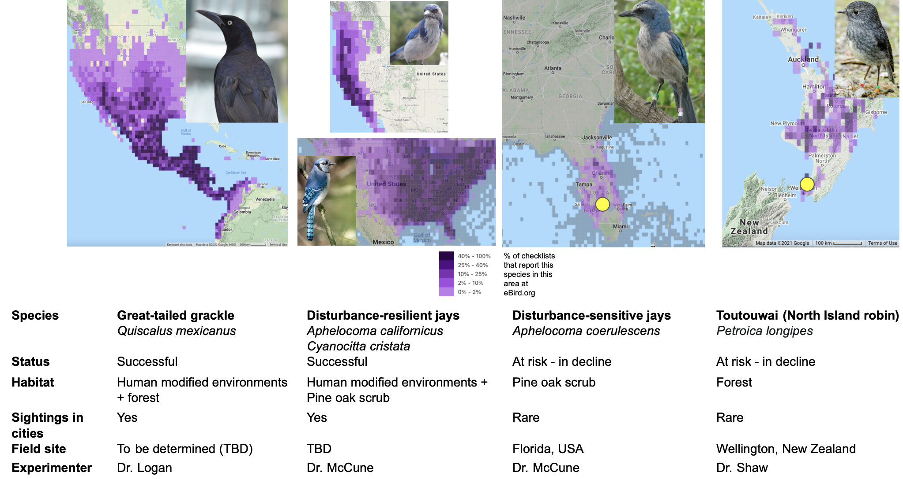
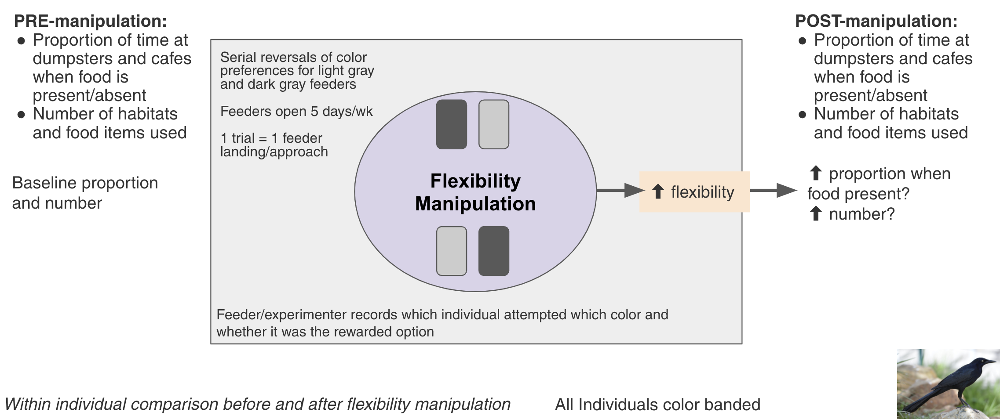
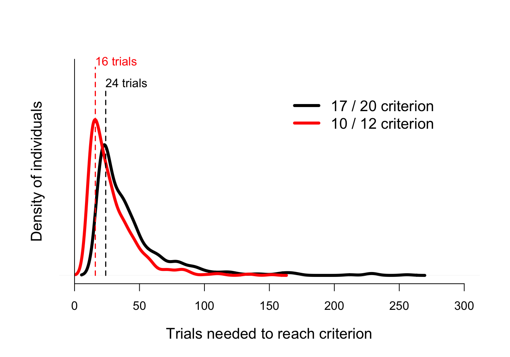
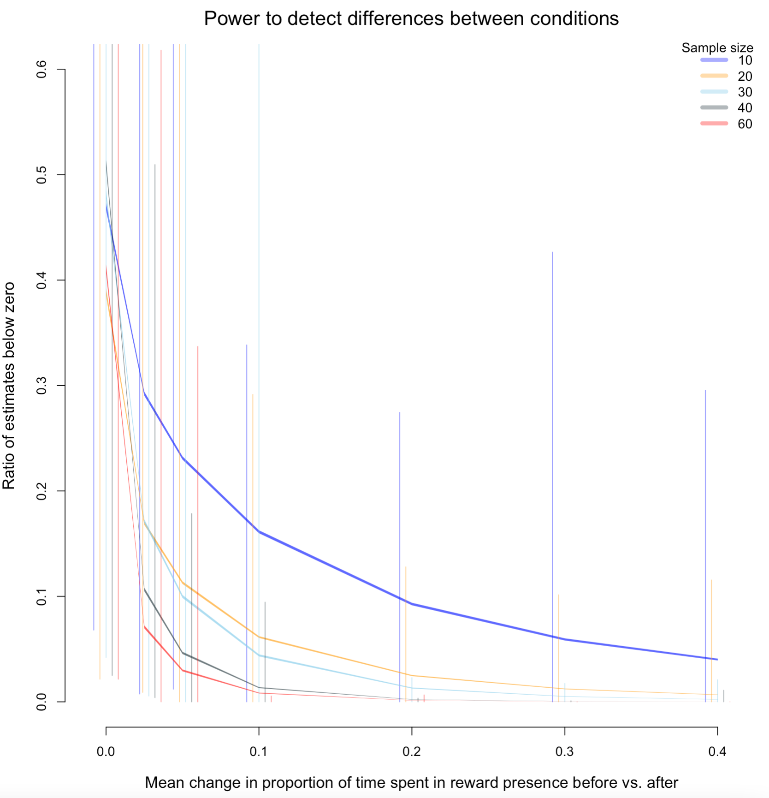
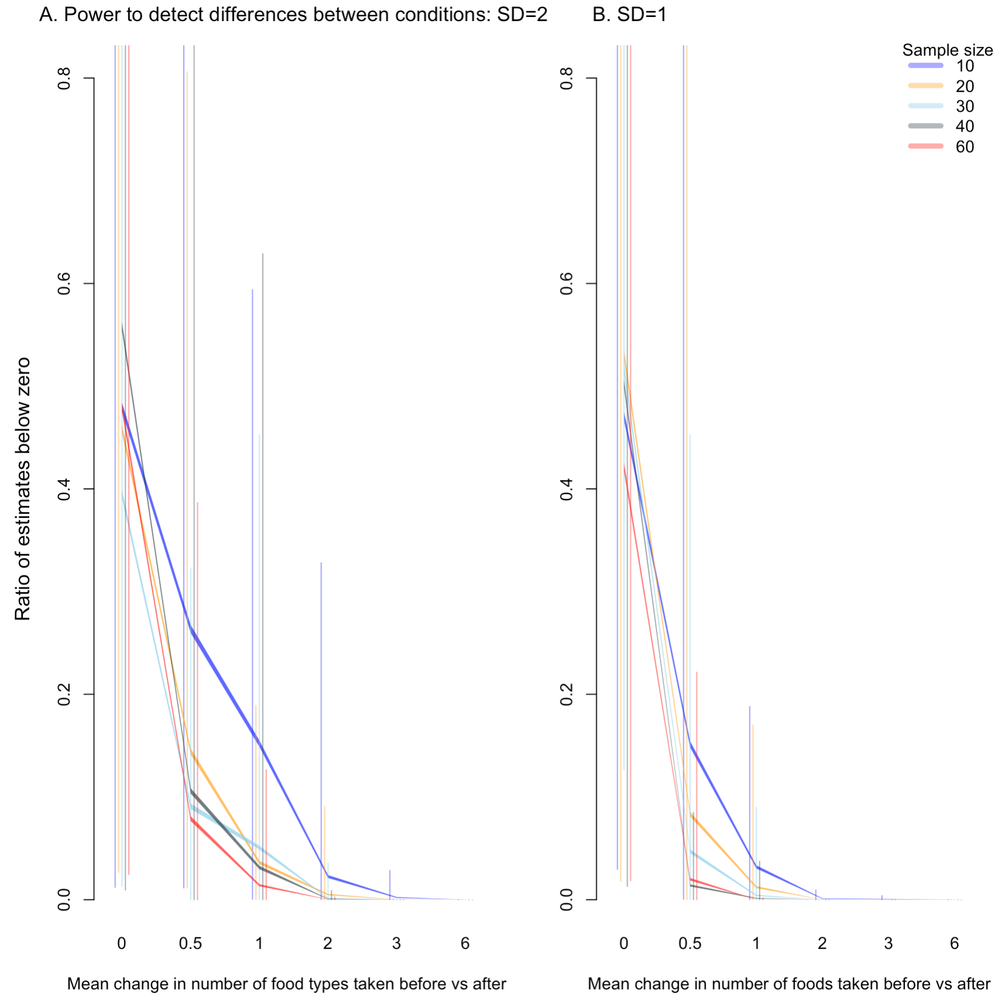

\addtolength{\headheight}{0.1cm}
\pagestyle{fancyplain}
\lhead{\includegraphics[height=1.2cm]{logoPCIRR.png}}
\renewcommand{\headrulewidth}{0pt}

Open...  {width=5%} access {width=5%} [code](https://github.com/ManyIndividuals/ManyIndividuals/blob/main/Files/rrs/mi1.Rmd)

\addtolength{\headheight}{0.1cm}
\pagestyle{fancyplain}
\lhead{\includegraphics[height=1.2cm]{logoPCIRR.png}}
\renewcommand{\headrulewidth}{0pt}

&nbsp;

**Affiliations:** 1) Max Planck Institute for Evolutionary Anthropology, Germany; 2) University of California Santa Barbara, USA. Corresponding author: corina_logan@eva.mpg.de

&nbsp;

**This registered report has been pre-study peer reviewed and received an In Principle Acceptance on 8 Sep 2022 by:**

Chris Chambers (2022) The role of behavioural flexibility in promoting resilience to human environmental impacts. *Peer Community in Registered Reports*. [https://rr.peercommunityin.org/articles/rec?id=200](https://rr.peercommunityin.org/articles/rec?id=200). Reviewers:  Gloriana Chaverri, Vedrana Šlipogor, and Alizée Vernouillet

{width=50%}

**Cite as:** Logan CJ, Shaw R,  Lukas D, McCune KB. 2022. **[How to succeed in human modified environments](http://corinalogan.com/ManyIndividuals/mi1.html)** (http://corinalogan.com/ManyIndividuals/mi1.html) In principle acceptance by *PCI Registered Reports* of the version on 25 Aug 2022 [https://github.com/ManyIndividuals/ManyIndividuals/blob/573b4b5802550f47f246fb8b71c8efc4f853445c/Files/rrs/mi1.Rmd](https://github.com/ManyIndividuals/ManyIndividuals/blob/573b4b5802550f47f246fb8b71c8efc4f853445c/Files/rrs/mi1.Rmd).

&nbsp;

```{r setup, include=FALSE}
library(knitr)
knitr::opts_chunk$set(tidy.opts=list(width.cutoff=60),tidy=TRUE) 
#Make code wrap text so it doesn't go off the page when Knitting to PDF

knitr::opts_chunk$set(echo=T, include=T, results='asis', warning=F, message=F) 
#sets global options to display code along with the results https://exeter-data-analytics.github.io/LitProg/r-markdown.html
#set echo=F for knitting to PDF (hide code), and echo=T for knitting to HTML (show code)
```

# **ABSTRACT**

Human modifications of environments are increasing, causing global changes that other species must adjust to or suffer from. Behavioral flexibility (hereafter 'flexibility') could be key to coping with rapid change. Behavioral research can contribute to conservation by determining which behaviors can predict the ability to adjust to human modified environments and whether these can be manipulated. When research that manipulates behavior in a conservation context occurs, it primarily trains a specific behavior to improve individual success in the wild. However, training a domain general cognitive ability, such as flexibility, has the potential to change a whole suite of behaviors, which could have a larger impact on influencing success in adjusting to human modified environments. This project asks whether flexibility can be increased by experimentally increasing environmental heterogeneity and whether such an increase can help species succeed in human modified environments. We explore whether it is  possible to take insights from highly divergent species and apply them to address critical conservation challenges. This pushes the limits in terms of understanding how conserved these abilities may be and to what extent they can be shaped by the environment. We aim to 1) conduct flexibility interventions in flexible species that are successful in human modified environments (great-tailed grackles and California scrub-jays or blue jays) to understand how flexibility relates to success; and 2) implement these interventions in two vulnerable species (toutouwai and Florida scrub-jays) to determine whether flexibility as a generalizable cognitive ability can be trained and whether such training improves success in human-modified environments. This research will significantly advance our understanding of the causes and consequences of flexibility, linking behavior to environmental change, cognition, and success in human modified environments through a comparative and global framework. This registered report launches our reproducible research program, ManyIndividuals (https://github.com/ManyIndividuals/ManyIndividuals), which is a global network of researchers with field sites investigating hypotheses that involve generalizing across many individuals.

# **REGISTERED REPORT DETAILS**

 - **Level of bias = 6:** This registered report was written (Jul 2021-May 2022), and revised after round one of peer review at Peer Community in Registered Reports (Jul 2022) prior to collecting any data.
 - **Programmatic registered report:** Three Stage 2 articles will result from this one Stage 1 registered report: one for toutouwai, one for grackles, and one for jays.
 - **Deviations from the Stage 1 registered report:** [to be filled in as needed after data collection begins]

# **INTRODUCTION**

Human modified environments are increasing [@liu2020high; @wu2011quantifying; @goldewijk2001estimating], causing global changes that other species must adjust to or suffer from [@ciani1986intertroop; @chejanovski2017experimental; @federspiel2017adjusting; @alberti2015eco]. Behavioral flexibility (hereafter 'flexibility') could be key for adjusting to such change: individuals interact with their environment through behavior, making it crucial to an ecologically valid understanding of how species adjust to environmental changes [@lee2021animal]. One of the top priorities for behavioral research to maximize conservation progress is to determine which cognitive abilities and behaviors can predict the ability to adjust to human modified environments and whether these can be manipulated [@moseby2016harnessing]. The rare research that manipulates behavior in a conservation context usually focuses on training specific behaviors (for example, predator recognition through predator exposure) to improve individual success in the wild [@moseby2012can; @west2018predator; @jolly2018out; @ross2019reversing; see review in @tetzlaff2019effects]. However, training a general cognitive ability, such as flexibility -- the ability to rapidly adapt behavior to changes through learning throughout the lifetime [see the theory behind this definition in @mikhalevich_is_2017] -- has the potential to change a whole suite of behaviors and more broadly influence success in adjusting to human modified environments. Recent evidence supports this hypothesis: as far as we are aware, we were the first to show that flexibility can be manipulated using serial reversal learning of color preferences, and that the manipulated individuals were more flexible in a new context (locus switching on a puzzlebox) as well as being more innovative (solved more loci on a puzzlebox) [@logan2022flexmanip].

Environments where informational cues about resources vary in a heterogeneous (but non-random) way across space and time are hypothesized to open a pathway for species to functionally detect and react to such cues via flexibility [@mikhalevich_is_2017]. Human modified environments likely provide a different set of informational cues that vary heterogeneously across space and time, and the species that are successful in such environments are likely those who are able to detect and track such cues. Because heterogeneous environments are hypothesized to select for flexibility [@wright2010behavioral], we expect that experimentally manipulating environments to be more heterogeneous will result in an increase in flexibility in individuals, which will then increase their success in such environments (Figure 1). Success can relate to any number of variables regarding the usage of and investment in resources and response to threats, from improved foraging efficiency to increased dispersal and survival within human modified environments, to placing nests in more protective locations. Whether a measure of success is predicted to relate to flexibility depends on what is already known about the particular population and their particular environment. 

&nbsp;


**Figure 1.** The theory behind this research illustrated by a directed acyclic graph (DAG), which is a theoretical model of the causal relationships among the key variables in our investigation. Based on the theoretical background provided by @mikhalevich_is_2017, we assume that more heterogeneity causes more flexibility, which then causes more success in human modified environments.

&nbsp;

This investigation asks whether flexibility can be increased by experimentally increasing environmental heterogeneity (via serial reversal learning) and whether such an increase can help species succeed in human modified environments. We explore whether it is possible to take insights from highly divergent species and apply them to address critical conservation challenges. Serial reversal learning tasks have been performed with a wide diversity of species [birds: @bond_serial_2007; bumblebees: @strang2014serial; stingrays: @daniel2020serial]. There is variation across individuals and species in their performance, however almost all previous studies show that individuals improve their flexibility if the reversal intervention is given multiple times in sequence [rats: @mackintosh1968factors; guppies: @lucon2014discrimination; poison frogs: @liu2016learning]. We aim to conduct a flexibility intervention in flexible species that are successful in human modified environments (great-tailed grackles and California scrub-jays or blue jays) to understand how flexibility relates to success, and implement these interventions in two vulnerable species (toutouwai and Florida scrub-jays) to determine whether flexibility as a generalizable cognitive ability can be trained and whether such training improves success in human modified environments (Figure 2). 

While we do not examine the potential spread of the post-manipulation success behaviors from manipulated individuals to individuals that are not involved in our studies, we acknowledge that this is a possibility worthy of future investigation. Manipulating the flexibility of a few individuals could have population-level effects because significant research on social information use in birds [e.g., @valente2021conspecific] demonstrates the potential for the manipulated behavior to disseminate to conspecifics (for example, if manipulated individuals are faster at locating new resources, which could attract the attention of conspecifics, or if unmanipulated individuals copy the manipulated individuals’ nesting or foraging locations). In the event that social learning is not used by a given population to spread the behaviors of manipulated individuals, investing in the training of specific individuals to increase their success in the wild could still have conservation impacts. In some cases, it is possible to train many individuals in a population or a species because there are not many individuals left [@greggor2021pre]. It is also possible to train all individuals involved in a conservation management event such as a translocation [@greggor2021pre]. Therefore, there can still be significant population consequences even if each individual needs to be trained to achieve the goal.

This comparative approach will ultimately reveal how conserved these abilities may be and to what extent they can be shaped by the environment. To increase the generalizability of the conclusions from the ManyIndividuals project, we here also provide multiple methodological options that other researchers can use to test these questions in additional species. The results will substantially advance our understanding of the causes and consequences of flexibility, linking behavior to environmental change, cognition, and success in human modified environments through a comparative and global framework.


# **RESEARCH QUESTIONS**

## Can behavioral flexibility in individuals be increased by increasing environmental heterogeneity? If so, does increased flexibility help individuals succeed in human modified environments? 

**Prediction 1:** Flexibility can be increased in individuals and such an increase **improves the likelihood of success in human modified environments**. This would indicate that the abilities involved in tracking changing resources in the environment are the same as or related to the abilities involved in succeeding in human modified environments. It would also indicate that flexibility is trainable and that such training could be a useful conservation tool for threatened and endangered species. 

**Prediction 1 alternative 1:** Flexibility can be increased in individuals, but such an increase **does not improve the likelihood of success** in human modified environments. This would indicate that species associated with human modified environments form this association for reasons other than their flexibility, and that threatened species are likely not very successful in human modified environments for reasons unrelated to their ability to change their behavior with changing circumstances. An alternative could be that the changes induced by the increase in flexibility do not persist for sufficiently long times to make a difference on the subsequent likelihood of success [changes in grackles were still present for four weeks after the manipulation and longer time periods were not attempted so the threshold is unknown @logan2022flexmanip].

**Prediction 1 alternative 2:** Flexibility can be increased in some populations, but not others. This would indicate that **flexibility manipulations may not work for all populations**, and that the effectiveness of such experiments should first be tested in the population of interest before including such an intervention in a conservation plan. If flexibility is not manipulatable in threatened populations, this would indicate that they are likely not very successful in human modified environments because of their inability to change their behavior with changing circumstances, and that flexibility is not trainable. If flexibility is not manipulatable in populations that are successful in human modified environments, this could indicate that they might have used flexibility in the past when originally forming the association, but the need to maintain flexibility in their repertoire is no longer necessary [@wright2010behavioral]. In populations where flexibility is not manipulatable, this would indicate that the abilities involved in tracking changing resources in the environment are independent of the abilities involved in succeeding in human modified environments.


## Population-specific background and tailored research questions

&nbsp;



**Figure 2.** Comparing the species involved in this investigation relative to their geographic range and association with human modified habitats. The yellow dots represent field site locations. Photo credit: grackle and CASJ, Corina Logan; blue jay, Rhododendrites; FLSJ, VvAndromedavV; toutouwai, Rachael Shaw.

&nbsp;

### **Great-tailed grackles (*Quiscalus mexicanus*)**

#### Background 
Great-tailed grackles are flexible [@logan2016flexibilityproblem; @logan2019flexmanip], highly associated with human modified environments [@johnson2001great], and have been rapidly expanding their geographic range across North America over the past 140 years [@wehtje2003range]. They are social and polygamous, and eat a diversity of human foods as well as foraging on insects and on substrates for other natural food items [@johnson2001great]. Males tend to be the socially dominant sex [@johnson2000male] and also the sex that disperses away from their natal area [@sevchik2019dispersal]. @Rodrigo2021gtgr found that more grackles are present and more foraging events occur during garbage pick ups when garbage tends to spill out of the bags, thus increasing food availability. Attending to garbage trucks, potentially across space and time, is an example of how flexibility can help individuals meet foraging needs in the context of changing environmental cues. Great-tailed grackle behavioral flexibility is manipulatable using serial reversal learning, and this manipulation improves their flexibility in a new context as well as their innovativeness [@logan2019flexmanip], which shows that training a general cognitive ability can affect more behaviors than the behavior that was trained and potentially make them more successful in human modified environments. We are in the middle of long-term data collection on grackles to answer questions about how flexibility relates to exploration [@mccune2019exploration], the predictability of their space use [@mccune2020spaceuse] and their foraging breadth [@logan2019flexforaging]. 

#### Research questions

 - **G.Q1: Do flexibility manipulated individuals differ in the proportion of time spent at cafes and garbage dumpsters when food is present?** We will investigate this question by tracking their presence at cafes and dumpsters when food is present versus when it is absent before and after manipulating their flexibility using serial reversal learning in the wild (Figure 3). Table 1 summarizes our predictions, analysis plans, interpretations for the various directions the results could go, and the hypotheses that could be contradicted given the various outcomes.
 
 - **G.Q2: Does manipulating behavioral flexibility alter the number of microhabitats used?** We will investigate this question by tracking their presence in a variety of microhabitats before and after manipulating their flexibility using serial reversal learning in the wild. We only count that a microhabitat was used if the individual had at least 5% of their data points there. This prevents a microhabitat from being counted even if an individual was simply moving through it, and therefore not necessarily using it.
 
 - **G.Q3: Does manipulating flexibility alter the number of different food items taken by grackles?** We will investigate this question by tracking the various food items they take before and after manipulating their flexibility using serial reversal learning in the wild.
 
*Note: we may not have the time or personnel to collect data for G.Q2 and G.Q3, however we will attempt to answer these questions if possible.*

&nbsp;



**Figure 3.** The reversal learning experiment in a group context (Design 2) tailored to the great-tailed grackle research question.

&nbsp;

**Table 1.** Study design for the great-tailed grackle research. References that were not already cited in the introduction: @duckworth2009role, @dingemanse2013between, @peterson2011ecological, @grinnell1917niche.


# **METHODS**

Our approach involves individuals participating in a serial reversal learning task and measuring success in natural behavior in the wild. In the following, we outline the procedure we are planning to use with wild birds: the serial reversal learning will involve a feeder setup (see design 2 below), and the success measures will be matched to the relevant behavior in the respective population. The framework we provide is general to facilitate its adaptation and replication to other populations (i.e., another researcher could adapt our hypotheses, methods, and analysis plans to their system). We start each section of the methods and analysis plans with general considerations (e.g., minimum sample size), before providing the specific details for each of the systems we plan to study.

We present one experimental design for the flexibility intervention (Figure 6) that can be conducted in two ways: in visual isolation (design 1) and in a group context (design 2). Experimenters can decide which (or both) they want to conduct in their population. Only one experiment must be conducted per population to be able to test these hypotheses. Conducting more than one of these experiments per population is acceptable, but not necessary. Before we present the designs, we first validated the reversal passing criteria and made them generalizable to a variety of species (see the next two sections). Depending on the response variable, there is the option to conduct a within- or between-subjects design: 

 1) **Within-subjects:** run the manipulation on all individuals and compare pre- and post-manipulation success measures
 2) **Between-subjects:** with manipulated and control groups and compare post-manipulation success measures. In this case, 50% of the individuals will be assigned to the control condition and 50% to the flexibility manipulation condition. Assignment to condition will be random (using the random number generator random.org).

&nbsp;


**Figure 6.** Template design for the reversal learning experiment.

## Determining when to switch each individual to the next reversal: reversal passing criterion

Different criteria exist to decide whether an individual has learned an association between the presence of a reward and some other feature (e.g., color or shape). The two main two criteria used are to switch an individual after it either has chosen 10 out of 12 choices correct [e.g., @shaw2015wild] or 17 out of 20 choices correct [e.g., @logan2016flexibilityproblem]. The criteria are further modified depending on whether choices are assessed continuously or grouped in predetermined blocks. 

Here, we assess whether achieving 10 correct choices out of the last 12 continuously counted choices can be used as a reliable reversal passing criterion. To determine reliability and suitability, we investigated five questions (see below) by generalizing previously simulated reversal learning data from @logan2020xpop, based on data from great-tailed grackles. We simulated the choices individuals with different learning rates (phi) and rates of deviating from learned associations (lambda) would make in the initial discrimination and in the first reversal. Grackles are fast to reverse preferences compared with many other species [@logan2016flexibilityproblem], therefore we generalized the simulations to other species by setting the parameters that guide performance (phi and lambda) to lead to slower performances. 

The findings from these simulated data indicate that deciding that an individual has passed the reversal when they choose 10 out of the last 12 consecutive trials correctly is functional and reliable because of the following:

**1) individuals will be finished after fewer trials than with other criteria**

With the 10 out of 12 criterion, individuals pass the reversal 8 trials faster (median) than with the 17 out of 20 criterion. This means that, for most individuals, the two rules are equally effective because they will pass both in the same amount of trials (i.e., the individual who met the 17/20 criterion in 50 trials would have met the 10/12 criterion in 42 trials), but because the 10 out of 12 criterion is restricted to 12 trials instead of 20, individuals need 8 fewer trials to meet the passing criterion. No individual needs more trials with the 10 out of 12 criterion. When trials are grouped into blocks of 10 such that they could only pass on trial 20, 30, etc., individuals need a median of 5 more trials compared to when choices are assessed continuously.

**2) classification of individuals using the 10/12 criterion is less noisy because there is less of a chance for individuals to approach the criterion and not pass or never pass**

The average improvement in the number of trials individuals need to reach the respective criterion is larger than the median of 8 trials. This occurs because there are no individuals who are faster with the 17 out of 20 criterion, and because there is a subset of individuals who need considerably fewer trials with the 10/12 criterion (Figure 7). Individuals who require a larger number of trials (>100) to pass almost never occur with the 10/12 criterion, whereas they are more common with the 17/20. With more trials, there is a higher chance that an individual will deviate from their preference by chance. This is also reflected in that 65 of the 626 simulated individuals never reached the 17/20 criterion within the maximum 300 trials, whereas there were only 4 individuals with the 10/12 criterion. Accordingly, an additional benefit of choosing the 10/12 criterion is that it is more likely that data for all individuals, even those who are slow to learn an association, can be collected.



**Figure 7.** There is less variation with the 10/12 reversal learning passing criterion and it requires fewer trials to reach than the 17/20 passing criterion. The lines represent the densities of individuals (estimated with smoothing which means values can go down to zero) across the 626 simulated individuals that needed a certain number of trials to either reach the 10/12 (red) or the 17/20 (black) criterion. With the 10/12 criterion, most individuals need 8 fewer trials (indicated by the lines showing the mode of the two density distributions). In addition, there are only very few individuals who need 100 or more trials with the 10/12 criterion, while there are several individuals that needed such large numbers with the 17/20 criterion.

**3) variation among individuals with the 10/12 criterion is still present and similar to the variation detected with other criteria**

As described in point 1, when changing the criterion from 17/20 to 10/12, most individuals need 8 fewer trials. This also means that the differences among individuals, which might contain relevant information about variation among them, is preserved. When transforming performance with the two criteria to ranks, individuals are sorted essentially in the same order independent of which criterion is used. This is shown in Figure 7: most points are shifted up by exactly 8 trials.

**4) individuals can be assumed to have reliably learned the association using the 10/12 criterion**

Based on the two reversal passing criteria (10/12 and 17/20), we can extract the attractions that simulated individuals have formed toward both the rewarded and the unrewarded option at the point at which they meet each of these criteria. Comparing the two attractions (to the rewarded and unrewarded options), we can determine whether individuals are likely to have learned an association or not. Independent of the criterion, individuals generally formed a preference for the rewarded option: 89% of individuals favor the rewarded option between 2.5 and 14 times more than the unrewarded option. With both criteria, individuals always have a stronger attraction to the rewarded than the unrewarded option. The smallest difference between the attraction scores to the rewarded and unrewarded options we observe at the point of passing is the same with both criteria. With the 10/12 criterion, individuals would in the next trial, on average, choose the rewarded option with a probability of 76% (3 times more likely to choose rewarded over unrewarded option), whereas this is 84% with the 17/20 criterion (5 times more likely).

**5) the learned association means that individuals who move to the next reversal are unlikely to solve the reversed association by chance**

As expected, based on the relative attraction scores at the end of the previous reversal, most individuals are unlikely to choose the now rewarded option. We expect that, on average, individuals will choose the newly rewarded option in 4 or fewer trials out of the first 12 trials (red line in Figure 8). This is a lower number of trials compared to individuals who have no association with either option (gray line in Figure 8), and a slightly higher number compared to individuals who use the 17/20 criterion (black line in Figure 8). The probability that an individual would, after a reversal, immediately choose the rewarded option 10 times during the first 12 trials (and pass) by chance is 0.001. However, even such rare individuals will have actually reversed their preference during their first 12 trials because they update their attractions on every trial.


**Figure 8.** Individuals form strong enough preferences using the 10/12 passing criterion as indicated by the fact that they are unlikely to pass in the first 12 trials of their next reversal (red line). These individuals would take longer to switch their preference than individuals who have no preference (gray line), and they would be slightly faster at switching their preference than individuals who formed their previous association using the 17/20 criterion (black line).

```{r loadsimulatedreversaldata, eval=F}
# Load previously simulated data from xpop

# There are two sets of simulated data, with initial attractions towards both options set at 0.1, and eight different phi and four different lambda combinations
simulatedreversaldata_attractionscores_1<-read.csv(url("https://raw.githubusercontent.com/corinalogan/grackles/master/Files/Preregistrations/gxpopbehaviorhabitat_SimulatedReversalData_Grackles_PhiLambda_Attraction02_Aug2021.csv"), header=T, sep=",", stringsAsFactors=F) 

simulatedreversaldata_attractionscores_2<-read.csv(url("https://raw.githubusercontent.com/corinalogan/grackles/master/Files/Preregistrations/gxpopbehaviorhabitat_SimulatedReversalData_Grackles_PhiLambda_Attraction04_Aug2021.csv"), header=T, sep=",", stringsAsFactors=F) 

# In both simulations, sites (which differ by the phi and lambda assigned to individuals) were counted from 1-16; for the second simulation we change this to 17-32
simulatedreversaldata_attractionscores_2$Site<-simulatedreversaldata_attractionscores_2$Site+16

# In both simulations, individuals were counted from 1-320; for the second population we change the ids to start at 321
simulatedreversaldata_attractionscores_2$Bird_ID<-simulatedreversaldata_attractionscores_2$Bird_ID+320

# We combine the two data sets for the further analyses
library(dplyr)
simulatedreversaldata_attractionscores<-bind_rows(simulatedreversaldata_attractionscores_1,simulatedreversaldata_attractionscores_2)


# Preparing simulated data for analyses

# In the simulations, trials were counted continuously for each bird. We now want to change this so that it restarts counting trials from 1 upward once a bird switches to reversal.

for (birds in 1:length(unique(simulatedreversaldata_attractionscores$Bird_ID))){
  currentbird<-unique(simulatedreversaldata_attractionscores$Bird_ID)[birds]
  maximuminitial<-max(simulatedreversaldata_attractionscores[simulatedreversaldata_attractionscores$Bird_ID==currentbird & simulatedreversaldata_attractionscores$Reversal == "initial",]$Trial)
  simulatedreversaldata_attractionscores[simulatedreversaldata_attractionscores$Bird_ID==currentbird & simulatedreversaldata_attractionscores$Reversal == "reversal",]$Trial<-simulatedreversaldata_attractionscores[simulatedreversaldata_attractionscores$Bird_ID==currentbird & simulatedreversaldata_attractionscores$Reversal == "reversal",]$Trial - maximuminitial
}

# We need to adjust the coding during the reversal learning so that "correct" now matches whether it is correct or not. 
simulatedreversaldata_attractionscores[simulatedreversaldata_attractionscores$Choice==0,]$Choice<-2

# To use the model to estimate the phi and lambda parameters, we first need to change the column names to match these to the specifications in the model: change Bird_ID  to id; change Reversal to Choice, change CorrectChoice to Correct, change Site to Expid

colnames(simulatedreversaldata_attractionscores)<-c("counter","id","Session","Trial","Reversal","Choice","Correct","Phi_mean","Lambda_mean","Site","Phi_sd","Lambda_sd","ThisBirdsPhi","ThisBirdsLambda","Attraction1","Attraction2")

# There are several simulated individuals who never reached any criterion during the initial learning phase (in xpop we worked with the criterion of 17 correct out of the 20 choices given as one block). We need to remove these individuals from the dataset

birdswithreversal<-as.data.frame(simulatedreversaldata_attractionscores %>% group_by(id) %>% summarise(experiments=length(unique(Reversal))))
birdswithreversal<-birdswithreversal[birdswithreversal$experiments==2,]
simulatedreversaldata_attractionscores<-simulatedreversaldata_attractionscores[simulatedreversaldata_attractionscores$id %in% birdswithreversal$id,]

# Next, we need to change the ids of the birds to be continuous again for easier further processing in loops
simulatedreversaldata_attractionscores$id<-as.integer(as.factor(simulatedreversaldata_attractionscores$id))


# 1) With the 10 correct out of 12 continuous trials criterion, individuals finish after fewer trials than with other criteria

# We use the data from the first reversal to check after how many trials an individual reaches the 10 out of 12 trials solved correctly rule. We are using a sliding window, rather than assuming that the experiment is split into discrete blocks of trials. For this, we check for each individual at what trial number it first reached the criterion that it had correctly solved 10 out of the last 12 trials.

# We create a matrix to store the output. We have two columns, one with the id of the individual the other with the number of trials they needed with this rule. Having this setup makes the comparison with the alternative rule easier. In addition, it will keep track of individuals that never reached the criterion
trialnumber_initiallearning_reachedtwelveten<-matrix(ncol=2,nrow=length(unique(simulatedreversaldata_attractionscores$id)))

# We loop through all unique individuals in the simulated dataset (626 individuals) and for each check when they reached the criterion - at that point we can stop ("break") and ignore the remaining performance. In the initial association learning, wrong choices are coded as 2 and correct choices as 1, so individuals reached the criterion if they chose 10*1 + 2*2 (equals 14) - so individuals reached criterion when the sum in choices across 12 trials is lower than 15.
for (i in 1:length(unique(simulatedreversaldata_attractionscores$id))){
  
  thisindividualsinitaltrials<-simulatedreversaldata_attractionscores[simulatedreversaldata_attractionscores$id %in% i & simulatedreversaldata_attractionscores$Reversal %in% "initial",]
  trialnumber_initiallearning_reachedtwelveten[i,1]<-i
  for (k in 1:(nrow(thisindividualsinitaltrials)-12)){
    if(sum(thisindividualsinitaltrials[c(k:(k+11)),]$Choice)<15){
      trialnumber_initiallearning_reachedtwelveten[i,2]<-(k+11)
      break}
  }
}

# Next, we repeat this for the alternative rule of 17 out of 20 trials, again using a sliding window approach across trials (17*1 + 3*2 = 23).
trialnumber_initiallearning_reachedseventeentwenty<-matrix(ncol=2,nrow=length(unique(simulatedreversaldata_attractionscores$id)))

for (i in 1:length(unique(simulatedreversaldata_attractionscores$id))){
  
  thisindividualsinitaltrials<-simulatedreversaldata_attractionscores[simulatedreversaldata_attractionscores$id %in% i & simulatedreversaldata_attractionscores$Reversal %in% "initial",]
  trialnumber_initiallearning_reachedseventeentwenty[i,1]<-i
  for (k in 1:(nrow(thisindividualsinitaltrials)-20)){
    if(sum(thisindividualsinitaltrials[c(k:(k+19)),]$Choice)<24){
      trialnumber_initiallearning_reachedseventeentwenty[i,2]<-(k+19)
      break}
  }
}

# We now have the number of trials each individual would have needed with the two rules to reach the respective criterion. We can check whether individuals needed fewer trials with the 10 out of 12 rule than the 17 out of 20 rule
twelvetenfaster<-trialnumber_initiallearning_reachedseventeentwenty[,2]-trialnumber_initiallearning_reachedtwelveten[,2]

# The median improvement is 8 trials
median(twelvetenfaster,na.rm=T)
# This means that for most individuals the two rules are equally effective, but because the 10 out of 12 rule is restricted to 12 trials instead of 20 individuals need 8 fewer trials.

# The same is seen in a regression
summary(lm(trialnumber_initiallearning_reachedseventeentwenty[,2]~trialnumber_initiallearning_reachedtwelveten[,2]))
# The intercept is 7 (similar to the mean listed above), and the slope is 1.3 (suggesting that deviations are slightly more when individuals need a large number of trials). 

# We can also check whether counting trials continously, instead of grouping them into blocks, means that individuals finish sooner. In the original simulation, trials where stopped when birds reached the 17 out of 20 criterion based on blocks of 10 trials. We can check whether counting trials continously means they would have finished sooner:

# We now get the number of trials they needed to pass the block criterion
trialnumber_initiallearning_reachedseventeentwentyblock<-matrix(ncol=2,nrow=length(unique(simulatedreversaldata_attractionscores$id)))

for (i in 1:length(unique(simulatedreversaldata_attractionscores$id))){
  thisindividualsinitaltrials<-simulatedreversaldata_attractionscores[simulatedreversaldata_attractionscores$id %in% i & simulatedreversaldata_attractionscores$Reversal %in% "initial",]
  trialnumber_initiallearning_reachedseventeentwentyblock[i,1]<-i
  trialnumber_initiallearning_reachedseventeentwentyblock[i,2]<-max(thisindividualsinitaltrials$Trial)
  }

plot(trialnumber_initiallearning_reachedseventeentwentyblock[,2]~trialnumber_initiallearning_reachedseventeentwenty[,2])
abline(a=0,b=1)
median(trialnumber_initiallearning_reachedseventeentwentyblock[,2]-trialnumber_initiallearning_reachedseventeentwenty[,2],na.rm=T)
# 5 trials faster
mean(trialnumber_initiallearning_reachedseventeentwentyblock[,2]-trialnumber_initiallearning_reachedseventeentwenty[,2],na.rm=T)
# 7 trials faster


# 2) With the 10 correct out of 12 continuous trials criterion, variation among individuals is still present and similar to the variation detected with other criteria

# Changing the criterion from 17/20 to 10/12 generally means that most individuals need 8 fewer trials. That also means that the differences among individuals, which might contain relevant information, is preserved. We can see this when we plot their ranks in how many trials they need (individuals who need the same number of trials have the same rank; there are fewer ranks with the 10/12 criterion because large values do not appear)
plot(as.integer(as.factor(trialnumber_initiallearning_reachedseventeentwenty[,2])) ~ as.integer(as.factor(trialnumber_initiallearning_reachedtwelveten[,2])),xlim=c(0,100),ylim=c(0,100))
abline(a=0,b=1)


# 3) With the 10 correct out of 12 continuous trials criterion, classification is less noisy because there is less of a chance of individuals missing the criterion repeatedly or even never reaching it, meaning that individuals slow to learn will be more reliably classified than with a different criterion

# While the median improvement is 8 trials, the average improvement is 15 trials
mean(twelvetenfaster,na.rm=T)
# The average improvement is larger than the median because, first, there are no individuals who are faster with the 17 out of 20 rule, and secondly because there is a subset of individuals who need considerably fewer trials with the 10 out of 12 rule. We can see this in a plot:

seventeentwenty<-trialnumber_initiallearning_reachedseventeentwenty[,2]
seventeentwenty<-seventeentwenty[is.na(seventeentwenty)==F]

twelveten<-trialnumber_initiallearning_reachedtwelveten[,2]
twelveten<-twelveten[is.na(twelveten)==F]

plot(density(seventeentwenty),ylim=c(0,0.05),ann=F,bty="n",xlim=c(0,300),lwd=4,xaxt="n",yaxt="n")
lines(density(twelveten),col="red",lwd=4)
axis(side=1,at=c(0,50,100,150,200,250,300))
segments(x0 = 16, y0 = 0, x1 = 16, y1 = 0.05, col = "red",lwd=1.5,lty=2) 
segments(x0 = 24, y0 = 0, x1 = 24, y1 = 0.045, col = "black",lwd=1.5,lty=2) 
mtext("Trials needed to reach criterion", side=1,cex=1.25,line=3)
mtext("Density of individuals", side=2,cex=1.25,line=1)
legend(x=160,y=0.045,legend=c(lty1="17 / 20 criterion",lty1="10 / 12 criterion"),lwd=c(4,4),col=c("black","red"),cex=1.25,bty="n")
abline(v=0,lty=1)
mtext("16 trials", side=1,cex=1,line=-16,at=32,col="red",bg="white")
mtext("24 trials", side=1,cex=1,line=-14.5,at=40,col="black",bg="white")

# m1Fig_ReversalCriterionComparison

# With the 17 out of 20 rule, some individuals need a very large number of trials. This is presumably because with more trials there is a higher chance that an individual will deviate from their preference by chance, leading to them not reaching the criterion. Such individuals with very larger number of trials (>100) almost never occur with the 10 out 12 rule. There are also 65 individuals (out of the 626) with the 17 out of 20 criterion who never reached the criterion within the maximum 300 trials that were simulated - while there are only 4 with the 10 out of 12 criterion.
sum(is.na(trialnumber_initiallearning_reachedseventeentwenty))
sum(is.na(trialnumber_initiallearning_reachedtwelveten))

# Accordingly, an additional benefit of choosing the 10/12 rule is that it is more likely that data for all individuals, even those slow to learn an association, can be collected.


# 4) With the 10 correct out of 12 continuous trials criterion, individuals can be assumed to have reliably learned the association

# The difference in attraction, the mechanisms of the assumed learning processes mean that changes in attraction scores are non-linear. New information that an option is rewarded leads initially to large increases in the attraction score towards that option, but each additional information about the reward leads to smaller and smaller additional increases; new information that a previously rewarded option is now unrewarded lead initially to large drops in the attraction score, but additional information that this option is no longer rewarded leads to smaller declines in the attraction score. This means that with the 10 out of 12 criterion, individuals might have already reached the part in the curve of change of attraction scores where there are large differences that have essentially plateaued. We can check this by assessing both the actual attraction scores at that trial when individuals would have reached the criterion, and how high their attraction score is in relation to the maximum attraction score they obtained during the experiment.
simulatedreversaldata_attractionscores$relativeattraction<-simulatedreversaldata_attractionscores$Attraction1/simulatedreversaldata_attractionscores$Attraction2

# We create a matrix to store the output. We have two columns, one with the id of the individual the other with the number of trials they needed with this rule. Having this setup makes the comparison with the alternative rule easier. In addition, it will keep track of individuals that never reached the criterion
trialnumber_initiallearning_reachedtwelveten<-matrix(ncol=6,nrow=length(unique(simulatedreversaldata_attractionscores$id)))
colnames(trialnumber_initiallearning_reachedtwelveten)<-c("Id","TrialAtReachingCriterion","AttractionScore","RelativeAttractionScore","AttractionOutOfMax","RelativeAttractionOutOfMax")
trialnumber_initiallearning_reachedtwelveten<-as.data.frame(trialnumber_initiallearning_reachedtwelveten)

# We loop through all unique individuals in the simulated dataset (626 individuals) and for each check when they reached the criterion - at that point we can stop ("break") and ignore the remaining performance. In the initial association learning, wrong choices are coded as 2 and correct choices as 1, so individuals reached the criterion if they chose 10*1 + 2*2 (equals 14) - so individuals reached criterion when the sum in choices across 12 trials is lower than 15.
for (i in 1:length(unique(simulatedreversaldata_attractionscores$id))){
  thisindividualsinitaltrials<-simulatedreversaldata_attractionscores[simulatedreversaldata_attractionscores$id %in% i & simulatedreversaldata_attractionscores$Reversal %in% "initial",]
  trialnumber_initiallearning_reachedtwelveten[i,1]<-i
  for (k in 1:(nrow(thisindividualsinitaltrials)-12)){
    if(sum(thisindividualsinitaltrials[c(k:(k+11)),]$Choice)<15){
      trialnumber_initiallearning_reachedtwelveten[i,2]<-(k+11)
      trialnumber_initiallearning_reachedtwelveten[i,3]<-thisindividualsinitaltrials[k+11,]$Attraction1
      trialnumber_initiallearning_reachedtwelveten[i,4]<-thisindividualsinitaltrials[k+11,]$relativeattraction
      trialnumber_initiallearning_reachedtwelveten[i,5]<-thisindividualsinitaltrials[k+11,]$Attraction1/max(thisindividualsinitaltrials$Attraction1,na.rm=T)
      trialnumber_initiallearning_reachedtwelveten[i,6]<-thisindividualsinitaltrials[k+11,]$relativeattraction/max(thisindividualsinitaltrials$relativeattraction,na.rm=T)
      break}
  }
}

# Next, we repeat this for the alternative rule of 17 out of 20 trials, again using a sliding window approach across trials (17*1 + 3*2 = 23).
trialnumber_initiallearning_reachedseventeentwenty<-matrix(ncol=6,nrow=length(unique(simulatedreversaldata_attractionscores$id)))
colnames(trialnumber_initiallearning_reachedseventeentwenty)<-c("Id","TrialAtReachingCriterion","AttractionScore","RelativeAttractionScore","AttractionOutOfMax","RelativeAttractionOutOfMax")
trialnumber_initiallearning_reachedseventeentwenty<-as.data.frame(trialnumber_initiallearning_reachedseventeentwenty)

for (i in 1:length(unique(simulatedreversaldata_attractionscores$id))){
  thisindividualsinitaltrials<-simulatedreversaldata_attractionscores[simulatedreversaldata_attractionscores$id %in% i & simulatedreversaldata_attractionscores$Reversal %in% "initial",]
  trialnumber_initiallearning_reachedseventeentwenty[i,1]<-i
  for (k in 1:(nrow(thisindividualsinitaltrials)-20)){
    if(sum(thisindividualsinitaltrials[c(k:(k+19)),]$Choice)<24){
      trialnumber_initiallearning_reachedseventeentwenty[i,2]<-(k+19)
      trialnumber_initiallearning_reachedseventeentwenty[i,3]<-thisindividualsinitaltrials[k+19,]$Attraction1
      trialnumber_initiallearning_reachedseventeentwenty[i,4]<-thisindividualsinitaltrials[k+19,]$relativeattraction
      trialnumber_initiallearning_reachedseventeentwenty[i,5]<-thisindividualsinitaltrials[k+19,]$Attraction1/max(thisindividualsinitaltrials$Attraction1,na.rm=T)
      trialnumber_initiallearning_reachedseventeentwenty[i,6]<-thisindividualsinitaltrials[k+19,]$relativeattraction/max(thisindividualsinitaltrials$relativeattraction,na.rm=T)
      break}
  }
}

# We can plot the relative attraction scores (prefer rewarded option relative to unrewarded option) at the points where each individual reached either the 10/12 or the 17/20 criterion. 
plot(trialnumber_initiallearning_reachedtwelveten$RelativeAttractionScore~trialnumber_initiallearning_reachedseventeentwenty$RelativeAttractionScore,ylim=c(0,50),xlim=c(0,50))
abline(a=0,b=1)
library(rethinking)
PI(trialnumber_initiallearning_reachedtwelveten[is.na(trialnumber_initiallearning_reachedtwelveten$RelativeAttractionScore)==F,]$RelativeAttractionScore)
PI(trialnumber_initiallearning_reachedseventeentwenty[is.na(trialnumber_initiallearning_reachedseventeentwenty$RelativeAttractionScore)==F,]$RelativeAttractionScore)

# We can see that (i) the lowest relative attraction scores are very similar, suggesting that independent of the criterion, individuals generally have formed a preference for the rewarded option (89% of the values lie between 2.5 and 14); and that (ii) for most individuals, the relative attraction scores are very similar for the two criteria.

# We can convert the relative attraction scores into the probability that an individual will choose the rewarded option in the trial following the cut-off by converting it back with the respective phi and lambda values
attractionlightgrey_twelveten<-median(trialnumber_initiallearning_reachedtwelveten$AttractionScore,na.rm=T)
attractiondarkgrey_twelveten<-(median(trialnumber_initiallearning_reachedtwelveten$AttractionScore,na.rm=T))/(median(trialnumber_initiallearning_reachedtwelveten$RelativeAttractionScore,na.rm=T))
bird_lambda<-median(simulatedreversaldata_attractionscores$ThisBirdsLambda)
probability_choose_lightgrey_tenoftwelve<-exp(bird_lambda*attractionlightgrey_twelveten)/(exp(bird_lambda*attractionlightgrey_twelveten)+exp(bird_lambda*attractiondarkgrey_twelveten)  )

attractionlightgrey_seventeentwenty<-median(trialnumber_initiallearning_reachedseventeentwenty$AttractionScore,na.rm=T)
attractiondarkgrey_seventeentwenty<-(median(trialnumber_initiallearning_reachedseventeentwenty$AttractionScore,na.rm=T))/(median(trialnumber_initiallearning_reachedseventeentwenty$RelativeAttractionScore,na.rm=T))
bird_lambda<-median(simulatedreversaldata_attractionscores$ThisBirdsLambda)
probability_choose_lightgrey_seventeenoftwenty<-exp(bird_lambda*attractionlightgrey_seventeentwenty)/(exp(bird_lambda*attractionlightgrey_seventeentwenty)+exp(bird_lambda*attractiondarkgrey_seventeentwenty)  )

probability_choose_lightgrey_tenoftwelve
# 0.7612336
probability_choose_lightgrey_seventeenoftwenty
# 0.839137

# While individuals are more likely to choose the rewarded option if they needed the 17/20 criterion to pass, also with the 10/12 criterion individuals show a clear preference for the rewarded option


# 5) this learned association means that individuals who move to the next reversal with this criteria are unlikely to solve the reversed association by chance.

# We can simulate the performance in the first 12 trials after switching the rewarded option for sets of 10000 individuals who either have no learned association, have been stopped after the 10/12 rule, or stopped after the 17/20 rule.
choselightgrey_seventeenoftwenty<-matrix(nrow=10000,ncol=12)
choselightgrey_seventeenoftwenty<-as.data.frame(choselightgrey_seventeenoftwenty)

for(i in 1:10000){
  for(j in 1:12)
choselightgrey_seventeenoftwenty[i,j]<-if(runif(1,0,1)<probability_choose_lightgrey_seventeenoftwenty){1} else{0}
}

# We can plot how often these individuals choose the now rewarded option in the first 12 trials: individuals with no learned associations are in the grey distribution, individuals with the 10/12 rule in the blue distribution, and individuals with the 17/20 rule are in the red distribution.  
plot(NA,xlim=c(1,12),ylim=c(0,0.3))
lines(dbinom(1:12,12,1-probability_choose_lightgrey_seventeenoftwenty)~c(1:12),col="red")
lines(dbinom(1:12,12,1-probability_choose_lightgrey_tenoftwelve)~c(1:12),col="blue")
lines(dbinom(1:12,12,0.5)~c(1:12),col="grey")

# As expected based on the relative attraction scores (probability to choose the now rewarded option of 24% for 10/12 and 16% for 17/20), most individuals choose the now rewarded option in less than 6 out of the first 12 trials, whereas that is the mean for individuals with no association

# We can make this more explicit and incorporate that individuals will also change their association as they learn that the rewarded option has switched
#assume that a bird made 10/12 choices correct
attractiondarkgrey<-0.388985
attractionlightgrey<-0.08549744
bird_phi<-median(simulatedreversaldata_attractionscores$ThisBirdsPhi)

# We give the individual 12 trials. We assume that at first they chose the previously rewarded option (dark grey) and switch to the now rewarded option halfway through
attractiondarkgrey<-(1-bird_phi)*attractiondarkgrey+bird_phi*0
attractiondarkgrey<-(1-bird_phi)*attractiondarkgrey+bird_phi*0
attractiondarkgrey<-(1-bird_phi)*attractiondarkgrey+bird_phi*0
attractionlightgrey<-(1-bird_phi)*attractionlightgrey+bird_phi*1
attractiondarkgrey<-(1-bird_phi)*attractiondarkgrey+bird_phi*0
attractiondarkgrey<-(1-bird_phi)*attractiondarkgrey+bird_phi*0
attractionlightgrey<-(1-bird_phi)*attractionlightgrey+bird_phi*1
attractionlightgrey<-(1-bird_phi)*attractionlightgrey+bird_phi*1
attractionlightgrey<-(1-bird_phi)*attractionlightgrey+bird_phi*1
attractiondarkgrey<-(1-bird_phi)*attractiondarkgrey+bird_phi*0
attractionlightgrey<-(1-bird_phi)*attractionlightgrey+bird_phi*1
attractionlightgrey<-(1-bird_phi)*attractionlightgrey+bird_phi*1

probability_choose_lightgrey_twelvetrials<-exp(bird_lambda*attractionlightgrey)/(exp(bird_lambda*attractionlightgrey)+exp(bird_lambda*attractiondarkgrey)  )

attractionlightgrey_seventeentwenty
attractiondarkgrey<-attractionlightgrey_seventeentwenty
attractionlightgrey<-attractiondarkgrey_seventeentwenty
bird_phi<-median(simulatedreversaldata_attractionscores$ThisBirdsPhi)

# We give the individual 12 trials. We assume that at first they chose the previously rewarded option (dark grey) and switch to the now rewarded option halfway through
attractiondarkgrey<-(1-bird_phi)*attractiondarkgrey+bird_phi*0
attractiondarkgrey<-(1-bird_phi)*attractiondarkgrey+bird_phi*0
attractiondarkgrey<-(1-bird_phi)*attractiondarkgrey+bird_phi*0
attractionlightgrey<-(1-bird_phi)*attractionlightgrey+bird_phi*1
attractiondarkgrey<-(1-bird_phi)*attractiondarkgrey+bird_phi*0
attractiondarkgrey<-(1-bird_phi)*attractiondarkgrey+bird_phi*0
attractionlightgrey<-(1-bird_phi)*attractionlightgrey+bird_phi*1
attractionlightgrey<-(1-bird_phi)*attractionlightgrey+bird_phi*1
attractionlightgrey<-(1-bird_phi)*attractionlightgrey+bird_phi*1
attractiondarkgrey<-(1-bird_phi)*attractiondarkgrey+bird_phi*0
attractionlightgrey<-(1-bird_phi)*attractionlightgrey+bird_phi*1
attractionlightgrey<-(1-bird_phi)*attractionlightgrey+bird_phi*1

probability_choose_lightgrey_twentytrials<-exp(bird_lambda*attractionlightgrey)/(exp(bird_lambda*attractionlightgrey)+exp(bird_lambda*attractiondarkgrey)  )

# While the learning during the 12 trials changes what they choose compared to what they would choose just based on their attractions at the end of the previous phase (black line is shifted up compared to the blue line), this is still not sufficient for them to pass the 10/12 rule
plot(NA,xlim=c(0,12),ylim=c(0,0.3),bty="n",ann=F)
lines(dbinom(0:12,12,0.5)~c(0:12),col="grey",lwd=2)
lines(dbinom(0:12,12,probability_choose_lightgrey_twelvetrials)~c(0:12),col="red",lwd=2)
lines(dbinom(0:12,12,probability_choose_lightgrey_twentytrials)~c(0:12),col="black",lwd=2)
mtext("Choice of the newly rewarded option in the first 12 trials after a reversal", side=1,line=3,cex=1.25)
mtext("Percentage of individuals", side=2,line=2.5,cex=1.5)
mtext("Strength of association at a reversal with different criteria", side=3,line=1.25,cex=1.5)
legend(x="topright",legend=c(lty1="17 / 20",lty1="10 / 12",lty3="random"),lwd=c(2,2,2),col=c("black","red","grey"),cex=1,bty="n")

dbinom(1:12,12,probability_choose_lightgrey_twelvetrials)[10]
# The probability that a bird would, after a reversal, reach the 10 out of 12 rule by chance is 0.001
```

## Determining after which reversal an individual has completed the experiment: serial reversal passing criterion

Data from previous serial reversal experiments suggests that individuals who go through multiple reversals will end up with a performance that is similar to the individuals who needed the fewest trials on the first reversal [@lucon2014discrimination; @logan2022flexmanip]. This suggests that the manipulation changes individuals within their natural range of variation rather than pushing them to new limits. This means that we can use the performance of the fastest individuals in the first reversal to set the criterion for passing the serial reversal experiment. Accordingly, we can only set the serial reversal passing criterion after the data from the first reversal begins to become available. Some species might already have data from previous studies on reversal learning, however it is important to set the passing criterion for this experiment using this particular setup. Therefore, the criterion must be established from scratch for each species using this setup.

**The serial reversal passing criterion:** reach the reversal passing criterion (10 out of 12 trials correct) in X trials or fewer in two consecutive reversals. 

X = the number of trials required that marks the fastest 20% of individuals in the first reversal. For example, if you test 20 individuals, the number of trials for the 4th fastest individual will be the criterion. For 10 individuals, use the number of trials for the 2nd fastest individual. The fastest 20% was validated using the grackle data [@logan2022flexmanip]: it aligns with the one sigma rule from a normal distribution, indicating the percentage of individuals who are faster than the mean number of trials minus one standard deviation. If more than 20% of individuals reach this number of trials in their first reversal (because there might be a tie), choose the next fastest number of trials to pass. Particularly near the beginning of the experiment, it will be important to set the passing criterion to a lower number to ensure that individuals will be overtrained rather than undertrained. 

As the data for additional individuals becomes available, this number can change accordingly. If the number changes across the experiment, we will check whether any currently participating individuals would have already passed according to this criterion and end their experiment.

Individuals need to meet this criterion in two consecutive reversals to pass the serial reversal experiment to ensure that their behavior is consistent and that their speedy performance did not occur by chance. Previous serial reversal experiments show that reversal performance plateaus after a certain number of reversals [e.g., 6-8 reversals in great-tailed grackles @logan2022flexmanip]. If individuals show no consistent improvement after 12 reversals and have not yet met the serial reversal passing criterion, they will be excluded from the experiment. We will plan to start with many more individuals than the minimum sample size to allow for potential drop outs.

We do not expect that the serial reversal manipulation will introduce new negative effects because the passing criterion is set such that the manipulated individuals are only as fast as the fastest 20% of tested individuals. This means that we are not introducing an unnatural amount of flexibility because we are not making any individuals more flexible than what already exists in their population.

There will be individual variation in terms of baseline flexibility before the manipulation such that the flexibility training might influence individuals differently. For example, individuals who are already flexible before the manipulation will not benefit much from the manipulation, while the less flexible individuals will benefit more. Individuals who are already flexible and pass the serial reversals in fewer reversals will still meet the experiment’s passing criterion and be considered to have completed the manipulation, even if they did not improve. Baseline flexibility differences could also be reflected in their pre-manipulation success measures (i.e., individuals with high baseline flexibility might already be successful before the manipulation) if these success measures relate to flexibility. Our statistical models account for these baseline individual differences in success as they might relate to performance on the flexibility manipulation because they include an interaction between the intercept (the value at which individuals start) and slope (by how much they change).

## Planned Sample

For each population, depending on the response variable, we ran separate power analyses to determine the planned sample size (see Analysis Plan). For each population, we will aim to reach the minimum sample size required to detect the expected effects of the intervention on the response variables. However, given the difficulties of working with wild individuals, there might be instances where we might not reach a particular target. In such a case, we will interpret the result in light of the power that the particular sample size provides, as indicated by the power analyses. The minimum sample size depends on whether the intervention is performed as a within-subject design  (higher power), measuring the response for the same individuals before and after the intervention, or whether it is performed as a between-subjects design, where half the individuals are randomly assigned to the intervention group. In addition, it will depend on whether the response variable has a binary or a continuous outcome (higher power), and in the latter case whether the measure is open-ended (lower power) and therefore individuals will show a large range of values (e.g., dispersal distance).

We will stop collecting data for the flexibility manipulation experiment when a buffer above the minimum sample size is reached or when the season in which the minimum sample size is reached comes to an end, or when the minimum sample sizes for the success measures have been reached. When conducting the manipulation experiment, it is important to aim to test more than the minimum number of individuals because some might not have data in the post-intervention stage. 


## **DESIGN 2** - Reversal learning experiment in a group context

Feeders are set up in the field, counterbalanced for color/location/etc, and will be available for opening when the experiment is being conducted (Figure 7). The feeders will be fitted with technology to automatically record which individual visits which feeder and when (unless a particular population is easy to track visually without such automated technology). Individuals are habituated to the open feeders filled with food until at least half of the minimum sample size has visited at least 1 feeder. All individuals start on the same rewarded option for the initial discrimination to improve motivation for participating in the experiment (e.g., if the first rewarded option was counterbalanced across individuals, subjects might be slower to learn their rewarded option if they use social information about which option is rewarded). If the subject visits the rewarded feeder, the feeder will automatically, or via a remote controlled by the experimenter, deliver a small amount of food, and then close and reset more food in preparation for the next opening. If the subject visits the non-rewarded feeder, the presence data will be recorded, but the feeder will not open. All feeders will contain one type of high value food. Ideally, feeders will be programmed to automatically switch which feeder type is rewarded as soon as an individual passes criterion in the middle of a test session. If automation is not possible, then the data sheets will be coded live by the experimenter and if that is not feasible, then the data sheet will be generated after each test session or at the end of the day by coding the videos to determine which individuals have passed criterion, and their rewarded feeder type will be changed in the next test session.

Individuals in the control condition (if there is one), will receive 1 reversal and, after they pass criterion on reversal 1, feeders of both options (previously rewarded and previously non-rewarded options) will open for these individuals. This will help keep the whole group interested in visiting the feeders while the individuals in the manipulated group complete their serial reversals. Data are collected on success measures (see below) either before and after the flexibility intervention or only after the intervention (depending on feasibility and how the study design needs to be tailored for each population).

**Passing criteria:**

 - **Feeder habituation:** all feeders at all locations will have food and be open for several hours daily or until at least half of the minimum sample size in each condition (control and manipulated) have visited at least one of the feeders.
 - **Reversal passing criterion:**  an individual is considered to have a preference when they choose 10 of the most recent 12 trials (choices) correct (the rewarded option). This criterion applies to the initial discrimination, and to each reversal.
 - **Manipulation passing criterion:** pass two consecutive reversals in X trials or less (see Serial reversal passing criterion above).

### Protocols

Food in the feeders: All feeders are opaque and always have food in them to eliminate the confound due to olfactory differences between the feeders that could be introduced if only the rewarded feeders have food in them. If a feeder needs to be refilled, refill all feeders consecutively in the same time period and refill each for the same amount of time even if that feeder does not need much or any food (in these cases, pretend to fill the feeder as you normally would). This eliminates confounds from cues provided by a differential amount of attention experimenters give the feeders depending on which needs refilling.

## Assessment of the likelihood of success in human modified environments with regard to the flexibility manipulation

After the manipulation, compare control individuals with individuals in the flexibility manipulation and/or pre-manipulation and post-manipulation measures on the same individuals using one or more of the following success measures. Choose population-relevant success variables that are predicted to be the most likely to be used in human modified environments. This list is not exhaustive - it serves as a place to generate ideas about what the best measures could be in a given population. Observational methods to collect these data may vary among populations and we describe below the methods that we will use (i.e., focal follows and all occurrences sampling). 

 - **Fitness variables:** nest success, number of offspring who survived to independence or adulthood, longevity, etc.
 - **Foraging variables:** diet breadth, number of foraging techniques used, etc.
 - **Movement variables:** predictability of movement behavior [e.g., step length and turning angles; see @mccune2020spaceuse], ability to disperse from a lower risk environment (e.g. a sanctuary, or largely intact natural habitat) to a higher risk, more heavily human modified environment (assess success/survival after dispersal if possible), etc.
 - **Habitat use variables:** foraging substrate (ground, bushes, trees, human modified substrates, human-provided supplemental food), nesting substrate (high or low, tree, bush or reeds), etc.

Begin collecting post-manipulation data on an individual as soon as it passes the manipulation because it is unknown for how long any potential effects of the manipulation will last. For the more social species and for populations who participate in the experiment in groups, there is the potential that individuals who were not in the manipulation condition or who have not yet passed the manipulation condition will learn about post-manipulation success behaviors from the manipulated individuals who passed the experiment. We are ultimately interested in determining whether we can change success behaviors as a result of the flexibility manipulation. If part of this change is the result of social learning from some of the manipulated individuals, it will still result in a change even if we do not quantify what percentage of the mechanism comes from individual learning after the manipulation or social learning after the manipulation. If there is a change in success measures between before and after the manipulation, the manipulation will have been the cause in either case. 

If other researchers are interested in beginning to quantify whether social learning is involved in the spread of success behaviors, then they could collect data on post-manipulation success measures from the individuals who did not pass the manipulation and compare them with individuals who passed the manipulation. If there is no difference between both groups’ post-manipulation success measures, this indicates that social learning was involved in the spread of success behaviors. They could then use this data in a future registered report examining the role of social learning in the spread of success behaviors. If researchers are not planning on a social learning component in future research and/or do not have the time or resources to collect more data, they can refrain from collecting post-manipulation data on success measures on the individuals who did not pass the manipulation criterion. 

### Observational methods

We will use slightly different observational methods for grackles and jays to collect data on foraging and microhabitat use. However, the categorization of food and habitat types will be the same:

Microhabitat types in the suburban habitat (<100m from human structure) include: vertical human structure (e.g. building, bench), native vegetation, non-native vegetation, grass, impervious surface, and dirt. In the natural habitat (>100m from human structure), microhabitat types include all previous categories, but not human structure or impervious surface All categories can be further defined by whether the subject was high (>3m) or low (<3m) (for example, grass and impervious surfaces can occur above 3m if grass is on the roof of a building, and if an individual is walking on the impervious surface of an upper floor parking garage).

Food types are broken down into plant (seed, fruit, human-provided, or unknown plant) and animal (insect larva, adult insect, amphibian, reptile, mammal, bird, egg, human-provided, or unknown animal). “Human-provided” indicates any food item that was acquired from a store at some point and is left out by humans. For example, sunflower seeds would be considered human-provided if they are in the form of bird seed or a human snack. Sunflower seeds would only be counted in the “seed” category if the bird is seen eating it from a plant. Data will be collected on the four plant subcategories and nine animal subcategories and used in the analyses.

During follows, we will record each microhabitat the individual is present in and all food items consumed. Before data analysis, to ensure that we are only including the microhabitats individuals use (rather than just pass through), we will filter the data to include only microhabitats that account for at least 5% of their data points. Although we may not observe every possible microhabitat or food item the individual may use, by equally sampling before and after the manipulation we can detect changes in habitat use.

Additionally, for all observational methods we use binoculars so that we can always attempt to stay far enough from the focal individual that our presence is not affecting their behavior. Because that distance can be different for each individual and species, we hesitate to give a specific number. However, if at any point the focal individual shows it is affected by our presence by looking directly at the researcher, alarm calling or startling, then we end the focal immediately, drop all data from that follow and attempt the follow again the next day.

We will attempt to balance follows for each observational method in the morning and afternoon for all individuals in the study. In this way, we will collect a random sample of data from active and inactive time periods for all individuals. Additionally, when automated tracking technology is used, it will record daily movement patterns, which will identify whether there is temporal or spatial variation in bird behavior.

#### Focal follows

We will collect data on foraging and microhabitat use of grackles during 10 minute (if using tracking technology in conjunction) or long (if tracking technology is not available) focal follows and our minimum sample size will be 20 individuals. If using the 10 minute focal folows, we will do 4 focal follows per individual before the flexibility manipulation and 4 focal follows per individual after the manipulation (8 total 10-min follows for 80 minutes of follow per bird). If conducting long focal follows, follow the focal for as long as possible (this might require multiple long focal follows across multiple days) until it has exhibited the number of behaviors needed (this depends on the specific criteria involved in the research question). In the interest of minimizing the temporal and spatial autocorrelation of behavior, the focal follow duration and minimum time between focal follows will vary according to the species, the local pattern of persistence of food sources in the environment, and how quickly the species consumes food piles. For example, a study on dolphins (*Tursiops* cf. *aduncus*) found that focal follow data that was separated by 10.5 min was functionally independent [@karniski2015comparison]. Therefore, we suggest adjusting the focal follow duration and spacing to accommodate the species under study.

#### All occurrences sampling

We will collect data on the foraging and microhabitat use of jays during spatial movement tracking (the latter as part of another investigation). We will follow jays for 60 minutes and record at 1-minute intervals the spatial location (GPS coordinates), any food items consumed, the microhabitat the jay is present in, and breeding behaviors if it is the breeding season. We will do 4 tracks per individual before, and 4 tracks per individual after the flexibility manipulation.

## Open data

The data will be published in the Knowledge Network for Biocomplexity's data repository.

## **Great-tailed grackles**

 - Grackle [protocol](https://docs.google.com/document/d/1pTrcy7ztgYVSAP7rGA6Y_lAmZ7hK_-mB01zwy0oKh7w/edit?usp=sharing) and [data sheet templates](https://docs.google.com/spreadsheets/d/1xELxnCJPa0hIXKagbUPgqq8Tap8mh7PFfLFUGCc525s/edit?usp=sharing)
 - [Protocol for applying radio tags and conducting GPS tracks](https://docs.google.com/document/d/1ZOpkdxy5-wiGg7hYod-XaaBoOl53DsVQ3pwWoIdvrzk/edit?usp=sharing) from @mccune2020spaceuse

### Planned sample

We will catch at least 20 grackles using walk in traps, mist nets, and bow nets; collect their biometric data, blood, and feathers; apply colored leg bands for individual identification, one band will have a PIT tag that will interface with the automated feeders (if automated feeders are used); attach a radio tag using a leg loop harness (if tracking gear is used); and release them at their point of capture. We will collect data on pre- and post-manipulation success measures and conduct the experiment within the non-breeding season to control for potential temporal differences in the environment and behavior.

### Before and after manipulation success measures

The proportion of time spent at dumpsters and outdoor cafes when food is present will be collected using one or both of two methods: 1) automation from Cellular Tracking Technologies, and/or 2) long focal follows [@altmann1974observational]. For method 1, individuals will wear radio tags whose signals are detected (within approximately 75m) by nodes that are placed at approximately 200m intervals. For method 2, focal individuals will be followed for as long as possible until criterion is reached (see later in this paragraph). Reaching criterion may require conducting multiple focal follows on multiple days. Focal follows will be spaced apart by at least one day because grackles either have food sources that persist across the whole season (e.g., oranges in an orange grove) or for a few hours (e.g., french fries in a parking lot) (Logan, pers. obs.). Therefore, the foraging observations on temporary (on the order of a few hours) food sources should be independent. Before and after tracking/long focal follow data will be collected on a minimum of 20 individuals with a minimum of 4 separate visit events per individual pre-manipulation and a minimum of 4 separate visit events per individual post-manipulation. This data will allow us to detect pre- vs post-manipulation within-individual differences in visits to dumpsters and cafes to determine whether individuals change the proportion of time they spend at these locations when food is present. 

For method 1, a determination will be made daily about whether food was present at a location and in which particular time period. We will visit the dumpsters each morning to record whether the lids were open and there was garbage inside or garbage on the ground around the dumpsters (1=food present) or whether the lids were closed and there was no garbage on the ground (0=food absent). We will initially visit cafes during lunch hours to determine when people generally eat outside and then set the default food presence period for each cafe to the widest time period we observed for that cafe (e.g., 12-2p = food present, before 12p and after 2p = food absent). For method 2, food presence/absence data is built in because the observer collects foraging, habitat, and location data at the same time.

We will track baseline behavior and changes after the flexibility manipulation in habitat use and foraging using the same long focal follows as above. We document all occurrences of microhabitats used and foraging of the focal individual (see Observational methods, above). These data will allow us to detect any pre- and post-manipulation within-individual differences in diversity of habitat use and foraging breadth.

### Flexibility manipulation (Design 2 reversal learning)

When using automated feeders, we will set up 4 feeders (2 dark gray and 2 light gray) at one location in a particular spatial arrangement: one dark gray and one light gray feeder will be oriented in the same way 1-2m apart, and the other dark gray and light gray feeders will be facing them in a mirrored position, but 5-10m away. The feeders will be fitted with RFID readers to automatically record which individual (fitted with a PIT tag attached to a leg band) visits which feeder and when. When using remote controlled feeders, 2 feeders (1 dark gray and 1 light gray) will be set up at a location and we will attempt to minimize side bias by alternating which color is on which side each day as well as moving the feeders around so they are never in the exact location they were on a previous day. The feeders will be available for opening for throughout the day: we will find birds that need training, set up and run a training session, then move and repeat), 5 days per week. If the subject visits the feeder that has the rewarded color, the feeder will automatically, or via a remote control, deliver a small amount of food, and then close and reset more food in preparation for the next opening. If the subject visits the feeder that has the non-rewarded color, the presence data will be recorded, but the feeder will not open. All feeders will contain one type of high value food (e.g., goldfish crackers, cheetos, cheez-its, or peanuts).

**Feeder habituation:** All feeders will have food available and be open for 3 hours per day on 5 consecutive days or until at least 20 banded grackles have visited at least 1 feeder.

**The experiment:** Each time a subject lands on an automated feeder or approaches the remote controlled feeder, it is recorded as the color choice and counts as one trial. The experiment will begin with the dark gray feeder being the rewarded feeder for all individuals. 


# **ANALYSIS PLAN**

We run analyses in R [current version `r getRversion()`; @rcoreteam] using the following R packages: rethinking [@rethinking2020], rstan [@rstan], cmdstanr [@cmdstanr], and knitr [@xie2018knitr].

#### **Great-tailed grackles**

##### G.Q1 Do flexibility manipulated individuals differ in the proportion of time spent at cafes and garbage dumpsters when food is present?

**The model**

*Bayesian model for a binomial distribution:*

$R_i$ ~ Binomial($t_i$,$p_i$)

$R_i$ is the duration spent at cafes and dumpsters when food rewards were present and $t_i$ is the total duration spent at cafes and dumpsters either before or after (i) the flexibility manipulation. A binomial distribution was used because the response variable is a proportion [@mcelreath2020statistical].

logit($p_i$) = $\gamma$[condition] + $\alpha$[ind],[condition]

$\gamma$[condition] is the average log-odds for each condition (before/after) and $\alpha$[ind],[condition] is the effect for each individual in each condition. The Bayesian model was developed using @mcelreath2020statistical as a guide.

**Power analysis**

We estimated our power to detect differences between conditions at different sample sizes and with different mean changes in the proportion of time spent in the presence of a reward in the before vs. after conditions (Figure 10). We simulated the proportions of times that different sample sizes of individuals would spend in the presence of the reward before and after the flexibility manipulation. We analyzed these simulated data with the model we will use to analyze the actual data, estimating the change in the proportion of time spent in the presence of the reward between the before and after conditions. From the posterior estimates of the model, we extracted both the mean change as well as the ratio of the posterior estimates that were below zero. 

If the mean ratio of estimates below zero is close to 0.5, the model assumes that the change in proportion of time spent in the presence of a reward before the flexibility manipulation is similar to after. If the ratio is close to zero, the model assumes individuals have changed their behavior. For changes smaller than 0.1, models are likely to assume that no changes occurred even with large sample sizes. If the change in the proportion of time an individual spends at a location when food is present before the flexibility manipulation vs. after is 0.1, on average 93% of the posterior of the model based on a sample size of 20 individuals will be larger than zero. This means that the model is quite certain there is a difference that is larger than zero. In addition, none of the models for a sample size of 20 at the mean change of 0.1 have a ratio larger than 0.3, meaning that the risk of having a false negative is unlikely. 

In general, with sample sizes at or above 20 and mean changes in the proportion of time spent in the presence of a reward is 0.1 or larger, then it is highly likely that the model will indicate that individuals have changed their behavior. Mean changes below 0.1 can still be detected, however there is a higher risk that there will be a false negative. If the change in the proportion of time an individual spends at a location when food is present before the flexibility manipulation vs. after is 0.025, on average 61% of the posterior of the model based on a sample size of 20 individuals will be larger than zero. In addition, only 20% of the models for a sample size of 20 at the mean change of 0.025 have a ratio larger than 0.3, meaning that the risk of having a false negative is still low.

With small mean changes in the response variable, some individuals might not increase or even decrease their response after the manipulation because there is variation around the mean change in individual responses. With small sample sizes, there is a risk that only individuals who did not clearly increase their response will be studied, whereas larger sample sizes are more likely to include a wider spectrum of individuals.

To estimate the risk of detecting false positives, we set the mean change in the proportion of time spent in the presence of the reward to zero so there was no change between the before and after conditions. As expected, the average ratio of estimates below zero is close to 0.5 and independent of sample size. With a sample size of 20, 43% have a ratio smaller than 0.3, meaning that the risk of having a false positive is high. The risk would be lower if the variation among individuals was lower than what we assumed (across all models, the standard deviation of the mean change in proportion was 0.1, which is a conservative estimate).

```{r gtgrq1simulation, eval=F}
library(rethinking)
library(cmdstanr)
set_ulam_cmdstan(TRUE) #makes it so ulam always runs with cmdstan
rstan_options(auto_write = TRUE)
#rebuild_cmdstan() #run this if you get an error about a PCH file https://discourse.mc-stan.org/t/struggling-to-get-cmdstan-working-on-mac-os-big-sur/19774/4

### SIMULATE the population
# use the cafe example for normal distribution p.437, the primate pulling example p.447 for the binomial distribution, and the grad admissions example for how to deal with a response variable that is a proportion p.341 (McElreath 2020). Replace the 1 in the primate pulling model with the total duration; the response variable is duration when reward is present. So the model makes the proportion for you - feed it the raw data.
N_ind <- 20 #number of individuals tested

#choosing the mean proportion change in the amount of time spent at a location when a reward was present and standard deviations - visualize to see whether it would be possible to tell the difference between before (black) and after (red). An SD of 0.1 (when the mean before is 0.6) encompasses all of the range of proportions we expect to find (0.3-0.9) so it would be the largest SD we would expect and thus the most conservative sd to use in the simulations
prob_before<-0.6
changeprop<-0.025
plot(density(rnorm(10000,prob_before,sd=0.1)),lwd=2,xlim=c(0,1.2))
lines(density(rnorm(10000,prob_before+(1-prob_before)*(changeprop*2),sd=0.1)),lwd=2,col="red")

#before
durationtotalb <- round(rnorm(N_ind,mean=10000,sd=500),0) #observed for 10000 seconds before manipulation, 0=no decimal points
propbefore <- round(rnorm(N_ind,mean=0.5,sd=0.1),2) #proportion of duration rewarded:total duration, 2 means 2 decimal points
durationrewardb <- round(durationtotalb*propbefore,0) #duration at location when reward was present
changeprop <- rnorm(N_ind, mean=(1-propbefore)/5,sd=0.1) #if had a large proportion before, have a smaller change relative to the after condition. Divide by 2 = assume that on average they will improve by 0.25 (the before mean of 0.5 divided by 2)

#after
propafter <- round(propbefore+changeprop,2)
propafter[propafter>1]<-1 #values larger than 1 mess up the model so restrict it
durationtotala <- round(rnorm(N_ind,mean=10000,sd=500),0) #10000 seconds, after manipulation
durationrewarda <- round(durationtotala*propafter,0) 

#check the plot to see whether individuals are increasing their proportions
#plot(propbefore,propafter)
#abline(0,1)

# power analysis: run this simulation with different N_ind, changeprop means and sd, to find the boundaries of where you can detect a difference (run the model and use contrasts) between the two conditions (before/after). Automate the process like Dieter did in xpop figs 5 (line 1133) and 6 (line 1452)?


### POWER ANALYSIS: different sample sizes and different mean changes in proportions between before and after conditions
# We now set our range of likely sample sizes, from a minimum of 9 individuals per population to a maximum of 60 individuals per population. We draw repeated samples of individuals of that size from each of the 5 populations, during each repetition we draw two samples from each population (so we can infer the false negative rate of wrongly estimating that two samples come from a different population even though they were taken from the sample population). This means we have 10 repetitions for each of the 5 sample sizes and each of the 6 changeprops. So 10*6 changeprops (=60) for each of the 5 sample sizes, resulting in a total length of samplesizes of 300
samplesizes<-c(10,20,30,40,60) #c(10,20,30,40,60)

# Set the means you want to compare
meanchangeprop1<-0.4 
meanchangeprop2<-0.3
meanchangeprop3<-0.2 #e.g., a bird spends 0.6 of its time being rewarded at cafes and dumpsters before the manipulation and then increases this proportion to 0.8 after the manipulation, showing that the manipulation improved their foraging success
meanchangeprop4<-0.1
meanchangeprop5<-0.05
meanchangeprop6<-0.025
changepropvariants<-c(meanchangeprop1,meanchangeprop2,meanchangeprop3,meanchangeprop4,meanchangeprop5,meanchangeprop6) #for false negatives
#changepropvariants<-c(0) #for false positives
#changepropvariants<-c(meanchangeprop6) #for showing differences

#compare different baseline proportions for how much time these individuals spend when the reward is present before the manipulation
prop_before<-c(0.5,0.6,0.7) #c(0.5,0.6,0.7)


#set up data frame where results will be stored
simresults <- matrix(NA,nrow=900,ncol=7)
simresults <- data.frame(simresults)
colnames(simresults) <- c("n","changeprop_mean","changeprop_sd","repetition","proportion_before","proportion_estimates_below_zero","count_estimates_below_zero")
counter<-1
 
# run simulations. There are 5 different sample sizes, and for each we have 6 different mean change in proportions that we want to examine, and each will repeat 10 times for a total of 300 samples.
for (samplesize in 1:length(samplesizes)) {
        N_ind <- samplesizes[samplesize] #number of grackles per sample size
        
        #now run through each of the 6 proportion variations
        for (propvariant in 1:length(changepropvariants)) {
        
        #pick the current proportion variant from the list changepropvariants
        currentchangeprop <- changepropvariants[propvariant]
        
        for (baselineprop in 1:3) {
        #pick the current proportion variant from the list changepropvariants
        currentprop_before <- prop_before[baselineprop]
        
        for (repetition in 1:10) {
        #create data frame to store for each repetition of the simulated data to be analyzed by the model
        sites <- matrix(nrow=n,ncol=4) 
        colnames(sites)<-c("ID","condition","duration_rewarded","total_duration")
        
        #BEFORE manipulation
        #observed for 10000 seconds before manipulation, 0=no decimal points
        durationtotalb <- round(rnorm(N_ind,mean=10000,sd=500),0) 
        #proportion of duration rewarded:total duration, 2 means 2 decimal points. Assume baseline proportion is 0.5, 0.6, or 0.7
        propbefore <- round(rnorm(N_ind,mean=currentprop_before,sd=0.1),2)
        propbefore[propbefore>1]<-1
        #duration at location when reward was present
        durationrewardb <- round(durationtotalb*propbefore,0) 
        #choose the next proportion change for each individual. If had a large proportion before, have a smaller change relative to the after condition. Multiply by 0.2 = assume that on average they will improve by 0.2. Modifying the proportion after relative to the proportion before accounts for those individuals who were already successful before the manipulation and thus won't have much of a change in prop due to the manipulation. Using the relative change also ensures that an individual will never have an after proportion larger than 1. Multiply currentchangeprop by 2 bc want the relative change to be in about the same order of magnitude as the proportion of change for each individual as the absolute change. If the proportion before is 0.5, the relative change will be the same as the absolute change. If the proportion before >0.5, then the absolute change will be smaller. E.g., if proportion before = 0.7, then a relative change of 0.2 leads to an absolute change of 0.14. If it is <0.5, then the absolute change will be larger than 0.2.
        changeprop <- rnorm(N_ind, mean=(1-propbefore)*(currentchangeprop*2),sd=0.1)  

        #AFTER manipulation
        propafter <- round(propbefore+changeprop,2)
        propafter[propafter>1]<-1 #values larger than 1 mess up the model so restrict it
        durationtotala <- round(rnorm(N_ind,mean=10000,sd=500),0) 
        durationrewarda <- round(durationtotala*propafter,0) 
  
        ### run a STAN model to see whether the before and after proportions are estimated to be different from each other
        #sets up the data sheet with the simulated data that the model will run on
       dat <- list(
    response = c(durationrewardb,durationrewarda),
    total = c(durationtotalb,durationtotala),
    tid = c(rep(1,N_ind),rep(2,N_ind)), #1 refers to durationrewardb and 2 to durationrewarda
    actor = rep(1:N_ind,2) #go through all individuals twice because there are observations from before and after for each
)
       
        # Our MODEL, which will estimate a different mean and variance of phi for each site 
       #(note: had to add force_recompile bc kept giving me an error and wouldn't finish running. See https://github.com/rmcelreath/rethinking/issues/338)
s1 <- ulam(
    alist(
        response ~ dbinom(total,p),
        logit(p) <- g[tid] + alpha[actor,tid],
        # adaptive priors - non-centered which is a parameterization that improves sampling for the MCMC model fit by helping with complex varying effects (see p.453)
        transpars> matrix[actor,2]:alpha <- compose_noncentered( sigma_actor , L_Rho_actor , z_actor ),
        matrix[2,actor]:z_actor ~ normal( 0 , 1 ),
        # fixed priors
        g[tid] ~ normal(0,1),
        vector[2]:sigma_actor ~ dexp(1),
        cholesky_factor_corr[2]:L_Rho_actor ~ lkj_corr_cholesky( 2 ),
        # compute ordinary correlation matrixes from Cholesky factors
        gq> matrix[2,2]:Rho_actor <<- Chol_to_Corr(L_Rho_actor)
    ) , data=dat , chains=4 , cores=4 , log_lik=TRUE , cmdstan = TRUE, control = list(adapt_delta = .95, force_recompile = TRUE))
      
        #run a CONTRAST to determine whether there is a difference between before (g1) and after (g2) (subtract g1 before from g2 after). Want probability scale because that is the scale we used in the simulation
post <- extract.samples(s1)
diff_g <- post$g[,2] - post$g[,1] #log-odds difference p.341 McElreath 2020
diff_p <- inv_logit(post$g[,2]) - inv_logit(post$g[,1]) #on the probability scale p.341 McElreath 2020
#precis( list( diff_g=diff_g , diff_p=diff_p ) )
    
    # enter all of the results into the data sheet
    simresults[counter,]$n <- N_ind
    simresults[counter,]$changeprop_mean <- currentchangeprop
    simresults[counter,]$changeprop_sd <- 0.1
    simresults[counter,]$repetition <- repetition
    simresults[counter,]$proportion_before <- currentprop_before
    simresults[counter,]$proportion_estimates_below_zero <- sum(diff_p<0)/length(diff_p)
    simresults[counter,]$count_estimates_below_zero <- sum(diff_p<0)
    counter<-counter+1 
    print(c(counter,"out of",10*length(samplesizes)*length(changepropvariants)*length(prop_before)))
        }
        }
        }
}

#write.csv(simresults,file="simresults20plus.csv") #put the outputs into a csv file so don't have to run the model again...it takes hours

## Prep a figure to show how sample size and mean change prop makes a difference in the results. Get posterior values for particular sample sizes and change props. The model kept stopping in the middle so I got the simulated data by running one sample size at a time. To do this, set samplesize (20 or 60), changepropvariants (0.1 or 0.025), and prop_before (always 0.6) to just one number and run the model. Generate the output, write to csv. Repeat for other model variants
#write.csv(diff_p,file="diff_p20changeprop0.1.csv")
#write.csv(diff_p,file="diff_p60changeprop0.1.csv")
```

```{r gtgrq1simulationfiguresamplesize, eval=F, messages=F}
library(rethinking)
library(cmdstanr)
set_ulam_cmdstan(TRUE) #makes it so ulam always runs with cmdstan

#load the data sheet that was made from the simulation in the previous R chunk
d <- read.csv("https://raw.githubusercontent.com/ManyIndividuals/ManyIndividuals/main/Files/rrs/mi1simresultsgtgr.csv", header = TRUE, sep = ",", stringsAsFactors = FALSE)
#head(d)

# Set up the data sheet for the model
dat <- list(
  proportion_estimates_below_zero = as.numeric(d$proportion_estimates_below_zero),
  count_estimates_below_zero = as.numeric(d$count_estimates_below_zero),
  changeprop_mean = as.numeric(sqrt(d$changeprop_mean)),
  samplesize = as.integer(as.factor(d$n))
)

# We run the STAN model - it is a binomial model that assumes that the probability to estimate a difference depends on an interaction between the sample size and the difference between the conditions (before/after). These two models do the same thing with different versions of the response variable. In m_samplesize_diffs, the response variable is already a proportion. In m_samplesize_diffscount, the response variable is a count and the model turns it into a proportion. We ended up using the latter
#m_samplesize_diffs <- ulam(
#    alist(
#        proportion_estimates_below_zero ~ dnorm(mu,sigma),
#        mu <- a[samplesize] + b[samplesize]*changeprop_mean,
#        a[samplesize] ~ dnorm(a_bar,sigma_a),
#        a_bar~dnorm(0,1.5),
#        sigma_a~dexp(1),
#        sigma~dexp(1),
#        b[samplesize]~dnorm(0,1.5)
#    ) , data=dat , chains=4 , cores=4 , log_lik=TRUE , cmdstan = TRUE, control = list(adapt_delta = .95, force_recompile = TRUE))

m_samplesize_diffscount <- ulam(
  alist(
    count_estimates_below_zero~dbinom(2000,p),
    logit(p) <- a[samplesize]-b[samplesize]*changeprop_mean,
    a[samplesize]~dnorm(a_bar,sigma_a),
    a_bar~dnorm(0,1.5),
    sigma_a~dexp(1),
    b[samplesize]~dnorm(0,1.5)
  ),data=dat, log_lik=TRUE, messages=FALSE,cmdstan=T)

# Extract the posterior estimates from this STAN model
precis_output<-precis( m_samplesize_diffscount , depth=2 )

# Plot the predictions for the different sample sizes as separate lines = COUNT out of 2000
plot(NULL,xlim=c(-0.01,0.41),ylim=c(0.0,0.6),pch=1,ann=F,frame.plot=F,cex=1.5)

mu_10<- link( m_samplesize_diffscount , data=data.frame( changeprop_mean=sqrt(unique(d$changeprop_mean)),samplesize=rep(1,length(unique(d$changeprop_mean))) ) )
mu_10_mean <- apply( mu_10 , 2 , mean )
mu_10_ci <- apply( mu_10 , 2 , PI , prob=0.97 )
shade( mu_10_ci , unique(d$changeprop_mean) , col=col.alpha("blue",0.7) )
lines(x=c(-0.008,-0.008),y=c(min(d[d$n %in% 10 & d$changeprop_mean %in% 0,]$proportion_estimates_below_zero),max(d[d$n %in% 10 & d$changeprop_mean %in% 0,]$proportion_estimates_below_zero)),col=col.alpha("blue",0.5))
lines(x=c(0.022,0.022),y=c(min(d[d$n %in% 10 & d$changeprop_mean %in% 0.025,]$proportion_estimates_below_zero),max(d[d$n %in% 10 & d$changeprop_mean %in% 0.025,]$proportion_estimates_below_zero)),col=col.alpha("blue",0.5))
lines(x=c(0.044,0.044),y=c(min(d[d$n %in% 10 & d$changeprop_mean %in% 0.05,]$proportion_estimates_below_zero),max(d[d$n %in% 10 & d$changeprop_mean %in% 0.05,]$proportion_estimates_below_zero)),col=col.alpha("blue",0.5))
lines(x=c(0.092,0.092),y=c(min(d[d$n %in% 10 & d$changeprop_mean %in% 0.1,]$proportion_estimates_below_zero),max(d[d$n %in% 10 & d$changeprop_mean %in% 0.1,]$proportion_estimates_below_zero)),col=col.alpha("blue",0.5))
lines(x=c(0.192,0.192),y=c(min(d[d$n %in% 10 & d$changeprop_mean %in% 0.2,]$proportion_estimates_below_zero),max(d[d$n %in% 10 & d$changeprop_mean %in% 0.2,]$proportion_estimates_below_zero)),col=col.alpha("blue",0.5))
lines(x=c(0.292,0.292),y=c(min(d[d$n %in% 10 & d$changeprop_mean %in% 0.3,]$proportion_estimates_below_zero),max(d[d$n %in% 10 & d$changeprop_mean %in% 0.3,]$proportion_estimates_below_zero)),col=col.alpha("blue",0.5))
lines(x=c(0.392,0.392),y=c(min(d[d$n %in% 10 & d$changeprop_mean %in% 0.4,]$proportion_estimates_below_zero),max(d[d$n %in% 10 & d$changeprop_mean %in% 0.4,]$proportion_estimates_below_zero)),col=col.alpha("blue",0.5))

mu_20 <- link( m_samplesize_diffscount , data=data.frame( changeprop_mean=sqrt(unique(d$changeprop_mean)),samplesize=rep(2,length(unique(d$changeprop_mean))) ) )
mu_20_mean <- apply( mu_20 , 2 , mean )
mu_20_ci <- apply( mu_20 , 2 , PI , prob=0.97 )
shade( mu_20_ci , unique(d$changeprop_mean) , col=col.alpha("orange",0.7) )
lines(x=c(-0.004,-0.004),y=c(min(d[d$n %in% 20 & d$changeprop_mean %in% 0,]$proportion_estimates_below_zero),max(d[d$n %in% 20 & d$changeprop_mean %in% 0,]$proportion_estimates_below_zero)),col=col.alpha("orange",0.5))
lines(x=c(0.024,0.024),y=c(min(d[d$n %in% 20 & d$changeprop_mean %in% 0.025,]$proportion_estimates_below_zero),max(d[d$n %in% 20 & d$changeprop_mean %in% 0.025,]$proportion_estimates_below_zero)),col=col.alpha("orange",0.5))
lines(x=c(0.048,0.048),y=c(min(d[d$n %in% 20 & d$changeprop_mean %in% 0.05,]$proportion_estimates_below_zero),max(d[d$n %in% 20 & d$changeprop_mean %in% 0.05,]$proportion_estimates_below_zero)),col=col.alpha("orange",0.5))
lines(x=c(0.096,0.096),y=c(min(d[d$n %in% 20 & d$changeprop_mean %in% 0.1,]$proportion_estimates_below_zero),max(d[d$n %in% 20 & d$changeprop_mean %in% 0.1,]$proportion_estimates_below_zero)),col=col.alpha("orange",0.5))
lines(x=c(0.196,0.196),y=c(min(d[d$n %in% 20 & d$changeprop_mean %in% 0.2,]$proportion_estimates_below_zero),max(d[d$n %in% 20 & d$changeprop_mean %in% 0.2,]$proportion_estimates_below_zero)),col=col.alpha("orange",0.5))
lines(x=c(0.296,0.296),y=c(min(d[d$n %in% 20 & d$changeprop_mean %in% 0.3,]$proportion_estimates_below_zero),max(d[d$n %in% 20 & d$changeprop_mean %in% 0.3,]$proportion_estimates_below_zero)),col=col.alpha("orange",0.5))
lines(x=c(0.396,0.396),y=c(min(d[d$n %in% 20 & d$changeprop_mean %in% 0.4,]$proportion_estimates_below_zero),max(d[d$n %in% 20 & d$changeprop_mean %in% 0.4,]$proportion_estimates_below_zero)),col=col.alpha("orange",0.5))

mu_30 <- link( m_samplesize_diffscount , data=data.frame( changeprop_mean=sqrt(unique(d$changeprop_mean)),samplesize=rep(3,length(unique(d$changeprop_mean))) ) )
mu_30_mean <- apply( mu_30 , 2 , mean )
mu_30_ci <- apply( mu_30 , 2 , PI , prob=0.97 )
shade( mu_30_ci ,unique(d$changeprop_mean), col=col.alpha("skyblue",0.7) )
lines(x=c(0,0),y=c(min(d[d$n %in% 30 & d$changeprop_mean %in% 0,]$proportion_estimates_below_zero),max(d[d$n %in% 30 & d$changeprop_mean %in% 0,]$proportion_estimates_below_zero)),col=col.alpha("skyblue",0.5))
lines(x=c(0.028,0.028),y=c(min(d[d$n %in% 30 & d$changeprop_mean %in% 0.025,]$proportion_estimates_below_zero),max(d[d$n %in% 30 & d$changeprop_mean %in% 0.025,]$proportion_estimates_below_zero)),col=col.alpha("skyblue",0.5))
lines(x=c(0.052,0.052),y=c(min(d[d$n %in% 30 & d$changeprop_mean %in% 0.05,]$proportion_estimates_below_zero),max(d[d$n %in% 30 & d$changeprop_mean %in% 0.05,]$proportion_estimates_below_zero)),col=col.alpha("skyblue",0.5))
lines(x=c(0.1,0.1),y=c(min(d[d$n %in% 30 & d$changeprop_mean %in% 0.1,]$proportion_estimates_below_zero),max(d[d$n %in% 30 & d$changeprop_mean %in% 0.1,]$proportion_estimates_below_zero)),col=col.alpha("skyblue",0.5))
lines(x=c(0.2,0.2),y=c(min(d[d$n %in% 30 & d$changeprop_mean %in% 0.2,]$proportion_estimates_below_zero),max(d[d$n %in% 30 & d$changeprop_mean %in% 0.2,]$proportion_estimates_below_zero)),col=col.alpha("skyblue",0.5))
lines(x=c(0.3,0.3),y=c(min(d[d$n %in% 30 & d$changeprop_mean %in% 0.3,]$proportion_estimates_below_zero),max(d[d$n %in% 30 & d$changeprop_mean %in% 0.3,]$proportion_estimates_below_zero)),col=col.alpha("skyblue",0.5))
lines(x=c(0.4,0.4),y=c(min(d[d$n %in% 30 & d$changeprop_mean %in% 0.4,]$proportion_estimates_below_zero),max(d[d$n %in% 30 & d$changeprop_mean %in% 0.4,]$proportion_estimates_below_zero)),col=col.alpha("skyblue",0.5))

mu_40 <- link( m_samplesize_diffscount , data=data.frame( changeprop_mean=sqrt(unique(d$changeprop_mean)),samplesize=rep(4,length(unique(d$changeprop_mean))) ) )
mu_40_mean <- apply( mu_40 , 2 , mean )
mu_40_ci <- apply( mu_40 , 2 , PI , prob=0.97 )
shade( mu_40_ci ,unique(d$changeprop_mean) , col=col.alpha("#213940",0.7) )
lines(x=c(0.004,0.004),y=c(min(d[d$n %in% 40 & d$changeprop_mean %in% 0,]$proportion_estimates_below_zero),max(d[d$n %in% 40 & d$changeprop_mean %in% 0,]$proportion_estimates_below_zero)),col=col.alpha("#213940",0.5))
lines(x=c(0.032,0.032),y=c(min(d[d$n %in% 40 & d$changeprop_mean %in% 0.025,]$proportion_estimates_below_zero),max(d[d$n %in% 40 & d$changeprop_mean %in% 0.025,]$proportion_estimates_below_zero)),col=col.alpha("#213940",0.5))
lines(x=c(0.056,0.056),y=c(min(d[d$n %in% 40 & d$changeprop_mean %in% 0.05,]$proportion_estimates_below_zero),max(d[d$n %in% 40 & d$changeprop_mean %in% 0.05,]$proportion_estimates_below_zero)),col=col.alpha("#213940",0.5))
lines(x=c(0.104,0.104),y=c(min(d[d$n %in% 40 & d$changeprop_mean %in% 0.1,]$proportion_estimates_below_zero),max(d[d$n %in% 40 & d$changeprop_mean %in% 0.1,]$proportion_estimates_below_zero)),col=col.alpha("#213940",0.5))
lines(x=c(0.204,0.204),y=c(min(d[d$n %in% 40 & d$changeprop_mean %in% 0.2,]$proportion_estimates_below_zero),max(d[d$n %in% 40 & d$changeprop_mean %in% 0.2,]$proportion_estimates_below_zero)),col=col.alpha("#213940",0.5))
lines(x=c(0.304,0.304),y=c(min(d[d$n %in% 40 & d$changeprop_mean %in% 0.3,]$proportion_estimates_below_zero),max(d[d$n %in% 40 & d$changeprop_mean %in% 0.3,]$proportion_estimates_below_zero)),col=col.alpha("#213940",0.5))
lines(x=c(0.404,0.404),y=c(min(d[d$n %in% 40 & d$changeprop_mean %in% 0.4,]$proportion_estimates_below_zero),max(d[d$n %in% 40 & d$changeprop_mean %in% 0.4,]$proportion_estimates_below_zero)),col=col.alpha("#213940",0.5))

mu_60 <- link( m_samplesize_diffscount , data=data.frame( changeprop_mean=sqrt(unique(d$changeprop_mean)),samplesize=rep(5,length(unique(d$changeprop_mean))) ) )
mu_60_mean <- apply( mu_60 , 2 , mean )
mu_60_ci <- apply( mu_60 , 2 , PI , prob=0.97 )
shade( mu_60_ci , unique(d$changeprop_mean), col=col.alpha("red",0.7) )
lines(x=c(0.008,0.008),y=c(min(d[d$n %in% 60 & d$changeprop_mean %in% 0,]$proportion_estimates_below_zero),max(d[d$n %in% 60 & d$changeprop_mean %in% 0,]$proportion_estimates_below_zero)),col=col.alpha("red",0.5))
lines(x=c(0.036,0.036),y=c(min(d[d$n %in% 60 & d$changeprop_mean %in% 0.025,]$proportion_estimates_below_zero),max(d[d$n %in% 60 & d$changeprop_mean %in% 0.025,]$proportion_estimates_below_zero)),col=col.alpha("red",0.5))
lines(x=c(0.06,0.06),y=c(min(d[d$n %in% 60 & d$changeprop_mean %in% 0.05,]$proportion_estimates_below_zero),max(d[d$n %in% 60 & d$changeprop_mean %in% 0.05,]$proportion_estimates_below_zero)),col=col.alpha("red",0.5))
lines(x=c(0.108,0.108),y=c(min(d[d$n %in% 60 & d$changeprop_mean %in% 0.1,]$proportion_estimates_below_zero),max(d[d$n %in% 60 & d$changeprop_mean %in% 0.1,]$proportion_estimates_below_zero)),col=col.alpha("red",0.5))
lines(x=c(0.208,0.208),y=c(min(d[d$n %in% 60 & d$changeprop_mean %in% 0.2,]$proportion_estimates_below_zero),max(d[d$n %in% 60 & d$changeprop_mean %in% 0.2,]$proportion_estimates_below_zero)),col=col.alpha("red",0.5))
lines(x=c(0.308,0.308),y=c(min(d[d$n %in% 60 & d$changeprop_mean %in% 0.3,]$proportion_estimates_below_zero),max(d[d$n %in% 60 & d$changeprop_mean %in% 0.3,]$proportion_estimates_below_zero)),col=col.alpha("red",0.5))
lines(x=c(0.408,0.408),y=c(min(d[d$n %in% 60 & d$changeprop_mean %in% 0.4,]$proportion_estimates_below_zero),max(d[d$n %in% 60 & d$changeprop_mean %in% 0.4,]$proportion_estimates_below_zero)),col=col.alpha("red",0.5))

legend(x="topright",legend=c(lty2="10",lty1="20",lty3="30",lty2="40",lty3="60"),lty=c(1,1,1,1,1),lwd=c(5,5,5,5,5),col=c(col.alpha("blue",0.4),col.alpha("orange",0.4),col.alpha("skyblue",0.4),col.alpha("#213940",0.4),col.alpha("red",0.4)),cex=1,bty="n")

# Axis labels (side 1=x axis, side 2=y axis)
mtext("Sample size",side=3,line=-0.7,at=0.4)
mtext("Power to detect differences between conditions",side=3,line=1,at=0.2,cex=1.5)
mtext("Mean change in proportion of time spent in reward presence before vs. after",side=1,line=3, cex=1.2)
mtext("Ratio of estimates below zero",side=2,line=3, cex=1.2)

#93% of the posterior mass is above zero for a 0.1 or larger mean change in proportion between before and after when the sample size is 20. 96% for n=30, 99% for n=40, and 99.7% for n=60
#mu_10_ci #82%. 3rd column from the right (column 4) for the 0.1 category on the x axis (ordered by unique(d$changeprop_mean))
#mu_20_ci #93%
#mu_30_ci #96%
#mu_40_ci #99%
#mu_60_ci #99.7%
#sum(d[d$n %in% 20 & d$changeprop_mean %in% 0,]$proportion_estimates_below_zero<0.3) #13 values are <0.3 (out of 30)
#length(d[d$n %in% 20 & d$changeprop_mean %in% 0,]$proportion_estimates_below_zero) #30 values total

### extra figure to show that an increase in sample size reduces the SD, but does not shift the curve to the right
#d20 <-d[d$n==20,] #sample size of 20, sd=0.1
#d60 <-d[d$n==60,] #sample size of 60, sd=0.1
#plot(density(d20$proportion_estimates_below_zero),lwd=2,col="blue",xlim=c(-0.1,1),ylim=c(0,40),ylab="",ylab(""),xlab(""))
#lines(density(d60$proportion_estimates_below_zero),lwd=2,col="red")
#abline(v=0)
#legend(x="topright",legend=c(lty2="20",lty1="60"),lty=c(1,1),lwd=c(5,5),col=c(col.alpha("blue",0.4),col.alpha("red",0.4)),cex=1,bty="n")

# Axis labels (side 1=x axis, side 2=y axis)
#mtext("Sample size",side=3,line=0,at=1)
#mtext("Mean change in proportion of time spent in the presence of a reward between before and after conditions",side=1,line=3, cex=1.2)
#mtext("Density of the proportion of estimates below zero",side=2,line=3, cex=1.2)
```

&nbsp;



**Figure 10.** Risk of false positives and false negatives depending on sample and effect sizes. Curves of the mean ratio of estimates below zero (vertical lines show the minimum and maximum ratios), which illustrates the power we have to detect differences between conditions at different sample sizes. The curves show the model estimates as the effect increases (larger changes in the mean proportion time spent after versus before on the x-axis) for different potential sample sizes (10-60, illustrated by different colors). When there is no change (x value of zero), estimates suggest that, as expected, half of the estimates are below zero because the before and after conditions are not different from each other. As the change increases, the estimates decrease because models are able to reliably tell that the before and after conditions differ from each other. Across all models, the standard deviation of the mean change in proportion was 0.1 (a conservative estimate).

```{r gtgrq1simulationfigurecurve, eval=F}
# (not shown in the article, but useful if you want to learn more about this modeling process)

# a figure that shows that an increase in sample size usually only decreases the sd and doesn't shift the curve to the right where there would be less of a chance of crossing zero and thus being less likely that the before and after are different from each other 
#load the data sheet that was made from the simulation
d <- read.csv("https://raw.githubusercontent.com/ManyIndividuals/ManyIndividuals/main/Files/rrs/mi1_posterior_diff_p.csv", header = TRUE, sep = ",", stringsAsFactors = FALSE)
#head(d)

# figure to show that an increase in sample size reduces the SD, but does not shift the curve to the right
plot(density(d$diff_p20changeprop0.1),lwd=2,col="blue",xlim=c(-0.1,0.3),ylim=c(0,25),ylab="",ylab(""),xlab(""))
lines(density(d$diff_p60changeprop0.1),lwd=2,col="red")
lines(density(d$diff_p20changeprop0.025),lwd=2,col="black")
lines(density(d$diff_p60changeprop0.025),lwd=2,col="purple")
abline(v=0)
legend(x="topright",legend=c(lty2="n=20, change=0.1",lty1="n=60, change=0.1",lty1="n=20, change=0.025",lty1="n=60, change=0.025"),lty=c(1,1,1,1),lwd=c(5,5,5,5),col=c(col.alpha("blue",0.4),col.alpha("red",0.4),col.alpha("black",0.4),col.alpha("purple",0.4)),cex=1,bty="n")

# Axis labels (side 1=x axis, side 2=y axis)
mtext("Sample size and mean proportion change",side=3,line=0,at=1)
mtext("Mean change in proportion of time spent in the presence of a reward between before and after conditions",side=1,line=3, cex=1.2)
mtext("Density",side=2,line=3, cex=1.2)
```

**Run this model on the actual data**

Run the code below to determine whether there were differences between the before and after conditions in their proportion of time spent at locations when food was present.

```{r gtgrq1model, eval=F}
library(rethinking)
library(cmdstanr)
set_ulam_cmdstan(TRUE) #makes it so ulam always runs with cmdstan

# load data sheet
d <- read.csv(url(""), header=T, sep=",", stringsAsFactors=F)

# sort the data
beforepresent <- d[d$RewardPresent==1 & d$BeforeOrAfterManipulation=="Before",]
beforeabsent <- d[d$RewardPresent==0 & d$BeforeOrAfterManipulation=="Before",]
beforetotal <- c(beforepresent,beforeabsent)
afterpresent <- d[d$RewardPresent==1 & d$BeforeOrAfterManipulation=="After",]
afterabsent <- d[d$RewardPresent==0 & d$BeforeOrAfterManipulation=="After",]
aftertotal <- c(afterpresent,afterabsent)

# Set up the data sheet
dat <- list(
    response = c(beforepresent$Duration,afterpresent$Duration),
    total = c(beforetotal$Duration,aftertotal$Duration),
    tid = c(rep(1,nrow(beforepresent)),rep(2,nrow(afterpresent))), #for all rows with before data, assign a treatment=1, and for all rows with after data, assign a treatment=2
    actor = rep(unique(d$ID),2) #now each actor has 2 data points: one for before and one for after so multiply by 2
)

#simulated data to test the model
simulatedgtgrproportiondata<-matrix(nrow=40,ncol=4) #n=20*2 conditions
simulatedgtgrproportiondata<-as.data.frame(simulatedgtgrproportiondata)
colnames(simulatedgtgrproportiondata)<-c("id","condition","totalduration","presentduration")
simulatedgtgrproportiondata$id<-rep(c(1:20),2) #n=20 individuals in 2 conditions so need to repeat the ID twice
simulatedgtgrproportiondata$condition<-c(rep(1,20),rep(2,20)) #condition: first 20 rows = condition 1, second 20 rows = condition 2
simulatedgtgrproportiondata$totalduration<-rnorm(40,mean=3600,sd=600) #assume mean total duration = 3600 seconds for n=20*2 conditions
for(durationbefore in 1:20) {
  initialproportion<-runif(1,min=0.5,max=0.7) #proportion of time spent in the presence of a reward before the manipulation is between 0.5 and 0.7
simulatedgtgrproportiondata[durationbefore,]$presentduration<-simulatedgtgrproportiondata[durationbefore,]$totalduration*initialproportion #convert the proportion to the number of seconds by multiplying it by total duration before
simulatedgtgrproportiondata[durationbefore+20,]$presentduration<-simulatedgtgrproportiondata[durationbefore+20,]$totalduration*initialproportion*runif(1,1.1,1.3) #increase proportion by between 1.1 and 1.3 to get the proportion after the manipulation and convert it to seconds by multiplying it by duration after
}

dat2 <- list(
    response = round(simulatedgtgrproportiondata$presentduration,0),
    total = round(simulatedgtgrproportiondata$totalduration,0),
    tid = simulatedgtgrproportiondata$condition,
    actor = simulatedgtgrproportiondata$id 
)

# THE MODEL (p.441 for normal distribution, 448 for binomial distribution - McElreath 2020)
m1 <- ulam(
    alist(
        response ~ dbinom(total,p),
        logit(p) <- g[tid] + alpha[actor,tid],
        # adaptive priors - non-centered which is a parameterization that improves sampling for the MCMC model fit by helping with complex varying effects (see p.453)
        transpars> matrix[actor,2]:alpha <- compose_noncentered( sigma_actor , L_Rho_actor , z_actor ),
        matrix[2,actor]:z_actor ~ normal( 0 , 1 ),
        # fixed priors
        g[tid] ~ normal(0,1),
        vector[2]:sigma_actor ~ dexp(1),
        cholesky_factor_corr[2]:L_Rho_actor ~ lkj_corr_cholesky( 2 ),
        # compute ordinary correlation matrixes from Cholesky factors
        gq> matrix[2,2]:Rho_actor <<- Chol_to_Corr(L_Rho_actor)
    ) , data=dat2 , chains=4 , cores=4 , log_lik=TRUE , cmdstan = TRUE)

#model output: pay attention to before (g1) and after (g2)
#precis(m1,depth=2)

#run a CONTRAST to determine whether there is a difference between before (g1) and after (g2)
post <- extract.samples(m1)
diff_g <- post$g[,1] - post$g[,2] #log-odds difference p.341
diff_p <- inv_logit(post$g[,1]) - inv_logit(post$g[,2]) #on the probability scale p.341
precis( list( diff_g=diff_g , diff_p=diff_p ) )
```


##### G.Q2 More flexible = use more microhabitats?

**The model**

*Bayesian model with a normal distribution:*

habitatuse ~ $\alpha$[ind] + $\beta$[ind]*before

habitatuse is the response variable: the total number of different microhabitats used per individual. There will be one intercept, $\alpha$, and one slope $\beta$ per individual, which will be estimated for the two conditions, before (and after) the manipulation. ID is nested within condition as a random effect because there is more than one data point per individual: each individual has a data point in the before condition and in the after condition. A normal distribution was used because the response variable is a sum without an expected skew to the curve [see Figure 10.6 in @mcelreath2020statistical]. The Bayesian model was developed using @mcelreath2020statistical as a guide.

**Power analysis**

We estimated our power to detect differences between conditions at different sample sizes and with different mean changes in the proportion of different microhabitats used per individual in the before vs. after conditions (Figure 11). We simulated the proportion of habitats used for different sample sizes of individuals before and after the flexibility manipulation. We analyzed these simulated data with the model we will use to analyze the actual data, estimating the change in the proportion of habitats used between the before and after conditions. From the posterior estimates of the model, we extracted both the mean change as well as the ratio of the posterior estimates that were below zero.

If the mean ratio of estimates below zero is close to 0.5, the model assumes that the change in the proportion of habitats used before the flexibility manipulation is similar to after. If the ratio is close to zero, the model assumes individuals have changed their behavior. For changes in the proportion of habitats used smaller than 0.15 (standard deviation=0.2) or 0.1 (SD=0.1), models are likely to assume that no changes occurred even with large sample sizes. If the change in the proportion of habitats used before the flexibility manipulation vs. after is 0.15 with a standard deviation of 0.2, on average 94% of the posterior of the model based on a sample size of 20 individuals will be larger than zero (93% with a standard deviation of 0.1). This means that the model is quite certain there is a difference that is larger than zero. In addition, only four of the 30 models for a sample size of 20 at the mean change of 0.15 have a ratio larger than 0.3, meaning that the risk of having a false negative is not very likely.

In general, with sample sizes at or above 20 and mean changes in the proportion of habitats used at 0.1 or larger, it is highly likely that the model will indicate that individuals have changed their behavior. Mean changes below 0.1 can still be detected, however there is a higher risk that there will be a false negative and this risk is independent of sample size. 

With small mean changes in the response variable, some individuals might not increase or even decrease their response after the manipulation because there is variation around the mean change in individual responses. With small sample sizes, there is a risk that only individuals who did not clearly increase their response will be studied, whereas larger sample sizes are more likely to include a wider spectrum of individuals.

To estimate the risk of detecting false positives, we set the mean change in the proportion of habitats used to zero so there was no change between the before and after conditions. As expected, the average ratio of estimates below zero is close to but below 0.5 and independent of sample size. The estimates went generally below 0.5 because the maximum number of habitats used was set to 10 and we had a condition where individuals before the manipulation used a mean of 7 habitats. Accordingly, if individuals randomly either increase or decrease their number of habitats used, decreases will be more severe because individuals can only increase by 3 habitats, but potentially decrease by 6 habitats. With a sample size of 20, 27% have a ratio smaller than 0.3, meaning that the risk of having a false positive is high. The risk would be lower if the variation among individuals was lower than what we assumed (the standard deviation of the mean change in number of habitats was 0.2, which is a conservative estimate).

```{r jayhabitatusesim, eval=F}
library(rethinking)
library(cmdstanr)
set_ulam_cmdstan(TRUE) #makes it so ulam always runs with cmdstan
rstan_options(auto_write = TRUE)

### SIMULATE the population

#exploration of the number of habitats jays might use (have to have at least 5% of the points in a given habitat for that habitat to count). Binomial distribution restricts it to the known maximum of 10 microhabitats in our study and makes it a positive number. Can likely distinguish between differences of 15% or more
plot(density(rbinom(10000,size=10,prob=5/10))) #10 max habitats; on average, individuals will use 5 of the 10 habitats more than 5% of the time
lines(density(rbinom(10000,size=10,prob=3.5/10)),col="red") #on average, individuals will use 3.5 of the 10 habitats more than 5% of the time
lines(density(rbinom(10000,size=10,prob=7/10)),col="blue") #on average, individuals will use 7 of the 10 habitats more than 5% of the time

#choose the mean proportion of habitats used before the manipulation
number_before<-5/10 #number of habitats used per bird in the before condition. 5 = 10/2, the halfway point of the max 10 habitats in the suburban habitat
changenumber<-1.5 #the difference in the number habitats used between the before and after conditions
N_ind <- 20 #number of individuals tested

numberbefore <- rbinom(N_ind,size=10,prob=number_before) #proportion of habitats used before
numberafter <- as.vector(rep(0,N_ind) )
for (i in 1:N_ind) {
  numberafter[i] <- round( numberbefore[i] + rnorm(n=1, mean=(10-numberbefore[i])*(changenumber/numberbefore[i]),sd=1),0 )
  if(numberafter[i]>10){numberafter[i] <- 10}
}

#change the number of habitats increased (e.g., 3.5) in changenumber in numberafter to determine which changenumber to run the simulations at. Visualize using the plot below to see when the distributions have more separation (and see whether it might be possible to tell the difference between before (black) and after (red))
plot(density(numberbefore),lwd=2,xlim=c(0,18),ylim=c(0,0.3))
lines(density(numberafter),lwd=2,col="red") #the after condition. Should be able to tell the difference when changenumber is at least 1.5 above number_before (and number_before is 5/10)

#check the plot to see whether individuals are increasing their numbers = most are above the 1:1 line. Those that were smaller on the x axis are farther from the line, which is what we wanted
plot(numberbefore,numberafter,xlim=c(0,10),ylim=c(0,10))
abline(0,1)


### POWER ANALYSIS: different sample sizes and different mean changes in proportions between before and after conditions
# We now set our range of likely sample sizes, from a minimum of 10 individuals per population to a maximum of 60 individuals per population. We draw repeated samples of individuals of that size from each of the 5 populations, during each repetition we draw two samples from each population (so we can infer the false negative rate of wrongly estimating that two samples come from a different population even though they were taken from the sample population). This means we have 10 repetitions for each of the 5 sample sizes and each of the 6 changemeans. So 10*6 changemeans. (=60) for each of the 5 sample sizes, resulting in a total length of samplesizes of 300
samplesizes<-c(10,20,30,40,60) #c(10,20,30,40,60)

# Set the means you want to compare
meanchangenumber1<-3/10 #Likely going to use 3 more out of the 10 habitats
meanchangenumber2<-2.5/10 #Likely going to use 2.5 more out of the 10 habitats
meanchangenumber3<-2/10 
meanchangenumber4<-1.5/10
meanchangenumber5<-1/10
meanchangenumber6<-0/10
changenumbervariants<-c(meanchangenumber1,meanchangenumber2,meanchangenumber3,meanchangenumber4,meanchangenumber5,meanchangenumber6) #for false negatives

#compare different baseline numbers for how many habitats these individuals are likely to use before the manipulation
average_number_before<-c(3/10, 5/10, 7/10)

#set up data frame where results will be stored
simresults <- matrix(NA,nrow=900,ncol=7)
simresults <- data.frame(simresults)
colnames(simresults) <- c("n","changenumber_mean","repetition","changeprop_sd","number_before","proportion_estimates_below_zero","count_estimates_below_zero")
counter<-1

# run simulations. There are 5 different sample sizes, and for each we have 6 different mean change in proportions that we want to examine, and each will repeat 10 times for a total of 300 samples.
for (samplesize in 1:length(samplesizes)) {
        N_ind <- samplesizes[samplesize] #number of grackles per sample size
        
        #now run through each of the 6 number variations
        for (numbervariant in 1:length(changenumbervariants)) {
        
        #pick the current proportion variant from the list changepropvariants
        currentchangenumber <- changenumbervariants[numbervariant]
        
        for (baselinenumber in 1:3) {
        #pick the current proportion variant from the list changepropvariants
        average_currentnumber_before <- average_number_before[baselinenumber]
        
        for (repetition in 1:10) {
       
        #BEFORE & AFTER manipulation
        individual_probs_before<-(rnorm(N_ind,mean=average_currentnumber_before,sd=0.05))  # Based on one of the three average baseline numbers before, each individual will be assigned a value close to this with some variation
        individual_probs_before[individual_probs_before<0]<-0
        individual_probs_before[individual_probs_before>1]<-1
        
        simulatedindividuals_number_before<-as.vector(rep(0,N_ind))
        individual_probs_after<-as.vector(rep(0,N_ind))
        simulatedindividuals_number_after<-as.vector(rep(0,N_ind))
        
        for (i in 1:N_ind) {
          simulatedindividuals_number_before[i] <- rbinom(1 ,size=10,prob=individual_probs_before[i]) # Based on their individual values for the proportion of habitats before, calculate proportion of habitats each individual used before
          simulatedindividuals_number_before[simulatedindividuals_number_before==0]<-1 # Individuals have to live in at least one habitat
          individual_probs_after[i]<-individual_probs_before[i]+rnorm(1,mean=currentchangenumber,sd=0.2) # We increase the individual baseline values by one of the six change numbers, with variation so that some individuals might also decrease their value from their baseline before.  #change this SD here and below in the simresults ouput to test different SDs
          individual_probs_after[individual_probs_after<0]<-0
          individual_probs_after[individual_probs_after>1]<-1
          simulatedindividuals_number_after[i] <- rbinom(1 ,size=10,prob=individual_probs_after[i]) # Based on their modified individual values for the proportion of habitats after, calculate how many habitats each individual used after
          simulatedindividuals_number_after[simulatedindividuals_number_after==0]<-1 # Individuals have to live in at least one habitat
          }

        ### run a STAN model to see whether the before and after proportions are estimated to be different from each other
        #sets up the data sheet with the simulated data that the model will run on
      dat <- list(
    habitatuse = c(simulatedindividuals_number_before,simulatedindividuals_number_after), #compare before and after
    tid = c(rep(1,N_ind),rep(2,N_ind)), #1 refers to before and 2 to after
    actor = rep(1:N_ind,2) #go through all individuals twice because there are observations from before and after for each
)

        # Our MODEL
sj <- ulam(
    alist(
        habitatuse ~ dbinom(10,p),
        logit(p) <- g[tid] + alpha[actor,tid],
        # adaptive priors - non-centered
        transpars> matrix[actor,2]:alpha <- compose_noncentered( sigma_actor , L_Rho_actor , z_actor ),
        matrix[2,actor]:z_actor ~ normal( 0 , 1 ),
        # fixed priors
        g[tid] ~ normal(0,1),
        vector[2]:sigma_actor ~ dexp(1),
        cholesky_factor_corr[2]:L_Rho_actor ~ lkj_corr_cholesky( 2 ),
        # compute ordinary correlation matrixes from Cholesky factors
        gq> matrix[2,2]:Rho_actor <<- Chol_to_Corr(L_Rho_actor)
    ) , data=dat , chains=4 , cores=4 , log_lik=TRUE , cmdstan = TRUE, control = list(adapt_delta = .95, force_recompile = TRUE))
#precis(sj, depth=2) #check the output to make sure it looks as expected

#run contrasts
post <- extract.samples(sj)
diff_g <- post$g[,2] - post$g[,1] #log-odds difference p.341 McElreath 2020
diff_p <- inv_logit(post$g[,2]) - inv_logit(post$g[,1]) #on the probability scale p.341 McElreath 2020
#precis( list( diff_g=diff_g , diff_p=diff_p ) )

  # enter all of the results into the data sheet
    simresults[counter,]$n <- N_ind
    simresults[counter,]$changenumber_mean <- currentchangenumber #this will show the avg change in proportion of habitats
    simresults[counter,]$repetition <- repetition
    simresults[counter,]$changeprop_sd <- 0.2 #change this number and in individual_probs_after to test different SDs
    simresults[counter,]$number_before <- average_currentnumber_before
    simresults[counter,]$proportion_estimates_below_zero <- sum(diff_p<0)/length(diff_p)
    simresults[counter,]$count_estimates_below_zero <- sum(diff_p<0)
    counter<-counter+1 
    print(c(counter,"out of",10*length(samplesizes)*length(changenumbervariants)*length(average_number_before)))
        }
        }
        }
}

#write the output to csv, combine both SD data sets into one sheet, upload to github, and get the url for the next R chunk. FYI model takes 4hrs to run
#write.csv(simresults,file="simresultsjayhabitatsd0.1.csv")
#write.csv(simresults,file="simresultsjayhabitatsd0.2.csv")
```

```{r jayq3simulationfiguresamplesize, eval=F, messages=F}
library(rethinking)
library(cmdstanr)
set_ulam_cmdstan(TRUE) #makes it so ulam always runs with cmdstan

#load the data sheet that was made from the simulation in the previous R chunk
d <- read.csv("https://raw.githubusercontent.com/ManyIndividuals/ManyIndividuals/main/Files/rrs/mi1simresultsjayshabitats.csv", header = TRUE, sep = ",", stringsAsFactors = FALSE)
#head(d)

#make a plot first for sd=2
d2 <- d[d$changeprop_sd==0.2,]

# Set up the data sheet for the model
dat2 <- list(
  proportion_estimates_below_zero = as.numeric(d2$proportion_estimates_below_zero),
  count_estimates_below_zero = as.numeric(d2$count_estimates_below_zero),
  changenumber_mean = as.factor(d2$changenumber_mean),
  samplesize = as.integer(as.factor(d2$n))
)

# We run the STAN model for sd=2 - it is a binomial model that assumes that the probability to estimate a difference depends on an interaction between the sample size and the difference between the conditions (before/after). The response variable is a count and the model turns it into a proportion
m_samplesize_diffscount2 <- ulam(
  alist(
    count_estimates_below_zero ~ dbinom(2000,p),
    logit(p) <- a[samplesize] + b[samplesize,changenumber_mean],
    a[samplesize]~dnorm(0,1),
    transpars> matrix[samplesize,6]:b <- compose_noncentered( sigma_actor , L_Rho_actor , z_actor ),
    matrix[6,samplesize]:z_actor ~ normal( 0 , 1 ),
    # fixed priors
    vector[6]:sigma_actor ~ dexp(1),
    cholesky_factor_corr[6]:L_Rho_actor ~ lkj_corr_cholesky( 2 ),
    gq> matrix[6,6]:Rho_actor <<- Chol_to_Corr(L_Rho_actor)
  ),data=dat2, log_lik=TRUE, messages=FALSE,cmdstan=T)

# Extract the posterior estimates from this STAN model
precis_output<-precis( m_samplesize_diffscount2 , depth=2 )


#now make a plot for sd=1
d1 <- d[d$changeprop_sd==0.1,]

# Set up the data sheet for the model
dat1 <- list(
  proportion_estimates_below_zero = as.numeric(d1$proportion_estimates_below_zero),
  count_estimates_below_zero = as.numeric(d1$count_estimates_below_zero),
  changenumber_mean = as.factor(d1$changenumber_mean),
  samplesize = as.integer(as.factor(d1$n))
)

# We run the STAN model
m_samplesize_diffscount <- ulam(
  alist(
    count_estimates_below_zero ~ dbinom(2000,p),
    logit(p) <- a[samplesize] + b[samplesize,changenumber_mean],
    a[samplesize]~dnorm(0,1),
    transpars> matrix[samplesize,6]:b <- compose_noncentered( sigma_actor , L_Rho_actor , z_actor ),
    matrix[6,samplesize]:z_actor ~ normal( 0 , 1 ),
    # fixed priors
    vector[6]:sigma_actor ~ dexp(1),
    cholesky_factor_corr[6]:L_Rho_actor ~ lkj_corr_cholesky( 2 ),
    gq> matrix[6,6]:Rho_actor <<- Chol_to_Corr(L_Rho_actor)
  ),data=dat1, log_lik=TRUE, messages=FALSE,cmdstan=T)

# Extract the posterior estimates from this STAN model
precis_output1<-precis( m_samplesize_diffscount , depth=2 )


# Plot the predictions for the different sample sizes as separate lines = COUNT out of 2000
# plot for sd=2
op <- par(mfrow=c(1,2), mar=c(5.9,4.9,2.3,0.9))
plot(NULL,xlim=c(-0.01,0.31),ylim=c(0.0,0.6),pch=1,ann=F,frame.plot=F,cex=1.5)

mu_10<- link( m_samplesize_diffscount2 , data=data.frame( changenumber_mean=as.factor(unique(d2$changenumber_mean)),samplesize=rep(1,length(unique(d2$changenumber_mean))) ) )
mu_10_mean <- apply( mu_10 , 2 , mean )
mu_10_ci <- apply( mu_10 , 2 , PI , prob=0.97 )
shade( mu_10_ci , unique(d2$changenumber_mean) , col=col.alpha("blue",0.7) )
lines(x=c(-0.004,-0.004),y=c(min(d2[d2$n %in% 10 & d2$changenumber_mean %in% 0,]$proportion_estimates_below_zero),max(d2[d2$n %in% 10 & d2$changenumber_mean %in% 0,]$proportion_estimates_below_zero)),col=col.alpha("blue",0.5))
lines(x=c(0.096,0.096),y=c(min(d2[d2$n %in% 10 & d2$changenumber_mean %in% 0.1,]$proportion_estimates_below_zero),max(d2[d2$n %in% 10 & d2$changenumber_mean %in% 0.1,]$proportion_estimates_below_zero)),col=col.alpha("blue",0.5))
lines(x=c(0.146,0.146),y=c(min(d2[d2$n %in% 10 & d2$changenumber_mean %in% 0.15,]$proportion_estimates_below_zero),max(d2[d2$n %in% 10 & d2$changenumber_mean %in% 0.15,]$proportion_estimates_below_zero)),col=col.alpha("blue",0.5))
lines(x=c(0.196,0.196),y=c(min(d2[d2$n %in% 10 & d2$changenumber_mean %in% 0.2,]$proportion_estimates_below_zero),max(d2[d2$n %in% 10 & d2$changenumber_mean %in% 0.2,]$proportion_estimates_below_zero)),col=col.alpha("blue",0.5))
lines(x=c(0.246,0.246),y=c(min(d2[d2$n %in% 10 & d2$changenumber_mean %in% 0.25,]$proportion_estimates_below_zero),max(d2[d2$n %in% 10 & d2$changenumber_mean %in% 0.25,]$proportion_estimates_below_zero)),col=col.alpha("blue",0.5))
lines(x=c(0.296,0.296),y=c(min(d2[d2$n %in% 10 & d2$changenumber_mean %in% 0.3,]$proportion_estimates_below_zero),max(d2[d2$n %in% 10 & d2$changenumber_mean %in% 0.3,]$proportion_estimates_below_zero)),col=col.alpha("blue",0.5))

mu_20 <- link( m_samplesize_diffscount2 , data=data.frame( changenumber_mean=as.factor(unique(d2$changenumber_mean)),samplesize=rep(2,length(unique(d2$changenumber_mean))) ) )
mu_20_mean <- apply( mu_20 , 2 , mean )
mu_20_ci <- apply( mu_20 , 2 , PI , prob=0.97 )
shade( mu_20_ci , unique(d2$changenumber_mean) , col=col.alpha("orange",0.7) )
lines(x=c(-0.002,-0.002),y=c(min(d2[d2$n %in% 20 & d2$changenumber_mean %in% 0,]$proportion_estimates_below_zero),max(d2[d2$n %in% 20 & d2$changenumber_mean %in% 0,]$proportion_estimates_below_zero)),col=col.alpha("orange",0.5))
lines(x=c(0.098,0.098),y=c(min(d2[d2$n %in% 20 & d2$changenumber_mean %in% 0.1,]$proportion_estimates_below_zero),max(d2[d2$n %in% 20 & d2$changenumber_mean %in% 0.1,]$proportion_estimates_below_zero)),col=col.alpha("orange",0.5))
lines(x=c(0.148,0.148),y=c(min(d2[d2$n %in% 20 & d2$changenumber_mean %in% 0.15,]$proportion_estimates_below_zero),max(d2[d2$n %in% 20 & d2$changenumber_mean %in% 0.15,]$proportion_estimates_below_zero)),col=col.alpha("orange",0.5))
lines(x=c(0.198,0.198),y=c(min(d2[d2$n %in% 20 & d2$changenumber_mean %in% 0.2,]$proportion_estimates_below_zero),max(d2[d2$n %in% 20 & d2$changenumber_mean %in% 0.2,]$proportion_estimates_below_zero)),col=col.alpha("orange",0.5))
lines(x=c(0.248,0.248),y=c(min(d2[d2$n %in% 20 & d2$changenumber_mean %in% 0.25,]$proportion_estimates_below_zero),max(d2[d2$n %in% 20 & d2$changenumber_mean %in% 0.25,]$proportion_estimates_below_zero)),col=col.alpha("orange",0.5))
lines(x=c(0.298,0.298),y=c(min(d2[d2$n %in% 20 & d2$changenumber_mean %in% 0.3,]$proportion_estimates_below_zero),max(d2[d2$n %in% 20 & d2$changenumber_mean %in% 0.3,]$proportion_estimates_below_zero)),col=col.alpha("orange",0.5))

mu_30 <- link( m_samplesize_diffscount2 , data=data.frame( changenumber_mean=as.factor(unique(d2$changenumber_mean)),samplesize=rep(3,length(unique(d2$changenumber_mean))) ) )
mu_30_mean <- apply( mu_30 , 2 , mean )
mu_30_ci <- apply( mu_30 , 2 , PI , prob=0.97 )
shade( mu_30_ci ,unique(d2$changenumber_mean), col=col.alpha("skyblue",0.7) )
lines(x=c(0,0),y=c(min(d2[d2$n %in% 30 & d2$changenumber_mean %in% 0,]$proportion_estimates_below_zero),max(d2[d2$n %in% 30 & d2$changenumber_mean %in% 0,]$proportion_estimates_below_zero)),col=col.alpha("skyblue",0.5))
lines(x=c(0.1,0.1),y=c(min(d2[d2$n %in% 30 & d2$changenumber_mean %in% 0.1,]$proportion_estimates_below_zero),max(d2[d2$n %in% 30 & d2$changenumber_mean %in% 0.1,]$proportion_estimates_below_zero)),col=col.alpha("skyblue",0.5))
lines(x=c(0.15,0.15),y=c(min(d2[d2$n %in% 30 & d2$changenumber_mean %in% 0.15,]$proportion_estimates_below_zero),max(d2[d2$n %in% 30 & d2$changenumber_mean %in% 0.15,]$proportion_estimates_below_zero)),col=col.alpha("skyblue",0.5))
lines(x=c(0.2,0.2),y=c(min(d2[d2$n %in% 30 & d2$changenumber_mean %in% 0.2,]$proportion_estimates_below_zero),max(d2[d2$n %in% 30 & d2$changenumber_mean %in% 0.2,]$proportion_estimates_below_zero)),col=col.alpha("skyblue",0.5))
lines(x=c(0.25,0.25),y=c(min(d2[d2$n %in% 30 & d2$changenumber_mean %in% 0.25,]$proportion_estimates_below_zero),max(d2[d2$n %in% 30 & d2$changenumber_mean %in% 0.25,]$proportion_estimates_below_zero)),col=col.alpha("skyblue",0.5))
lines(x=c(0.3,0.3),y=c(min(d2[d2$n %in% 30 & d2$changenumber_mean %in% 0.3,]$proportion_estimates_below_zero),max(d2[d2$n %in% 30 & d2$changenumber_mean %in% 0.3,]$proportion_estimates_below_zero)),col=col.alpha("skyblue",0.5))

mu_40 <- link( m_samplesize_diffscount2 , data=data.frame( changenumber_mean=as.factor(unique(d2$changenumber_mean)),samplesize=rep(4,length(unique(d2$changenumber_mean))) ) )
mu_40_mean <- apply( mu_40 , 2 , mean )
mu_40_ci <- apply( mu_40 , 2 , PI , prob=0.97 )
shade( mu_40_ci ,unique(d2$changenumber_mean) , col=col.alpha("#213940",0.7) )
lines(x=c(0.002,0.002),y=c(min(d2[d2$n %in% 40 & d2$changenumber_mean %in% 0,]$proportion_estimates_below_zero),max(d2[d2$n %in% 40 & d2$changenumber_mean %in% 0,]$proportion_estimates_below_zero)),col=col.alpha("#213940",0.5))
lines(x=c(0.102,0.102),y=c(min(d2[d2$n %in% 40 & d2$changenumber_mean %in% 0.1,]$proportion_estimates_below_zero),max(d2[d2$n %in% 40 & d2$changenumber_mean %in% 0.1,]$proportion_estimates_below_zero)),col=col.alpha("#213940",0.5))
lines(x=c(0.152,0.152),y=c(min(d2[d2$n %in% 40 & d2$changenumber_mean %in% 0.15,]$proportion_estimates_below_zero),max(d2[d2$n %in% 40 & d2$changenumber_mean %in% 0.15,]$proportion_estimates_below_zero)),col=col.alpha("#213940",0.5))
lines(x=c(0.202,0.202),y=c(min(d2[d2$n %in% 40 & d2$changenumber_mean %in% 0.2,]$proportion_estimates_below_zero),max(d2[d2$n %in% 40 & d2$changenumber_mean %in% 0.2,]$proportion_estimates_below_zero)),col=col.alpha("#213940",0.5))
lines(x=c(0.252,0.252),y=c(min(d2[d2$n %in% 40 & d2$changenumber_mean %in% 0.25,]$proportion_estimates_below_zero),max(d2[d2$n %in% 40 & d2$changenumber_mean %in% 0.25,]$proportion_estimates_below_zero)),col=col.alpha("#213940",0.5))
lines(x=c(0.302,0.302),y=c(min(d2[d2$n %in% 40 & d2$changenumber_mean %in% 0.3,]$proportion_estimates_below_zero),max(d2[d2$n %in% 40 & d2$changenumber_mean %in% 0.3,]$proportion_estimates_below_zero)),col=col.alpha("#213940",0.5))

mu_60 <- link( m_samplesize_diffscount2 , data=data.frame( changenumber_mean=as.factor(unique(d2$changenumber_mean)),samplesize=rep(5,length(unique(d2$changenumber_mean))) ) )
mu_60_mean <- apply( mu_60 , 2 , mean )
mu_60_ci <- apply( mu_60 , 2 , PI , prob=0.97 )
shade( mu_60_ci , unique(d2$changenumber_mean), col=col.alpha("red",0.7) )
lines(x=c(0.004,0.004),y=c(min(d2[d2$n %in% 60 & d2$changenumber_mean %in% 0,]$proportion_estimates_below_zero),max(d2[d2$n %in% 60 & d2$changenumber_mean %in% 0,]$proportion_estimates_below_zero)),col=col.alpha("red",0.5))
lines(x=c(0.104,0.104),y=c(min(d2[d2$n %in% 60 & d2$changenumber_mean %in% 0.1,]$proportion_estimates_below_zero),max(d2[d2$n %in% 60 & d2$changenumber_mean %in% 0.1,]$proportion_estimates_below_zero)),col=col.alpha("red",0.5))
lines(x=c(0.154,0.154),y=c(min(d2[d2$n %in% 60 & d2$changenumber_mean %in% 0.15,]$proportion_estimates_below_zero),max(d2[d2$n %in% 60 & d2$changenumber_mean %in% 0.15,]$proportion_estimates_below_zero)),col=col.alpha("red",0.5))
lines(x=c(0.204,0.204),y=c(min(d2[d2$n %in% 60 & d2$changenumber_mean %in% 0.2,]$proportion_estimates_below_zero),max(d2[d2$n %in% 60 & d2$changenumber_mean %in% 0.2,]$proportion_estimates_below_zero)),col=col.alpha("red",0.5))
lines(x=c(0.254,0.254),y=c(min(d2[d2$n %in% 60 & d2$changenumber_mean %in% 0.25,]$proportion_estimates_below_zero),max(d2[d2$n %in% 60 & d2$changenumber_mean %in% 0.25,]$proportion_estimates_below_zero)),col=col.alpha("red",0.5))
lines(x=c(0.304,0.304),y=c(min(d2[d2$n %in% 60 & d2$changenumber_mean %in% 0.3,]$proportion_estimates_below_zero),max(d2[d2$n %in% 60 & d2$changenumber_mean %in% 0.3,]$proportion_estimates_below_zero)),col=col.alpha("red",0.5))

# Axis labels (side 1=x axis, side 2=y axis)
mtext("A. Power to detect differences between conditions: SD=2",side=3,line=1,at=0.13,cex=1.2)
mtext("Mean change in proortion of habitats used before vs after",side=1,line=3, cex=0.9)
mtext("Ratio of estimates below zero",side=2,line=3, cex=1.2)

#94% of the posterior mass is above zero for a 0.15 or larger mean change in number of habitats used between before and after when the sample size is 20
mu_10_ci #0.12. column 4 for the 0.15 habitat change category on the x axis (ordered by unique(d$changenumber_mean))
mu_20_ci #0.06
mu_30_ci #0.02
mu_40_ci #0.009
mu_60_ci #0.003
sum(d2[d2$n %in% 20 & d2$changenumber_mean %in% 0.1,]$proportion_estimates_below_zero<0.3) #mean change=0.15 then 26/30 values are <0.3, mean change=0.15 then 29/30 values are <0.3, mean change=0 then 8/30 values are <0.3
length(d2[d2$n %in% 20 & d2$changenumber_mean %in% 0.1,]$proportion_estimates_below_zero) #30 values total


# plot for sd=1
plot(NULL,xlim=c(-0.01,0.31),ylim=c(0.0,0.6),pch=1,ann=F,frame.plot=F,cex=1.5)

mu1_10<- link( m_samplesize_diffscount , data=data.frame( changenumber_mean=as.factor(unique(d1$changenumber_mean)),samplesize=rep(1,length(unique(d1$changenumber_mean))) ) )
mu1_10_mean <- apply( mu1_10 , 2 , mean )
mu1_10_ci <- apply( mu1_10 , 2 , PI , prob=0.97 )
shade( mu1_10_ci , unique(d1$changenumber_mean) , col=col.alpha("blue",0.7) )
lines(x=c(-0.004,-0.004),y=c(min(d1[d1$n %in% 10 & d1$changenumber_mean %in% 0,]$proportion_estimates_below_zero),max(d1[d1$n %in% 10 & d1$changenumber_mean %in% 0,]$proportion_estimates_below_zero)),col=col.alpha("blue",0.5))
lines(x=c(0.096,0.096),y=c(min(d1[d1$n %in% 10 & d1$changenumber_mean %in% 0.1,]$proportion_estimates_below_zero),max(d1[d1$n %in% 10 & d1$changenumber_mean %in% 0.1,]$proportion_estimates_below_zero)),col=col.alpha("blue",0.5))
lines(x=c(0.146,0.146),y=c(min(d1[d1$n %in% 10 & d1$changenumber_mean %in% 0.15,]$proportion_estimates_below_zero),max(d1[d1$n %in% 10 & d1$changenumber_mean %in% 0.15,]$proportion_estimates_below_zero)),col=col.alpha("blue",0.5))
lines(x=c(0.196,0.196),y=c(min(d1[d1$n %in% 10 & d1$changenumber_mean %in% 0.2,]$proportion_estimates_below_zero),max(d1[d1$n %in% 10 & d1$changenumber_mean %in% 0.2,]$proportion_estimates_below_zero)),col=col.alpha("blue",0.5))
lines(x=c(0.246,0.246),y=c(min(d1[d1$n %in% 10 & d1$changenumber_mean %in% 0.25,]$proportion_estimates_below_zero),max(d1[d1$n %in% 10 & d1$changenumber_mean %in% 0.25,]$proportion_estimates_below_zero)),col=col.alpha("blue",0.5))
lines(x=c(0.296,0.296),y=c(min(d1[d1$n %in% 10 & d1$changenumber_mean %in% 0.3,]$proportion_estimates_below_zero),max(d1[d1$n %in% 10 & d1$changenumber_mean %in% 0.3,]$proportion_estimates_below_zero)),col=col.alpha("blue",0.5))

mu1_20 <- link( m_samplesize_diffscount , data=data.frame( changenumber_mean=as.factor(unique(d1$changenumber_mean)),samplesize=rep(2,length(unique(d1$changenumber_mean))) ) )
mu1_20_mean <- apply( mu1_20 , 2 , mean )
mu1_20_ci <- apply( mu1_20 , 2 , PI , prob=0.97 )
shade( mu1_20_ci , unique(d1$changenumber_mean) , col=col.alpha("orange",0.7) )
lines(x=c(-0.002,-0.002),y=c(min(d1[d1$n %in% 20 & d1$changenumber_mean %in% 0,]$proportion_estimates_below_zero),max(d1[d1$n %in% 20 & d1$changenumber_mean %in% 0,]$proportion_estimates_below_zero)),col=col.alpha("orange",0.5))
lines(x=c(0.098,0.098),y=c(min(d1[d1$n %in% 20 & d1$changenumber_mean %in% 0.1,]$proportion_estimates_below_zero),max(d1[d1$n %in% 20 & d1$changenumber_mean %in% 0.1,]$proportion_estimates_below_zero)),col=col.alpha("orange",0.5))
lines(x=c(0.148,0.148),y=c(min(d1[d1$n %in% 20 & d1$changenumber_mean %in% 0.15,]$proportion_estimates_below_zero),max(d1[d1$n %in% 20 & d1$changenumber_mean %in% 0.15,]$proportion_estimates_below_zero)),col=col.alpha("orange",0.5))
lines(x=c(0.198,0.198),y=c(min(d1[d1$n %in% 20 & d1$changenumber_mean %in% 0.2,]$proportion_estimates_below_zero),max(d1[d1$n %in% 20 & d1$changenumber_mean %in% 0.2,]$proportion_estimates_below_zero)),col=col.alpha("orange",0.5))
lines(x=c(0.248,0.248),y=c(min(d1[d1$n %in% 20 & d1$changenumber_mean %in% 0.25,]$proportion_estimates_below_zero),max(d1[d1$n %in% 20 & d1$changenumber_mean %in% 0.25,]$proportion_estimates_below_zero)),col=col.alpha("orange",0.5))
lines(x=c(0.298,0.298),y=c(min(d1[d1$n %in% 20 & d1$changenumber_mean %in% 0.3,]$proportion_estimates_below_zero),max(d1[d1$n %in% 20 & d1$changenumber_mean %in% 0.3,]$proportion_estimates_below_zero)),col=col.alpha("orange",0.5))

mu1_30 <- link( m_samplesize_diffscount , data=data.frame( changenumber_mean=as.factor(unique(d1$changenumber_mean)),samplesize=rep(3,length(unique(d1$changenumber_mean))) ) )
mu1_30_mean <- apply( mu1_30 , 2 , mean )
mu1_30_ci <- apply( mu1_30 , 2 , PI , prob=0.97 )
shade( mu1_30_ci ,unique(d1$changenumber_mean), col=col.alpha("skyblue",0.7) )
lines(x=c(0,0),y=c(min(d1[d1$n %in% 30 & d1$changenumber_mean %in% 0,]$proportion_estimates_below_zero),max(d1[d1$n %in% 30 & d1$changenumber_mean %in% 0,]$proportion_estimates_below_zero)),col=col.alpha("skyblue",0.5))
lines(x=c(0.1,0.1),y=c(min(d1[d1$n %in% 30 & d1$changenumber_mean %in% 0.1,]$proportion_estimates_below_zero),max(d1[d1$n %in% 30 & d1$changenumber_mean %in% 0.1,]$proportion_estimates_below_zero)),col=col.alpha("skyblue",0.5))
lines(x=c(0.15,0.15),y=c(min(d1[d1$n %in% 30 & d1$changenumber_mean %in% 0.15,]$proportion_estimates_below_zero),max(d1[d1$n %in% 30 & d1$changenumber_mean %in% 0.15,]$proportion_estimates_below_zero)),col=col.alpha("skyblue",0.5))
lines(x=c(0.2,0.2),y=c(min(d1[d1$n %in% 30 & d1$changenumber_mean %in% 0.2,]$proportion_estimates_below_zero),max(d1[d1$n %in% 30 & d1$changenumber_mean %in% 0.2,]$proportion_estimates_below_zero)),col=col.alpha("skyblue",0.5))
lines(x=c(0.25,0.25),y=c(min(d1[d1$n %in% 30 & d1$changenumber_mean %in% 0.25,]$proportion_estimates_below_zero),max(d1[d1$n %in% 30 & d1$changenumber_mean %in% 0.25,]$proportion_estimates_below_zero)),col=col.alpha("skyblue",0.5))
lines(x=c(0.3,0.3),y=c(min(d1[d1$n %in% 30 & d1$changenumber_mean %in% 0.3,]$proportion_estimates_below_zero),max(d1[d1$n %in% 30 & d1$changenumber_mean %in% 0.3,]$proportion_estimates_below_zero)),col=col.alpha("skyblue",0.5))

mu1_40 <- link( m_samplesize_diffscount , data=data.frame( changenumber_mean=as.factor(unique(d1$changenumber_mean)),samplesize=rep(4,length(unique(d1$changenumber_mean))) ) )
mu1_40_mean <- apply( mu1_40 , 2 , mean )
mu1_40_ci <- apply( mu1_40 , 2 , PI , prob=0.97 )
shade( mu1_40_ci ,unique(d1$changenumber_mean) , col=col.alpha("#213940",0.7) )
lines(x=c(0.002,0.002),y=c(min(d1[d1$n %in% 40 & d1$changenumber_mean %in% 0,]$proportion_estimates_below_zero),max(d1[d1$n %in% 40 & d1$changenumber_mean %in% 0,]$proportion_estimates_below_zero)),col=col.alpha("#213940",0.5))
lines(x=c(0.102,0.102),y=c(min(d1[d1$n %in% 40 & d1$changenumber_mean %in% 0.1,]$proportion_estimates_below_zero),max(d1[d1$n %in% 40 & d1$changenumber_mean %in% 0.1,]$proportion_estimates_below_zero)),col=col.alpha("#213940",0.5))
lines(x=c(0.152,0.152),y=c(min(d1[d1$n %in% 40 & d1$changenumber_mean %in% 0.15,]$proportion_estimates_below_zero),max(d1[d1$n %in% 40 & d1$changenumber_mean %in% 0.15,]$proportion_estimates_below_zero)),col=col.alpha("#213940",0.5))
lines(x=c(0.202,0.202),y=c(min(d1[d1$n %in% 40 & d1$changenumber_mean %in% 0.2,]$proportion_estimates_below_zero),max(d1[d1$n %in% 40 & d1$changenumber_mean %in% 0.2,]$proportion_estimates_below_zero)),col=col.alpha("#213940",0.5))
lines(x=c(0.252,0.252),y=c(min(d1[d1$n %in% 40 & d1$changenumber_mean %in% 0.25,]$proportion_estimates_below_zero),max(d1[d1$n %in% 40 & d1$changenumber_mean %in% 0.25,]$proportion_estimates_below_zero)),col=col.alpha("#213940",0.5))
lines(x=c(0.302,0.302),y=c(min(d1[d1$n %in% 40 & d1$changenumber_mean %in% 0.3,]$proportion_estimates_below_zero),max(d1[d1$n %in% 40 & d1$changenumber_mean %in% 0.3,]$proportion_estimates_below_zero)),col=col.alpha("#213940",0.5))

mu1_60 <- link( m_samplesize_diffscount , data=data.frame( changenumber_mean=as.factor(unique(d1$changenumber_mean)),samplesize=rep(5,length(unique(d1$changenumber_mean))) ) )
mu1_60_mean <- apply( mu1_60 , 2 , mean )
mu1_60_ci <- apply( mu1_60 , 2 , PI , prob=0.97 )
shade( mu1_60_ci , unique(d1$changenumber_mean), col=col.alpha("red",0.7) )
lines(x=c(0.004,0.004),y=c(min(d1[d1$n %in% 60 & d1$changenumber_mean %in% 0,]$proportion_estimates_below_zero),max(d1[d1$n %in% 60 & d1$changenumber_mean %in% 0,]$proportion_estimates_below_zero)),col=col.alpha("red",0.5))
lines(x=c(0.104,0.104),y=c(min(d1[d1$n %in% 60 & d1$changenumber_mean %in% 0.1,]$proportion_estimates_below_zero),max(d1[d1$n %in% 60 & d1$changenumber_mean %in% 0.1,]$proportion_estimates_below_zero)),col=col.alpha("red",0.5))
lines(x=c(0.154,0.154),y=c(min(d1[d1$n %in% 60 & d1$changenumber_mean %in% 0.15,]$proportion_estimates_below_zero),max(d1[d1$n %in% 60 & d1$changenumber_mean %in% 0.15,]$proportion_estimates_below_zero)),col=col.alpha("red",0.5))
lines(x=c(0.204,0.204),y=c(min(d1[d1$n %in% 60 & d1$changenumber_mean %in% 0.2,]$proportion_estimates_below_zero),max(d1[d1$n %in% 60 & d1$changenumber_mean %in% 0.2,]$proportion_estimates_below_zero)),col=col.alpha("red",0.5))
lines(x=c(0.254,0.254),y=c(min(d1[d1$n %in% 60 & d1$changenumber_mean %in% 0.25,]$proportion_estimates_below_zero),max(d1[d1$n %in% 60 & d1$changenumber_mean %in% 0.25,]$proportion_estimates_below_zero)),col=col.alpha("red",0.5))
lines(x=c(0.304,0.304),y=c(min(d1[d1$n %in% 60 & d1$changenumber_mean %in% 0.3,]$proportion_estimates_below_zero),max(d1[d1$n %in% 60 & d1$changenumber_mean %in% 0.3,]$proportion_estimates_below_zero)),col=col.alpha("red",0.5))

legend(x="topright",legend=c(lty2="10",lty1="20",lty3="30",lty2="40",lty3="60"),lty=c(1,1,1,1,1),lwd=c(5,5,5,5,5),col=c(col.alpha("blue",0.4),col.alpha("orange",0.4),col.alpha("skyblue",0.4),col.alpha("#213940",0.4),col.alpha("red",0.4)),cex=1,bty="n")

# Axis labels (side 1=x axis, side 2=y axis)
mtext("Sample size",side=3,line=-0.6,at=0.29)
mtext("B. SD=1",side=3,line=1,at=0.01,cex=1.2)
mtext("Mean change in proportion of habitats used before vs after",side=1,line=3, cex=0.9)
par(op)

#93% of the posterior mass is above zero for a 0.1 or larger mean change in number of habitats used between before and after when the sample size is 20
mu1_10_ci #0.17. column 5 for the 0.1 habitat change category on the x axis (ordered by unique(d$changenumber_mean))
mu1_20_ci #0.07
mu1_30_ci #0.06
mu1_40_ci #0.03
mu1_60_ci #0.004
sum(d1[d1$n %in% 20 & d1$changenumber_mean %in% 0.1,]$proportion_estimates_below_zero<0.3) #29/30 values are <0.3, 
#length(d1[d1$n %in% 20 & d1$changenumber_mean %in% 1,]$proportion_estimates_below_zero) #30 values total
```

&nbsp;


**Figure 11.** Risk of false positives and false negatives depending on sample and effect sizes. Curves of the mean ratio of estimates below zero (vertical lines show the minimum and maximum ratios), which illustrates the power we have to detect differences between conditions at different sample sizes. Across all models, the standard deviation of the mean change in proportion of habitats used was 0.2 (A) or 0.1 (B). A mean change in proportion of habitats of 0.3 is associated with a difference of 3 habitats (when the maximum number of habitats is 10). The curves show the model estimates as the effect increases (larger changes in the mean proportion time spent after versus before on the x-axis) for different potential sample sizes (10-60, illustrated by different colors). When there is no change (x value of zero), estimates suggest that, as expected, half of the estimates are below zero because the before and after conditions are not different from each other. As the change increases, the estimates decrease because models are able to reliably tell that the before and after conditions differ from each other.


**Run this model on the actual data**

Run the code below to determine whether there were differences between the before and after conditions in the proportion of microhabitats used. Only count that a microhabitat was used if the individual had at least 5% of their data points there. This prevents a microhabitat from being counted even if an individual was simply moving through it, and therefore not necessarily using it.

```{r gtgrhabitatuse, eval=F}
library(rethinking)
library(cmdstanr)
set_ulam_cmdstan(TRUE) #makes it so ulam always runs with cmdstan
                                                                                                                                  ## when the data do not yet exist, use simulated data to test the model
N_ind <- 20

dat <- list(
    habitatuse = rbinom(N_ind*2,size=10,prob=5/10), #20 individuals * 2 observations/individual, 10 max habitats; on average, individuals will use 5 of the 10 habitats more than 5% of the time
    tid = c(rep(1,N_ind),rep(2,N_ind)), #1 refers to before and 2 to after
    actor = rep(1:N_ind,2) #go through all individuals twice because there are observations from before and after for each
)


## When you have the actual data, load data sheet
d <- read.csv(url(""), header=T, sep=",", stringsAsFactors=F)

# add 4 microhabitats for all individuals in the natural habitat because suburban has 4 more microhabitats and this will equalize natural and suburban in the model
d[d$Habitat=="Natural",]$habitats <- d[d$Habitat=="Natural",]$habitats+3

# Set up the data sheet
dat <- list(
    habitatuse = d$habitats,
    before = d$BeforeOrAfterManipulation,
    ind = d$ID
)

# THE MODEL (p.447 for binomial distribution with advanced varying slopes - McElreath 2020). 
mj <- ulam(
    alist(
        habitatuse ~ dbinom(10,p), #max 10 habitats
        logit(p) <- g[tid] + alpha[actor,tid],
        # adaptive priors - non-centered
        transpars> matrix[actor,2]:alpha <- compose_noncentered( sigma_actor , L_Rho_actor , z_actor ),
        matrix[2,actor]:z_actor ~ normal( 0 , 1 ),
        # fixed priors
        g[tid] ~ normal(0,1),
        vector[2]:sigma_actor ~ dexp(1),
        cholesky_factor_corr[2]:L_Rho_actor ~ lkj_corr_cholesky( 2 ),
        # compute ordinary correlation matrixes from Cholesky factors
        gq> matrix[2,2]:Rho_actor <<- Chol_to_Corr(L_Rho_actor)
    ) , data=dat , chains=4 , cores=4 , log_lik=TRUE , cmdstan = TRUE, control = list(adapt_delta = .95, force_recompile = TRUE))

precis(mj,depth=2) #pay attention to g (g1 is before, g2 is after)
boxplot(dat$habitatuse~dat$tid) #see if there is a difference visually

 # run a contrast to determine whether there is a difference between the before and after conditions (there is a difference if CI is on one side of zero)
post <- extract.samples(mj)
diff_g <- post$g[,2] - post$g[,1] #log-odds difference p.341 McElreath 2020
diff_p <- inv_logit(post$g[,2]) - inv_logit(post$g[,1]) #on the probability scale p.341 McElreath 2020
#precis( list( diff_g=diff_g , diff_p=diff_p ) )
```


##### G.Q3 More flexible = more food types?

**The model**

*Bayesian model with a normal distribution:*

y ~ $\alpha$[ind] + $\beta$[ind]*before

y is the response variable: the total number of different food types taken per individual. There will be one intercept, $\alpha$, and one slope $\beta$ per individual, which will be estimated for the two conditions, before (and after) the manipulation. ID is nested within condition as a random effect because there is more than one data point per individual: each individual has a data point in the before condition and in the after condition. A normal distribution was used because the response variable is a sum without an expected skew to the curve [see Figure 10.6 in @mcelreath2020statistical]. The Bayesian model was developed using @mcelreath2020statistical as a guide.

**Power analysis**

We estimated our power to detect differences between conditions at different sample sizes and with different mean changes in the total number of different food types taken per individual in the before vs. after conditions (Figure 12). We simulated the number of food types taken for different sample sizes of individuals before and after the flexibility manipulation. We analyzed these simulated data with the model we will use to analyze the actual data, estimating the change in the number of food types taken between the before and after conditions. From the posterior estimates of the model, we extracted both the mean change as well as the ratio of the posterior estimates that were below zero.

If the mean ratio of estimates below zero is close to 0.5, the model assumes that the change in the number of food types taken before the flexibility manipulation is similar to after. If the ratio is close to zero, the model assumes individuals have changed their behavior. For changes in the number of food types taken smaller than 1, models are likely to assume that no changes occurred even with large sample sizes. If the change in the number of food types taken before the flexibility manipulation vs. after is 1 with a standard deviation of 2, on average 99.96% of the posterior of the model based on a sample size of 20 individuals will be larger than zero. This means that the model is quite certain there is a difference that is larger than zero. In addition, none of the 30 models for a sample size of 20 at the mean change of 1 have a ratio larger than 0.3, meaning that the risk of having a false negative is not very likely.

In general, with sample sizes at or above 20 and mean changes in the number of food types taken at 1 or larger, it is likely that the model will indicate that individuals have changed their behavior. Mean changes below 1 can still be detected, however there is a higher risk that there will be a false negative and this risk is independent of sample size. For example, 17% of the models for a sample size of 20 at the mean change of 0.5 have a ratio larger than 0.3, meaning there is a risk of having a false negative.

With small mean changes in the response variable, some individuals might not increase or even decrease their response after the manipulation because there is variation around the mean change in individual responses. With small sample sizes, there is a risk that only individuals who did not clearly increase their response will be studied, whereas larger sample sizes are more likely to include a wider spectrum of individuals.

To estimate the risk of detecting false positives, we set the mean change in the number of food types taken to zero so there was no change between the before and after conditions. As expected, the average ratio of estimates below zero is close to 0.5 and independent of sample size. With a sample size of 20, 30% have a ratio smaller than 0.3, meaning that the risk of having a false positive is high. The risk would be lower if the variation among individuals was lower than what we assumed (the standard deviation of the mean change in number of foods was 2, which is a conservative estimate).

```{r jayforagingsim, eval=F}
library(rethinking)
library(cmdstanr)
set_ulam_cmdstan(TRUE) #makes it so ulam always runs with cmdstan
rstan_options(auto_write = TRUE)

### SIMULATE the population (p.441 for normal distribution - McElreath 2020)
N_ind <- 20 #number of individuals tested

#choose the mean number of food types taken and standard deviations - visualize to see whether it might be possible to tell the difference between before (black) and after (red)
number_before<-6.5 #number of foods per bird in the before condition
changenumber<-1.3 #the difference in the number foods between the before and after conditions
plot(density(rnorm(10000,number_before,sd=2)),lwd=2,xlim=c(0,18),ylim=c(0,0.3)) #A sample size of 10k individuals. An SD of 1.3 (when the mean before is 6.5) encompasses all of the range of numbers of foods we expect to find (0-13) so it would be the largest SD we would expect and thus the most conservative sd to use in the simulations
lines(density(rnorm(10000,number_before*(changenumber*1),sd=2)),lwd=2,col="red") #the after condition. Should be able to tell the difference when changenumber is at least 1.3 and the SD is at least 2 (and number_before is 6.5)

#before
numberbefore <- round(rnorm(N_ind,mean=6.5,sd=2),2) #number of foods taken, 2 means 2 decimal points
numberbefore[numberbefore<1]<-0 #this needs to be a minimum of 0 bc an individual can never take negative food
changenumber <- rnorm(N_ind, mean=(13-numberbefore)*1,sd=2) #if had a large number before, have a smaller change relative to the after condition. Multiply by 1 to have a change of 6.5 food types (13-6.5 = 6.5*1 = 6.5)

#after
numberafter <- round(numberbefore+rnorm(N_ind,mean=changenumber,sd=2),2)
numberafter[numberafter<1]<-0

#change the number of foods increased (e.g., 4.5) in changenumber and the sd in numberafter to determine which sds to run the simulations at. Visualize using the plot below to see when the distributions have more separation. It looks like with a difference of 2 foods (4.5 in changenumber), which is probably the minimum we could detect differences with, the maximum numberafter sd would be 2 and an sd with larger detectable differences is 1. Run the simulation with an sd of 1 and 2 to explore the boundaries
plot(density(numberbefore),lwd=2,xlim=c(0,18),ylim=c(0,0.3)) #A sample size of 10k individuals. An SD of 2 (when the mean before is 6.5) encompasses all of the range of numbers of foods we expect to find (0-13) so it would be the largest SD we would expect and thus the most conservative sd to use in the simulations
lines(density(numberafter),lwd=2,col="red") #the after condition. Should be able to tell the difference when changenumber is at least 2 and the SD is at least 2 (and number_before is 6.5)

#check the plot to see whether individuals are increasing their numbers in general (as we are attempting with the changenumber) = 3 points are below the 1:1 line so it looks good
plot(numberbefore,numberafter)
abline(0,1)


### POWER ANALYSIS: different sample sizes and different mean changes in proportions between before and after conditions
# We now set our range of likely sample sizes, from a minimum of 9 individuals per population to a maximum of 60 individuals per population. We draw repeated samples of individuals of that size from each of the 5 populations, during each repetition we draw two samples from each population (so we can infer the false negative rate of wrongly estimating that two samples come from a different population even though they were taken from the sample population). This means we have 10 repetitions for each of the 5 sample sizes and each of the 6 changenumbers. So 10*6 changenumbers. (=60) for each of the 5 sample sizes, resulting in a total length of samplesizes of 300
samplesizes<-c(10,20,30,40,60) #c(10,20,30,40,60)

# Set the means you want to compare. To get a certain mean change in number of foods between before and after, set the multiplier in the changenumber mean: a large multiplier means a large change. Max (13) minus 1 (bc individuals will always live in at least one habitat) / 2 bc individuals who have low starting values will increase to the max, whereas individuals with high starting values will not increase at all
meanchangenumber1<-1 #individuals will on average take 6 more foods after the experiment ((13-numberbefore=6) 6*(6/6)=6*1 = 6. push everyone to 13 meaning that the lowest individuals will increase by 12 and the highest by 0 food items. Therefore, the average is 6 food items
meanchangenumber2<-0.5 # individuals will on average take 3 more foods after the experiment (6*(3/6) =6*0.5= 3)
meanchangenumber3<-0.333 #individuals will on average take 2 more foods after the experiment (6*(2/6) =6*0.33  = 2)
meanchangenumber4<-0.17 # individuals will on average take 1 more foods after the experiment (6*(1/6)=6*0.17  = 1)
meanchangenumber5<-0.08 # individuals will on average take 0.5 more foods after the experiment (6*(0.5/6)=6*0.08 = 0.5)
meanchangenumber6<-0 # individuals will on average take 0 more foods after the experiment (6*(0/6))=6*0 = 0). 0 for false positives
changenumbervariants<-c(meanchangenumber1,meanchangenumber2,meanchangenumber3,meanchangenumber4,meanchangenumber5,meanchangenumber6) #for false negatives

#compare different baseline numbers for how many foods these individuals take before the manipulation
number_before<-c(4, 6.5, 9)

#set up data frame where results will be stored
simresults <- matrix(NA,nrow=900,ncol=7)
simresults <- data.frame(simresults)
colnames(simresults) <- c("n","changenumber_mean","changenumber_sd","repetition","number_before","proportion_estimates_below_zero","count_estimates_below_zero")
counter<-1

# run simulations. There are 5 different sample sizes, and for each we have 6 different mean change in numbers that we want to examine, and each will repeat 10 times for a total of 300 samples.
for (samplesize in 1:length(samplesizes)) {
        N_ind <- samplesizes[samplesize] #number of grackles per sample size
        
        #now run through each of the 6 number variations
        for (numbervariant in 1:length(changenumbervariants)) {
        
        #pick the current proportion variant from the list changepropvariants
        currentchangenumber <- changenumbervariants[numbervariant]
        
        for (baselinenumber in 1:3) {
        #pick the current proportion variant from the list changepropvariants
        currentnumber_before <- number_before[baselinenumber]
        
        for (repetition in 1:10) {
        #create data frame to store for each repetition of the simulated data to be analyzed by the model
        sites <- matrix(nrow=n,ncol=3) 
        colnames(sites)<-c("ID","condition","number_habitats")
        
        #BEFORE manipulation
        numberbefore <- round(rnorm(N_ind,mean=currentnumber_before,sd=1.5),0) #number of foods, 2 means 2 decimal points
        numberbefore[numberbefore<1]<-1 #this needs to be a minimum of 1 bc an individual likely have been observed to take at least one piece of food
        changenumber <- rnorm(N_ind, mean=(13-numberbefore)*(currentchangenumber),sd=1) #change this SD to explore the boundaries of individual variation in their response (in terms of the success measure) to the flexibility manipulation. We explored SD=1 and SD=2

        #AFTER manipulation
        numberafter <- round(numberbefore+changenumber,0)
        numberafter[numberafter<1]<-1 #this needs to be a minimum of 1 bc an individual likely have been observed to take at least one piece of food
  
        ### run a STAN model to see whether the before and after proportions are estimated to be different from each other
        #sets up the data sheet with the simulated data that the model will run on
      dat <- list(
    foods = c(numberbefore,numberafter), #compare before and after
    before = c(rep(0,N_ind),rep(1,N_ind)), #1 refers to before and 2 to after
    ind = rep(1:N_ind,2) #go through all individuals twice because there are observations from before and after for each
)

        # Our MODEL, which will estimate a different mean and variance of phi for each site 
        # note: had to add force_recompile bc kept giving me an error and wouldn't finish running. See https://github.com/rmcelreath/rethinking/issues/338
sjf <- ulam(
    alist(
        foods ~ normal( mu , sigma ),
        mu <- a_ind[ind] + b_ind[ind]*before,
        c(a_ind,b_ind)[ind] ~ multi_normal( c(alpha,beta) , Rho , sigma_ind ),
        alpha ~ normal(6.5,2), #6.5=mean number of foods taken, 2=food types for the sd (don't change when exploring different SDs for changenumber)
        beta ~ normal(0,6), #0.5=mean slope, 6=sd which is like the max difference between before and after
        sigma_ind ~ exponential(1),
        sigma ~ exponential(1),
        Rho ~ lkj_corr(2)
    ) , data=dat , chains=4 , cores=4 , log_lik=TRUE , cmdstan = TRUE, control = list(adapt_delta = .95, force_recompile = TRUE))

#precis(sjf, depth=2) #check the output to make sure it looks as expected
#Don't need to do the contrast because we already have each individual's number so we only need to look at their beta to see whether it is positive (more foods after) or negative (fewer foods after)
post <- extract.samples(sjf)

  # enter all of the results into the data sheet
    simresults[counter,]$n <- N_ind
    simresults[counter,]$changenumber_mean <- (13-currentnumber_before)*(currentchangenumber)
    simresults[counter,]$changenumber_sd <- 1 #change this to match the SD in changenumber (it only gets changed in these 2 places)
    simresults[counter,]$repetition <- repetition
    simresults[counter,]$number_before <- currentnumber_before
    simresults[counter,]$proportion_estimates_below_zero <- sum(post$beta<0)/2000
    simresults[counter,]$count_estimates_below_zero <- sum(post$beta<0)
    counter<-counter+1 
    print(c(counter,"out of",10*length(samplesizes)*length(changenumbervariants)*length(number_before)))
        }
        }
        }
}

#write.csv(simresults,file="simresultsjayforagingsd2.csv") #put the outputs into a csv file so don't have to run the model again (it takes 5-7 hours)
#write.csv(simresults,file="simresultsjayforagingsd1.csv")
```

```{r jayq4simulationfiguresamplesize, eval=F, messages=F}
library(rethinking)
library(cmdstanr)
set_ulam_cmdstan(TRUE) #makes it so ulam always runs with cmdstan
#rebuild_cmdstan() #run this if you get an error about a PCH file https://discourse.mc-stan.org/t/struggling-to-get-cmdstan-working-on-mac-os-big-sur/19774/4

#load the data sheet that was made from the simulation in the previous R chunk
d <- read.csv("https://raw.githubusercontent.com/ManyIndividuals/ManyIndividuals/main/Files/rrs/mi1simresultsjaysforaging.csv", header = TRUE, sep = ",", stringsAsFactors = FALSE)
#head(d)

#make a plot first for sd=2
d2 <- d[d$changenumber_sd==2,]

# Set up the data sheet for the model
datsd2 <- list(
  proportion_estimates_below_zero = as.numeric(d2$proportion_estimates_below_zero),
  count_estimates_below_zero = as.numeric(d2$count_estimates_below_zero),
  changenumber_mean = as.factor(d2$changenumber_mean),
  samplesize = as.integer(as.factor(d2$n))
)

# We run the STAN model for sd=2 - it is a binomial model that assumes that the probability to estimate a difference depends on an interaction between the sample size and the difference between the conditions (before/after). The response variable is a count and the model turns it into a proportion
m_samplesize_diffscount2 <- ulam(
  alist(
    count_estimates_below_zero ~ dbinom(2000,p),
    logit(p) <- a[samplesize] + b[samplesize,changenumber_mean],
    a[samplesize]~dnorm(0,1),
    transpars> matrix[samplesize,6]:b <- compose_noncentered( sigma_actor , L_Rho_actor , z_actor ),
    matrix[6,samplesize]:z_actor ~ normal( 0 , 1 ),
    # fixed priors
    vector[6]:sigma_actor ~ dexp(1),
    cholesky_factor_corr[6]:L_Rho_actor ~ lkj_corr_cholesky( 2 ),
    gq> matrix[6,6]:Rho_actor <<- Chol_to_Corr(L_Rho_actor)
  ),data=datsd2, log_lik=TRUE, messages=FALSE,cmdstan=T)

# Extract the posterior estimates from this STAN model
precis_output<-precis( m_samplesize_diffscount2 , depth=2 )


#now make a plot for sd=1
d1 <- d[d$changenumber_sd==1,]

# Set up the data sheet for the model
datsd1 <- list(
  proportion_estimates_below_zero = as.numeric(d1$proportion_estimates_below_zero),
  count_estimates_below_zero = as.numeric(d1$count_estimates_below_zero),
  changenumber_mean = as.factor(d1$changenumber_mean),
  samplesize = as.integer(as.factor(d1$n))
)

# We run the STAN model for sd=1
m_samplesize_diffscount <- ulam(
  alist(
    count_estimates_below_zero ~ dbinom(2000,p),
    logit(p) <- a[samplesize] + b[samplesize,changenumber_mean],
    a[samplesize]~dnorm(0,1),
    transpars> matrix[samplesize,6]:b <- compose_noncentered( sigma_actor , L_Rho_actor , z_actor ),
    matrix[6,samplesize]:z_actor ~ normal( 0 , 1 ),
    vector[6]:sigma_actor ~ dexp(1),
    cholesky_factor_corr[6]:L_Rho_actor ~ lkj_corr_cholesky( 2 ),
    gq> matrix[6,6]:Rho_actor <<- Chol_to_Corr(L_Rho_actor)
  ),data=datsd1, log_lik=TRUE, messages=FALSE,cmdstan=T)

# Extract the posterior estimates from this STAN model
precis_output1<-precis( m_samplesize_diffscount , depth=2 )


# Plot the predictions for the different sample sizes as separate lines = COUNT out of 2000
# plot for sd=2
op <- par(mfrow=c(1,2), mar=c(5.9,4.9,2.3,0.9))
plot(NULL,xlim=c(-0.2,5),ylim=c(0.0,0.8),pch=1,ann=F,frame.plot=F,cex=1.5,xaxt="n")

mu_10<- link( m_samplesize_diffscount2 , data=data.frame( changenumber_mean=as.factor(unique(d2$changenumber_mean)),samplesize=rep(1,length(unique(d2$changenumber_mean))) ) )
mu_10_mean <- apply( mu_10 , 2 , mean )
mu_10_ci <- apply( mu_10 , 2 , PI , prob=0.97 )
shade( mu_10_ci , unique(d2$changenumber_mean) , col=col.alpha("blue",0.7) )
lines(x=c(-0.1,-0.1),y=c(min(d2[d2$n %in% 10 & d2$changenumber_mean %in% 0,]$proportion_estimates_below_zero),max(d2[d2$n %in% 10 & d2$changenumber_mean %in% 0,]$proportion_estimates_below_zero)),col=col.alpha("blue",0.5))
lines(x=c(0.9,0.9),y=c(min(d2[d2$n %in% 10 & d2$changenumber_mean %in% 1,]$proportion_estimates_below_zero),max(d2[d2$n %in% 10 & d2$changenumber_mean %in% 1,]$proportion_estimates_below_zero)),col=col.alpha("blue",0.5))
lines(x=c(1.9,1.9),y=c(min(d2[d2$n %in% 10 & d2$changenumber_mean %in% 2,]$proportion_estimates_below_zero),max(d2[d2$n %in% 10 & d2$changenumber_mean %in% 2,]$proportion_estimates_below_zero)),col=col.alpha("blue",0.5))
lines(x=c(2.9,2.9),y=c(min(d2[d2$n %in% 10 & d2$changenumber_mean %in% 3,]$proportion_estimates_below_zero),max(d2[d2$n %in% 10 & d2$changenumber_mean %in% 3,]$proportion_estimates_below_zero)),col=col.alpha("blue",0.5))
lines(x=c(3.9,3.9),y=c(min(d2[d2$n %in% 10 & d2$changenumber_mean %in% 4,]$proportion_estimates_below_zero),max(d2[d2$n %in% 10 & d2$changenumber_mean %in% 4,]$proportion_estimates_below_zero)),col=col.alpha("blue",0.5))
lines(x=c(4.9,4.9),y=c(min(d2[d2$n %in% 10 & d2$changenumber_mean %in% 5,]$proportion_estimates_below_zero),max(d2[d2$n %in% 10 & d2$changenumber_mean %in% 5,]$proportion_estimates_below_zero)),col=col.alpha("blue",0.5))

mu_20 <- link( m_samplesize_diffscount2 , data=data.frame( changenumber_mean=as.factor(unique(d2$changenumber_mean)),samplesize=rep(2,length(unique(d2$changenumber_mean))) ) )
mu_20_mean <- apply( mu_20 , 2 , mean )
mu_20_ci <- apply( mu_20 , 2 , PI , prob=0.97 )
shade( mu_20_ci , unique(d2$changenumber_mean) , col=col.alpha("orange",0.7) )
lines(x=c(-0.05,-0.05),y=c(min(d2[d2$n %in% 20 & d2$changenumber_mean %in% 0,]$proportion_estimates_below_zero),max(d2[d2$n %in% 20 & d2$changenumber_mean %in% 0,]$proportion_estimates_below_zero)),col=col.alpha("orange",0.5))
lines(x=c(0.95,0.95),y=c(min(d2[d2$n %in% 20 & d2$changenumber_mean %in% 1,]$proportion_estimates_below_zero),max(d2[d2$n %in% 20 & d2$changenumber_mean %in% 1,]$proportion_estimates_below_zero)),col=col.alpha("orange",0.5))
lines(x=c(1.95,1.95),y=c(min(d2[d2$n %in% 20 & d2$changenumber_mean %in% 2,]$proportion_estimates_below_zero),max(d2[d2$n %in% 20 & d2$changenumber_mean %in% 2,]$proportion_estimates_below_zero)),col=col.alpha("orange",0.5))
lines(x=c(2.95,2.95),y=c(min(d2[d2$n %in% 20 & d2$changenumber_mean %in% 3,]$proportion_estimates_below_zero),max(d2[d2$n %in% 20 & d2$changenumber_mean %in% 3,]$proportion_estimates_below_zero)),col=col.alpha("orange",0.5))
lines(x=c(3.95,3.95),y=c(min(d2[d2$n %in% 20 & d2$changenumber_mean %in% 4,]$proportion_estimates_below_zero),max(d2[d2$n %in% 20 & d2$changenumber_mean %in% 4,]$proportion_estimates_below_zero)),col=col.alpha("orange",0.5))
lines(x=c(4.95,4.95),y=c(min(d2[d2$n %in% 20 & d2$changenumber_mean %in% 5,]$proportion_estimates_below_zero),max(d2[d2$n %in% 20 & d2$changenumber_mean %in% 5,]$proportion_estimates_below_zero)),col=col.alpha("orange",0.5))

mu_30 <- link( m_samplesize_diffscount2 , data=data.frame( changenumber_mean=as.factor(unique(d2$changenumber_mean)),samplesize=rep(3,length(unique(d2$changenumber_mean))) ) )
mu_30_mean <- apply( mu_30 , 2 , mean )
mu_30_ci <- apply( mu_30 , 2 , PI , prob=0.97 )
shade( mu_30_ci ,unique(d2$changenumber_mean), col=col.alpha("skyblue",0.7) )
lines(x=c(0,0),y=c(min(d2[d2$n %in% 30 & d2$changenumber_mean %in% 0,]$proportion_estimates_below_zero),max(d2[d2$n %in% 30 & d2$changenumber_mean %in% 0,]$proportion_estimates_below_zero)),col=col.alpha("skyblue",0.5))
lines(x=c(1,1),y=c(min(d2[d2$n %in% 30 & d2$changenumber_mean %in% 1,]$proportion_estimates_below_zero),max(d2[d2$n %in% 30 & d2$changenumber_mean %in% 1,]$proportion_estimates_below_zero)),col=col.alpha("skyblue",0.5))
lines(x=c(2,2),y=c(min(d2[d2$n %in% 30 & d2$changenumber_mean %in% 2,]$proportion_estimates_below_zero),max(d2[d2$n %in% 30 & d2$changenumber_mean %in% 2,]$proportion_estimates_below_zero)),col=col.alpha("skyblue",0.5))
lines(x=c(3,3),y=c(min(d2[d2$n %in% 30 & d2$changenumber_mean %in% 3,]$proportion_estimates_below_zero),max(d2[d2$n %in% 30 & d2$changenumber_mean %in% 3,]$proportion_estimates_below_zero)),col=col.alpha("skyblue",0.5))
lines(x=c(4,4),y=c(min(d2[d2$n %in% 30 & d2$changenumber_mean %in% 4,]$proportion_estimates_below_zero),max(d2[d2$n %in% 30 & d2$changenumber_mean %in% 4,]$proportion_estimates_below_zero)),col=col.alpha("skyblue",0.5))
lines(x=c(5,5),y=c(min(d2[d2$n %in% 30 & d2$changenumber_mean %in% 5,]$proportion_estimates_below_zero),max(d2[d2$n %in% 30 & d2$changenumber_mean %in% 5,]$proportion_estimates_below_zero)),col=col.alpha("skyblue",0.5))

mu_40 <- link( m_samplesize_diffscount2 , data=data.frame( changenumber_mean=as.factor(unique(d2$changenumber_mean)),samplesize=rep(4,length(unique(d2$changenumber_mean))) ) )
mu_40_mean <- apply( mu_40 , 2 , mean )
mu_40_ci <- apply( mu_40 , 2 , PI , prob=0.97 )
shade( mu_40_ci ,unique(d2$changenumber_mean) , col=col.alpha("#213940",0.7) )
lines(x=c(0.05,0.05),y=c(min(d2[d2$n %in% 40 & d2$changenumber_mean %in% 0,]$proportion_estimates_below_zero),max(d2[d2$n %in% 40 & d2$changenumber_mean %in% 0,]$proportion_estimates_below_zero)),col=col.alpha("#213940",0.5))
lines(x=c(1.05,1.05),y=c(min(d2[d2$n %in% 40 & d2$changenumber_mean %in% 1,]$proportion_estimates_below_zero),max(d2[d2$n %in% 40 & d2$changenumber_mean %in% 1,]$proportion_estimates_below_zero)),col=col.alpha("#213940",0.5))
lines(x=c(2.05,2.05),y=c(min(d2[d2$n %in% 40 & d2$changenumber_mean %in% 2,]$proportion_estimates_below_zero),max(d2[d2$n %in% 40 & d2$changenumber_mean %in% 2,]$proportion_estimates_below_zero)),col=col.alpha("#213940",0.5))
lines(x=c(3.05,3.05),y=c(min(d2[d2$n %in% 40 & d2$changenumber_mean %in% 3,]$proportion_estimates_below_zero),max(d2[d2$n %in% 40 & d2$changenumber_mean %in% 3,]$proportion_estimates_below_zero)),col=col.alpha("#213940",0.5))
lines(x=c(4.05,4.05),y=c(min(d2[d2$n %in% 40 & d2$changenumber_mean %in% 4,]$proportion_estimates_below_zero),max(d2[d2$n %in% 40 & d2$changenumber_mean %in% 4,]$proportion_estimates_below_zero)),col=col.alpha("#213940",0.5))
lines(x=c(5.05,5.05),y=c(min(d2[d2$n %in% 40 & d2$changenumber_mean %in% 5,]$proportion_estimates_below_zero),max(d2[d2$n %in% 40 & d2$changenumber_mean %in% 5,]$proportion_estimates_below_zero)),col=col.alpha("#213940",0.5))

mu_60 <- link( m_samplesize_diffscount2 , data=data.frame( changenumber_mean=as.factor(unique(d2$changenumber_mean)),samplesize=rep(5,length(unique(d2$changenumber_mean))) ) )
mu_60_mean <- apply( mu_60 , 2 , mean )
mu_60_ci <- apply( mu_60 , 2 , PI , prob=0.97 )
shade( mu_60_ci , unique(d2$changenumber_mean), col=col.alpha("red",0.7) )
lines(x=c(0.1,0.1),y=c(min(d2[d2$n %in% 60 & d2$changenumber_mean %in% 0,]$proportion_estimates_below_zero),max(d2[d2$n %in% 60 & d2$changenumber_mean %in% 0,]$proportion_estimates_below_zero)),col=col.alpha("red",0.5))
lines(x=c(1.1,1.1),y=c(min(d2[d2$n %in% 60 & d2$changenumber_mean %in% 1,]$proportion_estimates_below_zero),max(d2[d2$n %in% 60 & d2$changenumber_mean %in% 1,]$proportion_estimates_below_zero)),col=col.alpha("red",0.5))
lines(x=c(2.1,2.1),y=c(min(d2[d2$n %in% 60 & d2$changenumber_mean %in% 2,]$proportion_estimates_below_zero),max(d2[d2$n %in% 60 & d2$changenumber_mean %in% 2,]$proportion_estimates_below_zero)),col=col.alpha("red",0.5))
lines(x=c(3.1,3.1),y=c(min(d2[d2$n %in% 60 & d2$changenumber_mean %in% 3,]$proportion_estimates_below_zero),max(d2[d2$n %in% 60 & d2$changenumber_mean %in% 3,]$proportion_estimates_below_zero)),col=col.alpha("red",0.5))
lines(x=c(4.1,4.1),y=c(min(d2[d2$n %in% 60 & d2$changenumber_mean %in% 4,]$proportion_estimates_below_zero),max(d2[d2$n %in% 60 & d2$changenumber_mean %in% 4,]$proportion_estimates_below_zero)),col=col.alpha("red",0.5))
lines(x=c(5.1,5.1),y=c(min(d2[d2$n %in% 60 & d2$changenumber_mean %in% 5,]$proportion_estimates_below_zero),max(d2[d2$n %in% 60 & d2$changenumber_mean %in% 5,]$proportion_estimates_below_zero)),col=col.alpha("red",0.5))

# Axis labels (side 1=x axis, side 2=y axis)
mtext("A. Power to detect differences between conditions: SD=2",side=3,line=1,at=2.5,cex=1.2)
mtext("Mean change in number of food types taken before vs after",side=1,line=2, cex=1)
mtext("Ratio of estimates below zero",side=2,line=3, cex=1.2)
mtext("0",side=1,line=0, at=0, cex=1)
mtext("0.5",side=1,line=0, at=1, cex=1)
mtext("1",side=1,line=0, at=2, cex=1)
mtext("2",side=1,line=0, at=3, cex=1)
mtext("3",side=1,line=0, at=4, cex=1)
mtext("6",side=1,line=0, at=5, cex=1)

#99.96% of the posterior mass is above zero for a 1 or larger mean change in number of habitats used between before and after when the sample size is 20
#mu_10_ci #99.85%. column 4 for the 1 category on the x axis (ordered by unique(d$changenumber_mean))
#mu_20_ci #99.96%
#mu_30_ci #99.95%
#mu_40_ci #99.97%
#mu_60_ci #99.98%
#sum(d2[d2$n %in% 20 & d2$changenumber_mean %in% 2,]$proportion_estimates_below_zero<0.3) #30 values are <0.3 (out of 30). 25/30 are <0.3 when the changenumber mean is 1 (equivalant to a 0.5 change in habitats), and 9/30 when changenumbermean=0
#length(d2[d2$n %in% 20 & d2$changenumber_mean %in% 2,]$proportion_estimates_below_zero) #30 values total


# plot for sd=1
plot(NULL,xlim=c(-0.2,5.2),ylim=c(0.0,0.8),pch=1,ann=F,frame.plot=F,cex=1.5,xaxt="n")

mu1_10<- link( m_samplesize_diffscount , data=data.frame( changenumber_mean=as.factor(unique(d1$changenumber_mean)),samplesize=rep(1,length(unique(d1$changenumber_mean))) ) )
mu1_10_mean <- apply( mu1_10 , 2 , mean )
mu1_10_ci <- apply( mu1_10 , 2 , PI , prob=0.97 )
shade( mu1_10_ci , unique(d1$changenumber_mean) , col=col.alpha("blue",0.7) )
lines(x=c(-0.1,-0.1),y=c(min(d1[d1$n %in% 10 & d1$changenumber_mean %in% 0,]$proportion_estimates_below_zero),max(d1[d1$n %in% 10 & d1$changenumber_mean %in% 0,]$proportion_estimates_below_zero)),col=col.alpha("blue",0.5))
lines(x=c(0.9,0.9),y=c(min(d1[d1$n %in% 10 & d1$changenumber_mean %in% 1,]$proportion_estimates_below_zero),max(d1[d1$n %in% 10 & d1$changenumber_mean %in% 1,]$proportion_estimates_below_zero)),col=col.alpha("blue",0.5))
lines(x=c(1.9,1.9),y=c(min(d1[d1$n %in% 10 & d1$changenumber_mean %in% 2,]$proportion_estimates_below_zero),max(d1[d1$n %in% 10 & d1$changenumber_mean %in% 2,]$proportion_estimates_below_zero)),col=col.alpha("blue",0.5))
lines(x=c(2.9,2.9),y=c(min(d1[d1$n %in% 10 & d1$changenumber_mean %in% 3,]$proportion_estimates_below_zero),max(d1[d1$n %in% 10 & d1$changenumber_mean %in% 3,]$proportion_estimates_below_zero)),col=col.alpha("blue",0.5))
lines(x=c(3.9,3.9),y=c(min(d1[d1$n %in% 10 & d1$changenumber_mean %in% 4,]$proportion_estimates_below_zero),max(d1[d1$n %in% 10 & d1$changenumber_mean %in% 4,]$proportion_estimates_below_zero)),col=col.alpha("blue",0.5))
lines(x=c(4.9,4.9),y=c(min(d1[d1$n %in% 10 & d1$changenumber_mean %in% 5,]$proportion_estimates_below_zero),max(d1[d1$n %in% 10 & d1$changenumber_mean %in% 5,]$proportion_estimates_below_zero)),col=col.alpha("blue",0.5))

mu1_20 <- link( m_samplesize_diffscount , data=data.frame( changenumber_mean=as.factor(unique(d1$changenumber_mean)),samplesize=rep(2,length(unique(d1$changenumber_mean))) ) )
mu1_20_mean <- apply( mu1_20 , 2 , mean )
mu1_20_ci <- apply( mu1_20 , 2 , PI , prob=0.97 )
shade( mu1_20_ci , unique(d1$changenumber_mean) , col=col.alpha("orange",0.7) )
lines(x=c(-0.05,-0.05),y=c(min(d1[d1$n %in% 20 & d1$changenumber_mean %in% 0,]$proportion_estimates_below_zero),max(d1[d1$n %in% 20 & d1$changenumber_mean %in% 0,]$proportion_estimates_below_zero)),col=col.alpha("orange",0.5))
lines(x=c(0.95,0.95),y=c(min(d1[d1$n %in% 20 & d1$changenumber_mean %in% 1,]$proportion_estimates_below_zero),max(d1[d1$n %in% 20 & d1$changenumber_mean %in% 1,]$proportion_estimates_below_zero)),col=col.alpha("orange",0.5))
lines(x=c(1.95,1.95),y=c(min(d1[d1$n %in% 20 & d1$changenumber_mean %in% 2,]$proportion_estimates_below_zero),max(d1[d1$n %in% 20 & d1$changenumber_mean %in% 2,]$proportion_estimates_below_zero)),col=col.alpha("orange",0.5))
lines(x=c(2.95,2.95),y=c(min(d1[d1$n %in% 20 & d1$changenumber_mean %in% 3,]$proportion_estimates_below_zero),max(d1[d1$n %in% 20 & d1$changenumber_mean %in% 3,]$proportion_estimates_below_zero)),col=col.alpha("orange",0.5))
lines(x=c(3.95,3.95),y=c(min(d1[d1$n %in% 20 & d1$changenumber_mean %in% 4,]$proportion_estimates_below_zero),max(d1[d1$n %in% 20 & d1$changenumber_mean %in% 4,]$proportion_estimates_below_zero)),col=col.alpha("orange",0.5))
lines(x=c(4.95,4.95),y=c(min(d1[d1$n %in% 20 & d1$changenumber_mean %in% 5,]$proportion_estimates_below_zero),max(d1[d1$n %in% 20 & d1$changenumber_mean %in% 5,]$proportion_estimates_below_zero)),col=col.alpha("orange",0.5))

mu1_30 <- link( m_samplesize_diffscount , data=data.frame( changenumber_mean=as.factor(unique(d1$changenumber_mean)),samplesize=rep(3,length(unique(d1$changenumber_mean))) ) )
mu1_30_mean <- apply( mu1_30 , 2 , mean )
mu1_30_ci <- apply( mu1_30 , 2 , PI , prob=0.97 )
shade( mu1_30_ci ,unique(d1$changenumber_mean), col=col.alpha("skyblue",0.7) )
lines(x=c(0,0),y=c(min(d1[d1$n %in% 30 & d1$changenumber_mean %in% 0,]$proportion_estimates_below_zero),max(d1[d1$n %in% 30 & d1$changenumber_mean %in% 0,]$proportion_estimates_below_zero)),col=col.alpha("skyblue",0.5))
lines(x=c(1,1),y=c(min(d1[d1$n %in% 30 & d1$changenumber_mean %in% 1,]$proportion_estimates_below_zero),max(d1[d1$n %in% 30 & d1$changenumber_mean %in% 1,]$proportion_estimates_below_zero)),col=col.alpha("skyblue",0.5))
lines(x=c(2,2),y=c(min(d1[d1$n %in% 30 & d1$changenumber_mean %in% 2,]$proportion_estimates_below_zero),max(d1[d1$n %in% 30 & d1$changenumber_mean %in% 2,]$proportion_estimates_below_zero)),col=col.alpha("skyblue",0.5))
lines(x=c(3,3),y=c(min(d1[d1$n %in% 30 & d1$changenumber_mean %in% 3,]$proportion_estimates_below_zero),max(d1[d1$n %in% 30 & d1$changenumber_mean %in% 3,]$proportion_estimates_below_zero)),col=col.alpha("skyblue",0.5))
lines(x=c(4,4),y=c(min(d1[d1$n %in% 30 & d1$changenumber_mean %in% 4,]$proportion_estimates_below_zero),max(d1[d1$n %in% 30 & d1$changenumber_mean %in% 4,]$proportion_estimates_below_zero)),col=col.alpha("skyblue",0.5))
lines(x=c(5,5),y=c(min(d1[d1$n %in% 30 & d1$changenumber_mean %in% 5,]$proportion_estimates_below_zero),max(d1[d1$n %in% 30 & d1$changenumber_mean %in% 5,]$proportion_estimates_below_zero)),col=col.alpha("skyblue",0.5))

mu1_40 <- link( m_samplesize_diffscount , data=data.frame( changenumber_mean=as.factor(unique(d1$changenumber_mean)),samplesize=rep(4,length(unique(d1$changenumber_mean))) ) )
mu1_40_mean <- apply( mu1_40 , 2 , mean )
mu1_40_ci <- apply( mu1_40 , 2 , PI , prob=0.97 )
shade( mu1_40_ci ,unique(d1$changenumber_mean) , col=col.alpha("#213940",0.7) )
lines(x=c(0.05,0.05),y=c(min(d1[d1$n %in% 40 & d1$changenumber_mean %in% 0,]$proportion_estimates_below_zero),max(d1[d1$n %in% 40 & d1$changenumber_mean %in% 0,]$proportion_estimates_below_zero)),col=col.alpha("#213940",0.5))
lines(x=c(1.05,1.05),y=c(min(d1[d1$n %in% 40 & d1$changenumber_mean %in% 1,]$proportion_estimates_below_zero),max(d1[d1$n %in% 40 & d1$changenumber_mean %in% 1,]$proportion_estimates_below_zero)),col=col.alpha("#213940",0.5))
lines(x=c(2.05,2.05),y=c(min(d1[d1$n %in% 40 & d1$changenumber_mean %in% 2,]$proportion_estimates_below_zero),max(d1[d1$n %in% 40 & d1$changenumber_mean %in% 2,]$proportion_estimates_below_zero)),col=col.alpha("#213940",0.5))
lines(x=c(3.05,3.05),y=c(min(d1[d1$n %in% 40 & d1$changenumber_mean %in% 3,]$proportion_estimates_below_zero),max(d1[d1$n %in% 40 & d1$changenumber_mean %in% 3,]$proportion_estimates_below_zero)),col=col.alpha("#213940",0.5))
lines(x=c(4.05,4.05),y=c(min(d1[d1$n %in% 40 & d1$changenumber_mean %in% 4,]$proportion_estimates_below_zero),max(d1[d1$n %in% 40 & d1$changenumber_mean %in% 4,]$proportion_estimates_below_zero)),col=col.alpha("#213940",0.5))
lines(x=c(5.05,5.05),y=c(min(d1[d1$n %in% 40 & d1$changenumber_mean %in% 5,]$proportion_estimates_below_zero),max(d1[d1$n %in% 40 & d1$changenumber_mean %in% 5,]$proportion_estimates_below_zero)),col=col.alpha("#213940",0.5))

mu1_60 <- link( m_samplesize_diffscount , data=data.frame( changenumber_mean=as.factor(unique(d1$changenumber_mean)),samplesize=rep(5,length(unique(d1$changenumber_mean))) ) )
mu1_60_mean <- apply( mu1_60 , 2 , mean )
mu1_60_ci <- apply( mu1_60 , 2 , PI , prob=0.97 )
shade( mu1_60_ci , unique(d1$changenumber_mean), col=col.alpha("red",0.7) )
lines(x=c(0.1,0.1),y=c(min(d1[d1$n %in% 60 & d1$changenumber_mean %in% 0,]$proportion_estimates_below_zero),max(d1[d1$n %in% 60 & d1$changenumber_mean %in% 0,]$proportion_estimates_below_zero)),col=col.alpha("red",0.5))
lines(x=c(1.1,1.1),y=c(min(d1[d1$n %in% 60 & d1$changenumber_mean %in% 1,]$proportion_estimates_below_zero),max(d1[d1$n %in% 60 & d1$changenumber_mean %in% 1,]$proportion_estimates_below_zero)),col=col.alpha("red",0.5))
lines(x=c(2.1,2.1),y=c(min(d1[d1$n %in% 60 & d1$changenumber_mean %in% 2,]$proportion_estimates_below_zero),max(d1[d1$n %in% 60 & d1$changenumber_mean %in% 2,]$proportion_estimates_below_zero)),col=col.alpha("red",0.5))
lines(x=c(3.1,3.1),y=c(min(d1[d1$n %in% 60 & d1$changenumber_mean %in% 3,]$proportion_estimates_below_zero),max(d1[d1$n %in% 60 & d1$changenumber_mean %in% 3,]$proportion_estimates_below_zero)),col=col.alpha("red",0.5))
lines(x=c(4.1,4.1),y=c(min(d1[d1$n %in% 60 & d1$changenumber_mean %in% 4,]$proportion_estimates_below_zero),max(d1[d1$n %in% 60 & d1$changenumber_mean %in% 4,]$proportion_estimates_below_zero)),col=col.alpha("red",0.5))
lines(x=c(5.1,5.1),y=c(min(d1[d1$n %in% 60 & d1$changenumber_mean %in% 5,]$proportion_estimates_below_zero),max(d1[d1$n %in% 60 & d1$changenumber_mean %in% 5,]$proportion_estimates_below_zero)),col=col.alpha("red",0.5))

legend(x="topright",legend=c(lty2="10",lty1="20",lty3="30",lty2="40",lty3="60"),lty=c(1,1,1,1,1),lwd=c(5,5,5,5,5),col=c(col.alpha("blue",0.4),col.alpha("orange",0.4),col.alpha("skyblue",0.4),col.alpha("#213940",0.4),col.alpha("red",0.4)),cex=1,bty="n")

# Axis labels (side 1=x axis, side 2=y axis)
mtext("Sample size",side=3,line=-0.7,at=4.9)
mtext("0",side=1,line=0, at=0, cex=1)
mtext("0.5",side=1,line=0, at=1, cex=1)
mtext("1",side=1,line=0, at=2, cex=1)
mtext("2",side=1,line=0, at=3, cex=1)
mtext("3",side=1,line=0, at=4, cex=1)
mtext("6",side=1,line=0, at=5, cex=1)
mtext("B. SD=1",side=3,line=1,at=0.1,cex=1.2)
mtext("Mean change in number of foods taken before vs after",side=1,line=2, cex=1)
par(op)

#98% of the posterior mass is above zero for a 1 or larger mean change in number of habitats used between before and after when the sample size is 20
#mu1_10_ci #99.97%. column 4 for the 1 category on the x axis (ordered by unique(d$changenumber_mean))
#mu1_20_ci #99.99%
#mu1_30_ci #99.996%
#mu1_40_ci #99.998%
#mu1_60_ci #100%
#sum(d1[d1$n %in% 20 & d1$changenumber_mean %in% 2,]$proportion_estimates_below_zero<0.3) #30 values are <0.3 (out of 30)
#length(d1[d1$n %in% 20 & d1$changenumber_mean %in% 2,]$proportion_estimates_below_zero) #30 values total
```

&nbsp;



**Figure 12.** Risk of false positives and false negatives depending on sample and effect sizes. Curves of the mean ratio of estimates below zero (vertical lines show the minimum and maximum ratios), which illustrates the power we have to detect differences between conditions at different sample sizes. Across all models, the standard deviation of the mean change in number of food types taken was 2 (A) or 1 (B), and the number of food types taken before the flexibility manipulation was 6.5. A mean change in proportion of habitats of 0.3 is associated with a difference of 3 habitats (when the maximum number of habitats is 10). The curves show the model estimates as the effect increases (larger changes in the mean proportion time spent after versus before on the x-axis) for different potential sample sizes (10-60, illustrated by different colors). When there is no change (x value of zero), estimates suggest that, as expected, half of the estimates are below zero because the before and after conditions are not different from each other. As the change increases, the estimates decrease because models are able to reliably tell that the before and after conditions differ from each other.


**Run this model on the actual data**

Run the code below to determine whether there were differences between the before and after conditions in the number of food types taken. 

```{r gtgrforaging, eval=F}
library(rethinking)
library(cmdstanr)
set_ulam_cmdstan(TRUE) #makes it so ulam always runs with cmdstan
                                                                                                                                  ## when the data do not yet exist, use simulated data to test the model
N_ind <- 20

dat <- list(
    foods = standardize(rnorm(40,mean=6.5,sd=2)), #estimate 20 total individuals (*2 conditions) with a mean of 6.5 foods/individual (halfway between the max 13 possible food types)
    before = c(rep(1,N_ind),rep(2,N_ind)), #1 refers to before and 2 to after
    ind = rep(1:N_ind,2) #go through all individuals twice because there are observations from before and after for each
)

## load data sheet
d <- read.csv(url(""), header=T, sep=",", stringsAsFactors=F)

# Set up the data sheet
dat <- list(
    habitatuse = d$habitats,
    before = d$BeforeOrAfterManipulation,
    ind = d$ID
)

# THE MODEL (p.441 for normal distribution - McElreath 2020). Note that it is MULTIPLIED by condition (before), which means that you don't need to run a contrast because each individual value already accounts for the difference. So only look at beta to see if it is above zero or not for each individual or summed across individuals
mjf <- ulam(
    alist(
        foods ~ normal( mu , sigma ),
        mu <- a_ind[ind] + b_ind[ind]*before,
        c(a_ind,b_ind)[ind] ~ multi_normal( c(alpha,beta) , Rho , sigma_ind ),
        alpha ~ normal(6.5,2), #6.5=mean number of foods taken, 2=food types for the sd
        beta ~ normal(0,6), #0.5=mean slope, 6=sd which is like the max difference between before and after
        sigma_ind ~ exponential(1),
        sigma ~ exponential(1),
        Rho ~ lkj_corr(2)
    ) , data=dat , chains=4 , cores=4 , log_lik=TRUE , cmdstan = TRUE)

#precis(mjf,depth=2) #model output: if the beta confidence interval are on one side of zero, then there was a difference between the before and after conditions. If the beta confidence interval crosses zero, then there was no difference between before and after.
#boxplot(dat$foods~dat$before) #see if there is a difference visually
```


# **ETHICS**

This research is carried out in accordance with permits from the:

1) US Fish and Wildlife Service (scientific collecting permit number MBPER0039225)
2) US Geological Survey Bird Banding Laboratory (federal bird banding permit number 23872 for grackles and 24273 for jays)
3) Institutional Animal Care and Use Committee at the University of California Santa Barbara (protocol number 958)
4) California Department of Fish and Wildlife (scientific collecting permit [specific use] number S‐192100001‐19210‐001 for grackles and S-192100002-20329-001 for jays)

# **AUTHOR CONTRIBUTIONS**

**Logan:** Hypothesis development, data collection, data analysis and interpretation, write up, revising/editing, materials/funding.

**Lukas:** Analysis design and code, sample size modeling, validated reversal passing criteria, write up, revising/editing

# **FUNDING**

This research is funded by the Department of Human Behavior, Ecology and Culture at the Max Planck Institute for Evolutionary Anthropology (to Logan) and the Rutherford Discovery Fellowship from the Royal Society Te Apārangi (to Shaw).

# **CONFLICT OF INTEREST DISCLOSURE**

We, the authors, declare that we have no financial conflicts of interest with the content of this article. Logan is a co-founder of, on the Managing Board, and a recommender at PCI Registered Reports, and Lukas is a recommender at PCI Registered Reports.

# **ACKNOWLEDGEMENTS**

We are grateful to our funder, Richard McElreath at the Max Planck Institute for Evolutionary Anthropology. Logan's Land Acknowledgement: The land on which I conduct this research was stolen from the Chumash Nations by colonizers. As part of my ongoing work to acknowledge the history of this land and my relation to it as a settler, I'm currently supporting The SPACE and local artists (e.g., Indigenous DNA: Decolonize Native Art). You can, too, by donating and sharing this information with your networks! Mia Lopez of the Coastal Band of the Chumash Nation created Land Acknowledgements for the University of California Santa Barbara’s Department of English and the Carsey-Wolf Center. I have incorporated sections of Lopez’ text (in quotation marks and with Lopez' permission) in this Land Acknowledgement. “The Chumash people are comprised of the descendants of Indigenous peoples removed from their Island of origin: Limuw (Santa Cruz), Anyapac (Anacapa), Wima (Santa Rosa) and Tuqan (San Miguel), and subjugated by five missions during Spanish colonization of the Central Coast, from Malibu to Morro Bay and inland to Bakersfield. Know that each Tribe, Council, Clan and Band is working hard to restore and continue their traditional stewardship practices on these lands and heal from this historical trauma. The damage has been done and continues to be done by not sharing the true history and legacy of this place and others. And the exploitation of the area’s natural and cultural resources can never be erased. There is no mitigation effort or research project that can make Chumash communities whole again, but we can do better.” I am considering how I “might more fully account for” the role my research and presence has “in perpetuating colonial ways of knowing and seeing, and how, moreover, [I] might dismantle these same structures and tendencies.”


# **REFERENCES**