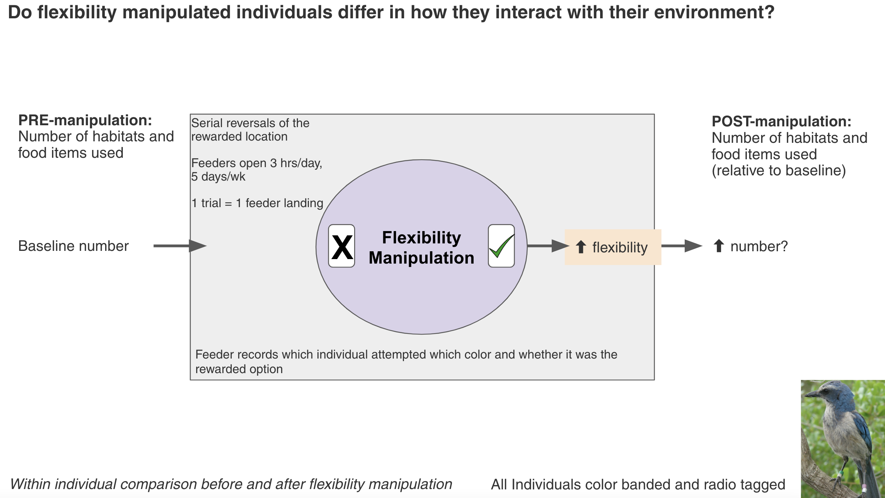
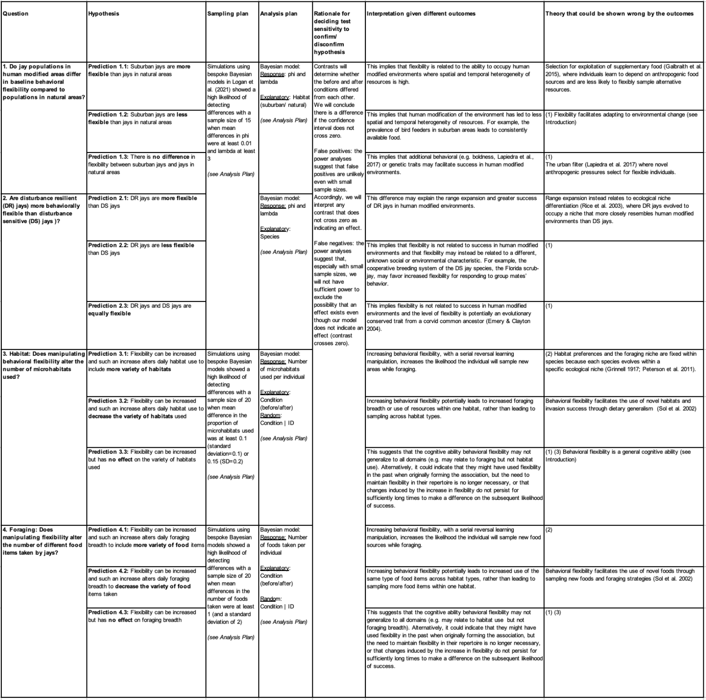

\addtolength{\headheight}{0.1cm}
\pagestyle{fancyplain}
\lhead{\includegraphics[height=1.2cm]{logoPCIRR.png}}
\renewcommand{\headrulewidth}{0pt}

Open...  {width=5%} access {width=5%} [code](https://github.com/ManyIndividuals/ManyIndividuals/blob/main/Files/rrs/mi1.Rmd)

\addtolength{\headheight}{0.1cm}
\pagestyle{fancyplain}
\lhead{\includegraphics[height=1.2cm]{logoPCIRR.png}}
\renewcommand{\headrulewidth}{0pt}

&nbsp;

##### Affiliations: 
1) Institute for Social, Behavioral and Economic Research, University of California Santa Barbara, Santa Barbara, CA, USA
2) College of Forestry, Wildlife and Environment, Auburn University, Auburn, AL, USA 
3) Archbold Biological Station, Venus, FL, USA. 

*Corresponding author: kelseybmccune@gmail.com*

&nbsp;

**This is a post-study manuscript of the registered report that has been pre-study peer reviewed and received an In Principle Acceptance on 8 Sep 2022 by:**

Chris Chambers (2022) The role of behavioural flexibility in promoting resilience to human environmental impacts. *Peer Community in Registered Reports*. [https://rr.peercommunityin.org/articles/rec?id=200](https://rr.peercommunityin.org/articles/rec?id=200). Reviewers:  Gloriana Chaverri, Vedrana Šlipogor, and Alizée Vernouillet

{width=50%}


*See the reproducible manuscript ([Rmd](https://github.com/ManyIndividuals/ManyIndividuals/blob/573b4b5802550f47f246fb8b71c8efc4f853445c/Files/rrs/mi1.Rmd)) version for the code*

&nbsp;

```{r setup, include=FALSE}
library(knitr)
knitr::opts_chunk$set(tidy.opts=list(width.cutoff=60),tidy=TRUE) 
#Make code wrap text so it doesn't go off the page when Knitting to PDF

knitr::opts_chunk$set(echo=T, include=T, results='asis', warning=F, message=F) 
#sets global options to display code along with the results https://exeter-data-analytics.github.io/LitProg/r-markdown.html
#set echo=F for knitting to PDF (hide code), and echo=T for knitting to HTML (show code)
```

# **ABSTRACT**

Human modifications of environments are increasing, causing global changes that other species must adjust to or suffer from. Behavioral flexibility (hereafter 'flexibility') could be key to coping with rapid change. Behavioral research can contribute to conservation by determining which behaviors can predict the ability to adjust to human modified environments and whether these can be manipulated. When research that manipulates behavior in a conservation context occurs, it primarily trains a specific behavior to improve individual success in the wild. However, training a domain general cognitive ability, such as flexibility, has the potential to change a whole suite of behaviors, which could have a larger impact on influencing success in adjusting to human modified environments. This project asks whether flexibility can be increased by experimentally increasing environmental heterogeneity and whether such an increase can help species succeed in human modified environments. We explore whether it is  possible to take insights from highly divergent species and apply them to address critical conservation challenges. This pushes the limits in terms of understanding how conserved these abilities may be and to what extent they can be shaped by the environment. We aim to 1) conduct flexibility interventions in flexible species that are successful in human modified environments (California scrub-jays or blue jays) to understand how flexibility relates to success; and 2) implement these interventions in a vulnerable species (Florida scrub-jays) to determine whether flexibility as a generalizable cognitive ability can be trained and whether such training improves success in human-modified environments. This research will significantly advance our understanding of the causes and consequences of flexibility, linking behavior to environmental change, cognition, and success in human modified environments through a comparative and global framework. 

# **REGISTERED REPORT DETAILS**

 - **Level of bias = 6:** This registered report was written (Jul 2021-May 2022), and revised after round one of peer review at Peer Community in Registered Reports (Jul 2022) prior to collecting any data.
 - **Programmatic registered report:** Three Stage 2 articles will result from this one Stage 1 registered report: one for toutouwai, one for grackles, and one for jays (this current manuscript).
 - **Deviations from the Stage 1 registered report:** We were unable to sample disturbance-resilient blue jays or California scrub-jays and so we cannot address J.Q2 (one of four specific research questions) at this time.

# **INTRODUCTION**

Human modified environments are increasing [@liu2020high; @wu2011quantifying; @goldewijk2001estimating], causing global changes that other species must adjust to or suffer from [@ciani1986intertroop; @chejanovski2017experimental; @federspiel2017adjusting; @alberti2015eco]. Behavioral flexibility (hereafter 'flexibility') could be key for adjusting to such change: individuals interact with their environment through behavior, making it crucial to an ecologically valid understanding of how species adjust to environmental changes [@lee2021animal]. One of the top priorities for behavioral research to maximize conservation progress is to determine which cognitive abilities and behaviors can predict the ability to adjust to human modified environments and whether these can be manipulated [@moseby2016harnessing]. The rare research that manipulates behavior in a conservation context usually focuses on training specific behaviors (for example, predator recognition through predator exposure) to improve individual success in the wild [@moseby2012can; @west2018predator; @jolly2018out; @ross2019reversing; see review in @tetzlaff2019effects]. However, training a general cognitive ability, such as flexibility -- the ability to rapidly adapt behavior to changes through learning throughout the lifetime [see the theory behind this definition in @mikhalevich_is_2017] -- has the potential to change a whole suite of behaviors and more broadly influence success in adjusting to human modified environments. Recent evidence supports this hypothesis: as far as we are aware, our previous work, in collaboration with Dr. Corina Logan, was the first to show that flexibility can be manipulated using serial reversal learning of color preferences, and that the manipulated individuals were more flexible in a new context (locus switching on a puzzlebox) as well as being more innovative (solved more loci on a puzzlebox) [@logan2022flexmanip].

Environments where informational cues about resources vary in a heterogeneous (but non-random) way across space and time are hypothesized to open a pathway for species to functionally detect and react to such cues via flexibility [@mikhalevich_is_2017]. Human modified environments likely provide a different set of informational cues that vary heterogeneously across space and time, and the species that are successful in such environments are likely those who are able to detect and track such cues. Because heterogeneous environments are hypothesized to select for flexibility [@wright2010behavioral], we expect that experimentally manipulating environments to be more heterogeneous will result in an increase in flexibility in individuals, which will then increase their success in such environments (Figure 1). Success can relate to any number of variables regarding the usage of and investment in resources and response to threats, from improved foraging efficiency to increased dispersal and survival within human modified environments, to placing nests in more protective locations. Whether a measure of success is predicted to relate to flexibility depends on what is already known about the particular population and their particular environment. 

&nbsp;


**Figure 1.** The theory behind this research illustrated by a directed acyclic graph (DAG), which is a theoretical model of the causal relationships among the key variables in our investigation. Based on the theoretical background provided by @mikhalevich_is_2017, we assume that more heterogeneity causes more flexibility, which then causes more success in human modified environments.

&nbsp;

This investigation asks whether flexibility can be increased by experimentally increasing environmental heterogeneity (via serial reversal learning) and whether such an increase can help species succeed in human modified environments. Serial reversal learning tasks have been performed with a wide diversity of species [birds: @bond_serial_2007; bumblebees: @strang2014serial; stingrays: @daniel2020serial]. There is variation across individuals and species in their performance, however almost all previous studies show that individuals improve their flexibility if the reversal intervention is given multiple times in sequence [rats: @mackintosh1968factors; guppies: @lucon2014discrimination; poison frogs: @liu2016learning]. We aim to conduct a flexibility intervention in species that are successful in human modified environments (California scrub-jays or blue jays) to understand how flexibility relates to success, and implement these interventions in a vulnerable species (Florida scrub-jays) to determine whether flexibility as a generalizable cognitive ability can be trained and whether such training improves success in human modified environments. 

While we do not examine the potential spread of the post-manipulation success behaviors from manipulated individuals to individuals that are not involved in our studies, we acknowledge that this is a possibility worthy of future investigation. Manipulating the flexibility of a few individuals could have population-level effects because significant research on social information use in birds [e.g., @valente2021conspecific] demonstrates the potential for the manipulated behavior to disseminate to conspecifics (for example, if manipulated individuals are faster at locating new resources, which could attract the attention of conspecifics, or if unmanipulated individuals copy the manipulated individuals’ nesting or foraging locations). In the event that social learning is not used by a given population to spread the behaviors of manipulated individuals, investing in the training of specific individuals to increase their success in the wild could still have conservation impacts. In some cases, it is possible to train many individuals in a population or a species because there are not many individuals left [@greggor2021pre]. It is also possible to train all individuals involved in a conservation management event such as a translocation [@greggor2021pre]. Therefore, there can still be significant population consequences even if each individual needs to be trained to achieve the goal.

This comparative approach will ultimately reveal how conserved these abilities may be and to what extent they can be shaped by the environment. The results will substantially advance our understanding of the causes and consequences of flexibility, linking behavior to environmental change, cognition, and success in human modified environments through a comparative framework.


# **RESEARCH QUESTIONS**

## Can behavioral flexibility in individuals be increased by increasing environmental heterogeneity? If so, does increased flexibility help individuals succeed in human modified environments? 

**Prediction 1:** Flexibility can be increased in individuals and such an increase **improves the likelihood of success in human modified environments**. This would indicate that the abilities involved in tracking changing resources in the environment are the same as or related to the abilities involved in succeeding in human modified environments. It would also indicate that flexibility is trainable and that such training could be a useful conservation tool for threatened and endangered species. 

**Prediction 1 alternative 1:** Flexibility can be increased in individuals, but such an increase **does not improve the likelihood of success** in human modified environments. This would indicate that species associated with human modified environments form this association for reasons other than their flexibility, and that threatened species are likely not very successful in human modified environments for reasons unrelated to their ability to change their behavior with changing circumstances. An alternative could be that the changes induced by the increase in flexibility do not persist for sufficiently long times to make a difference on the subsequent likelihood of success [changes in great-tailed grackles were still present for four weeks after the manipulation and longer time periods were not attempted so the threshold is unknown @logan2022flexmanip].

**Prediction 1 alternative 2:** Flexibility can be increased in some populations, but not others. This would indicate that **flexibility manipulations may not work for all populations**, and that the effectiveness of such experiments should first be tested in the population of interest before including such an intervention in a conservation plan. If flexibility is not manipulatable in threatened populations, this would indicate that they are likely not very successful in human modified environments because of their inability to change their behavior with changing circumstances, and that flexibility is not trainable. If flexibility is not manipulatable in populations that are successful in human modified environments, this could indicate that they might have used flexibility in the past when originally forming the association, but the need to maintain flexibility in their repertoire is no longer necessary [@wright2010behavioral]. In populations where flexibility is not manipulatable, this would indicate that the abilities involved in tracking changing resources in the environment are independent of the abilities involved in succeeding in human modified environments.


## Population-specific background and tailored research questions

&nbsp;


**Figure 2.** Comparing the species involved in this investigation relative to their geographic range and association with human modified habitats. The yellow dots represent field site locations. Photo credit: CASJ, Corina Logan; BLJA, Rhododendrites; FLSJ, VvAndromedavV.

&nbsp;


#### Background
Jay species exhibit a diversity of social systems and success in colonizing suburban and urban areas (Fig. 2). California scrub-jays (*Aphelocoma californica*, hereafter "CASJ") and blue jays (*Cyanocitta cristata*, hereafter “BLJA”) are singular, monogamous breeders that are increasing in abundance, expanding their range sizes, and highly successful in natural, suburban, and urban areas [@blair1996land; @curry2017california]. We therefore consider these “disturbance-resilient” (DR) jay species. In contrast, the Florida scrub-jay (*A. coerulescens*; hereafter "FLSJ") is a “disturbance-sensitive” (DS) jay species that is threatened, endemic, and range-restricted to xeric oak scrub habitat in Florida [@woolfenden1996florida]. 

These species forage primarily on mast (acorns, hazelnuts, etc.) that they cache throughout their territory, which makes it available to eat year-round. They are also opportunistic omnivores and specifically need high-fat and high-protein arthropods to feed to nestlings and fledglings [@curry2017california]. Nesting and foraging substrates can be drastically different in human modified environments compared to natural areas [e.g., predominance of non-native vegetation; @tuomainen2011behavioural], and it is unknown whether suburban and urban jays are able to persist in these environments through behavioral adjustments. The DS jay species, the FLSJ, can persist in suburban habitats after conversion from xeric oak scrub, however suburban populations of FLSJ steadily decline (Bowman pers. comm.). This is potentially due to the presence of suboptimal habitat resulting from fire suppression [@woolfenden1996florida], higher rates of brood reduction through nestling starvation [@shawkey2004brood], and the lack of nutritionally complete prey items [@shawkey2004brood] in suburban habitats. It is possible that behavioral flexibility in habitat use and foraging breadth underlies the ability of some FLSJ to persist in human-dominated areas. 

We aim to compare behavioral flexibility within species, between suburban and natural populations to determine whether variation in flexibility relates to variation in presence in these habitats. Subsequently, we will compare flexibility between DS and DR jay species to determine whether this trait is related to the greater success of DR jay species, like the CASJ and BLJA, in human-dominated areas. Lastly, we will test whether manipulating flexibility increases the foraging and microhabitat breadth of jays in human modified environments. Manipulating the flexibility of a subset of individuals has the potential to affect the population because previous research demonstrates that both species have the capacity to use foraging information discovered by others (social learning) to flexibly change their behavior [@mccune2018cognition; @midford2000social]. 

#### Research questions

For all research questions, Table 1 summarizes our predictions, analysis plans, interpretations for the various directions the results could go, and the hypotheses that could be contradicted given the various outcomes.

 - **J.Q1: Do jay populations in human modified areas differ in baseline behavioral flexibility compared to populations in natural areas?** We will investigate this question by comparing performance on serial reversal learning in the wild between jays in natural areas and jays in human modified areas. 
 - **J.Q2: Are disturbance-resilient (DR) jays more behaviorally flexible than disturbance-sensitive (DS) jays?** We will investigate this question by comparing performance on serial reversal learning in the wild between DR and DS jay species.
 - **J.Q3: Does manipulating behavioral flexibility alter the number of microhabitats used?** We will investigate this question by tracking their presence in a variety of microhabitats before and after manipulating their flexibility using serial reversal learning in the wild. We only count that a microhabitat was used if the individual had at least 5% of their data points there. This prevents a microhabitat from being counted even if an individual was simply moving through it, and therefore not necessarily using it.
 - **J.Q4: Does manipulating flexibility alter the number of different food items taken by jays?** We will investigate this question by tracking the various food items they take before and after manipulating their flexibility using serial reversal learning in the wild.
 
&nbsp;



**Figure 3.** The reversal learning experiment in a group context (Design 2) tailored to the jay research questions. The white rectangles represent feeder locations, the feeder with the X is in the unrewarded location while the feeder with the green check is the rewarded location.

&nbsp;

**Table 1.** Study design for the jay research. Note that we are unable to test Q2 because it was not possible to sample CASJ or BLJA within the timeframe of this study. References that were not already cited in the introduction: @galbraith2015supplementary, @lapiedra2017urbanization, @rice2003ecological, @emery2004mentality, @sol2002behavioural, @peterson2011ecological, @grinnell1917niche.



&nbsp;


# **METHODS**

Our approach involves individuals participating in a serial reversal learning task and measuring success in natural behavior in the wild. In the following, we outline the procedure we are planning to use with wild birds: the serial reversal learning will involve a feeder setup (see Fig. 3, above), and the success measures will be matched to the relevant behavior in the respective population. The framework we provided in the ManyIndividuals registered report is general to facilitate its adaptation and replication to other populations (i.e., another researcher could adapt our hypotheses, methods, and analysis plans to their system). 

We presented one experimental design for the flexibility intervention (Fig. 4) that can be conducted in two ways: in visual isolation (design 1) and in a group context (design 2). In this Stage 2 manuscript, we used design 2, the within-subjects group context which compares pre- and post-manipulation success measures of the same individuals.

&nbsp;


**Figure 4.** Template design for the reversal learning experiment.


## **DESIGN 2** - Reversal learning experiment in a group context

Feeders are set up in the field, counterbalanced for color/location/etc, and will be available for opening when the experiment is being conducted (Figure 7). The feeders will be fitted with technology to automatically record which individual visits which feeder and when (unless a particular population is easy to track visually without such automated technology, as is the case for the jays). Individuals are habituated to the open feeders filled with food until at least half of the minimum sample size has visited at least 1 feeder. All individuals start on the same rewarded option for the initial discrimination to improve motivation for participating in the experiment (e.g., if the first rewarded option was counterbalanced across individuals, subjects might be slower to learn their rewarded option if they use social information about which option is rewarded). If the subject visits the rewarded feeder, the feeder will automatically, or via a remote controlled by the experimenter, deliver a small amount of food, and then close and reset more food in preparation for the next opening. If the subject visits the non-rewarded feeder, the presence data will be recorded, but the feeder will not open. All feeders will contain one type of high value food. Ideally, feeders will be programmed to automatically switch which feeder type is rewarded as soon as an individual passes criterion in the middle of a test session. If automation is not possible, then the data sheets will be coded live by the experimenter. All feeders are opaque and always have food in them to eliminate the confound due to olfactory differences between the feeders that could be introduced if only the rewarded feeders have food in them. If a feeder needs to be refilled, refill all feeders consecutively in the same time period and refill each for the same amount of time even if that feeder does not need much or any food (in these cases, pretend to fill the feeder as you normally would). This eliminates confounds from cues provided by a differential amount of attention experimenters give the feeders depending on which needs refilling.

Data are collected on success measures (see below) before and after the flexibility intervention or only after the intervention.

**Passing criteria:**

 - **Feeder habituation:** all feeders at all locations will have food and be open for several hours daily or until at least half of the minimum sample size in each condition (control and manipulated) have visited at least one of the feeders.
 - **Reversal passing criterion:**  an individual is considered to have a preference when they choose 10 of the most recent 12 trials (choices) correct (the rewarded option). This criterion applies to the initial discrimination, and to each reversal.
 - **Manipulation passing criterion:** pass two consecutive reversals in X trials or less (see Serial reversal passing criterion above).


### Assessment of the likelihood of success in human modified environments with regard to the flexibility manipulation

Here, we compare pre- and post-flexibility manipulation measures on the same individuals using one or more of the following success measures. Choose population-relevant success variables that are predicted to be the most likely to be used in human modified environments. This list is not exhaustive - it serves as a place to generate ideas about what the best measures could be in a given population. Observational methods to collect these data may vary among populations and we describe below the methods that we will use (i.e., all occurrences sampling). 

 - **Fitness variables:** nest success, number of offspring who survived to independence or adulthood, longevity, etc.
 - **Foraging variables:** diet breadth, number of foraging techniques used, etc.
 - **Movement variables:** predictability of movement behavior [e.g., step length and turning angles; see @mccune2020spaceuse], ability to disperse from a lower risk environment (e.g. a sanctuary, or largely intact natural habitat) to a higher risk, more heavily human modified environment (assess success/survival after dispersal if possible), etc.
 - **Habitat use variables:** foraging substrate (ground, bushes, trees, human modified substrates, human-provided supplemental food), nesting substrate (high or low, tree, bush or reeds), etc.

Begin collecting post-manipulation data on an individual as soon as it passes the manipulation because it is unknown for how long any potential effects of the manipulation will last. For the more social species and for populations who participate in the experiment in groups, there is the potential that individuals who were not in the manipulation condition or who have not yet passed the manipulation condition will learn about post-manipulation success behaviors from the manipulated individuals who passed the experiment. We are ultimately interested in determining whether we can change success behaviors as a result of the flexibility manipulation. If part of this change is the result of social learning from some of the manipulated individuals, it will still result in a change even if we do not quantify what percentage of the mechanism comes from individual learning after the manipulation or social learning after the manipulation. If there is a change in success measures between before and after the manipulation, the manipulation will have been the cause in either case. 

If other researchers are interested in beginning to quantify whether social learning is involved in the spread of success behaviors, then they could collect data on post-manipulation success measures from the individuals who did not pass the manipulation and compare them with individuals who passed the manipulation. If there is no difference between both groups’ post-manipulation success measures, this indicates that social learning was involved in the spread of success behaviors. They could then use this data in a future registered report examining the role of social learning in the spread of success behaviors. If researchers are not planning on a social learning component in future research and/or do not have the time or resources to collect more data, they can refrain from collecting post-manipulation data on success measures on the individuals who did not pass the manipulation criterion. 

### Observational methods

We categorized the food and habitat types used as:

Microhabitat types in the suburban habitat (<100m from human structure) include: vertical human structure (e.g. building, bench), native vegetation, non-native vegetation, grass, impervious surface, and dirt. In the natural habitat (>100m from human structure), microhabitat types include all previous categories, but not human structure or impervious surface All categories can be further defined by whether the subject was high (>3m) or low (<3m) (for example, grass and impervious surfaces can occur above 3m if grass is on the roof of a building, and if an individual is walking on the impervious surface of an upper floor parking garage).

Food types are broken down into plant (seed, fruit, human-provided, or unknown plant) and animal (insect larva, adult insect, crustacean, amphibian, reptile, mammal, bird, egg, human-provided, or unknown animal). “Human-provided” indicates any food item that was acquired from a store at some point and is left out by humans. For example, sunflower seeds would be considered human-provided if they are in the form of bird seed or a human snack. Sunflower seeds would only be counted in the “seed” category if the bird is seen eating it from a plant. Data will be collected on the four plant subcategories and ten animal subcategories and used in the analyses.

During follows, we will record each microhabitat the individual is present in and all food items consumed. Before data analysis, to ensure that we are only including the microhabitats individuals use (rather than just pass through), we will filter the data to include only microhabitats that account for at least 5% of their data points. Although we may not observe every possible microhabitat or food item the individual may use, by equally sampling before and after the manipulation we can detect changes in use.

Additionally, for all observational methods we use binoculars so that we can always attempt to stay far enough from the focal individual that our presence is not affecting their behavior. Because that distance can be different for each individual and species, we hesitate to give a specific number. However, if at any point the focal individual shows it is affected by our presence by looking directly at the researcher, alarm calling or startling, then we end the focal immediately, drop all data from that follow and attempt the follow again the next day.

We will attempt to balance follows for each observational method in the morning and afternoon for all individuals in the study. In this way, we will collect a random sample of data from active and inactive time periods for all individuals. 

#### All occurrences sampling

We will collect data on the foraging and microhabitat use of jays during spatial movement tracking (the latter as part of another investigation). We will follow jays for 60 minutes and record at 1-minute intervals the spatial location (GPS coordinates), any food items consumed, the microhabitat the jay is present in, and breeding behaviors if it is the breeding season. We will do 4 tracks per individual before, and 4 tracks per individual after the flexibility manipulation.

### Open data

The data will be published in the Knowledge Network for Biocomplexity's data repository.


### Protocols

  - Jay [protocol](https://docs.google.com/document/d/1VWL7AIDB-Z1vhs1dEM7JACHuvNjgjZCBI3ubQECqm2U/edit?usp=sharing) and [data sheet templates](https://docs.google.com/spreadsheets/d/1qpukS67A8IslPxP8RBpdB4fS4f9ofWCvQXVgXu-G7Qs/edit?usp=sharing)
 - [Protocol for applying radio tags and conducting GPS tracks](https://docs.google.com/document/d/1ZOpkdxy5-wiGg7hYod-XaaBoOl53DsVQ3pwWoIdvrzk/edit?usp=sharing) from @mccune2020spaceuse
 - Jay [processing protocol](https://docs.google.com/document/d/1YnGdsU-Q7kNBVT-N3x1BA30xP10jPFYEv9-dlTw2RcQ/edit?usp=sharing)

### Planned sample

We will catch up to 60 jays per year using walk in traps, mist nets, and bow nets; collect their biometric data, and a blood sample; apply colored leg bands; attach a radio tag using a leg loop harness; and release them at their point of capture. We will collect data on pre- and post-manipulation success measures and conduct the experiment within the non-breeding season to control for potential temporal differences in the environment and behavior.

To determine whether the flexibility manipulation has influenced the ability of jays to persist in human modified environments, we will catch half of the jays in areas with access to human-supplemented food (i.e. private property, a university campus, parks adjacent to neighborhoods with feeders) and the other half in natural areas (wildlife management areas, reserves).

### Before and after manipulation success measures

We will track baseline behavior and changes after the flexibility manipulation via spatial movement tracking that lasts for 60 min, noting the GPS location and the jay’s behavior at 1 minute intervals. During tracks, we document all occurrences of microhabitats used within the territory and foraging (see Observational methods, above) [@altmann1974observational]. The minimum sample size will be 20 individuals per species with a minimum of 4 tracks per individual (at least 2 per month) pre-manipulation and a minimum of 4 tracks per individual (at least 2 per month) post-manipulation (at least 320 tracks in total). These data will allow us to detect any pre- and post-manipulation within-individual differences in diversity of habitat use, and foraging breadth.

### Flexibility manipulation (Design 2 reversal learning)

We will set up feeding stations at a minimum of 4 study sites, each containing multiple jay territories, spaced at least 2km apart: 2 sites in natural habitat, 2 in human-modified habitat. If individuals are dispersed across multiple areas, we will attempt to add an equal number of sites in natural and human-modified habitats. 

#### Feeder habituation

One feeder at each location will have food and the experimenter will use the remote to feed the focal individual every time it approaches. Habituation will occur in 2-hour sessions between 8a-3p on a minimum of 4 consecutive days or until at least 1 banded jay per territory has visited the feeder at least 3 times without showing fear behaviors.

### The experiment

Prior to the flexibility manipulation, we will collect the 4 minimum tracking sessions to determine the baseline values for microhabitat use and foraging breadth. Afterwards, we will set up feeders to initiate the flexibility manipulation phase.  Once jays are habituated to the feeders we will manipulate behavioral flexibility using serial reversals of the open feeder location. Only one feeder will be opened at a consistent location (north or south, east or west position) within territories across days and the manipulation treatment will consist of 30-min sessions per day per territory, up to 4 days per week, where each visit by the focal jay to a feeder is considered a trial. Jays pass a given reversal when they correctly choose the rewarded feeder in at least 10 trials out of the most recent 12 trials. Jays were very fast to switch their preference in the first reversal. Therefore, serial reversals will continue until jays pass two consecutive reversals in X trials or less (see Serial reversal passing criterion above). At this criterion, the jays will be considered to have increased their behavioral flexibility.  After the manipulation is complete in each territory, we will again conduct the tracking sessions to measure microhabitat use and foraging breadth.


# **ANALYSIS PLAN**

We run analyses in R [current version `r getRversion()`; @rcoreteam] using the following R packages: rethinking [@rethinking2020], rstan [@rstan], cmdstanr [@cmdstanr], knitr [@xie2018knitr], and irr [@gamer2012package].

## Can flexibility be increased to help individuals succeed in human modified environments?

### **DESIGN 1** - Reversal learning experiment in visual isolation

**Can flexibility be increased?** If most individuals in the flexibility manipulation (serial reversals) passed the passing criterion, then the answer is yes.

**Do the flexibility manipulated (serial reversal) individuals have better success in human modified environments?**

*Response variable:* success variable (e.g., predictability of movement behavior, number of different food items taken, etc.)

*Explanatory variable:* 

- Condition (control, manipulated)

OR

- Condition (pre-manipulation, post-manipulation)

*Random variable:* ID (when response variable has multiple data points per individual)


### **DESIGN 2** - Reversal learning experiment in a group context

Same questions, response/explanatory/random variables as in Design 1.


#### **Jays**

##### J.Q1 Do jay populations in human modified areas differ in baseline behavioral flexibility compared to populations in natural areas?

**The model**

We used the reversal learning Bayesian model in @logan2020xpop to simulate and analyze population differences in reversal learning, and calculate our ability to detect differences between populations. The model "accounts for every choice made in the reversal learning experiment and updates the probability of choosing either option after the choice was made depending on whether that choice contained a food reward or not. It does this by updating three main components for each choice: an attraction score, a learning rate ($\phi$), and a rate of deviating from learned attractions ($\lambda$)" [@logan2020xpop].

***Equation 1 (attraction and $\phi$):*** $A_{i,j, t+1} = (1-\phi_j) A_{i,j,t} + \phi_j \pi_{i,j,t}$

Equation 1 “tells us how attractions to different behavioral options $A_{i,j, t+1}$ (i.e., how preferable option $i$ is to the bird $j$ at time $t+1$) change over time as a function of previous attractions $A_{i ,j, t}$ and recently experienced payoffs $\pi_{i,j,t}$ (i.e., whether they received a reward in a given trial or not). Attraction scores thus reflect the accumulated learning history up to this point. The (bird-specific) parameter $\phi_j$ describes the weight of recent experience. The higher the value of $\phi_j$, the faster the bird updates their attraction. It thus can be interpreted as the *learning or updating rate of an individual*. A value of $\phi_j = 0.04$, for example, means that receiving a single reward for one of the two options will shift preferences by 0.02 from initial 0.5-0.5 attractions, a value of $\phi_j = 0.06$ will shift preferences by 0.03 and so on” [@blaisdell2021causal]. 

***Equation 2 ($\lambda$):*** $P(i)_{t+1} = \frac{\exp(\lambda_j A_{i, j, t})}{\sum\limits_{m=1}^{2}\exp(\lambda_j A_{m, j, t})}.$

Equation 2 “expresses the probability an individual $j$ chooses option $i$ in the next round, $t+1$, based on the latent attractions. The parameter $\lambda_j$ represents the *rate of deviating from learned attractions* of an individual (also called inverse temperature). It controls how sensitive choices are to differences in attraction scores. As $\lambda_j$ gets larger, choices become more deterministic, as it gets smaller, choices become more exploratory (random choice if $\lambda_j = 0$). For instance, if an individual has a 0.6-0.4 preference for option A, a value of $\lambda_j = 3$ means they choose A 65% of the time, a value of $\lambda_j = 10$ means they choose A 88% of the time and a value of $\lambda_j = 0.5$ means they choose A only 53% of the time” [@blaisdell2021causal].  

We used the $\phi_j$ and $\lambda_j$ values as the response variable in the Bayesian model to examine whether there were differences in flexibility between the habitats:

y ~ $\alpha$[habitat]

y is the response variable ($\phi_j$ and $\lambda_j$, which are extracted from the correct and incorrect choices in the serial reversals). There is one intercept, $\alpha$, per habitat (suburban or natural) and we will estimate the habitat's average and standard deviation of the response variable.

**Power analysis**

Simulations using bespoke Bayesian models in @logan2020xpop (the same model structure we use here) showed a high likelihood of detecting differences with a minimum sample size of 15 when mean differences in phi were at least 0.01 and mean differences in lambda at least 3.

**Run this model on the actual data**

Run the code below to determine whether there were differences between the two habitats in their phi and lambda flexibility measures.

```{r jayflexbeforehabitatcomparison, eval=F}
library(rethinking)
library(cmdstanr)
set_ulam_cmdstan(TRUE) #makes it so ulam always runs with cmdstan

# load data sheet
dflex <- read.csv(url("https://raw.githubusercontent.com/ManyIndividuals/ManyIndividuals/refs/heads/main/Files/rrs/mi1_jays_flexdata.csv"), header=T, sep=",", stringsAsFactors=F)

#label columns so they match the model's variable names
colnames(dflex)[3] = "Habitat"
colnames(dflex)[9] = "Correct"

#make a new column Choice that is Correct +1 to avoid zeros that mess up the model. Make sure to remove the -1s showing that the bird did not participate
dflex <- dflex[!dflex$Correct==-1,] #remove the -1s
dflex$Choice <- dflex$Correct+1 

# sort the data: only want data from the initial discrimination and first reversal to use as the baseline flexibility so we can compare between habitats
reduceddata <- matrix(ncol=ncol(dflex),nrow=0)
reduceddata <- data.frame(reduceddata)
for (i in 1:length(unique(dflex$ID))) {
  thisbird <- unique(dflex$ID)[i]
  thisbirddata <- dflex[dflex$ID==thisbird,]
  thisbirdslastreversal <- thisbirddata[thisbirddata$Reversal %in% c(0,1),]
  reduceddata <- rbind(reduceddata,thisbirdslastreversal)
}
dflex_beginning <- reduceddata


# Now we run a STAN model with all habitats, estimating both means of phi and lambda for each habitat as well as each individuals' phi and lambda

# We set up the data for the model
dat_full <-list() # start the list which holds the input data for the stan model
dat_full$N <- nrow(dflex_beginning) #total number of rows
dat_full$N_id <- length(unique(as.factor(dflex_beginning$ID))) # records how many different individuals there are
dat_full$id <- as.numeric(as.factor(dflex_beginning$ID)) # re-codes each ID as a sequential number
dat_full$N_exp <- length(unique(dflex_beginning$Habitat)) # records the number of habitats
dat_full$Choice <- as.numeric(as.factor(dflex_beginning$Choice)) #this is the Correct +1 variable
dat_full$Correct <- as.numeric(as.factor(dflex_beginning$Correct)) #making this a factor turns it into the same as Choice
dat_full$Trial<-dflex_beginning$Trial # has the info on which trial it is
dat_full$Habitat <- as.numeric(as.factor(dflex_beginning$Habitat)) # re-codes the unique habitats as sequential number; 1 = Natural, 2 = Suburban

# This STAN model, in addition to estimating phi and lambda for each individual, also estimates means for each habitat It again starts with attractions set to 0.1 and assumes that individuals only learn about the option they chose.

# The individuals are now numbered - to find out which individual is which number, run
# levels(as.factor(dflex_beginning$ID))

reinforcement_model_id_site_nonzeroattraction <- "
data{
   int N;
   int N_id;
   int N_exp;
   array[N] int id;
   array[N] int Habitat;
   array[N] int Trial;
   array[N] int Choice;
   array[N] int Correct;
}

parameters{
  real logit_phi;
  real log_L;

  // Varying effects clustered on individual
  matrix[2,N_id] z_ID;
  vector<lower=0>[2] sigma_ID;       //SD of parameters among individuals
  cholesky_factor_corr[2] Rho_ID;

  // Varying effects clustered on experimenter
  matrix[2,N_exp] z_EXP;
  vector<lower=0>[2] sigma_EXP;
  cholesky_factor_corr[2] Rho_EXP;
}

transformed parameters{
matrix[N_id,2] v_ID; // varying effects on individuals
matrix[N_exp,2] v_EXP; // varying effects on experimenter

v_ID = ( diag_pre_multiply( sigma_ID , Rho_ID ) * z_ID )';
v_EXP = ( diag_pre_multiply( sigma_EXP , Rho_EXP ) * z_EXP )';
}

model{
matrix[N_id,2] A; // attraction matrix

logit_phi ~  normal(0,1);
log_L ~  normal(0,1);

// varying effects
to_vector(z_ID) ~ normal(0,1);
sigma_ID ~ exponential(1);
Rho_ID ~ lkj_corr_cholesky(4);

to_vector(z_EXP) ~ normal(0,1);
sigma_EXP ~ exponential(1);
Rho_EXP ~ lkj_corr_cholesky(4);

// initialize attraction scores
for ( i in 1:N_id ) {
A[i,1] = 0.1; A[i,2] = 0.1;
}

// loop over Choices
for ( i in 1:N ) {
vector[2] pay;
vector[2] p;
real L;
real phi;

// first, what is log-prob of observed choice
L =  exp(log_L + v_ID[id[i],1]+ v_EXP[Habitat[i],1]);
p = softmax(L*A[id[i],1:2]' );
Choice[i] ~ categorical( p );

// second, update attractions conditional on observed choice
phi =  inv_logit(logit_phi + v_ID[id[i],2]+ v_EXP[Habitat[i],2]);
pay[1:2] = rep_vector(0,2);
pay[ Choice[i] ] = Correct[i];
A[ id[i] , Choice[i] ] = ( (1-phi)*(A[ id[i] , Choice[i] ]) + phi*pay[Choice[i]]);
}//i
}
"

 
 
# Run the STAN model on the full data with rstan. 5000 iter takes a couple of minutes
m_simulated_full <- stan( model_code =  reinforcement_model_id_site_nonzeroattraction, data=dat_full ,iter = 5000, cores = 4, chains=4, control = list(adapt_delta=0.9, max_treedepth = 12)) 

# We extract the posterior from the STAN model
s <- extract.samples(m_simulated_full)

# We save the output so that we do not have to rerun the model for potential further analyses
write.csv(s,"mi1_jays_q1_output_m_simulated_full.csv")
# if you want to work directly from the saved model output, run the following line 
# s <- read.csv(url("https://raw.githubusercontent.com/ManyIndividuals/ManyIndividuals/refs/heads/main/Files/rrs/mi1_jays_q1_output_m_simulated_full.csv"), header=T, sep=",", stringsAsFactors=F)
# There should be 10000 rows in the data frame (we sampled 2500 iterations from 4 chains), so each row is one of the samples from the posterior.
# The csv file does not preserve the structure. The s file that is the posterior from the STAN model has a nested structure. If you load it from the csv file, the nesting is lost and the variables are renamed. 
# Variable X = unique identifier of the sample from the posterior
# logit_phi = estimate of the baseline phi (logit transformed) across all individuals and habitats
# log_L = estimate of the baseline lambda (log transformed) across all individuals and habitats
# z_ID.1 through z_ID.14 z transformation of lambda for each of the 14 individuals (helps to make the values comparable)
# z_ID.15 through z_ID.28 z transformation of phi for each of the 15 individuals (helps to make the values comparable)
# sigma.ID.1 = variation in lambda among individuals
# sigma_ID.2 = variation in phi among individuals
# Rho_ID.1 = how much lambda is correlated within individuals (will always be 1)
# Rho_ID.2 = how much lambda is with phi within individuals (will be slightly negative)
# Rho_ID.3 = how much lambda is correlated with phi among individuals (will always be 0)
# Rho_ID.4 = how much phi is correlated within individuals (should be close to 1)
# z_EXP.1 through z_EXP.2 z transformation of lambda for each of the two habitats (helps to make the values comparable)
# z_EXP.3 through z_EXP.4 z transformation of phi for each of the two habitats (helps to make the values comparable)
# sigma_EXP.1 variation among individuals in natural habitat
# sigma_EXP.2 variation among individuals in suburban habitat
# Rho_ID.1 = how much lambda is correlated within habitats (will always be 1)
# Rho_ID.2 = how much lambda is correlated with phi within habitats (should be slightly negative)
# Rho_ID.3 = how much lambda is correlated with phi among individuals (will always be 0)
# Rho_ID.4 = how much phi is correlated within individuals (should be close to 1)
# v_ID.1 through v_ID.14 the individual offsets in lambda for the 14 individuals
# v_ID.15 through v_ID.28 the individual offsets in phi for the 14 individuals
# v_EXP.1 the offset for lambda for the natural habitat
# v_EXP.2 the offset for lambda for the suburban habitat
# v_EXP.3 the offset for phi for the natural habitat
# v_EXP.4 the offset for phi for the suburban habitat
# To obtain the estimated phi value for the first individual estimated during a given posterior, you need the inverse logit of the sum of (logit_phi in that row plus v_ID.15 from that row) - to get the full estimate for that individual, average across all rows
# To obtain the estimated lambda value for the first individual estimated during a given posterior, you need the exponential of the sum of (log_L in that row plus v_ID.1 from that row) - to get the full estimate for that individual, average across all rows
# To obtain the estimated phi value in the natural habitat estimated during a given posterior, you need the inverse logit of the sum of (logit_phi in that row plus v_EXP.3 from that row) - to get the full estimate for that habitat, average across all rows
# To obtain the estimated lambda value in the natural habitat estimated during a given posterior, you need the exponential of the sum of (log_L in that row plus v_EXP.1 from that row) - to get the full estimate for that habitat, average across all rows

# If you want to plot the distribution of phi and lambda in the two different habitats, first calculate phi and lambda for each individual. Next, look up which individual is in which habitat with the following code (the order is the same as in the mode, so the individual in the first row is the individual labelled 1 in the model)
# library(dplyr)
# dflex_beginning %>% group_by(ID) %>% summarize(unique(Habitat))

# We calculate the mean phi and lambda for each habitat as estimated by the STAN model
lambda <- sapply(1 : dat_full$N_exp, function(x) exp( mean(s$log_L) + mean(s$v_EXP[ ,x, 1])))
phi <- sapply(1 : dat_full$N_exp, function(x) inv_logit( mean(s$logit_phi) + mean(s$v_EXP[ ,x, 2])))


# We want to know whether the STAN model estimated two habitats to be different or not. As criterion for this, we check whether the samples in the posterior for pairs of habitat overlap or not. That means that, when calculating the difference between the samples in the posterior for a pair of habitat, they are assumed to be different if the differences are all on one side of zero.

# We first whether there is a difference in mean phi between sites
# We calculate the pairwise differences between sites for the estimated phi means
pairwisedifferences_phiposteriors<-list(sapply(1 : (dat_full$N_exp * (dat_full$N_exp-1)/2), function(x) (s$v_EXP[ ,combn(1:dat_full$N_exp,m=2)[1,x], 2]-(s$v_EXP[ ,combn(1:dat_full$N_exp,m=2)[2,x], 2]))))

# We convert it into a dataframe for easier manipulation
estimates_pairwisedifferences_phiposteriors<-as.data.frame(precis(pairwisedifferences_phiposteriors,depth=2))

# We add a column that classifies as true or false whether the estimates crosses zero (as opposed to all values being either smaller or larger than zero)
estimates_pairwisedifferences_phiposteriors$crosseszero<-ifelse(estimates_pairwisedifferences_phiposteriors$mean>0,estimates_pairwisedifferences_phiposteriors$`5.5%`<0,estimates_pairwisedifferences_phiposteriors$`94.5%`>0)

# the columns are: mean is the average difference between the two habitats (suburban minus natural, natural has slightly larger values; sd is the standard deviation of this estimation, followed by the 89% compatibility estimates, a histogram showing the distribution of the differences across the different samples in the posterior indicating that this has been sampled reliably because there are no outliers, and a classifier whether the 89% interval crosses zero - the 1 means it does, so the two habitats do not differ consistently in the phi of the individuals)
#      mean   sd  5.5% 94.5%    histogram crosseszero
# [1] -0.23 1.27 -2.22   1.4 ▁▁▁▁▁▁▇▅▁▁▁▁           1
# Result = there is no difference between suburban and natural intervals for phi because the interval crosses zero


# Second, we check whether there is a difference in mean lambda
# We calculate the pairwise differences between sites for the estimated phi means
pairwisedifferences_lambdaposteriors<-list(sapply(1 : (dat_full$N_exp * (dat_full$N_exp-1)/2), function(x) (s$v_EXP[ ,combn(1:dat_full$N_exp,m=2)[1,x], 1]-(s$v_EXP[ ,combn(1:dat_full$N_exp,m=2)[2,x], 1]))))

# We convert it into a dataframe for easier manipulation
estimates_pairwisedifferences_lambdaposteriors<-as.data.frame(precis(pairwisedifferences_lambdaposteriors,depth=2))

# We add a column that classifies as true or false whether the estimates crosses zero (as opposed to all values being either smaller or larger than zero)
estimates_pairwisedifferences_lambdaposteriors$crosseszero<-ifelse(estimates_pairwisedifferences_lambdaposteriors$mean>0,estimates_pairwisedifferences_lambdaposteriors$`5.5%`<0,estimates_pairwisedifferences_lambdaposteriors$`94.5%`>0)

# the columns are: mean is the average difference between the two habitats (suburban minus natural, natural has slightly larger values; sd is the standard deviation of this estimation, followed by the 89% compatibility estimates, a histogram showing the distribution of the differences across the different samples in the posterior indicating that this has been sampled reliably because there are no outliers, and a classifier whether the 89% interval crosses zero - the 1 means it does, so the two habitats do not differ consistently in the phi of the individuals)
#      mean   sd  5.5% 94.5%    histogram crosseszero
# [1] -0.01 0.18 -0.28  0.28 ▁▁▁▁▂▇▇▂▁▁▁▁           1
# Result = there is no difference between suburban and natural intervals for lambda because the interval crosses zero

```


##### J.Q2 Are disturbance-resiliant jays more flexible than disturbance-resistant jays?

**The model**

Same as in J.Q1 above.

**Power analysis**

Same as in J.Q1 above.

**Run this model on the actual data**

Run the code below to determine whether there were differences between the species in their phi and lambda flexibility measures.

```{r jayflexsppdiff, eval=F}
library(rethinking)
library(cmdstanr)
set_ulam_cmdstan(TRUE) #makes it so ulam always runs with cmdstan

# load data sheet
dflex <- read.csv(url(""), header=T, sep=",", stringsAsFactors=F)

# sort the data: only want data from the initial discrimination and first reversal to use as the baseline flexibility so we can compare between species
reduceddata <- matrix(ncol=ncol(dflex),nrow=0)
reduceddata <- data.frame(reduceddata)
for (i in 1:length(unique(dflex$ID))) {
  thisbird <- unique(dflex$ID)[i]
  thisbirddata <- dflex[dflex$ID==thisbird,]
  thisbirdslastreversal <- thisbirddata[thisbirddata$Reversal %in% c(0,1),]
  reduceddata <- rbind(reduceddata,thisbirdslastreversal)
}
dflex_beginning <- reduceddata


# Now we run a STAN model with all simulated species, estimating both means of phi and lambda for each species as well as each individuals' phi and lambda

# We set up the data for the model
dat_full <- as.list(simulatedreversaldata_attractionscores)
dat_full$N <- nrow(simulatedreversaldata_attractionscores)
dat_full$N_id <- length(unique(simulatedreversaldata_attractionscores$id))
dat_full$N_exp <- length(unique(simulatedreversaldata_attractionscores$Habitat))
dat_full$Choice <- as.numeric(as.factor(dat_full$Choice))

# This STAN model, in addition to estimating phi and lambda for each individual, also estimates means for each habitat It again starts with attractions set to 0.1 and assumes that individuals only learn about the option they chose.

reinforcement_model_id_site_nonzeroattraction <- "
data{
   int N;
   int N_id;
   int N_exp;
   int id[N];
   int Species[N];
   int Trial[N];
   int Choice[N];
   int Correct[N];
}

parameters{
  real logit_phi;
  real log_L;

  // Varying effects clustered on individual
  matrix[2,N_id] z_ID;
  vector<lower=0>[2] sigma_ID;       //SD of parameters among individuals
  cholesky_factor_corr[2] Rho_ID;

  // Varying effects clustered on experimenter
  matrix[2,N_exp] z_EXP;
  vector<lower=0>[2] sigma_EXP;
  cholesky_factor_corr[2] Rho_EXP;
}

transformed parameters{
matrix[N_id,2] v_ID; // varying effects on individuals
matrix[N_exp,2] v_EXP; // varying effects on experimenter

v_ID = ( diag_pre_multiply( sigma_ID , Rho_ID ) * z_ID )';
v_EXP = ( diag_pre_multiply( sigma_EXP , Rho_EXP ) * z_EXP )';
}

model{
matrix[N_id,2] A; // attraction matrix

logit_phi ~  normal(0,1);
log_L ~  normal(0,1);

// varying effects
to_vector(z_ID) ~ normal(0,1);
sigma_ID ~ exponential(1);
Rho_ID ~ lkj_corr_cholesky(4);

to_vector(z_EXP) ~ normal(0,1);
sigma_EXP ~ exponential(1);
Rho_EXP ~ lkj_corr_cholesky(4);

// initialize attraction scores
for ( i in 1:N_id ) {
A[i,1] = 0.1; A[i,2] = 0.1';
}

// loop over Choices
for ( i in 1:N ) {
vector[2] pay;
vector[2] p;
real L;
real phi;

// first, what is log-prob of observed choice
L =  exp(log_L + v_ID[id[i],1]+ v_EXP[Species[i],1]);
p = softmax(L*A[id[i],1:2]' );
Choice[i] ~ categorical( p );

// second, update attractions conditional on observed choice
phi =  inv_logit(logit_phi + v_ID[id[i],2]+ v_EXP[Species[i],2]);
pay[1:2] = rep_vector(0,2);
pay[ Choice[i] ] = Correct[i];
A[ id[i] , Choice[i] ] = ( (1-phi)*(A[ id[i] , Choice[i] ]) + phi*pay[Choice[i]])';
}//i
}
"

# Now we run the STAN model on the full data. This will take a few hours.
m_simulated_full <- stan( model_code =  reinforcement_model_id_site_nonzeroattraction, data=dat_full ,iter = 5000, cores = 4, chains=4, control = list(adapt_delta=0.9, max_treedepth = 12))

# We extract the posterior from the STAN model
s <- extract.samples(m_simulated_full)

# We calculate the mean phi and lambda for each Species as estimated by the STAN model
lambda <- sapply(1 : dat_full$N_exp, function(x) exp( mean(s$log_L) + mean(s$v_EXP[ ,x, 1])))
phi <- sapply(1 : dat_full$N_exp, function(x) inv_logit( mean(s$logit_phi) + mean(s$v_EXP[ ,x, 2])))


# We want to know whether the STAN model estimated two habitats to be different or not. As criterion for this, we check whether the samples in the posterior for pairs of Species overlap or not. That means that, when calculating the difference between the samples in the posterior for a pair of Species, they are assumed to be different if the differences are all on one side of zero.

# We first check our power to estimate difference in mean phi between sites
# We calculate the pairwise differences between sites for the estimated phi means
pairwisedifferences_phiposteriors<-list(sapply(1 : (dat_full$N_exp * (dat_full$N_exp-1)/2), function(x) (s$v_EXP[ ,combn(1:dat_full$N_exp,m=2)[1,x], 2]-(s$v_EXP[ ,combn(1:dat_full$N_exp,m=2)[2,x], 2]))))

# We convert it into a dataframe for easier manipulation
estimates_pairwisedifferences_phiposteriors<-as.data.frame(precis(pairwisedifferences_phiposteriors,depth=2))

# We add a column that classifies as true or false whether the estimates crosses zero (as opposed to all values being either smaller or larger than zero)
estimates_pairwisedifferences_phiposteriors$crosseszero<-ifelse(estimates_pairwisedifferences_phiposteriors$mean>0,estimates_pairwisedifferences_phiposteriors$`5.5%`<0,estimates_pairwisedifferences_phiposteriors$`94.5%`>0)
```

##### J.Q3 More flexible = use more microhabitats?

**The model**

*Bayesian model with a normal distribution:*

habitatuse ~ $\alpha$[ind] + $\beta$[ind]*before

habitatuse is the response variable: the total number of different microhabitats used per individual. There will be one intercept, $\alpha$, and one slope $\beta$ per individual, which will be estimated for the two conditions, before (and after) the manipulation. ID is nested within condition as a random effect because there is more than one data point per individual: each individual has a data point in the before condition and in the after condition. A normal distribution was used because the response variable is a sum without an expected skew to the curve [see Figure 10.6 in @mcelreath2020statistical]. The Bayesian model was developed using @mcelreath2020statistical as a guide.

**Power analysis**

We estimated our power to detect differences between conditions at different sample sizes and with different mean changes in the proportion of different microhabitats used per individual in the before vs. after conditions (Figure 11). We simulated the proportion of habitats used for different sample sizes of individuals before and after the flexibility manipulation. We analyzed these simulated data with the model we will use to analyze the actual data, estimating the change in the proportion of habitats used between the before and after conditions. From the posterior estimates of the model, we extracted both the mean change as well as the ratio of the posterior estimates that were below zero.

If the mean ratio of estimates below zero is close to 0.5, the model assumes that the change in the proportion of habitats used before the flexibility manipulation is similar to after. If the ratio is close to zero, the model assumes individuals have changed their behavior. For changes in the proportion of habitats used smaller than 0.15 (standard deviation=0.2) or 0.1 (SD=0.1), models are likely to assume that no changes occurred even with large sample sizes. If the change in the proportion of habitats used before the flexibility manipulation vs. after is 0.15 with a standard deviation of 0.2, on average 94% of the posterior of the model based on a sample size of 20 individuals will be larger than zero (93% with a standard deviation of 0.1). This means that the model is quite certain there is a difference that is larger than zero. In addition, only four of the 30 models for a sample size of 20 at the mean change of 0.15 have a ratio larger than 0.3, meaning that the risk of having a false negative is not very likely.

In general, with sample sizes at or above 20 and mean changes in the proportion of habitats used at 0.1 or larger, it is highly likely that the model will indicate that individuals have changed their behavior. Mean changes below 0.1 can still be detected, however there is a higher risk that there will be a false negative and this risk is independent of sample size. 

With small mean changes in the response variable, some individuals might not increase or even decrease their response after the manipulation because there is variation around the mean change in individual responses. With small sample sizes, there is a risk that only individuals who did not clearly increase their response will be studied, whereas larger sample sizes are more likely to include a wider spectrum of individuals.

To estimate the risk of detecting false positives, we set the mean change in the proportion of habitats used to zero so there was no change between the before and after conditions. As expected, the average ratio of estimates below zero is close to but below 0.5 and independent of sample size. The estimates went generally below 0.5 because the maximum number of habitats used was set to 10 and we had a condition where individuals before the manipulation used a mean of 7 habitats. Accordingly, if individuals randomly either increase or decrease their number of habitats used, decreases will be more severe because individuals can only increase by 3 habitats, but potentially decrease by 6 habitats. With a sample size of 20, 27% have a ratio smaller than 0.3, meaning that the risk of having a false positive is high. The risk would be lower if the variation among individuals was lower than what we assumed (the standard deviation of the mean change in number of habitats was 0.2, which is a conservative estimate).

```{r jayhabitatusesim, eval=F}
library(rethinking)
library(cmdstanr)
set_ulam_cmdstan(TRUE) #makes it so ulam always runs with cmdstan
rstan_options(auto_write = TRUE)

### SIMULATE the population

#exploration of the number of habitats jays might use (have to have at least 5% of the points in a given habitat for that habitat to count). Binomial distribution restricts it to the known maximum of 10 microhabitats in our study and makes it a positive number. Can likely distinguish between differences of 15% or more
plot(density(rbinom(10000,size=10,prob=5/10))) #10 max habitats; on average, individuals will use 5 of the 10 habitats more than 5% of the time
lines(density(rbinom(10000,size=10,prob=3.5/10)),col="red") #on average, individuals will use 3.5 of the 10 habitats more than 5% of the time
lines(density(rbinom(10000,size=10,prob=7/10)),col="blue") #on average, individuals will use 7 of the 10 habitats more than 5% of the time

#choose the mean proportion of habitats used before the manipulation
number_before<-5/10 #number of habitats used per bird in the before condition. 5 = 10/2, the halfway point of the max 10 habitats in the suburban habitat
changenumber<-1.5 #the difference in the number habitats used between the before and after conditions
N_ind <- 20 #number of individuals tested

numberbefore <- rbinom(N_ind,size=10,prob=number_before) #proportion of habitats used before
numberafter <- as.vector(rep(0,N_ind) )
for (i in 1:N_ind) {
  numberafter[i] <- round( numberbefore[i] + rnorm(n=1, mean=(10-numberbefore[i])*(changenumber/numberbefore[i]),sd=1),0 )
  if(numberafter[i]>10){numberafter[i] <- 10}
}

#change the number of habitats increased (e.g., 3.5) in changenumber in numberafter to determine which changenumber to run the simulations at. Visualize using the plot below to see when the distributions have more separation (and see whether it might be possible to tell the difference between before (black) and after (red))
plot(density(numberbefore),lwd=2,xlim=c(0,18),ylim=c(0,0.3))
lines(density(numberafter),lwd=2,col="red") #the after condition. Should be able to tell the difference when changenumber is at least 1.5 above number_before (and number_before is 5/10)

#check the plot to see whether individuals are increasing their numbers = most are above the 1:1 line. Those that were smaller on the x axis are farther from the line, which is what we wanted
plot(numberbefore,numberafter,xlim=c(0,10),ylim=c(0,10))
abline(0,1)


### POWER ANALYSIS: different sample sizes and different mean changes in proportions between before and after conditions
# We now set our range of likely sample sizes, from a minimum of 10 individuals per population to a maximum of 60 individuals per population. We draw repeated samples of individuals of that size from each of the 5 populations, during each repetition we draw two samples from each population (so we can infer the false negative rate of wrongly estimating that two samples come from a different population even though they were taken from the sample population). This means we have 10 repetitions for each of the 5 sample sizes and each of the 6 changemeans. So 10*6 changemeans. (=60) for each of the 5 sample sizes, resulting in a total length of samplesizes of 300
samplesizes<-c(10,20,30,40,60) #c(10,20,30,40,60)

# Set the means you want to compare
meanchangenumber1<-3/10 #Likely going to use 3 more out of the 10 habitats
meanchangenumber2<-2.5/10 #Likely going to use 2.5 more out of the 10 habitats
meanchangenumber3<-2/10 
meanchangenumber4<-1.5/10
meanchangenumber5<-1/10
meanchangenumber6<-0/10
changenumbervariants<-c(meanchangenumber1,meanchangenumber2,meanchangenumber3,meanchangenumber4,meanchangenumber5,meanchangenumber6) #for false negatives

#compare different baseline numbers for how many habitats these individuals are likely to use before the manipulation
average_number_before<-c(3/10, 5/10, 7/10)

#set up data frame where results will be stored
simresults <- matrix(NA,nrow=900,ncol=7)
simresults <- data.frame(simresults)
colnames(simresults) <- c("n","changenumber_mean","repetition","changeprop_sd","number_before","proportion_estimates_below_zero","count_estimates_below_zero")
counter<-1

# run simulations. There are 5 different sample sizes, and for each we have 6 different mean change in proportions that we want to examine, and each will repeat 10 times for a total of 300 samples.
for (samplesize in 1:length(samplesizes)) {
        N_ind <- samplesizes[samplesize] #number of grackles per sample size
        
        #now run through each of the 6 number variations
        for (numbervariant in 1:length(changenumbervariants)) {
        
        #pick the current proportion variant from the list changepropvariants
        currentchangenumber <- changenumbervariants[numbervariant]
        
        for (baselinenumber in 1:3) {
        #pick the current proportion variant from the list changepropvariants
        average_currentnumber_before <- average_number_before[baselinenumber]
        
        for (repetition in 1:10) {
       
        #BEFORE & AFTER manipulation
        individual_probs_before<-(rnorm(N_ind,mean=average_currentnumber_before,sd=0.05))  # Based on one of the three average baseline numbers before, each individual will be assigned a value close to this with some variation
        individual_probs_before[individual_probs_before<0]<-0
        individual_probs_before[individual_probs_before>1]<-1
        
        simulatedindividuals_number_before<-as.vector(rep(0,N_ind))
        individual_probs_after<-as.vector(rep(0,N_ind))
        simulatedindividuals_number_after<-as.vector(rep(0,N_ind))
        
        for (i in 1:N_ind) {
          simulatedindividuals_number_before[i] <- rbinom(1 ,size=10,prob=individual_probs_before[i]) # Based on their individual values for the proportion of habitats before, calculate proportion of habitats each individual used before
          simulatedindividuals_number_before[simulatedindividuals_number_before==0]<-1 # Individuals have to live in at least one habitat
          individual_probs_after[i]<-individual_probs_before[i]+rnorm(1,mean=currentchangenumber,sd=0.2) # We increase the individual baseline values by one of the six change numbers, with variation so that some individuals might also decrease their value from their baseline before.  #change this SD here and below in the simresults ouput to test different SDs
          individual_probs_after[individual_probs_after<0]<-0
          individual_probs_after[individual_probs_after>1]<-1
          simulatedindividuals_number_after[i] <- rbinom(1 ,size=10,prob=individual_probs_after[i]) # Based on their modified individual values for the proportion of habitats after, calculate how many habitats each individual used after
          simulatedindividuals_number_after[simulatedindividuals_number_after==0]<-1 # Individuals have to live in at least one habitat
          }

        ### run a STAN model to see whether the before and after proportions are estimated to be different from each other
        #sets up the data sheet with the simulated data that the model will run on
      dat <- list(
    habitatuse = c(simulatedindividuals_number_before,simulatedindividuals_number_after), #compare before and after
    tid = c(rep(1,N_ind),rep(2,N_ind)), #1 refers to before and 2 to after
    actor = rep(1:N_ind,2) #go through all individuals twice because there are observations from before and after for each
)

        # Our MODEL
sj <- ulam(
    alist(
        habitatuse ~ dbinom(10,p),
        logit(p) <- g[tid] + alpha[actor,tid],
        # adaptive priors - non-centered
        transpars> matrix[actor,2]:alpha <- compose_noncentered( sigma_actor , L_Rho_actor , z_actor ),
        matrix[2,actor]:z_actor ~ normal( 0 , 1 ),
        # fixed priors
        g[tid] ~ normal(0,1),
        vector[2]:sigma_actor ~ dexp(1),
        cholesky_factor_corr[2]:L_Rho_actor ~ lkj_corr_cholesky( 2 ),
        # compute ordinary correlation matrixes from Cholesky factors
        gq> matrix[2,2]:Rho_actor <<- Chol_to_Corr(L_Rho_actor)
    ) , data=dat , chains=4 , cores=4 , log_lik=TRUE , cmdstan = TRUE, control = list(adapt_delta = .95, force_recompile = TRUE))
#precis(sj, depth=2) #check the output to make sure it looks as expected

#run contrasts
post <- extract.samples(sj)
diff_g <- post$g[,2] - post$g[,1] #log-odds difference p.341 McElreath 2020
diff_p <- inv_logit(post$g[,2]) - inv_logit(post$g[,1]) #on the probability scale p.341 McElreath 2020
#precis( list( diff_g=diff_g , diff_p=diff_p ) )

  # enter all of the results into the data sheet
    simresults[counter,]$n <- N_ind
    simresults[counter,]$changenumber_mean <- currentchangenumber #this will show the avg change in proportion of habitats
    simresults[counter,]$repetition <- repetition
    simresults[counter,]$changeprop_sd <- 0.2 #change this number and in individual_probs_after to test different SDs
    simresults[counter,]$number_before <- average_currentnumber_before
    simresults[counter,]$proportion_estimates_below_zero <- sum(diff_p<0)/length(diff_p)
    simresults[counter,]$count_estimates_below_zero <- sum(diff_p<0)
    counter<-counter+1 
    print(c(counter,"out of",10*length(samplesizes)*length(changenumbervariants)*length(average_number_before)))
        }
        }
        }
}

#write the output to csv, combine both SD data sets into one sheet, upload to github, and get the url for the next R chunk. FYI model takes 4hrs to run
#write.csv(simresults,file="simresultsjayhabitatsd0.1.csv")
#write.csv(simresults,file="simresultsjayhabitatsd0.2.csv")
```

```{r jayq3simulationfiguresamplesize, eval=F, messages=F}
library(rethinking)
library(cmdstanr)
set_ulam_cmdstan(TRUE) #makes it so ulam always runs with cmdstan

#load the data sheet that was made from the simulation in the previous R chunk
d <- read.csv("https://raw.githubusercontent.com/ManyIndividuals/ManyIndividuals/main/Files/rrs/mi1simresultsjayshabitats.csv", header = TRUE, sep = ",", stringsAsFactors = FALSE)
#head(d)

#make a plot first for sd=2
d2 <- d[d$changeprop_sd==0.2,]

# Set up the data sheet for the model
dat2 <- list(
  proportion_estimates_below_zero = as.numeric(d2$proportion_estimates_below_zero),
  count_estimates_below_zero = as.numeric(d2$count_estimates_below_zero),
  changenumber_mean = as.factor(d2$changenumber_mean),
  samplesize = as.integer(as.factor(d2$n))
)

# We run the STAN model for sd=2 - it is a binomial model that assumes that the probability to estimate a difference depends on an interaction between the sample size and the difference between the conditions (before/after). The response variable is a count and the model turns it into a proportion
m_samplesize_diffscount2 <- ulam(
  alist(
    count_estimates_below_zero ~ dbinom(2000,p),
    logit(p) <- a[samplesize] + b[samplesize,changenumber_mean],
    a[samplesize]~dnorm(0,1),
    transpars> matrix[samplesize,6]:b <- compose_noncentered( sigma_actor , L_Rho_actor , z_actor ),
    matrix[6,samplesize]:z_actor ~ normal( 0 , 1 ),
    # fixed priors
    vector[6]:sigma_actor ~ dexp(1),
    cholesky_factor_corr[6]:L_Rho_actor ~ lkj_corr_cholesky( 2 ),
    gq> matrix[6,6]:Rho_actor <<- Chol_to_Corr(L_Rho_actor)
  ),data=dat2, log_lik=TRUE, messages=FALSE,cmdstan=T)

# Extract the posterior estimates from this STAN model
precis_output<-precis( m_samplesize_diffscount2 , depth=2 )


#now make a plot for sd=1
d1 <- d[d$changeprop_sd==0.1,]

# Set up the data sheet for the model
dat1 <- list(
  proportion_estimates_below_zero = as.numeric(d1$proportion_estimates_below_zero),
  count_estimates_below_zero = as.numeric(d1$count_estimates_below_zero),
  changenumber_mean = as.factor(d1$changenumber_mean),
  samplesize = as.integer(as.factor(d1$n))
)

# We run the STAN model
m_samplesize_diffscount <- ulam(
  alist(
    count_estimates_below_zero ~ dbinom(2000,p),
    logit(p) <- a[samplesize] + b[samplesize,changenumber_mean],
    a[samplesize]~dnorm(0,1),
    transpars> matrix[samplesize,6]:b <- compose_noncentered( sigma_actor , L_Rho_actor , z_actor ),
    matrix[6,samplesize]:z_actor ~ normal( 0 , 1 ),
    # fixed priors
    vector[6]:sigma_actor ~ dexp(1),
    cholesky_factor_corr[6]:L_Rho_actor ~ lkj_corr_cholesky( 2 ),
    gq> matrix[6,6]:Rho_actor <<- Chol_to_Corr(L_Rho_actor)
  ),data=dat1, log_lik=TRUE, messages=FALSE,cmdstan=T)

# Extract the posterior estimates from this STAN model
precis_output1<-precis( m_samplesize_diffscount , depth=2 )


# Plot the predictions for the different sample sizes as separate lines = COUNT out of 2000
# plot for sd=2
op <- par(mfrow=c(1,2), mar=c(5.9,4.9,2.3,0.9))
plot(NULL,xlim=c(-0.01,0.31),ylim=c(0.0,0.6),pch=1,ann=F,frame.plot=F,cex=1.5)

mu_10<- link( m_samplesize_diffscount2 , data=data.frame( changenumber_mean=as.factor(unique(d2$changenumber_mean)),samplesize=rep(1,length(unique(d2$changenumber_mean))) ) )
mu_10_mean <- apply( mu_10 , 2 , mean )
mu_10_ci <- apply( mu_10 , 2 , PI , prob=0.97 )
shade( mu_10_ci , unique(d2$changenumber_mean) , col=col.alpha("blue",0.7) )
lines(x=c(-0.004,-0.004),y=c(min(d2[d2$n %in% 10 & d2$changenumber_mean %in% 0,]$proportion_estimates_below_zero),max(d2[d2$n %in% 10 & d2$changenumber_mean %in% 0,]$proportion_estimates_below_zero)),col=col.alpha("blue",0.5))
lines(x=c(0.096,0.096),y=c(min(d2[d2$n %in% 10 & d2$changenumber_mean %in% 0.1,]$proportion_estimates_below_zero),max(d2[d2$n %in% 10 & d2$changenumber_mean %in% 0.1,]$proportion_estimates_below_zero)),col=col.alpha("blue",0.5))
lines(x=c(0.146,0.146),y=c(min(d2[d2$n %in% 10 & d2$changenumber_mean %in% 0.15,]$proportion_estimates_below_zero),max(d2[d2$n %in% 10 & d2$changenumber_mean %in% 0.15,]$proportion_estimates_below_zero)),col=col.alpha("blue",0.5))
lines(x=c(0.196,0.196),y=c(min(d2[d2$n %in% 10 & d2$changenumber_mean %in% 0.2,]$proportion_estimates_below_zero),max(d2[d2$n %in% 10 & d2$changenumber_mean %in% 0.2,]$proportion_estimates_below_zero)),col=col.alpha("blue",0.5))
lines(x=c(0.246,0.246),y=c(min(d2[d2$n %in% 10 & d2$changenumber_mean %in% 0.25,]$proportion_estimates_below_zero),max(d2[d2$n %in% 10 & d2$changenumber_mean %in% 0.25,]$proportion_estimates_below_zero)),col=col.alpha("blue",0.5))
lines(x=c(0.296,0.296),y=c(min(d2[d2$n %in% 10 & d2$changenumber_mean %in% 0.3,]$proportion_estimates_below_zero),max(d2[d2$n %in% 10 & d2$changenumber_mean %in% 0.3,]$proportion_estimates_below_zero)),col=col.alpha("blue",0.5))

mu_20 <- link( m_samplesize_diffscount2 , data=data.frame( changenumber_mean=as.factor(unique(d2$changenumber_mean)),samplesize=rep(2,length(unique(d2$changenumber_mean))) ) )
mu_20_mean <- apply( mu_20 , 2 , mean )
mu_20_ci <- apply( mu_20 , 2 , PI , prob=0.97 )
shade( mu_20_ci , unique(d2$changenumber_mean) , col=col.alpha("orange",0.7) )
lines(x=c(-0.002,-0.002),y=c(min(d2[d2$n %in% 20 & d2$changenumber_mean %in% 0,]$proportion_estimates_below_zero),max(d2[d2$n %in% 20 & d2$changenumber_mean %in% 0,]$proportion_estimates_below_zero)),col=col.alpha("orange",0.5))
lines(x=c(0.098,0.098),y=c(min(d2[d2$n %in% 20 & d2$changenumber_mean %in% 0.1,]$proportion_estimates_below_zero),max(d2[d2$n %in% 20 & d2$changenumber_mean %in% 0.1,]$proportion_estimates_below_zero)),col=col.alpha("orange",0.5))
lines(x=c(0.148,0.148),y=c(min(d2[d2$n %in% 20 & d2$changenumber_mean %in% 0.15,]$proportion_estimates_below_zero),max(d2[d2$n %in% 20 & d2$changenumber_mean %in% 0.15,]$proportion_estimates_below_zero)),col=col.alpha("orange",0.5))
lines(x=c(0.198,0.198),y=c(min(d2[d2$n %in% 20 & d2$changenumber_mean %in% 0.2,]$proportion_estimates_below_zero),max(d2[d2$n %in% 20 & d2$changenumber_mean %in% 0.2,]$proportion_estimates_below_zero)),col=col.alpha("orange",0.5))
lines(x=c(0.248,0.248),y=c(min(d2[d2$n %in% 20 & d2$changenumber_mean %in% 0.25,]$proportion_estimates_below_zero),max(d2[d2$n %in% 20 & d2$changenumber_mean %in% 0.25,]$proportion_estimates_below_zero)),col=col.alpha("orange",0.5))
lines(x=c(0.298,0.298),y=c(min(d2[d2$n %in% 20 & d2$changenumber_mean %in% 0.3,]$proportion_estimates_below_zero),max(d2[d2$n %in% 20 & d2$changenumber_mean %in% 0.3,]$proportion_estimates_below_zero)),col=col.alpha("orange",0.5))

mu_30 <- link( m_samplesize_diffscount2 , data=data.frame( changenumber_mean=as.factor(unique(d2$changenumber_mean)),samplesize=rep(3,length(unique(d2$changenumber_mean))) ) )
mu_30_mean <- apply( mu_30 , 2 , mean )
mu_30_ci <- apply( mu_30 , 2 , PI , prob=0.97 )
shade( mu_30_ci ,unique(d2$changenumber_mean), col=col.alpha("skyblue",0.7) )
lines(x=c(0,0),y=c(min(d2[d2$n %in% 30 & d2$changenumber_mean %in% 0,]$proportion_estimates_below_zero),max(d2[d2$n %in% 30 & d2$changenumber_mean %in% 0,]$proportion_estimates_below_zero)),col=col.alpha("skyblue",0.5))
lines(x=c(0.1,0.1),y=c(min(d2[d2$n %in% 30 & d2$changenumber_mean %in% 0.1,]$proportion_estimates_below_zero),max(d2[d2$n %in% 30 & d2$changenumber_mean %in% 0.1,]$proportion_estimates_below_zero)),col=col.alpha("skyblue",0.5))
lines(x=c(0.15,0.15),y=c(min(d2[d2$n %in% 30 & d2$changenumber_mean %in% 0.15,]$proportion_estimates_below_zero),max(d2[d2$n %in% 30 & d2$changenumber_mean %in% 0.15,]$proportion_estimates_below_zero)),col=col.alpha("skyblue",0.5))
lines(x=c(0.2,0.2),y=c(min(d2[d2$n %in% 30 & d2$changenumber_mean %in% 0.2,]$proportion_estimates_below_zero),max(d2[d2$n %in% 30 & d2$changenumber_mean %in% 0.2,]$proportion_estimates_below_zero)),col=col.alpha("skyblue",0.5))
lines(x=c(0.25,0.25),y=c(min(d2[d2$n %in% 30 & d2$changenumber_mean %in% 0.25,]$proportion_estimates_below_zero),max(d2[d2$n %in% 30 & d2$changenumber_mean %in% 0.25,]$proportion_estimates_below_zero)),col=col.alpha("skyblue",0.5))
lines(x=c(0.3,0.3),y=c(min(d2[d2$n %in% 30 & d2$changenumber_mean %in% 0.3,]$proportion_estimates_below_zero),max(d2[d2$n %in% 30 & d2$changenumber_mean %in% 0.3,]$proportion_estimates_below_zero)),col=col.alpha("skyblue",0.5))

mu_40 <- link( m_samplesize_diffscount2 , data=data.frame( changenumber_mean=as.factor(unique(d2$changenumber_mean)),samplesize=rep(4,length(unique(d2$changenumber_mean))) ) )
mu_40_mean <- apply( mu_40 , 2 , mean )
mu_40_ci <- apply( mu_40 , 2 , PI , prob=0.97 )
shade( mu_40_ci ,unique(d2$changenumber_mean) , col=col.alpha("#213940",0.7) )
lines(x=c(0.002,0.002),y=c(min(d2[d2$n %in% 40 & d2$changenumber_mean %in% 0,]$proportion_estimates_below_zero),max(d2[d2$n %in% 40 & d2$changenumber_mean %in% 0,]$proportion_estimates_below_zero)),col=col.alpha("#213940",0.5))
lines(x=c(0.102,0.102),y=c(min(d2[d2$n %in% 40 & d2$changenumber_mean %in% 0.1,]$proportion_estimates_below_zero),max(d2[d2$n %in% 40 & d2$changenumber_mean %in% 0.1,]$proportion_estimates_below_zero)),col=col.alpha("#213940",0.5))
lines(x=c(0.152,0.152),y=c(min(d2[d2$n %in% 40 & d2$changenumber_mean %in% 0.15,]$proportion_estimates_below_zero),max(d2[d2$n %in% 40 & d2$changenumber_mean %in% 0.15,]$proportion_estimates_below_zero)),col=col.alpha("#213940",0.5))
lines(x=c(0.202,0.202),y=c(min(d2[d2$n %in% 40 & d2$changenumber_mean %in% 0.2,]$proportion_estimates_below_zero),max(d2[d2$n %in% 40 & d2$changenumber_mean %in% 0.2,]$proportion_estimates_below_zero)),col=col.alpha("#213940",0.5))
lines(x=c(0.252,0.252),y=c(min(d2[d2$n %in% 40 & d2$changenumber_mean %in% 0.25,]$proportion_estimates_below_zero),max(d2[d2$n %in% 40 & d2$changenumber_mean %in% 0.25,]$proportion_estimates_below_zero)),col=col.alpha("#213940",0.5))
lines(x=c(0.302,0.302),y=c(min(d2[d2$n %in% 40 & d2$changenumber_mean %in% 0.3,]$proportion_estimates_below_zero),max(d2[d2$n %in% 40 & d2$changenumber_mean %in% 0.3,]$proportion_estimates_below_zero)),col=col.alpha("#213940",0.5))

mu_60 <- link( m_samplesize_diffscount2 , data=data.frame( changenumber_mean=as.factor(unique(d2$changenumber_mean)),samplesize=rep(5,length(unique(d2$changenumber_mean))) ) )
mu_60_mean <- apply( mu_60 , 2 , mean )
mu_60_ci <- apply( mu_60 , 2 , PI , prob=0.97 )
shade( mu_60_ci , unique(d2$changenumber_mean), col=col.alpha("red",0.7) )
lines(x=c(0.004,0.004),y=c(min(d2[d2$n %in% 60 & d2$changenumber_mean %in% 0,]$proportion_estimates_below_zero),max(d2[d2$n %in% 60 & d2$changenumber_mean %in% 0,]$proportion_estimates_below_zero)),col=col.alpha("red",0.5))
lines(x=c(0.104,0.104),y=c(min(d2[d2$n %in% 60 & d2$changenumber_mean %in% 0.1,]$proportion_estimates_below_zero),max(d2[d2$n %in% 60 & d2$changenumber_mean %in% 0.1,]$proportion_estimates_below_zero)),col=col.alpha("red",0.5))
lines(x=c(0.154,0.154),y=c(min(d2[d2$n %in% 60 & d2$changenumber_mean %in% 0.15,]$proportion_estimates_below_zero),max(d2[d2$n %in% 60 & d2$changenumber_mean %in% 0.15,]$proportion_estimates_below_zero)),col=col.alpha("red",0.5))
lines(x=c(0.204,0.204),y=c(min(d2[d2$n %in% 60 & d2$changenumber_mean %in% 0.2,]$proportion_estimates_below_zero),max(d2[d2$n %in% 60 & d2$changenumber_mean %in% 0.2,]$proportion_estimates_below_zero)),col=col.alpha("red",0.5))
lines(x=c(0.254,0.254),y=c(min(d2[d2$n %in% 60 & d2$changenumber_mean %in% 0.25,]$proportion_estimates_below_zero),max(d2[d2$n %in% 60 & d2$changenumber_mean %in% 0.25,]$proportion_estimates_below_zero)),col=col.alpha("red",0.5))
lines(x=c(0.304,0.304),y=c(min(d2[d2$n %in% 60 & d2$changenumber_mean %in% 0.3,]$proportion_estimates_below_zero),max(d2[d2$n %in% 60 & d2$changenumber_mean %in% 0.3,]$proportion_estimates_below_zero)),col=col.alpha("red",0.5))

# Axis labels (side 1=x axis, side 2=y axis)
mtext("A. Power to detect differences between conditions: SD=2",side=3,line=1,at=0.13,cex=1.2)
mtext("Mean change in proortion of habitats used before vs after",side=1,line=3, cex=0.9)
mtext("Ratio of estimates below zero",side=2,line=3, cex=1.2)

#94% of the posterior mass is above zero for a 0.15 or larger mean change in number of habitats used between before and after when the sample size is 20
mu_10_ci #0.12. column 4 for the 0.15 habitat change category on the x axis (ordered by unique(d$changenumber_mean))
mu_20_ci #0.06
mu_30_ci #0.02
mu_40_ci #0.009
mu_60_ci #0.003
sum(d2[d2$n %in% 20 & d2$changenumber_mean %in% 0.1,]$proportion_estimates_below_zero<0.3) #mean change=0.15 then 26/30 values are <0.3, mean change=0.15 then 29/30 values are <0.3, mean change=0 then 8/30 values are <0.3
length(d2[d2$n %in% 20 & d2$changenumber_mean %in% 0.1,]$proportion_estimates_below_zero) #30 values total


# plot for sd=1
plot(NULL,xlim=c(-0.01,0.31),ylim=c(0.0,0.6),pch=1,ann=F,frame.plot=F,cex=1.5)

mu1_10<- link( m_samplesize_diffscount , data=data.frame( changenumber_mean=as.factor(unique(d1$changenumber_mean)),samplesize=rep(1,length(unique(d1$changenumber_mean))) ) )
mu1_10_mean <- apply( mu1_10 , 2 , mean )
mu1_10_ci <- apply( mu1_10 , 2 , PI , prob=0.97 )
shade( mu1_10_ci , unique(d1$changenumber_mean) , col=col.alpha("blue",0.7) )
lines(x=c(-0.004,-0.004),y=c(min(d1[d1$n %in% 10 & d1$changenumber_mean %in% 0,]$proportion_estimates_below_zero),max(d1[d1$n %in% 10 & d1$changenumber_mean %in% 0,]$proportion_estimates_below_zero)),col=col.alpha("blue",0.5))
lines(x=c(0.096,0.096),y=c(min(d1[d1$n %in% 10 & d1$changenumber_mean %in% 0.1,]$proportion_estimates_below_zero),max(d1[d1$n %in% 10 & d1$changenumber_mean %in% 0.1,]$proportion_estimates_below_zero)),col=col.alpha("blue",0.5))
lines(x=c(0.146,0.146),y=c(min(d1[d1$n %in% 10 & d1$changenumber_mean %in% 0.15,]$proportion_estimates_below_zero),max(d1[d1$n %in% 10 & d1$changenumber_mean %in% 0.15,]$proportion_estimates_below_zero)),col=col.alpha("blue",0.5))
lines(x=c(0.196,0.196),y=c(min(d1[d1$n %in% 10 & d1$changenumber_mean %in% 0.2,]$proportion_estimates_below_zero),max(d1[d1$n %in% 10 & d1$changenumber_mean %in% 0.2,]$proportion_estimates_below_zero)),col=col.alpha("blue",0.5))
lines(x=c(0.246,0.246),y=c(min(d1[d1$n %in% 10 & d1$changenumber_mean %in% 0.25,]$proportion_estimates_below_zero),max(d1[d1$n %in% 10 & d1$changenumber_mean %in% 0.25,]$proportion_estimates_below_zero)),col=col.alpha("blue",0.5))
lines(x=c(0.296,0.296),y=c(min(d1[d1$n %in% 10 & d1$changenumber_mean %in% 0.3,]$proportion_estimates_below_zero),max(d1[d1$n %in% 10 & d1$changenumber_mean %in% 0.3,]$proportion_estimates_below_zero)),col=col.alpha("blue",0.5))

mu1_20 <- link( m_samplesize_diffscount , data=data.frame( changenumber_mean=as.factor(unique(d1$changenumber_mean)),samplesize=rep(2,length(unique(d1$changenumber_mean))) ) )
mu1_20_mean <- apply( mu1_20 , 2 , mean )
mu1_20_ci <- apply( mu1_20 , 2 , PI , prob=0.97 )
shade( mu1_20_ci , unique(d1$changenumber_mean) , col=col.alpha("orange",0.7) )
lines(x=c(-0.002,-0.002),y=c(min(d1[d1$n %in% 20 & d1$changenumber_mean %in% 0,]$proportion_estimates_below_zero),max(d1[d1$n %in% 20 & d1$changenumber_mean %in% 0,]$proportion_estimates_below_zero)),col=col.alpha("orange",0.5))
lines(x=c(0.098,0.098),y=c(min(d1[d1$n %in% 20 & d1$changenumber_mean %in% 0.1,]$proportion_estimates_below_zero),max(d1[d1$n %in% 20 & d1$changenumber_mean %in% 0.1,]$proportion_estimates_below_zero)),col=col.alpha("orange",0.5))
lines(x=c(0.148,0.148),y=c(min(d1[d1$n %in% 20 & d1$changenumber_mean %in% 0.15,]$proportion_estimates_below_zero),max(d1[d1$n %in% 20 & d1$changenumber_mean %in% 0.15,]$proportion_estimates_below_zero)),col=col.alpha("orange",0.5))
lines(x=c(0.198,0.198),y=c(min(d1[d1$n %in% 20 & d1$changenumber_mean %in% 0.2,]$proportion_estimates_below_zero),max(d1[d1$n %in% 20 & d1$changenumber_mean %in% 0.2,]$proportion_estimates_below_zero)),col=col.alpha("orange",0.5))
lines(x=c(0.248,0.248),y=c(min(d1[d1$n %in% 20 & d1$changenumber_mean %in% 0.25,]$proportion_estimates_below_zero),max(d1[d1$n %in% 20 & d1$changenumber_mean %in% 0.25,]$proportion_estimates_below_zero)),col=col.alpha("orange",0.5))
lines(x=c(0.298,0.298),y=c(min(d1[d1$n %in% 20 & d1$changenumber_mean %in% 0.3,]$proportion_estimates_below_zero),max(d1[d1$n %in% 20 & d1$changenumber_mean %in% 0.3,]$proportion_estimates_below_zero)),col=col.alpha("orange",0.5))

mu1_30 <- link( m_samplesize_diffscount , data=data.frame( changenumber_mean=as.factor(unique(d1$changenumber_mean)),samplesize=rep(3,length(unique(d1$changenumber_mean))) ) )
mu1_30_mean <- apply( mu1_30 , 2 , mean )
mu1_30_ci <- apply( mu1_30 , 2 , PI , prob=0.97 )
shade( mu1_30_ci ,unique(d1$changenumber_mean), col=col.alpha("skyblue",0.7) )
lines(x=c(0,0),y=c(min(d1[d1$n %in% 30 & d1$changenumber_mean %in% 0,]$proportion_estimates_below_zero),max(d1[d1$n %in% 30 & d1$changenumber_mean %in% 0,]$proportion_estimates_below_zero)),col=col.alpha("skyblue",0.5))
lines(x=c(0.1,0.1),y=c(min(d1[d1$n %in% 30 & d1$changenumber_mean %in% 0.1,]$proportion_estimates_below_zero),max(d1[d1$n %in% 30 & d1$changenumber_mean %in% 0.1,]$proportion_estimates_below_zero)),col=col.alpha("skyblue",0.5))
lines(x=c(0.15,0.15),y=c(min(d1[d1$n %in% 30 & d1$changenumber_mean %in% 0.15,]$proportion_estimates_below_zero),max(d1[d1$n %in% 30 & d1$changenumber_mean %in% 0.15,]$proportion_estimates_below_zero)),col=col.alpha("skyblue",0.5))
lines(x=c(0.2,0.2),y=c(min(d1[d1$n %in% 30 & d1$changenumber_mean %in% 0.2,]$proportion_estimates_below_zero),max(d1[d1$n %in% 30 & d1$changenumber_mean %in% 0.2,]$proportion_estimates_below_zero)),col=col.alpha("skyblue",0.5))
lines(x=c(0.25,0.25),y=c(min(d1[d1$n %in% 30 & d1$changenumber_mean %in% 0.25,]$proportion_estimates_below_zero),max(d1[d1$n %in% 30 & d1$changenumber_mean %in% 0.25,]$proportion_estimates_below_zero)),col=col.alpha("skyblue",0.5))
lines(x=c(0.3,0.3),y=c(min(d1[d1$n %in% 30 & d1$changenumber_mean %in% 0.3,]$proportion_estimates_below_zero),max(d1[d1$n %in% 30 & d1$changenumber_mean %in% 0.3,]$proportion_estimates_below_zero)),col=col.alpha("skyblue",0.5))

mu1_40 <- link( m_samplesize_diffscount , data=data.frame( changenumber_mean=as.factor(unique(d1$changenumber_mean)),samplesize=rep(4,length(unique(d1$changenumber_mean))) ) )
mu1_40_mean <- apply( mu1_40 , 2 , mean )
mu1_40_ci <- apply( mu1_40 , 2 , PI , prob=0.97 )
shade( mu1_40_ci ,unique(d1$changenumber_mean) , col=col.alpha("#213940",0.7) )
lines(x=c(0.002,0.002),y=c(min(d1[d1$n %in% 40 & d1$changenumber_mean %in% 0,]$proportion_estimates_below_zero),max(d1[d1$n %in% 40 & d1$changenumber_mean %in% 0,]$proportion_estimates_below_zero)),col=col.alpha("#213940",0.5))
lines(x=c(0.102,0.102),y=c(min(d1[d1$n %in% 40 & d1$changenumber_mean %in% 0.1,]$proportion_estimates_below_zero),max(d1[d1$n %in% 40 & d1$changenumber_mean %in% 0.1,]$proportion_estimates_below_zero)),col=col.alpha("#213940",0.5))
lines(x=c(0.152,0.152),y=c(min(d1[d1$n %in% 40 & d1$changenumber_mean %in% 0.15,]$proportion_estimates_below_zero),max(d1[d1$n %in% 40 & d1$changenumber_mean %in% 0.15,]$proportion_estimates_below_zero)),col=col.alpha("#213940",0.5))
lines(x=c(0.202,0.202),y=c(min(d1[d1$n %in% 40 & d1$changenumber_mean %in% 0.2,]$proportion_estimates_below_zero),max(d1[d1$n %in% 40 & d1$changenumber_mean %in% 0.2,]$proportion_estimates_below_zero)),col=col.alpha("#213940",0.5))
lines(x=c(0.252,0.252),y=c(min(d1[d1$n %in% 40 & d1$changenumber_mean %in% 0.25,]$proportion_estimates_below_zero),max(d1[d1$n %in% 40 & d1$changenumber_mean %in% 0.25,]$proportion_estimates_below_zero)),col=col.alpha("#213940",0.5))
lines(x=c(0.302,0.302),y=c(min(d1[d1$n %in% 40 & d1$changenumber_mean %in% 0.3,]$proportion_estimates_below_zero),max(d1[d1$n %in% 40 & d1$changenumber_mean %in% 0.3,]$proportion_estimates_below_zero)),col=col.alpha("#213940",0.5))

mu1_60 <- link( m_samplesize_diffscount , data=data.frame( changenumber_mean=as.factor(unique(d1$changenumber_mean)),samplesize=rep(5,length(unique(d1$changenumber_mean))) ) )
mu1_60_mean <- apply( mu1_60 , 2 , mean )
mu1_60_ci <- apply( mu1_60 , 2 , PI , prob=0.97 )
shade( mu1_60_ci , unique(d1$changenumber_mean), col=col.alpha("red",0.7) )
lines(x=c(0.004,0.004),y=c(min(d1[d1$n %in% 60 & d1$changenumber_mean %in% 0,]$proportion_estimates_below_zero),max(d1[d1$n %in% 60 & d1$changenumber_mean %in% 0,]$proportion_estimates_below_zero)),col=col.alpha("red",0.5))
lines(x=c(0.104,0.104),y=c(min(d1[d1$n %in% 60 & d1$changenumber_mean %in% 0.1,]$proportion_estimates_below_zero),max(d1[d1$n %in% 60 & d1$changenumber_mean %in% 0.1,]$proportion_estimates_below_zero)),col=col.alpha("red",0.5))
lines(x=c(0.154,0.154),y=c(min(d1[d1$n %in% 60 & d1$changenumber_mean %in% 0.15,]$proportion_estimates_below_zero),max(d1[d1$n %in% 60 & d1$changenumber_mean %in% 0.15,]$proportion_estimates_below_zero)),col=col.alpha("red",0.5))
lines(x=c(0.204,0.204),y=c(min(d1[d1$n %in% 60 & d1$changenumber_mean %in% 0.2,]$proportion_estimates_below_zero),max(d1[d1$n %in% 60 & d1$changenumber_mean %in% 0.2,]$proportion_estimates_below_zero)),col=col.alpha("red",0.5))
lines(x=c(0.254,0.254),y=c(min(d1[d1$n %in% 60 & d1$changenumber_mean %in% 0.25,]$proportion_estimates_below_zero),max(d1[d1$n %in% 60 & d1$changenumber_mean %in% 0.25,]$proportion_estimates_below_zero)),col=col.alpha("red",0.5))
lines(x=c(0.304,0.304),y=c(min(d1[d1$n %in% 60 & d1$changenumber_mean %in% 0.3,]$proportion_estimates_below_zero),max(d1[d1$n %in% 60 & d1$changenumber_mean %in% 0.3,]$proportion_estimates_below_zero)),col=col.alpha("red",0.5))

legend(x="topright",legend=c(lty2="10",lty1="20",lty3="30",lty2="40",lty3="60"),lty=c(1,1,1,1,1),lwd=c(5,5,5,5,5),col=c(col.alpha("blue",0.4),col.alpha("orange",0.4),col.alpha("skyblue",0.4),col.alpha("#213940",0.4),col.alpha("red",0.4)),cex=1,bty="n")

# Axis labels (side 1=x axis, side 2=y axis)
mtext("Sample size",side=3,line=-0.6,at=0.29)
mtext("B. SD=1",side=3,line=1,at=0.01,cex=1.2)
mtext("Mean change in proportion of habitats used before vs after",side=1,line=3, cex=0.9)
par(op)

#93% of the posterior mass is above zero for a 0.1 or larger mean change in number of habitats used between before and after when the sample size is 20
mu1_10_ci #0.17. column 5 for the 0.1 habitat change category on the x axis (ordered by unique(d$changenumber_mean))
mu1_20_ci #0.07
mu1_30_ci #0.06
mu1_40_ci #0.03
mu1_60_ci #0.004
sum(d1[d1$n %in% 20 & d1$changenumber_mean %in% 0.1,]$proportion_estimates_below_zero<0.3) #29/30 values are <0.3, 
#length(d1[d1$n %in% 20 & d1$changenumber_mean %in% 1,]$proportion_estimates_below_zero) #30 values total
```

&nbsp;


**Figure 11.** Risk of false positives and false negatives depending on sample and effect sizes. Curves of the mean ratio of estimates below zero (vertical lines show the minimum and maximum ratios), which illustrates the power we have to detect differences between conditions at different sample sizes. Across all models, the standard deviation of the mean change in proportion of habitats used was 0.2 (A) or 0.1 (B). A mean change in proportion of habitats of 0.3 is associated with a difference of 3 habitats (when the maximum number of habitats is 10). The curves show the model estimates as the effect increases (larger changes in the mean proportion time spent after versus before on the x-axis) for different potential sample sizes (10-60, illustrated by different colors). When there is no change (x value of zero), estimates suggest that, as expected, half of the estimates are below zero because the before and after conditions are not different from each other. As the change increases, the estimates decrease because models are able to reliably tell that the before and after conditions differ from each other.

&nbsp;

**Run this model on the actual data**

Run the code below to determine whether there were differences between the before and after conditions in the proportion of microhabitats used. Only count that a microhabitat was used if the individual had at least 5% of their data points there. This prevents a microhabitat from being counted even if an individual was simply moving through it, and therefore not necessarily using it.

```{r jayhabitatuse, eval=F}
library(rethinking)
library(cmdstanr)
set_ulam_cmdstan(TRUE) #makes it so ulam always runs with cmdstan
                                                                                                                                  ## when the data do not yet exist, use simulated data to test the model
N_ind <- 20

dat <- list(
    habitatuse = rbinom(N_ind*2,size=10,prob=5/10), #20 individuals * 2 observations/individual, 10 max habitats; on average, individuals will use 5 of the 10 habitats more than 5% of the time
    before = c(rep(1,N_ind),rep(2,N_ind)), #1 refers to before and 2 to after
    ind = rep(1:N_ind,2) #go through all individuals twice because there are observations from before and after for each
)


## When you have the actual data, load data sheet
d <- read.csv(url("https://raw.githubusercontent.com/ManyIndividuals/ManyIndividuals/refs/heads/main/Files/rrs/mi1_jays_Habitatdata.csv"), header=T, sep=",", stringsAsFactors=F)
d = d[,-1]
d$area = ifelse(d$BirdID == "yx-dgk" | d$BirdID == "wk-ox" | d$BirdID == "gx-ak" |
                     d$BirdID == "rx-yk" | d$BirdID == "bx-wk"| d$BirdID == "yx-gk" |
                     d$BirdID == "ow-xk" | d$BirdID == "ak-ox"| 
                     d$BirdID == "gx-ok" | d$BirdID == "bx-yk" | d$BirdID == "wx-rk",
                   "Suburban", "Natural")
colnames(d) = c("habitats","BeforeOrAfterManipulation","ID","area")

# The number of micro-habitats that individuals could have used differs between the natural and the suburban area. We need to account for this because we are assessing whether the proportion of possible habitats an individual uses changed from before to after
d$possiblehabitats<-ifelse(d$area=="Natural",10,12)

# Set up the data sheet
dat <- list(
    habitatuse = d$habitats,
    possiblehabitats = d$possiblehabitats,
    before = d$BeforeOrAfterManipulation,
    ind = as.integer(as.factor(d$ID))
)

# THE MODEL (p.447 for binomial distribution with advanced varying slopes - McElreath 2020). 
mj <- ulam(
    alist(
        habitatuse ~ dbinom(possiblehabitats,p), #max 10 habitats
        logit(p) <- g[before] + alpha[ind,before],
        # adaptive priors - non-centered
        transpars> matrix[ind,2]:alpha <- compose_noncentered( sigma_ind , L_Rho_ind , z_ind ),
        matrix[2,ind]:z_ind ~ normal( 0 , 1 ),
        # fixed priors
        g[before] ~ normal(0,1),
        vector[2]:sigma_ind ~ dexp(1),
        cholesky_factor_corr[2]:L_Rho_ind ~ lkj_corr_cholesky( 2 ),
        # compute ordinary correlation matrixes from Cholesky finds
        gq> matrix[2,2]:Rho_ind <<- Chol_to_Corr(L_Rho_ind)
    ) , data=dat , chains=4 , cores=4 , log_lik=TRUE , cmdstan = TRUE, control = list(adapt_delta = .95, force_recompile = TRUE))

precis(mj,depth=2) #pay attention to g (g1 is before, g2 is after)
boxplot(dat$habitatuse~dat$before) #see if there is a difference visually

 # run a contrast to determine whether there is a difference between the before and after conditions (there is a difference if CI is on one side of zero)
post <- extract.samples(mj)
diff_g <- post$g[,2] - post$g[,1] #log-odds difference p.341 McElreath 2020
diff_p <- inv_logit(post$g[,2]) - inv_logit(post$g[,1]) #on the probability scale p.341 McElreath 2020
precis( list( diff_g=diff_g , diff_p=diff_p ) )
```


##### J.Q4 More flexible = more food types?

**The model**

*Bayesian model with a normal distribution:*

y ~ $\alpha$[ind] + $\beta$[ind]*before

y is the response variable: the total number of different food types taken per individual. There will be one intercept, $\alpha$, and one slope $\beta$ per individual, which will be estimated for the two conditions, before (and after) the manipulation. ID is nested within condition as a random effect because there is more than one data point per individual: each individual has a data point in the before condition and in the after condition. A normal distribution was used because the response variable is a sum without an expected skew to the curve [see Figure 10.6 in @mcelreath2020statistical]. The Bayesian model was developed using @mcelreath2020statistical as a guide.

**Power analysis**

We estimated our power to detect differences between conditions at different sample sizes and with different mean changes in the total number of different food types taken per individual in the before vs. after conditions (Figure 12). We simulated the number of food types taken for different sample sizes of individuals before and after the flexibility manipulation. We analyzed these simulated data with the model we will use to analyze the actual data, estimating the change in the number of food types taken between the before and after conditions. From the posterior estimates of the model, we extracted both the mean change as well as the ratio of the posterior estimates that were below zero.

If the mean ratio of estimates below zero is close to 0.5, the model assumes that the change in the number of food types taken before the flexibility manipulation is similar to after. If the ratio is close to zero, the model assumes individuals have changed their behavior. For changes in the number of food types taken smaller than 1, models are likely to assume that no changes occurred even with large sample sizes. If the change in the number of food types taken before the flexibility manipulation vs. after is 1 with a standard deviation of 2, on average 99.96% of the posterior of the model based on a sample size of 20 individuals will be larger than zero. This means that the model is quite certain there is a difference that is larger than zero. In addition, none of the 30 models for a sample size of 20 at the mean change of 1 have a ratio larger than 0.3, meaning that the risk of having a false negative is not very likely.

In general, with sample sizes at or above 20 and mean changes in the number of food types taken at 1 or larger, it is likely that the model will indicate that individuals have changed their behavior. Mean changes below 1 can still be detected, however there is a higher risk that there will be a false negative and this risk is independent of sample size. For example, 17% of the models for a sample size of 20 at the mean change of 0.5 have a ratio larger than 0.3, meaning there is a risk of having a false negative.

With small mean changes in the response variable, some individuals might not increase or even decrease their response after the manipulation because there is variation around the mean change in individual responses. With small sample sizes, there is a risk that only individuals who did not clearly increase their response will be studied, whereas larger sample sizes are more likely to include a wider spectrum of individuals.

To estimate the risk of detecting false positives, we set the mean change in the number of food types taken to zero so there was no change between the before and after conditions. As expected, the average ratio of estimates below zero is close to 0.5 and independent of sample size. With a sample size of 20, 30% have a ratio smaller than 0.3, meaning that the risk of having a false positive is high. The risk would be lower if the variation among individuals was lower than what we assumed (the standard deviation of the mean change in number of foods was 2, which is a conservative estimate).

```{r jayforagingsim, eval=F}
library(rethinking)
library(cmdstanr)
set_ulam_cmdstan(TRUE) #makes it so ulam always runs with cmdstan
rstan_options(auto_write = TRUE)

### SIMULATE the population (p.441 for normal distribution - McElreath 2020)
N_ind <- 20 #number of individuals tested

#choose the mean number of food types taken and standard deviations - visualize to see whether it might be possible to tell the difference between before (black) and after (red)
number_before<-6.5 #number of foods per bird in the before condition
changenumber<-1.3 #the difference in the number foods between the before and after conditions
plot(density(rnorm(10000,number_before,sd=2)),lwd=2,xlim=c(0,18),ylim=c(0,0.3)) #A sample size of 10k individuals. An SD of 1.3 (when the mean before is 6.5) encompasses all of the range of numbers of foods we expect to find (0-13) so it would be the largest SD we would expect and thus the most conservative sd to use in the simulations
lines(density(rnorm(10000,number_before*(changenumber*1),sd=2)),lwd=2,col="red") #the after condition. Should be able to tell the difference when changenumber is at least 1.3 and the SD is at least 2 (and number_before is 6.5)

#before
numberbefore <- round(rnorm(N_ind,mean=6.5,sd=2),2) #number of foods taken, 2 means 2 decimal points
numberbefore[numberbefore<1]<-0 #this needs to be a minimum of 0 bc an individual can never take negative food
changenumber <- rnorm(N_ind, mean=(13-numberbefore)*1,sd=2) #if had a large number before, have a smaller change relative to the after condition. Multiply by 1 to have a change of 6.5 food types (13-6.5 = 6.5*1 = 6.5)

#after
numberafter <- round(numberbefore+rnorm(N_ind,mean=changenumber,sd=2),2)
numberafter[numberafter<1]<-0

#change the number of foods increased (e.g., 4.5) in changenumber and the sd in numberafter to determine which sds to run the simulations at. Visualize using the plot below to see when the distributions have more separation. It looks like with a difference of 2 foods (4.5 in changenumber), which is probably the minimum we could detect differences with, the maximum numberafter sd would be 2 and an sd with larger detectable differences is 1. Run the simulation with an sd of 1 and 2 to explore the boundaries
plot(density(numberbefore),lwd=2,xlim=c(0,18),ylim=c(0,0.3)) #A sample size of 10k individuals. An SD of 2 (when the mean before is 6.5) encompasses all of the range of numbers of foods we expect to find (0-13) so it would be the largest SD we would expect and thus the most conservative sd to use in the simulations
lines(density(numberafter),lwd=2,col="red") #the after condition. Should be able to tell the difference when changenumber is at least 2 and the SD is at least 2 (and number_before is 6.5)

#check the plot to see whether individuals are increasing their numbers in general (as we are attempting with the changenumber) = 3 points are below the 1:1 line so it looks good
plot(numberbefore,numberafter)
abline(0,1)


### POWER ANALYSIS: different sample sizes and different mean changes in proportions between before and after conditions
# We now set our range of likely sample sizes, from a minimum of 9 individuals per population to a maximum of 60 individuals per population. We draw repeated samples of individuals of that size from each of the 5 populations, during each repetition we draw two samples from each population (so we can infer the false negative rate of wrongly estimating that two samples come from a different population even though they were taken from the sample population). This means we have 10 repetitions for each of the 5 sample sizes and each of the 6 changenumbers. So 10*6 changenumbers. (=60) for each of the 5 sample sizes, resulting in a total length of samplesizes of 300
samplesizes<-c(10,20,30,40,60) #c(10,20,30,40,60)

# Set the means you want to compare. To get a certain mean change in number of foods between before and after, set the multiplier in the changenumber mean: a large multiplier means a large change. Max (13) minus 1 (bc individuals will always live in at least one habitat) / 2 bc individuals who have low starting values will increase to the max, whereas individuals with high starting values will not increase at all
meanchangenumber1<-1 #individuals will on average take 6 more foods after the experiment ((13-numberbefore=6) 6*(6/6)=6*1 = 6. push everyone to 13 meaning that the lowest individuals will increase by 12 and the highest by 0 food items. Therefore, the average is 6 food items
meanchangenumber2<-0.5 # individuals will on average take 3 more foods after the experiment (6*(3/6) =6*0.5= 3)
meanchangenumber3<-0.333 #individuals will on average take 2 more foods after the experiment (6*(2/6) =6*0.33  = 2)
meanchangenumber4<-0.17 # individuals will on average take 1 more foods after the experiment (6*(1/6)=6*0.17  = 1)
meanchangenumber5<-0.08 # individuals will on average take 0.5 more foods after the experiment (6*(0.5/6)=6*0.08 = 0.5)
meanchangenumber6<-0 # individuals will on average take 0 more foods after the experiment (6*(0/6))=6*0 = 0). 0 for false positives
changenumbervariants<-c(meanchangenumber1,meanchangenumber2,meanchangenumber3,meanchangenumber4,meanchangenumber5,meanchangenumber6) #for false negatives

#compare different baseline numbers for how many foods these individuals take before the manipulation
number_before<-c(4, 6.5, 9)

#set up data frame where results will be stored
simresults <- matrix(NA,nrow=900,ncol=7)
simresults <- data.frame(simresults)
colnames(simresults) <- c("n","changenumber_mean","changenumber_sd","repetition","number_before","proportion_estimates_below_zero","count_estimates_below_zero")
counter<-1

# run simulations. There are 5 different sample sizes, and for each we have 6 different mean change in numbers that we want to examine, and each will repeat 10 times for a total of 300 samples.
for (samplesize in 1:length(samplesizes)) {
        N_ind <- samplesizes[samplesize] #number of grackles per sample size
        
        #now run through each of the 6 number variations
        for (numbervariant in 1:length(changenumbervariants)) {
        
        #pick the current proportion variant from the list changepropvariants
        currentchangenumber <- changenumbervariants[numbervariant]
        
        for (baselinenumber in 1:3) {
        #pick the current proportion variant from the list changepropvariants
        currentnumber_before <- number_before[baselinenumber]
        
        for (repetition in 1:10) {
        #create data frame to store for each repetition of the simulated data to be analyzed by the model
        sites <- matrix(nrow=n,ncol=3) 
        colnames(sites)<-c("ID","condition","number_habitats")
        
        #BEFORE manipulation
        numberbefore <- round(rnorm(N_ind,mean=currentnumber_before,sd=1.5),0) #number of foods, 2 means 2 decimal points
        numberbefore[numberbefore<1]<-1 #this needs to be a minimum of 1 bc an individual likely have been observed to take at least one piece of food
        changenumber <- rnorm(N_ind, mean=(13-numberbefore)*(currentchangenumber),sd=1) #change this SD to explore the boundaries of individual variation in their response (in terms of the success measure) to the flexibility manipulation. We explored SD=1 and SD=2

        #AFTER manipulation
        numberafter <- round(numberbefore+changenumber,0)
        numberafter[numberafter<1]<-1 #this needs to be a minimum of 1 bc an individual likely have been observed to take at least one piece of food
  
        ### run a STAN model to see whether the before and after proportions are estimated to be different from each other
        #sets up the data sheet with the simulated data that the model will run on
      dat <- list(
    foods = c(numberbefore,numberafter), #compare before and after
    before = c(rep(0,N_ind),rep(1,N_ind)), #1 refers to before and 2 to after
    ind = rep(1:N_ind,2) #go through all individuals twice because there are observations from before and after for each
)

        # Our MODEL, which will estimate a different mean and variance of phi for each site 
        # note: had to add force_recompile bc kept giving me an error and wouldn't finish running. See https://github.com/rmcelreath/rethinking/issues/338
sjf <- ulam(
    alist(
        foods ~ normal( mu , sigma ),
        mu <- a_ind[ind] + b_ind[ind]*before,
        c(a_ind,b_ind)[ind] ~ multi_normal( c(alpha,beta) , Rho , sigma_ind ),
        alpha ~ normal(6.5,2), #6.5=mean number of foods taken, 2=food types for the sd (don't change when exploring different SDs for changenumber)
        beta ~ normal(0,6), #0.5=mean slope, 6=sd which is like the max difference between before and after
        sigma_ind ~ exponential(1),
        sigma ~ exponential(1),
        Rho ~ lkj_corr(2)
    ) , data=dat , chains=4 , cores=4 , log_lik=TRUE , cmdstan = TRUE, control = list(adapt_delta = .95, force_recompile = TRUE))

#precis(sjf, depth=2) #check the output to make sure it looks as expected
#Don't need to do the contrast because we already have each individual's number so we only need to look at their beta to see whether it is positive (more foods after) or negative (fewer foods after)
post <- extract.samples(sjf)

  # enter all of the results into the data sheet
    simresults[counter,]$n <- N_ind
    simresults[counter,]$changenumber_mean <- (13-currentnumber_before)*(currentchangenumber)
    simresults[counter,]$changenumber_sd <- 1 #change this to match the SD in changenumber (it only gets changed in these 2 places)
    simresults[counter,]$repetition <- repetition
    simresults[counter,]$number_before <- currentnumber_before
    simresults[counter,]$proportion_estimates_below_zero <- sum(post$beta<0)/2000
    simresults[counter,]$count_estimates_below_zero <- sum(post$beta<0)
    counter<-counter+1 
    print(c(counter,"out of",10*length(samplesizes)*length(changenumbervariants)*length(number_before)))
        }
        }
        }
}

#write.csv(simresults,file="simresultsjayforagingsd2.csv") #put the outputs into a csv file so don't have to run the model again (it takes 5-7 hours)
#write.csv(simresults,file="simresultsjayforagingsd1.csv")
```

```{r jayq4simulationfiguresamplesize, eval=F, messages=F}
library(rethinking)
library(cmdstanr)
set_ulam_cmdstan(TRUE) #makes it so ulam always runs with cmdstan
#rebuild_cmdstan() #run this if you get an error about a PCH file https://discourse.mc-stan.org/t/struggling-to-get-cmdstan-working-on-mac-os-big-sur/19774/4

#load the data sheet that was made from the simulation in the previous R chunk
d <- read.csv("https://raw.githubusercontent.com/ManyIndividuals/ManyIndividuals/main/Files/rrs/mi1simresultsjaysforaging.csv", header = TRUE, sep = ",", stringsAsFactors = FALSE)
#head(d)

#make a plot first for sd=2
d2 <- d[d$changenumber_sd==2,]

# Set up the data sheet for the model
datsd2 <- list(
  proportion_estimates_below_zero = as.numeric(d2$proportion_estimates_below_zero),
  count_estimates_below_zero = as.numeric(d2$count_estimates_below_zero),
  changenumber_mean = as.factor(d2$changenumber_mean),
  samplesize = as.integer(as.factor(d2$n))
)

# We run the STAN model for sd=2 - it is a binomial model that assumes that the probability to estimate a difference depends on an interaction between the sample size and the difference between the conditions (before/after). The response variable is a count and the model turns it into a proportion
m_samplesize_diffscount2 <- ulam(
  alist(
    count_estimates_below_zero ~ dbinom(2000,p),
    logit(p) <- a[samplesize] + b[samplesize,changenumber_mean],
    a[samplesize]~dnorm(0,1),
    transpars> matrix[samplesize,6]:b <- compose_noncentered( sigma_actor , L_Rho_actor , z_actor ),
    matrix[6,samplesize]:z_actor ~ normal( 0 , 1 ),
    # fixed priors
    vector[6]:sigma_actor ~ dexp(1),
    cholesky_factor_corr[6]:L_Rho_actor ~ lkj_corr_cholesky( 2 ),
    gq> matrix[6,6]:Rho_actor <<- Chol_to_Corr(L_Rho_actor)
  ),data=datsd2, log_lik=TRUE, messages=FALSE,cmdstan=T)

# Extract the posterior estimates from this STAN model
precis_output<-precis( m_samplesize_diffscount2 , depth=2 )


#now make a plot for sd=1
d1 <- d[d$changenumber_sd==1,]

# Set up the data sheet for the model
datsd1 <- list(
  proportion_estimates_below_zero = as.numeric(d1$proportion_estimates_below_zero),
  count_estimates_below_zero = as.numeric(d1$count_estimates_below_zero),
  changenumber_mean = as.factor(d1$changenumber_mean),
  samplesize = as.integer(as.factor(d1$n))
)

# We run the STAN model for sd=1
m_samplesize_diffscount <- ulam(
  alist(
    count_estimates_below_zero ~ dbinom(2000,p),
    logit(p) <- a[samplesize] + b[samplesize,changenumber_mean],
    a[samplesize]~dnorm(0,1),
    transpars> matrix[samplesize,6]:b <- compose_noncentered( sigma_actor , L_Rho_actor , z_actor ),
    matrix[6,samplesize]:z_actor ~ normal( 0 , 1 ),
    vector[6]:sigma_actor ~ dexp(1),
    cholesky_factor_corr[6]:L_Rho_actor ~ lkj_corr_cholesky( 2 ),
    gq> matrix[6,6]:Rho_actor <<- Chol_to_Corr(L_Rho_actor)
  ),data=datsd1, log_lik=TRUE, messages=FALSE,cmdstan=T)

# Extract the posterior estimates from this STAN model
precis_output1<-precis( m_samplesize_diffscount , depth=2 )


# Plot the predictions for the different sample sizes as separate lines = COUNT out of 2000
# plot for sd=2
op <- par(mfrow=c(1,2), mar=c(5.9,4.9,2.3,0.9))
plot(NULL,xlim=c(-0.2,5),ylim=c(0.0,0.8),pch=1,ann=F,frame.plot=F,cex=1.5,xaxt="n")

mu_10<- link( m_samplesize_diffscount2 , data=data.frame( changenumber_mean=as.factor(unique(d2$changenumber_mean)),samplesize=rep(1,length(unique(d2$changenumber_mean))) ) )
mu_10_mean <- apply( mu_10 , 2 , mean )
mu_10_ci <- apply( mu_10 , 2 , PI , prob=0.97 )
shade( mu_10_ci , unique(d2$changenumber_mean) , col=col.alpha("blue",0.7) )
lines(x=c(-0.1,-0.1),y=c(min(d2[d2$n %in% 10 & d2$changenumber_mean %in% 0,]$proportion_estimates_below_zero),max(d2[d2$n %in% 10 & d2$changenumber_mean %in% 0,]$proportion_estimates_below_zero)),col=col.alpha("blue",0.5))
lines(x=c(0.9,0.9),y=c(min(d2[d2$n %in% 10 & d2$changenumber_mean %in% 1,]$proportion_estimates_below_zero),max(d2[d2$n %in% 10 & d2$changenumber_mean %in% 1,]$proportion_estimates_below_zero)),col=col.alpha("blue",0.5))
lines(x=c(1.9,1.9),y=c(min(d2[d2$n %in% 10 & d2$changenumber_mean %in% 2,]$proportion_estimates_below_zero),max(d2[d2$n %in% 10 & d2$changenumber_mean %in% 2,]$proportion_estimates_below_zero)),col=col.alpha("blue",0.5))
lines(x=c(2.9,2.9),y=c(min(d2[d2$n %in% 10 & d2$changenumber_mean %in% 3,]$proportion_estimates_below_zero),max(d2[d2$n %in% 10 & d2$changenumber_mean %in% 3,]$proportion_estimates_below_zero)),col=col.alpha("blue",0.5))
lines(x=c(3.9,3.9),y=c(min(d2[d2$n %in% 10 & d2$changenumber_mean %in% 4,]$proportion_estimates_below_zero),max(d2[d2$n %in% 10 & d2$changenumber_mean %in% 4,]$proportion_estimates_below_zero)),col=col.alpha("blue",0.5))
lines(x=c(4.9,4.9),y=c(min(d2[d2$n %in% 10 & d2$changenumber_mean %in% 5,]$proportion_estimates_below_zero),max(d2[d2$n %in% 10 & d2$changenumber_mean %in% 5,]$proportion_estimates_below_zero)),col=col.alpha("blue",0.5))

mu_20 <- link( m_samplesize_diffscount2 , data=data.frame( changenumber_mean=as.factor(unique(d2$changenumber_mean)),samplesize=rep(2,length(unique(d2$changenumber_mean))) ) )
mu_20_mean <- apply( mu_20 , 2 , mean )
mu_20_ci <- apply( mu_20 , 2 , PI , prob=0.97 )
shade( mu_20_ci , unique(d2$changenumber_mean) , col=col.alpha("orange",0.7) )
lines(x=c(-0.05,-0.05),y=c(min(d2[d2$n %in% 20 & d2$changenumber_mean %in% 0,]$proportion_estimates_below_zero),max(d2[d2$n %in% 20 & d2$changenumber_mean %in% 0,]$proportion_estimates_below_zero)),col=col.alpha("orange",0.5))
lines(x=c(0.95,0.95),y=c(min(d2[d2$n %in% 20 & d2$changenumber_mean %in% 1,]$proportion_estimates_below_zero),max(d2[d2$n %in% 20 & d2$changenumber_mean %in% 1,]$proportion_estimates_below_zero)),col=col.alpha("orange",0.5))
lines(x=c(1.95,1.95),y=c(min(d2[d2$n %in% 20 & d2$changenumber_mean %in% 2,]$proportion_estimates_below_zero),max(d2[d2$n %in% 20 & d2$changenumber_mean %in% 2,]$proportion_estimates_below_zero)),col=col.alpha("orange",0.5))
lines(x=c(2.95,2.95),y=c(min(d2[d2$n %in% 20 & d2$changenumber_mean %in% 3,]$proportion_estimates_below_zero),max(d2[d2$n %in% 20 & d2$changenumber_mean %in% 3,]$proportion_estimates_below_zero)),col=col.alpha("orange",0.5))
lines(x=c(3.95,3.95),y=c(min(d2[d2$n %in% 20 & d2$changenumber_mean %in% 4,]$proportion_estimates_below_zero),max(d2[d2$n %in% 20 & d2$changenumber_mean %in% 4,]$proportion_estimates_below_zero)),col=col.alpha("orange",0.5))
lines(x=c(4.95,4.95),y=c(min(d2[d2$n %in% 20 & d2$changenumber_mean %in% 5,]$proportion_estimates_below_zero),max(d2[d2$n %in% 20 & d2$changenumber_mean %in% 5,]$proportion_estimates_below_zero)),col=col.alpha("orange",0.5))

mu_30 <- link( m_samplesize_diffscount2 , data=data.frame( changenumber_mean=as.factor(unique(d2$changenumber_mean)),samplesize=rep(3,length(unique(d2$changenumber_mean))) ) )
mu_30_mean <- apply( mu_30 , 2 , mean )
mu_30_ci <- apply( mu_30 , 2 , PI , prob=0.97 )
shade( mu_30_ci ,unique(d2$changenumber_mean), col=col.alpha("skyblue",0.7) )
lines(x=c(0,0),y=c(min(d2[d2$n %in% 30 & d2$changenumber_mean %in% 0,]$proportion_estimates_below_zero),max(d2[d2$n %in% 30 & d2$changenumber_mean %in% 0,]$proportion_estimates_below_zero)),col=col.alpha("skyblue",0.5))
lines(x=c(1,1),y=c(min(d2[d2$n %in% 30 & d2$changenumber_mean %in% 1,]$proportion_estimates_below_zero),max(d2[d2$n %in% 30 & d2$changenumber_mean %in% 1,]$proportion_estimates_below_zero)),col=col.alpha("skyblue",0.5))
lines(x=c(2,2),y=c(min(d2[d2$n %in% 30 & d2$changenumber_mean %in% 2,]$proportion_estimates_below_zero),max(d2[d2$n %in% 30 & d2$changenumber_mean %in% 2,]$proportion_estimates_below_zero)),col=col.alpha("skyblue",0.5))
lines(x=c(3,3),y=c(min(d2[d2$n %in% 30 & d2$changenumber_mean %in% 3,]$proportion_estimates_below_zero),max(d2[d2$n %in% 30 & d2$changenumber_mean %in% 3,]$proportion_estimates_below_zero)),col=col.alpha("skyblue",0.5))
lines(x=c(4,4),y=c(min(d2[d2$n %in% 30 & d2$changenumber_mean %in% 4,]$proportion_estimates_below_zero),max(d2[d2$n %in% 30 & d2$changenumber_mean %in% 4,]$proportion_estimates_below_zero)),col=col.alpha("skyblue",0.5))
lines(x=c(5,5),y=c(min(d2[d2$n %in% 30 & d2$changenumber_mean %in% 5,]$proportion_estimates_below_zero),max(d2[d2$n %in% 30 & d2$changenumber_mean %in% 5,]$proportion_estimates_below_zero)),col=col.alpha("skyblue",0.5))

mu_40 <- link( m_samplesize_diffscount2 , data=data.frame( changenumber_mean=as.factor(unique(d2$changenumber_mean)),samplesize=rep(4,length(unique(d2$changenumber_mean))) ) )
mu_40_mean <- apply( mu_40 , 2 , mean )
mu_40_ci <- apply( mu_40 , 2 , PI , prob=0.97 )
shade( mu_40_ci ,unique(d2$changenumber_mean) , col=col.alpha("#213940",0.7) )
lines(x=c(0.05,0.05),y=c(min(d2[d2$n %in% 40 & d2$changenumber_mean %in% 0,]$proportion_estimates_below_zero),max(d2[d2$n %in% 40 & d2$changenumber_mean %in% 0,]$proportion_estimates_below_zero)),col=col.alpha("#213940",0.5))
lines(x=c(1.05,1.05),y=c(min(d2[d2$n %in% 40 & d2$changenumber_mean %in% 1,]$proportion_estimates_below_zero),max(d2[d2$n %in% 40 & d2$changenumber_mean %in% 1,]$proportion_estimates_below_zero)),col=col.alpha("#213940",0.5))
lines(x=c(2.05,2.05),y=c(min(d2[d2$n %in% 40 & d2$changenumber_mean %in% 2,]$proportion_estimates_below_zero),max(d2[d2$n %in% 40 & d2$changenumber_mean %in% 2,]$proportion_estimates_below_zero)),col=col.alpha("#213940",0.5))
lines(x=c(3.05,3.05),y=c(min(d2[d2$n %in% 40 & d2$changenumber_mean %in% 3,]$proportion_estimates_below_zero),max(d2[d2$n %in% 40 & d2$changenumber_mean %in% 3,]$proportion_estimates_below_zero)),col=col.alpha("#213940",0.5))
lines(x=c(4.05,4.05),y=c(min(d2[d2$n %in% 40 & d2$changenumber_mean %in% 4,]$proportion_estimates_below_zero),max(d2[d2$n %in% 40 & d2$changenumber_mean %in% 4,]$proportion_estimates_below_zero)),col=col.alpha("#213940",0.5))
lines(x=c(5.05,5.05),y=c(min(d2[d2$n %in% 40 & d2$changenumber_mean %in% 5,]$proportion_estimates_below_zero),max(d2[d2$n %in% 40 & d2$changenumber_mean %in% 5,]$proportion_estimates_below_zero)),col=col.alpha("#213940",0.5))

mu_60 <- link( m_samplesize_diffscount2 , data=data.frame( changenumber_mean=as.factor(unique(d2$changenumber_mean)),samplesize=rep(5,length(unique(d2$changenumber_mean))) ) )
mu_60_mean <- apply( mu_60 , 2 , mean )
mu_60_ci <- apply( mu_60 , 2 , PI , prob=0.97 )
shade( mu_60_ci , unique(d2$changenumber_mean), col=col.alpha("red",0.7) )
lines(x=c(0.1,0.1),y=c(min(d2[d2$n %in% 60 & d2$changenumber_mean %in% 0,]$proportion_estimates_below_zero),max(d2[d2$n %in% 60 & d2$changenumber_mean %in% 0,]$proportion_estimates_below_zero)),col=col.alpha("red",0.5))
lines(x=c(1.1,1.1),y=c(min(d2[d2$n %in% 60 & d2$changenumber_mean %in% 1,]$proportion_estimates_below_zero),max(d2[d2$n %in% 60 & d2$changenumber_mean %in% 1,]$proportion_estimates_below_zero)),col=col.alpha("red",0.5))
lines(x=c(2.1,2.1),y=c(min(d2[d2$n %in% 60 & d2$changenumber_mean %in% 2,]$proportion_estimates_below_zero),max(d2[d2$n %in% 60 & d2$changenumber_mean %in% 2,]$proportion_estimates_below_zero)),col=col.alpha("red",0.5))
lines(x=c(3.1,3.1),y=c(min(d2[d2$n %in% 60 & d2$changenumber_mean %in% 3,]$proportion_estimates_below_zero),max(d2[d2$n %in% 60 & d2$changenumber_mean %in% 3,]$proportion_estimates_below_zero)),col=col.alpha("red",0.5))
lines(x=c(4.1,4.1),y=c(min(d2[d2$n %in% 60 & d2$changenumber_mean %in% 4,]$proportion_estimates_below_zero),max(d2[d2$n %in% 60 & d2$changenumber_mean %in% 4,]$proportion_estimates_below_zero)),col=col.alpha("red",0.5))
lines(x=c(5.1,5.1),y=c(min(d2[d2$n %in% 60 & d2$changenumber_mean %in% 5,]$proportion_estimates_below_zero),max(d2[d2$n %in% 60 & d2$changenumber_mean %in% 5,]$proportion_estimates_below_zero)),col=col.alpha("red",0.5))

# Axis labels (side 1=x axis, side 2=y axis)
mtext("A. Power to detect differences between conditions: SD=2",side=3,line=1,at=2.5,cex=1.2)
mtext("Mean change in number of food types taken before vs after",side=1,line=2, cex=1)
mtext("Ratio of estimates below zero",side=2,line=3, cex=1.2)
mtext("0",side=1,line=0, at=0, cex=1)
mtext("0.5",side=1,line=0, at=1, cex=1)
mtext("1",side=1,line=0, at=2, cex=1)
mtext("2",side=1,line=0, at=3, cex=1)
mtext("3",side=1,line=0, at=4, cex=1)
mtext("6",side=1,line=0, at=5, cex=1)

#99.96% of the posterior mass is above zero for a 1 or larger mean change in number of habitats used between before and after when the sample size is 20
#mu_10_ci #99.85%. column 4 for the 1 category on the x axis (ordered by unique(d$changenumber_mean))
#mu_20_ci #99.96%
#mu_30_ci #99.95%
#mu_40_ci #99.97%
#mu_60_ci #99.98%
#sum(d2[d2$n %in% 20 & d2$changenumber_mean %in% 2,]$proportion_estimates_below_zero<0.3) #30 values are <0.3 (out of 30). 25/30 are <0.3 when the changenumber mean is 1 (equivalant to a 0.5 change in habitats), and 9/30 when changenumbermean=0
#length(d2[d2$n %in% 20 & d2$changenumber_mean %in% 2,]$proportion_estimates_below_zero) #30 values total


# plot for sd=1
plot(NULL,xlim=c(-0.2,5.2),ylim=c(0.0,0.8),pch=1,ann=F,frame.plot=F,cex=1.5,xaxt="n")

mu1_10<- link( m_samplesize_diffscount , data=data.frame( changenumber_mean=as.factor(unique(d1$changenumber_mean)),samplesize=rep(1,length(unique(d1$changenumber_mean))) ) )
mu1_10_mean <- apply( mu1_10 , 2 , mean )
mu1_10_ci <- apply( mu1_10 , 2 , PI , prob=0.97 )
shade( mu1_10_ci , unique(d1$changenumber_mean) , col=col.alpha("blue",0.7) )
lines(x=c(-0.1,-0.1),y=c(min(d1[d1$n %in% 10 & d1$changenumber_mean %in% 0,]$proportion_estimates_below_zero),max(d1[d1$n %in% 10 & d1$changenumber_mean %in% 0,]$proportion_estimates_below_zero)),col=col.alpha("blue",0.5))
lines(x=c(0.9,0.9),y=c(min(d1[d1$n %in% 10 & d1$changenumber_mean %in% 1,]$proportion_estimates_below_zero),max(d1[d1$n %in% 10 & d1$changenumber_mean %in% 1,]$proportion_estimates_below_zero)),col=col.alpha("blue",0.5))
lines(x=c(1.9,1.9),y=c(min(d1[d1$n %in% 10 & d1$changenumber_mean %in% 2,]$proportion_estimates_below_zero),max(d1[d1$n %in% 10 & d1$changenumber_mean %in% 2,]$proportion_estimates_below_zero)),col=col.alpha("blue",0.5))
lines(x=c(2.9,2.9),y=c(min(d1[d1$n %in% 10 & d1$changenumber_mean %in% 3,]$proportion_estimates_below_zero),max(d1[d1$n %in% 10 & d1$changenumber_mean %in% 3,]$proportion_estimates_below_zero)),col=col.alpha("blue",0.5))
lines(x=c(3.9,3.9),y=c(min(d1[d1$n %in% 10 & d1$changenumber_mean %in% 4,]$proportion_estimates_below_zero),max(d1[d1$n %in% 10 & d1$changenumber_mean %in% 4,]$proportion_estimates_below_zero)),col=col.alpha("blue",0.5))
lines(x=c(4.9,4.9),y=c(min(d1[d1$n %in% 10 & d1$changenumber_mean %in% 5,]$proportion_estimates_below_zero),max(d1[d1$n %in% 10 & d1$changenumber_mean %in% 5,]$proportion_estimates_below_zero)),col=col.alpha("blue",0.5))

mu1_20 <- link( m_samplesize_diffscount , data=data.frame( changenumber_mean=as.factor(unique(d1$changenumber_mean)),samplesize=rep(2,length(unique(d1$changenumber_mean))) ) )
mu1_20_mean <- apply( mu1_20 , 2 , mean )
mu1_20_ci <- apply( mu1_20 , 2 , PI , prob=0.97 )
shade( mu1_20_ci , unique(d1$changenumber_mean) , col=col.alpha("orange",0.7) )
lines(x=c(-0.05,-0.05),y=c(min(d1[d1$n %in% 20 & d1$changenumber_mean %in% 0,]$proportion_estimates_below_zero),max(d1[d1$n %in% 20 & d1$changenumber_mean %in% 0,]$proportion_estimates_below_zero)),col=col.alpha("orange",0.5))
lines(x=c(0.95,0.95),y=c(min(d1[d1$n %in% 20 & d1$changenumber_mean %in% 1,]$proportion_estimates_below_zero),max(d1[d1$n %in% 20 & d1$changenumber_mean %in% 1,]$proportion_estimates_below_zero)),col=col.alpha("orange",0.5))
lines(x=c(1.95,1.95),y=c(min(d1[d1$n %in% 20 & d1$changenumber_mean %in% 2,]$proportion_estimates_below_zero),max(d1[d1$n %in% 20 & d1$changenumber_mean %in% 2,]$proportion_estimates_below_zero)),col=col.alpha("orange",0.5))
lines(x=c(2.95,2.95),y=c(min(d1[d1$n %in% 20 & d1$changenumber_mean %in% 3,]$proportion_estimates_below_zero),max(d1[d1$n %in% 20 & d1$changenumber_mean %in% 3,]$proportion_estimates_below_zero)),col=col.alpha("orange",0.5))
lines(x=c(3.95,3.95),y=c(min(d1[d1$n %in% 20 & d1$changenumber_mean %in% 4,]$proportion_estimates_below_zero),max(d1[d1$n %in% 20 & d1$changenumber_mean %in% 4,]$proportion_estimates_below_zero)),col=col.alpha("orange",0.5))
lines(x=c(4.95,4.95),y=c(min(d1[d1$n %in% 20 & d1$changenumber_mean %in% 5,]$proportion_estimates_below_zero),max(d1[d1$n %in% 20 & d1$changenumber_mean %in% 5,]$proportion_estimates_below_zero)),col=col.alpha("orange",0.5))

mu1_30 <- link( m_samplesize_diffscount , data=data.frame( changenumber_mean=as.factor(unique(d1$changenumber_mean)),samplesize=rep(3,length(unique(d1$changenumber_mean))) ) )
mu1_30_mean <- apply( mu1_30 , 2 , mean )
mu1_30_ci <- apply( mu1_30 , 2 , PI , prob=0.97 )
shade( mu1_30_ci ,unique(d1$changenumber_mean), col=col.alpha("skyblue",0.7) )
lines(x=c(0,0),y=c(min(d1[d1$n %in% 30 & d1$changenumber_mean %in% 0,]$proportion_estimates_below_zero),max(d1[d1$n %in% 30 & d1$changenumber_mean %in% 0,]$proportion_estimates_below_zero)),col=col.alpha("skyblue",0.5))
lines(x=c(1,1),y=c(min(d1[d1$n %in% 30 & d1$changenumber_mean %in% 1,]$proportion_estimates_below_zero),max(d1[d1$n %in% 30 & d1$changenumber_mean %in% 1,]$proportion_estimates_below_zero)),col=col.alpha("skyblue",0.5))
lines(x=c(2,2),y=c(min(d1[d1$n %in% 30 & d1$changenumber_mean %in% 2,]$proportion_estimates_below_zero),max(d1[d1$n %in% 30 & d1$changenumber_mean %in% 2,]$proportion_estimates_below_zero)),col=col.alpha("skyblue",0.5))
lines(x=c(3,3),y=c(min(d1[d1$n %in% 30 & d1$changenumber_mean %in% 3,]$proportion_estimates_below_zero),max(d1[d1$n %in% 30 & d1$changenumber_mean %in% 3,]$proportion_estimates_below_zero)),col=col.alpha("skyblue",0.5))
lines(x=c(4,4),y=c(min(d1[d1$n %in% 30 & d1$changenumber_mean %in% 4,]$proportion_estimates_below_zero),max(d1[d1$n %in% 30 & d1$changenumber_mean %in% 4,]$proportion_estimates_below_zero)),col=col.alpha("skyblue",0.5))
lines(x=c(5,5),y=c(min(d1[d1$n %in% 30 & d1$changenumber_mean %in% 5,]$proportion_estimates_below_zero),max(d1[d1$n %in% 30 & d1$changenumber_mean %in% 5,]$proportion_estimates_below_zero)),col=col.alpha("skyblue",0.5))

mu1_40 <- link( m_samplesize_diffscount , data=data.frame( changenumber_mean=as.factor(unique(d1$changenumber_mean)),samplesize=rep(4,length(unique(d1$changenumber_mean))) ) )
mu1_40_mean <- apply( mu1_40 , 2 , mean )
mu1_40_ci <- apply( mu1_40 , 2 , PI , prob=0.97 )
shade( mu1_40_ci ,unique(d1$changenumber_mean) , col=col.alpha("#213940",0.7) )
lines(x=c(0.05,0.05),y=c(min(d1[d1$n %in% 40 & d1$changenumber_mean %in% 0,]$proportion_estimates_below_zero),max(d1[d1$n %in% 40 & d1$changenumber_mean %in% 0,]$proportion_estimates_below_zero)),col=col.alpha("#213940",0.5))
lines(x=c(1.05,1.05),y=c(min(d1[d1$n %in% 40 & d1$changenumber_mean %in% 1,]$proportion_estimates_below_zero),max(d1[d1$n %in% 40 & d1$changenumber_mean %in% 1,]$proportion_estimates_below_zero)),col=col.alpha("#213940",0.5))
lines(x=c(2.05,2.05),y=c(min(d1[d1$n %in% 40 & d1$changenumber_mean %in% 2,]$proportion_estimates_below_zero),max(d1[d1$n %in% 40 & d1$changenumber_mean %in% 2,]$proportion_estimates_below_zero)),col=col.alpha("#213940",0.5))
lines(x=c(3.05,3.05),y=c(min(d1[d1$n %in% 40 & d1$changenumber_mean %in% 3,]$proportion_estimates_below_zero),max(d1[d1$n %in% 40 & d1$changenumber_mean %in% 3,]$proportion_estimates_below_zero)),col=col.alpha("#213940",0.5))
lines(x=c(4.05,4.05),y=c(min(d1[d1$n %in% 40 & d1$changenumber_mean %in% 4,]$proportion_estimates_below_zero),max(d1[d1$n %in% 40 & d1$changenumber_mean %in% 4,]$proportion_estimates_below_zero)),col=col.alpha("#213940",0.5))
lines(x=c(5.05,5.05),y=c(min(d1[d1$n %in% 40 & d1$changenumber_mean %in% 5,]$proportion_estimates_below_zero),max(d1[d1$n %in% 40 & d1$changenumber_mean %in% 5,]$proportion_estimates_below_zero)),col=col.alpha("#213940",0.5))

mu1_60 <- link( m_samplesize_diffscount , data=data.frame( changenumber_mean=as.factor(unique(d1$changenumber_mean)),samplesize=rep(5,length(unique(d1$changenumber_mean))) ) )
mu1_60_mean <- apply( mu1_60 , 2 , mean )
mu1_60_ci <- apply( mu1_60 , 2 , PI , prob=0.97 )
shade( mu1_60_ci , unique(d1$changenumber_mean), col=col.alpha("red",0.7) )
lines(x=c(0.1,0.1),y=c(min(d1[d1$n %in% 60 & d1$changenumber_mean %in% 0,]$proportion_estimates_below_zero),max(d1[d1$n %in% 60 & d1$changenumber_mean %in% 0,]$proportion_estimates_below_zero)),col=col.alpha("red",0.5))
lines(x=c(1.1,1.1),y=c(min(d1[d1$n %in% 60 & d1$changenumber_mean %in% 1,]$proportion_estimates_below_zero),max(d1[d1$n %in% 60 & d1$changenumber_mean %in% 1,]$proportion_estimates_below_zero)),col=col.alpha("red",0.5))
lines(x=c(2.1,2.1),y=c(min(d1[d1$n %in% 60 & d1$changenumber_mean %in% 2,]$proportion_estimates_below_zero),max(d1[d1$n %in% 60 & d1$changenumber_mean %in% 2,]$proportion_estimates_below_zero)),col=col.alpha("red",0.5))
lines(x=c(3.1,3.1),y=c(min(d1[d1$n %in% 60 & d1$changenumber_mean %in% 3,]$proportion_estimates_below_zero),max(d1[d1$n %in% 60 & d1$changenumber_mean %in% 3,]$proportion_estimates_below_zero)),col=col.alpha("red",0.5))
lines(x=c(4.1,4.1),y=c(min(d1[d1$n %in% 60 & d1$changenumber_mean %in% 4,]$proportion_estimates_below_zero),max(d1[d1$n %in% 60 & d1$changenumber_mean %in% 4,]$proportion_estimates_below_zero)),col=col.alpha("red",0.5))
lines(x=c(5.1,5.1),y=c(min(d1[d1$n %in% 60 & d1$changenumber_mean %in% 5,]$proportion_estimates_below_zero),max(d1[d1$n %in% 60 & d1$changenumber_mean %in% 5,]$proportion_estimates_below_zero)),col=col.alpha("red",0.5))

legend(x="topright",legend=c(lty2="10",lty1="20",lty3="30",lty2="40",lty3="60"),lty=c(1,1,1,1,1),lwd=c(5,5,5,5,5),col=c(col.alpha("blue",0.4),col.alpha("orange",0.4),col.alpha("skyblue",0.4),col.alpha("#213940",0.4),col.alpha("red",0.4)),cex=1,bty="n")

# Axis labels (side 1=x axis, side 2=y axis)
mtext("Sample size",side=3,line=-0.7,at=4.9)
mtext("0",side=1,line=0, at=0, cex=1)
mtext("0.5",side=1,line=0, at=1, cex=1)
mtext("1",side=1,line=0, at=2, cex=1)
mtext("2",side=1,line=0, at=3, cex=1)
mtext("3",side=1,line=0, at=4, cex=1)
mtext("6",side=1,line=0, at=5, cex=1)
mtext("B. SD=1",side=3,line=1,at=0.1,cex=1.2)
mtext("Mean change in number of foods taken before vs after",side=1,line=2, cex=1)
par(op)

#98% of the posterior mass is above zero for a 1 or larger mean change in number of habitats used between before and after when the sample size is 20
#mu1_10_ci #99.97%. column 4 for the 1 category on the x axis (ordered by unique(d$changenumber_mean))
#mu1_20_ci #99.99%
#mu1_30_ci #99.996%
#mu1_40_ci #99.998%
#mu1_60_ci #100%
#sum(d1[d1$n %in% 20 & d1$changenumber_mean %in% 2,]$proportion_estimates_below_zero<0.3) #30 values are <0.3 (out of 30)
#length(d1[d1$n %in% 20 & d1$changenumber_mean %in% 2,]$proportion_estimates_below_zero) #30 values total
```

&nbsp;


**Figure 12.** Risk of false positives and false negatives depending on sample and effect sizes. Curves of the mean ratio of estimates below zero (vertical lines show the minimum and maximum ratios), which illustrates the power we have to detect differences between conditions at different sample sizes. Across all models, the standard deviation of the mean change in number of food types taken was 2 (A) or 1 (B), and the number of food types taken before the flexibility manipulation was 6.5. A mean change in proportion of habitats of 0.3 is associated with a difference of 3 habitats (when the maximum number of habitats is 10). The curves show the model estimates as the effect increases (larger changes in the mean proportion time spent after versus before on the x-axis) for different potential sample sizes (10-60, illustrated by different colors). When there is no change (x value of zero), estimates suggest that, as expected, half of the estimates are below zero because the before and after conditions are not different from each other. As the change increases, the estimates decrease because models are able to reliably tell that the before and after conditions differ from each other.

&nbsp;

**Run this model on the actual data**

Run the code below to determine whether there were differences between the before and after conditions in the number of food types taken. 

```{r jayforaging, eval=F}
library(rethinking)
library(cmdstanr)
set_ulam_cmdstan(TRUE) #makes it so ulam always runs with cmdstan
                                                                                                                      ## when the data do not yet exist, use simulated data to test the model
#N_ind <- 20

#dat <- list(
#    foods = standardize(rnorm(40,mean=4.5,sd=2)), #estimate 20 total individuals (*2 conditions) with a mean of 6.5 foods/individual (halfway between the max 13 possible food types)
#    before = c(rep(1,N_ind),rep(2,N_ind)), #1 refers to before and 2 to after
#    ind = rep(1:N_ind,2) #go through all individuals twice because there are observations from before and after for each
#)

## load data sheet
d <- read.csv(url("https://raw.githubusercontent.com/ManyIndividuals/ManyIndividuals/refs/heads/main/Files/rrs/mi1_jays_Foragingdata.csv"), header=T, sep=",", stringsAsFactors=F)
d = d[,-1]
colnames(d) = c("area","forage","BeforeOrAfterManipulation","ID")

# Set up the data sheet
dat <- list(
    forageuse = d$forage,
    before = d$BeforeOrAfterManipulation-1, #1=before, 2=after, and then -1 makes it so it is 0 and 1, respectively, which makes the model work better
    ind = as.integer(as.factor(d$ID))
)

# THE MODEL (p.441 for normal distribution - McElreath 2020). Note that it is MULTIPLIED by condition (before), which means that you don't need to run a contrast because each individual value already accounts for the difference. So only look at beta 
mjf <- ulam(
    alist(
        forageuse ~ normal( mu , sigma ),
        mu <- a_ind[ind] + b_ind[ind]*before,
        c(a_ind,b_ind)[ind] ~ multi_normal( c(alpha,beta) , Rho , sigma_ind ),
        alpha ~ normal(6.5,2), #6.5=mean number of foods taken, 2=food types for the sd
        beta ~ normal(0,6), #0.5=mean slope, 6=sd which is like the max difference between before and after
        sigma_ind ~ exponential(1),
        sigma ~ exponential(1),
        Rho ~ lkj_corr(2)
    ) , data=dat , iter=8000, chains=4 , cores=4 , log_lik=TRUE , cmdstan = TRUE)

#precis(mjf,depth=2)
#Don't need to do a contrast because we already have each individual's number of food itmes so we only need to look at the overall beta (the slope between the values before and after) to see whether it is positive (more foods after) or negative (fewer foods after)
#beta: mean=0.26, 89%CI= -0.45 to 0.96 - it crosses zero so we cannot say whether there was a difference between before and after. This is because 0.26 more foods were used after the flexibility training and if we look at Figure 12, the power analysis, about 63% of the analyses at a sample size of 20 (the actual sample size was 22) cross zero, so it would be very difficult to detect a difference between the conditions because such a small difference in the number of foods taken could occur by chance.

#boxplot(dat$forageuse~dat$before) #see if there is a difference visually
```


# **ETHICS**

This research is carried out in accordance with permits from the:

1) US Fish and Wildlife Service (scientific collecting permit number MBPER0039225)
2) US Geological Survey Bird Banding Laboratory (federal bird banding permit number 23872 for grackles and 24273 for jays)
3) Institutional Animal Care and Use Committee at the University of California Santa Barbara (protocol number 958)
4) California Department of Fish and Wildlife (scientific collecting permit [specific use] number S‐192100001‐19210‐001 for grackles and S-192100002-20329-001 for jays)
5) Oregon Department of Fish and Wildlife (scientific collecting permit 125-22)
6) The New Zealand Department of Conservation (permit number 97554-FAU)

# **AUTHOR CONTRIBUTIONS**

**McCune:** Hypothesis development, data collection, data analysis and interpretation, write up, revising/editing.

**Barve:** Data collection, revising/editing, materials/funding

# **FUNDING**

This research is funded by the Department of Human Behavior, Ecology and Culture at the Max Planck Institute for Evolutionary Anthropology (to Logan).

# **CONFLICT OF INTEREST DISCLOSURE**

We, the authors, declare that we have no financial conflicts of interest with the content of this article. CJ Logan is a co-founder of and on the Managing Board at PCI Registered Reports.

# **ACKNOWLEDGEMENTS**

We are grateful to our funders: Richard McElreath and Corina Logan at the Max Planck Institute for Evolutionary Anthropology (whole project), Dieter Lukas for assistance with analyses and coding.

# **REFERENCES**