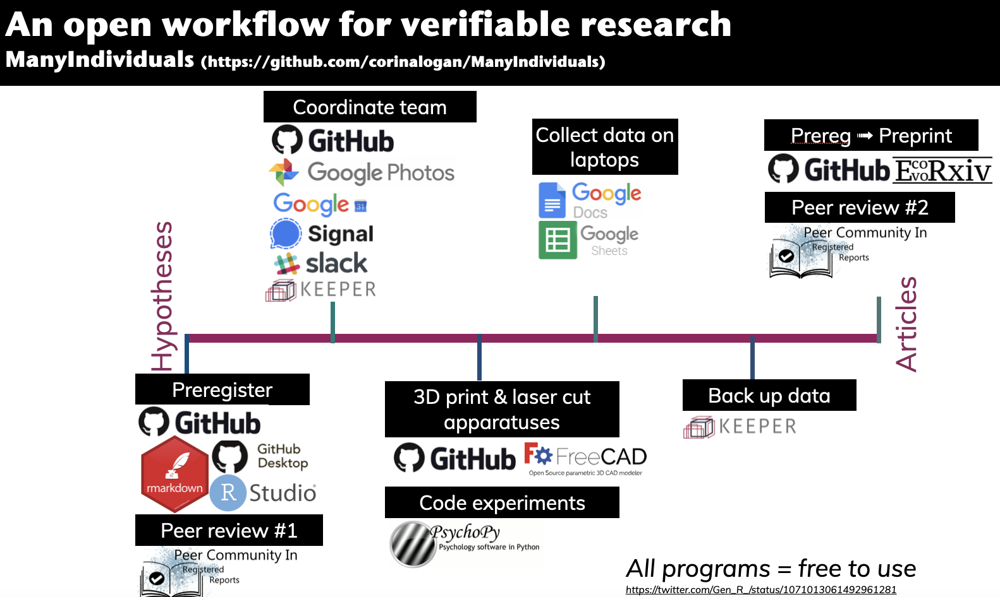

# ManyIndividuals

We are a network of researchers investigating hypotheses that involve generalizing across many individuals (e.g., populations or species). We conduct the same tests in the same way across species to determine whether the results of particular experiments are generalizable beyond that population or species.

## The experiments

 - **Manipulating behavioral flexibility through serial reversal learning:** [protocol](https://docs.google.com/document/d/16hKGUNO1SpnXAT8DN_GXb56Aw6WzCraCIUKiP9gVI6o/edit?usp=sharing), [pseudorandomized option on left order](https://docs.google.com/spreadsheets/d/1B3-ZKd4nr_4gA91Pu2eUUBOriwW-V88VRgK9c1lDSjY/edit?usp=sharing), [instructions](https://docs.google.com/document/d/1QakS8TMe4WRv_QWKrHaWHyJSXbQwl8v9Y061SY914Wg/edit?usp=sharing) for interobserver reliability video coders who code 20% of the videos from the experiment
 - **Manipulating foraging predictability in time and space:**
     - **GPS tracking:** [protocol]()

## The tools

#### Private materials shared within the network

 - [Slack](https://slack.com/intl/en-de/) group (private) for coordinated conversations that don’t clog up inboxes (can use Mattermost [open source] instead of Slack, but you have to host the conversations on your own server)
 - [Signal](https://signal.org) for when experimenters need immediate access to coordinators while testing
 - [Google Calendar](https://calendar.google.com) for each lab to coordinate the project internally
 - [Google Photos](https://photos.google.com) album for each lab so experimenters can add photos and everyone can access them for their presentations/articles/websites
 - [Google Sheets](https://www.google.com/sheets/about/) for all data sheets so everyone can enter/edit/see everything at the same time. What to code in each column is clearly defined in the Protocol…
 - [Keeper](https://keeper.mpdl.mpg.de) is an online data back up space with ready-made folders for each experiment. Experimenters upload data sheets and videos daily. File naming instructions are included in each protocol here at GitHub (IndividualID_YYYY-MM-DD_ExpName_SessionNumber_TrialNumber)
 
#### Public materials
 - GitHub repository (this page that you are reading) for registered reports, final data sheets, bibliography, etc. Make one folder called “Files” and put everything in there (except for the readme file) using…
 - [GitHub Desktop](https://desktop.github.com) to push and pull files between your computer and your GitHub repo using folders (you can make folders on your computer, but not at GitHub directly)
 - [Rmarkdown](https://rmarkdown.rstudio.com) (rmd) to write registered reports/articles and open them in [RStudio](https://rstudio.com) (e.g., https://github.com/corinalogan/grackles/blob/master/Files/Preregistrations/gxpopbehaviorhabitat.Rmd)
 - [Google Docs](https://www.google.com/docs/about/) to write experimental protocols and link to them in the registered reports and articles at GitHub (e.g., http://corinalogan.com/Preregistrations/gxpopbehaviorhabitat.html#Protocols_and_open_materials)
    - Make the shareable link VIEW ONLY so the public can’t edit it; share directly with collaborators and experimenters and list them as editors so they can update as testing progresses
    - Write exceptions at the protocols as you go for anything that comes up that was not planned or had to be tweaked

## Code of conduct
